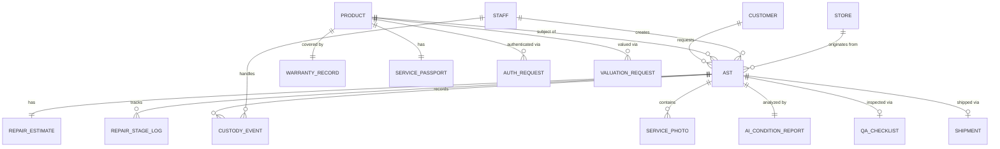

# 📋 Product Requirements Document (PRD)

## RSMS — After-Sales Service (Repairs & Care) Module

### Codename: **Luxury Care OS**

---

| Field | Value |
|---|---|
| **Product** | Retail Store Management System (RSMS) — iOS Application |
| **Module** | After-Sales Service (Repairs & Care) |
| **Version** | 1.0 |
| **Author** | Product Development Team |
| **Date** | 2026-06-18 |
| **Platform** | iPhone & iPad (iOS 26+) |
| **Frameworks** | SwiftUI, Core ML, Vision, App Intents, CloudKit |
| **Architecture** | MVVM with Swift Concurrency (`async/await`, Actors) |
| **SRS Reference** | SRS RSMS v1.0 — Sections 2.1.4, 4.4 |
| **Shared Platform** | Product Digital Twin Platform (shared with Inventory Controller Module) |

---

## Table of Contents

1. [Product Vision & Strategic Context](#1-product-vision--strategic-context)
2. [Scope & Boundaries](#2-scope--boundaries)
3. [**Shared Architecture — Product Digital Twin Platform**](#3-shared-architecture--product-passport-platform)
4. [User Personas & Roles](#4-user-personas--roles)
5. [Information Architecture & Navigation](#5-information-architecture--navigation)
6. [Epic E1 — Smart Intake & Diagnostics](#6-epic-e1--smart-intake--diagnostics)
7. [Epic E2 — Repair Workflow Engine](#7-epic-e2--repair-workflow-engine)
8. [Epic E3 — Customer Experience Portal](#8-epic-e3--customer-experience-portal)
9. [Epic E4 — Warranty & Authentication Center](#9-epic-e4--warranty--authentication-center)
10. [Epic E5 — Return & Logistics Management](#10-epic-e5--return--logistics-management)
11. [Epic E6 — Service Intelligence Dashboard](#11-epic-e6--service-intelligence-dashboard)
12. [Innovation Features (F1–F10)](#12-innovation-features-f1f10)
13. [Data Model & Core Data Schema](#13-data-model--core-data-schema)
14. [API Contract Specifications](#14-api-contract-specifications)
15. [Apple Framework Mapping](#15-apple-framework-mapping)
16. [HIG Compliance Guidelines](#16-hig-compliance-guidelines)
17. [Role-Based Access Control (RBAC)](#17-role-based-access-control-rbac)
18. [Non-Functional Requirements](#18-non-functional-requirements)
19. [Verification & Testing Plan](#19-verification--testing-plan)
20. [Implementation Checklist](#20-implementation-checklist)
21. [Appendices](#21-appendices)

---

## 1. Product Vision & Strategic Context

### 1.1 Vision Statement

> **Luxury Care OS** — An end-to-end after-sales experience platform that transforms repairs, authentication, warranties, valuations, and customer communication into a **premium digital luxury service journey**.

### 1.2 Problem Statement

The current after-sales landscape for luxury retail suffers from:

| Problem | Impact |
|---|---|
| ❌ No transparency | Customers have zero visibility into repair status |
| ❌ Poor communication | Phone calls / emails with no structure |
| ❌ No visual tracking | "Repair In Progress" is the only status customers see |
| ❌ No authentication support | Manual emails, spreadsheets, manual approvals |
| ❌ No luxury experience | Generic, non-premium digital touchpoints |
| ❌ No predictive insights | Reactive instead of proactive service management |

### 1.3 Current Market Flow (Weak)

```
Customer reports issue → Ticket created → Repair center → Phone calls/emails → Repair completed → Customer pickup
```

### 1.4 Our Solution Architecture

```
Luxury Care OS
├── E1  Smart Intake & Diagnostics
├── E2  Repair Workflow Engine
├── E3  Customer Experience Portal
├── E4  Warranty & Authentication Center
├── E5  Return & Logistics Management
└── E6  Service Intelligence Dashboard
```

### 1.5 Six Core Differentiators

| # | Differentiator | Competitive Advantage |
|---|---|---|
| 1 | AI-powered condition assessment | Vision framework detects scratches, discoloration, cracks, missing parts automatically |
| 2 | Visual repair progress tracking | Parcel-tracking-like step-by-step journey visible to customer |
| 3 | Customer self-service approval & payment | One-tap approve → pay → done (no phone calls) |
| 4 | Digital Authenticity Vault (Service Passport) | Complete product lifecycle as a digital passport |
| 5 | Luxury service analytics | Predictive insights, SLA prediction, repair health scoring |
| 6 | White-Glove Concierge Mode | VIP recognition and personalized service at every touchpoint |

### 1.6 Business Goals

| Goal | Metric | Target |
|---|---|---|
| Reduce repair turnaround | Average days from intake to pickup | < 5 business days |
| Increase customer satisfaction | CSAT score post-repair | ≥ 4.5 / 5.0 |
| Reduce dispute rate | % of repairs with disputes | < 2% |
| Increase self-service adoption | % approvals via portal | ≥ 70% |
| Reduce SLA breaches | % repairs within SLA | ≥ 95% |
| Improve parts availability | Stock-out rate for common parts | < 5% |

---

## 2. Scope & Boundaries

### 2.1 In Scope

| Category | Details |
|---|---|
| **SRS 2.1.4.1** | Intake & Diagnostics — AST creation, photos, condition reports, warranty validation |
| **SRS 2.1.4.2** | Workflow — Estimation, client approval, parts allocation, repair stages, QA, completion |
| **SRS 2.1.4.3** | Communication — Client notifications, approvals, cost estimates, payment collection |
| **SRS 2.1.4.4** | Warranty & Authentication — Warranty lookups, authentication requests, valuation letters |
| **SRS 2.1.4.5** | Returns to Client — Pickup scheduling, packaging, documentation, shipment tracking |
| **SRS 4.4** | All detailed functional requirements for After-Sales Service |
| **Innovation** | 10 additional enterprise/luxury features (F1–F10) |

### 2.2 Out of Scope

| Item | Rationale |
|---|---|
| POS / Checkout operations | Covered by Sales Associate module |
| Inventory management (core) | Covered by Inventory Controller module |
| Clienteling (core CRM) | Covered by Sales Associate module |
| Store admin / shift management | Covered by Store Admin module |
| Android / Web builds | iOS-only per SRS 2.3 |

### 2.3 Key Definitions

| Term | Definition |
|---|---|
| **AST** | After-Sales Ticket — the atomic unit of service tracking |
| **SKU** | Stock Keeping Unit — item-level product identifier |
| **RFID** | Radio Frequency Identification tag for item-level tracking |
| **SLA** | Service Level Agreement — contracted repair turnaround time |
| **QA** | Quality Assurance inspection before repair completion |
| **BOPIS/BORIS** | Buy Online Pick-up In Store / Buy Online Return In Store |
| **OMS** | Order Management System for omnichannel orchestration |

### 2.4 Dependencies & Shared Platform

| Dependency | Module / System | Type |
|---|---|---|
| **Product Digital Twin Platform** | **Shared Core (Inventory ↔ After-Sales)** | **Read / Write** |
| Customer Profile Data | Clienteling Module | Read |
| Product Catalog / SKU Data | Product Master Module | Read |
| Inventory / Parts Data | Inventory Module | Read / Write |
| Warranty Records | Shared Platform (with Inventory) | Read / Write |
| Authentication Records | Shared Platform (with Inventory) | Read / Write |
| Payment Gateway | POS / Payments Module | Integration |
| Push Notifications | APNs / Cloud Messaging | Infrastructure |
| AI/ML Models | Core ML / Vision | Embedded |
| Cloud Sync | CloudKit / Backend API | Infrastructure |

---

## 3. Shared Architecture — Product Digital Twin Platform

> **This is the single most important architectural decision in the entire RSMS system. The After-Sales module does NOT operate as a standalone system — it shares the Product Digital Twin Platform with the Inventory Controller module.**

### 3.1 Why Not Separate Databases?

Most retail vendors build Inventory and After-Sales as two disconnected systems. This creates:
- Duplicate product records
- Manual re-entry at every customer visit
- No shared warranty, authentication, or valuation history
- Disconnected service logistics

### 3.2 Our Architecture

```
Product Digital Twin Platform
│
├── Inventory Controller Module
│     Creates Product Digital Twin at receiving
│     Tracks movements, issues COA
│
├── After-Sales Service Module          ← THIS MODULE
│     Reads existing Passport (zero re-entry)
│     Appends repair history, QA results
│     Updates warranty, processes authentication
│
├── Warranty Center (Shared)
├── Authentication Center (Shared)
└── Customer Portal (Shared)
```

### 3.3 How After-Sales Uses the Product Digital Twin

When a customer brings an item for service:

```
Scan Product / Enter Serial Number
       ↓
Load Existing Product Digital Twin     ← NO RE-ENTRY
       ↓
System immediately knows:
  • Purchase Date & Store
  • Warranty Status & Expiry
  • Transfer History
  • Previous Repairs
  • Previous Authentications
  • Certificate of Authenticity
       ↓
Create AST → Linked to Passport
       ↓
Repair events appended to same timeline
```

### 3.4 Shared Product Digital Twin Data Model

```swift
// SHARED between Inventory and After-Sales modules
struct ProductDigitalTwin: Codable, Identifiable {
    let id: UUID
    let productID: UUID
    let serialNumber: String
    let productName: String
    let brand: String
    let sku: String
    let category: ProductCategory
    let createdAt: Date
    let createdByModule: OriginModule         // .inventory or .afterSales
    
    var certificateOfAuthenticity: AuthCertificate?
    var warrantyRecord: WarrantyRecord?
    var events: [PassportEvent]               // Unified timeline from BOTH modules
    var currentLocation: AssetLocation
    var inventoryStatus: InventoryStatus
}

struct PassportEvent: Codable, Identifiable {
    let id: UUID
    let date: Date
    let type: PassportEventType
    let title: String
    let description: String
    let location: String
    let performedBy: UUID?
    let module: OriginModule                 // Which module created this event
    let documents: [Document]
    let photos: [ServicePhoto]
}
```

### 3.5 Example: Complete Product Lifecycle

```
Product Digital Twin — Cartier Tank Française — SN: CTR-2026-00891
│
├─ 📦 Received             Delhi Warehouse      Jan 05, 2026   [Inventory]
├─ 🏷 RFID Tagged          Delhi Store           Jan 06, 2026   [Inventory]
├─ 📋 COA Issued           Certificate #A-8812   Jan 06, 2026   [Inventory]
├─ 🔄 Transferred          Delhi → Mumbai        Feb 12, 2026   [Inventory]
├─ 🛍 Sold                 VIP Client Vikram     Mar 15, 2026   [Sales]
├─ 🔧 Repair #1 Created    Crown alignment       Jun 10, 2026   [After-Sales]
├─ ⏳ Shipped to Service    Service Center A      Jun 11, 2026   [Logistics]
├─ 🔧 Repair #1 Completed  Crown replaced        Jun 18, 2026   [After-Sales]
├─ ✅ QA Passed             Inspector Aisha       Jun 18, 2026   [After-Sales]
├─ 📄 Warranty Extended     +1 Year               Jun 18, 2026   [After-Sales]
└─ ✅ Re-Authenticated      Certificate #A-9901   Nov 20, 2026   [After-Sales]
```

### 3.6 Shared CloudKit Container

Both modules use the **same** CloudKit container for real-time data sharing:

```swift
// SHARED container identifier — used by BOTH Inventory and After-Sales
let sharedContainerID = "iCloud.com.rsms.ProductDigitalTwin"
```

> **For the full Product Digital Twin Platform specification, see: Inventory Controller PRD, Section 3.**

---

## 3. User Personas & Roles

### 3.1 Primary Personas

#### Persona 1: After-Sales Specialist (Power User)

| Attribute | Detail |
|---|---|
| **Name** | Aisha — Service Technician Lead |
| **Role** | After-Sales Specialist |
| **Tech Proficiency** | High — comfortable with iPad workflows |
| **Daily Tasks** | Creates ASTs, performs diagnostics, manages repair workflow, communicates with customers |
| **Pain Points** | Manual tracking, phone tag with customers, no AI assistance, paper-based QA |
| **Goals** | Streamline intake-to-delivery, reduce disputes, automate notifications |

#### Persona 2: Boutique Manager (Oversight)

| Attribute | Detail |
|---|---|
| **Name** | Rajesh — Store Manager, Delhi Boutique |
| **Role** | Boutique Manager |
| **Tech Proficiency** | Medium |
| **Daily Tasks** | Monitors SLA compliance, reviews repair queues, handles escalations, tracks analytics |
| **Pain Points** | No proactive alerts, reactive management, no cross-store benchmarking |
| **Goals** | Zero SLA breaches, high CSAT, efficient resource allocation |

#### Persona 3: Corporate Admin (Strategic)

| Attribute | Detail |
|---|---|
| **Name** | Meera — VP Retail Operations |
| **Role** | Corporate Admin / Retail Ops |
| **Tech Proficiency** | High |
| **Daily Tasks** | Reviews network-wide analytics, approves authentication requests, sets SLA policies |
| **Pain Points** | No centralized visibility, manual authentication workflows |
| **Goals** | Brand protection, operational efficiency, predictive insights |

#### Persona 4: End Customer (External via Portal)

| Attribute | Detail |
|---|---|
| **Name** | Vikram — Loyal VIP Customer |
| **Role** | Customer (external) |
| **Tech Proficiency** | Moderate |
| **Interaction** | Receives push/SMS/email notifications, accesses secure portal for approvals and payments |
| **Pain Points** | No repair visibility, phone-based approvals, no digital records |
| **Goals** | Transparent repair journey, effortless approvals, digital service passport |

### 3.2 RACI Matrix

| Activity | After-Sales Specialist | Boutique Manager | Corporate Admin | Customer |
|---|---|---|---|---|
| AST Creation | **R** | I | – | I |
| AI Diagnostics | **R/A** | I | – | – |
| Estimate Generation | **R** | **A** | – | I |
| Customer Approval | I | I | – | **R/A** |
| Parts Allocation | **R** | **A** | I | – |
| Repair Execution | **R** | I | – | I |
| QA Inspection | **R/A** | I | – | – |
| Authentication Request | I | **R** | **A** | I |
| Valuation Letter | I | I | **R/A** | I |
| SLA Monitoring | I | **R/A** | **A** | – |
| Analytics Review | I | **R** | **R/A** | – |
| Escalation Handling | I | **R** | **A** | I |

> **R** = Responsible, **A** = Accountable, **I** = Informed, **C** = Consulted

---

## 4. Information Architecture & Navigation

### 4.1 SwiftUI View Hierarchy

```
AfterSalesTabView (TabView)
├── Tab 1: ServiceDashboardView
│   ├── ActiveRepairsListView
│   ├── SLAAlertsBannerView
│   ├── QuickStatsCardView
│   └── RecentActivityFeedView
│
├── Tab 2: TicketCenterView
│   ├── TicketListView (with search, filter, sort)
│   │   └── TicketRowView
│   ├── TicketDetailView
│   │   ├── TicketHeaderView
│   │   ├── CustomerInfoCardView
│   │   ├── ProductInfoCardView
│   │   ├── DiagnosticPhotoGalleryView
│   │   ├── AIConditionReportView
│   │   ├── RepairTimelineView
│   │   ├── EstimateCardView
│   │   ├── PartsAllocationView
│   │   ├── QAChecklistView
│   │   ├── ChainOfCustodyView
│   │   ├── CommunicationLogView
│   │   └── ActionButtonBarView
│   └── CreateTicketFlowView (multi-step)
│       ├── Step1_CustomerSearchView
│       ├── Step2_ProductIdentificationView
│       ├── Step3_PhotoCaptureView
│       ├── Step4_AIDiagnosticsView
│       ├── Step5_WarrantyCheckView
│       └── Step6_ConfirmationView
│
├── Tab 3: WarrantyAuthView
│   ├── WarrantyLookupView
│   │   ├── SerialNumberInputView
│   │   └── WarrantyResultView
│   ├── AuthenticationRequestsView
│   │   ├── AuthRequestListView
│   │   ├── AuthRequestDetailView
│   │   └── CertificatePreviewView
│   └── ValuationView
│       ├── ValuationRequestFormView
│       ├── ValuationReviewView
│       └── ValuationLetterPreviewView
│
├── Tab 4: LogisticsView
│   ├── ReadyForPickupListView
│   ├── PickupSchedulerView
│   ├── PackagingGeneratorView
│   ├── ShipmentTrackingView
│   └── ReturnDocumentationView
│
└── Tab 5: InsightsView
    ├── AnalyticsDashboardView
    │   ├── RepairMetricsChartView
    │   ├── SLAComplianceChartView
    │   ├── TopIssuesChartView
    │   └── StoreComparisonView
    ├── PredictiveInsightsView
    │   ├── SLARiskPredictionView
    │   ├── PartsforecastView
    │   └── BottleneckDetectionView
    └── RepairKnowledgeBaseView
        ├── KBSearchView
        └── KBArticleDetailView
```

### 4.2 Navigation Pattern

Per Apple HIG:

| Pattern | Usage |
|---|---|
| **TabView** | Top-level module navigation (5 tabs) |
| **NavigationStack** | Hierarchical drill-down within each tab |
| **Sheet (.sheet)** | Modal creation flows, quick actions |
| **FullScreenCover** | Photo capture, AI diagnostics overlay |
| **Inspector** | Side panel detail views on iPad |
| **Alert / ConfirmationDialog** | Destructive actions, confirmations |

### 4.3 iPad-Specific Layout

```
iPad (Regular Width):
┌─────────────────────────────────────────────────────┐
│  Sidebar          │  Detail View      │  Inspector  │
│  (NavigationSplit │  (Content)        │  (Optional) │
│   View)           │                   │             │
│  ○ Dashboard      │  [Selected Item   │  [Quick     │
│  ○ Tickets        │   Full Detail]    │   Actions]  │
│  ○ Warranty       │                   │             │
│  ○ Logistics      │                   │             │
│  ○ Insights       │                   │             │
└─────────────────────────────────────────────────────┘
```

Use `NavigationSplitView` with three-column layout on iPad for master-detail-inspector pattern.

---

## 5. Epic E1 — Smart Intake & Diagnostics

> **SRS Coverage**: 2.1.4.1, 4.4 bullet 1

### 5.1 Overview

The entry point for all after-sales service. An After-Sales Ticket (AST) is created with complete product and customer context, enriched with AI-powered condition assessment.

### 5.2 User Stories

| ID | Story | Priority |
|---|---|---|
| E1-US01 | As an after-sales specialist, I want to create a new AST by searching for or scanning the customer's profile so that I can link the ticket to existing customer data. | P0 |
| E1-US02 | As an after-sales specialist, I want to identify the product by serial number, RFID scan, or barcode so that I can pull product details automatically. | P0 |
| E1-US03 | As an after-sales specialist, I want to capture multiple high-resolution photos of the product using the device camera so that I can document the current condition. | P0 |
| E1-US04 | As an after-sales specialist, I want the system to run AI-powered condition analysis on captured photos so that scratches, discoloration, cracks, and missing parts are auto-detected. | P0 |
| E1-US05 | As an after-sales specialist, I want to validate warranty status by serial number so that I know if the repair is covered or chargeable. | P0 |
| E1-US06 | As an after-sales specialist, I want to add diagnostic notes and select the issue category so that the repair team has full context. | P0 |
| E1-US07 | As an after-sales specialist, I want a confirmation summary screen before finalizing the AST so that I can review all captured data. | P1 |
| E1-US08 | As an after-sales specialist, I want the system to auto-generate a unique Ticket ID in a human-readable format (e.g., `AST-2026-DLH-00123`) so that it's easy to reference. | P0 |
| E1-US09 | As a boutique manager, I want to receive a notification when a new AST is created so that I'm aware of incoming service requests. | P1 |
| E1-US10 | As a customer, I want to receive a confirmation (push/SMS/email) that my item has been received for service so that I have a record. | P0 |

### 5.3 AST Data Model

```swift
struct AfterSalesTicket: Identifiable, Codable {
    let id: UUID
    let ticketNumber: String              // e.g., "AST-2026-DLH-00123"
    let createdAt: Date
    var updatedAt: Date
    
    // Customer
    let customerID: UUID
    let customerName: String
    let customerTier: CustomerTier        // .standard, .vip, .vvip
    
    // Product
    let productID: UUID
    let productName: String
    let serialNumber: String
    let sku: String
    let productCategory: ProductCategory  // .watch, .jewelry, .leather, .couture
    let purchaseDate: Date?
    let purchaseStore: String?
    
    // Warranty
    var warrantyStatus: WarrantyStatus    // .active, .expired, .extended, .void
    var warrantyExpiryDate: Date?
    var isWarrantyCovered: Bool
    
    // Condition
    var conditionPhotos: [ServicePhoto]
    var aiConditionReport: AIConditionReport?
    var diagnosticNotes: String
    var issueCategory: IssueCategory
    var issueSeverity: IssueSeverity      // .minor, .moderate, .major, .critical
    
    // Repair
    var currentStage: RepairStage
    var estimate: RepairEstimate?
    var customerApprovalStatus: ApprovalStatus
    var partsAllocated: [RepairPart]
    var qaChecklist: QAChecklist?
    var repairNotes: [RepairNote]
    
    // Chain of Custody
    var custodyEvents: [CustodyEvent]
    
    // Logistics
    var returnMethod: ReturnMethod?       // .pickup, .courier, .inStore
    var scheduledPickupDate: Date?
    var shipmentTrackingNumber: String?
    
    // Metadata
    let createdBy: UUID                   // Staff ID
    var assignedTechnician: UUID?
    let storeID: UUID
    var slaDeadline: Date
    var priorityLevel: PriorityLevel      // .normal, .high, .urgent
}
```

### 5.4 AI Condition Analysis — Vision Framework Integration

```swift
// Core ML + Vision pipeline
struct AIConditionReport: Codable {
    let analysisDate: Date
    let modelVersion: String
    var detectedIssues: [DetectedIssue]
    var overallConditionScore: Double      // 0.0 – 1.0
    var confidenceScore: Double            // 0.0 – 1.0
    var comparisonWithBaseline: ConditionComparison?
}

struct DetectedIssue: Codable, Identifiable {
    let id: UUID
    let type: IssueType                   // .scratch, .discoloration, .crack, .missingPart, .dent, .corrosion
    let severity: IssueSeverity
    let location: CGRect                  // Bounding box on image
    let confidence: Double
    let description: String
}
```

**Apple Framework Usage:**

| Framework | Purpose |
|---|---|
| `Vision` | `VNDetectRectanglesRequest` for product boundary detection |
| `Vision` | `VNClassifyImageRequest` with custom Core ML model for defect classification |
| `Core ML` | Custom-trained model (`LuxuryItemConditionClassifier.mlmodel`) |
| `AVFoundation` | Camera capture session with high-res photo output |
| `PhotosUI` | `PhotosPicker` for selecting existing photos (HIG compliant) |

### 5.5 UI Specifications

#### CreateTicketFlowView — Multi-Step Form

| Step | View | Key Components | HIG Pattern |
|---|---|---|---|
| 1 | `CustomerSearchView` | `Searchable` modifier, recent customers list, scan button | Search bar with suggestions |
| 2 | `ProductIdentificationView` | Serial # text field, RFID scan button, barcode scanner via `AVFoundation` | Form with grouped sections |
| 3 | `PhotoCaptureView` | Camera preview via `AVCaptureSession`, capture button, photo grid, minimum 2 photos required | Full-screen camera overlay |
| 4 | `AIDiagnosticsView` | Loading animation during analysis, detected issues overlay on photos, confidence badges | Progress view + results card |
| 5 | `WarrantyCheckView` | Auto-populated warranty status, visual status badge (green/red/amber/grey), expiry date | Info card with status indicator |
| 6 | `ConfirmationView` | Complete summary, edit buttons per section, "Create Ticket" primary action | Review summary pattern |

#### Acceptance Criteria — E1

| ID | Criterion | Verification |
|---|---|---|
| E1-AC01 | AST is created with all mandatory fields populated | Unit test + UI test |
| E1-AC02 | At least 2 photos must be captured before proceeding | UI validation |
| E1-AC03 | AI analysis completes within 5 seconds on-device | Performance test |
| E1-AC04 | AI detects scratches, cracks, discoloration with ≥ 85% accuracy | ML model evaluation |
| E1-AC05 | Warranty status is correctly retrieved from backend | Integration test |
| E1-AC06 | Unique ticket number is generated in format `AST-YYYY-STR-NNNNN` | Unit test |
| E1-AC07 | Customer receives confirmation notification within 30 seconds | E2E test |
| E1-AC08 | All photos are stored with timestamps and GPS metadata | Unit test |
| E1-AC09 | Offline ticket creation queues and syncs when connectivity is restored | Offline test |
| E1-AC10 | Chain of custody event is created at intake with digital signature | Integration test |

---

## 6. Epic E2 — Repair Workflow Engine

> **SRS Coverage**: 2.1.4.2, 4.4 bullet 2

### 6.1 Overview

A structured, multi-stage repair pipeline with visual progress tracking, estimate management, parts allocation, and QA enforcement.

### 6.2 Repair Pipeline Stages

```
┌──────────┐   ┌────────────┐   ┌──────────────┐   ┌─────────────────┐
│ CREATED  │──→│ INSPECTION │──→│   ESTIMATE   │──→│ CLIENT APPROVAL │
└──────────┘   └────────────┘   │  GENERATED   │   │    PENDING      │
                                └──────────────┘   └─────────────────┘
                                                           │
                    ┌──────────────────────────────────────┘
                    ▼
           ┌─────────────────┐   ┌────────────────┐   ┌──────────────┐
           │ PARTS ALLOCATED │──→│ REPAIR STARTED │──→│   REPAIR     │
           └─────────────────┘   └────────────────┘   │  COMPLETED   │
                                                      └──────────────┘
                                                             │
                                                             ▼
                                                      ┌──────────┐   ┌───────────────────┐
                                                      │ QA PASS  │──→│ READY FOR PICKUP  │
                                                      └──────────┘   └───────────────────┘
                                                             │
                                                      ┌──────────┐
                                                      │ QA FAIL  │──→ (Back to REPAIR STARTED)
                                                      └──────────┘
```

### 6.3 User Stories

| ID | Story | Priority |
|---|---|---|
| E2-US01 | As an after-sales specialist, I want to review the diagnostic report and create a cost estimate with itemized parts and labor so that the customer can approve. | P0 |
| E2-US02 | As an after-sales specialist, I want the estimate to auto-calculate total cost including tax so that pricing is accurate. | P0 |
| E2-US03 | As a customer, I want to receive the estimate digitally and approve/reject with one tap so that I don't need phone calls. | P0 |
| E2-US04 | As an after-sales specialist, I want to allocate required parts from inventory with availability checks so that repair can begin. | P0 |
| E2-US05 | As an after-sales specialist, I want to track repair stages with timestamps so that I have a complete audit trail. | P0 |
| E2-US06 | As an after-sales specialist, I want a mandatory QA checklist before marking repair as complete so that quality is ensured. | P0 |
| E2-US07 | As a customer, I want to see a visual repair timeline (like parcel tracking) showing each completed stage so that I have full transparency. | P0 |
| E2-US08 | As a boutique manager, I want to see all active repairs with stage, SLA status, and assigned technician so that I can manage workload. | P0 |
| E2-US09 | As an after-sales specialist, I want to capture before and after photos at each stage so that repair quality is documented. | P1 |
| E2-US10 | As a boutique manager, I want to reassign a repair to a different technician so that I can balance workload. | P1 |

### 6.4 Data Models

```swift
enum RepairStage: String, Codable, CaseIterable {
    case created            = "Created"
    case inspection         = "Inspection"
    case estimateGenerated  = "Estimate Generated"
    case clientApproval     = "Client Approval Pending"
    case clientApproved     = "Client Approved"
    case clientRejected     = "Client Rejected"
    case partsAllocated     = "Parts Allocated"
    case repairStarted      = "Repair Started"
    case repairCompleted    = "Repair Completed"
    case qaPassed           = "QA Passed"
    case qaFailed           = "QA Failed"
    case readyForPickup     = "Ready For Pickup"
    case pickedUp           = "Picked Up"
    case closed             = "Closed"
}

struct RepairEstimate: Codable, Identifiable {
    let id: UUID
    let ticketID: UUID
    let createdAt: Date
    var items: [EstimateLineItem]
    var laborCost: Decimal
    var partsCost: Decimal
    var taxRate: Decimal
    var taxAmount: Decimal
    var totalCost: Decimal
    var estimatedCompletionDate: Date
    var notes: String
    var approvalStatus: ApprovalStatus
    var approvedAt: Date?
    var approvalMethod: ApprovalMethod?   // .portal, .inStore, .phone
}

struct EstimateLineItem: Codable, Identifiable {
    let id: UUID
    let description: String
    let type: LineItemType                // .part, .labor, .service
    let quantity: Int
    let unitPrice: Decimal
    var totalPrice: Decimal
    let partNumber: String?
}

struct QAChecklist: Codable {
    let ticketID: UUID
    let inspectorID: UUID
    let inspectedAt: Date
    var items: [QAChecklistItem]
    var overallResult: QAResult           // .pass, .fail
    var notes: String
    var afterPhotos: [ServicePhoto]
}

struct QAChecklistItem: Codable, Identifiable {
    let id: UUID
    let category: String                  // e.g., "Visual Inspection", "Functionality", "Packaging"
    let description: String
    var isPassed: Bool
    var notes: String?
}
```

### 6.5 UI Specifications

#### RepairTimelineView — Visual Progress Tracker

A vertical stepper timeline inspired by Apple's order tracking:

```
    ✅ Inspection Complete          Jun 10, 2:30 PM
    │
    ✅ Estimate Sent to Customer    Jun 10, 4:15 PM
    │
    ✅ Customer Approved            Jun 11, 9:00 AM
    │
    ✅ Parts Ordered                Jun 11, 11:30 AM
    │
    🔵 Repair In Progress           Jun 12, 10:00 AM  ← Current
    │
    ○  QA Inspection                Pending
    │
    ○  Ready For Collection         Pending
```

**SwiftUI Implementation Pattern:**

```swift
struct RepairTimelineView: View {
    let stages: [TimelineStage]
    
    var body: some View {
        VStack(alignment: .leading, spacing: 0) {
            ForEach(stages) { stage in
                TimelineStageRow(stage: stage)
            }
        }
        .padding()
    }
}
```

#### EstimateCardView

| Element | HIG Pattern | Detail |
|---|---|---|
| Header | Prominent card | "Cost Estimate" with ticket number |
| Line items | Inset grouped list | Description, quantity, unit price, total |
| Summary | Bold totals section | Subtotal, Tax, **Grand Total** |
| Actions | Primary + Secondary buttons | "Send to Customer" (filled), "Edit" (outline) |
| Status badge | Capsule tag | Pending / Approved / Rejected with color coding |

#### Acceptance Criteria — E2

| ID | Criterion | Verification |
|---|---|---|
| E2-AC01 | Estimate includes itemized parts, labor, tax calculation | Unit test |
| E2-AC02 | Stage transitions are logged with timestamp, user ID, and notes | Integration test |
| E2-AC03 | QA checklist must be fully completed (all items checked) before marking repair complete | UI validation |
| E2-AC04 | Customer sees real-time stage updates in portal within 60 seconds of stage change | E2E test |
| E2-AC05 | Repair cannot skip stages (enforced state machine) | Unit test |
| E2-AC06 | QA failure returns repair to "Repair Started" stage | State machine test |
| E2-AC07 | Parts allocation checks inventory availability before confirmation | Integration test |
| E2-AC08 | Before/after photos are captured and linked to respective stages | UI test |
| E2-AC09 | Technician assignment and reassignment is logged | Audit test |
| E2-AC10 | Estimated completion date is calculated based on parts availability + repair complexity | Unit test |

---

## 7. Epic E3 — Customer Experience Portal

> **SRS Coverage**: 2.1.4.3, 4.4 bullet 3

### 7.1 Overview

A secure, branded customer-facing portal accessible via deep link (push notification / SMS / email). Enables self-service estimate approval, payment, messaging, and full repair visibility.

### 7.2 User Stories

| ID | Story | Priority |
|---|---|---|
| E3-US01 | As a customer, I want to receive a push notification with a deep link when my estimate is ready so that I can approve immediately. | P0 |
| E3-US02 | As a customer, I want to view my repair estimate with itemized breakdown in the portal so that I understand the costs. | P0 |
| E3-US03 | As a customer, I want to approve or reject the estimate with one tap so that the process is frictionless. | P0 |
| E3-US04 | As a customer, I want to pay online via Apple Pay or credit card so that I don't need to visit the store. | P0 |
| E3-US05 | As a customer, I want to see real-time repair status with visual timeline so that I know exactly where my item is. | P0 |
| E3-US06 | As a customer, I want to view before/after photos of my repair so that I can see the quality of work. | P1 |
| E3-US07 | As a customer, I want to message the service team directly from the portal so that I can ask questions. | P1 |
| E3-US08 | As a customer, I want to download repair documents (invoice, QA report, warranty update) so that I have records. | P1 |
| E3-US09 | As a customer, I want notifications at each major milestone (received, estimate ready, repair started, completed, ready for pickup) so that I'm always informed. | P0 |
| E3-US10 | As a customer, I want to schedule my pickup directly from the portal so that it's convenient. | P1 |

### 7.3 Notification Strategy

| Event | Push | SMS | Email | In-App |
|---|---|---|---|---|
| Item Received | ✅ | ✅ | ✅ | ✅ |
| Estimate Ready | ✅ | ✅ | ✅ | ✅ |
| Awaiting Approval (reminder) | ✅ | – | ✅ | ✅ |
| Repair Started | ✅ | – | – | ✅ |
| Repair Completed | ✅ | ✅ | ✅ | ✅ |
| QA Passed | ✅ | – | – | ✅ |
| Ready For Pickup | ✅ | ✅ | ✅ | ✅ |
| Payment Confirmation | – | – | ✅ | ✅ |

### 7.4 Payment Integration

```swift
struct PaymentConfiguration {
    // Apple Pay via PassKit
    let merchantIdentifier: String
    let supportedNetworks: [PKPaymentNetwork] = [.visa, .masterCard, .amex]
    let merchantCapabilities: PKMerchantCapability = [.threeDSecure, .debit, .credit]
    let countryCode: String
    let currencyCode: String
}
```

**Apple Framework Usage:**

| Framework | Purpose |
|---|---|
| `PassKit` | Apple Pay integration for seamless payment |
| `StoreKit` | Receipt validation and transaction management |
| `UserNotifications` | Local + remote push notifications |
| `App Intents` | Siri integration: "Check my repair status" |
| `WidgetKit` | Lock screen widget showing current repair status |

### 7.5 Deep Link Schema

```
rsms://after-sales/ticket/{ticketID}/estimate
rsms://after-sales/ticket/{ticketID}/status
rsms://after-sales/ticket/{ticketID}/payment
rsms://after-sales/ticket/{ticketID}/messages
rsms://after-sales/ticket/{ticketID}/pickup
```

### 7.6 App Intents Integration

```swift
struct CheckRepairStatusIntent: AppIntent {
    static var title: LocalizedStringResource = "Check Repair Status"
    static var description = IntentDescription("Check the status of your current repair")
    
    @Parameter(title: "Ticket Number")
    var ticketNumber: String?
    
    func perform() async throws -> some IntentResult & ProvidesDialog {
        // Fetch latest status and return conversational result
    }
}
```

### 7.7 Widget Support (WidgetKit)

| Widget Size | Content |
|---|---|
| **Small** | Current repair stage icon + stage name |
| **Medium** | Repair timeline with current stage highlighted + ETA |
| **Large** | Full timeline + before/after photos thumbnail + next action button |
| **Lock Screen (Accessory)** | Stage icon + ticket number |

### 7.8 Acceptance Criteria — E3

| ID | Criterion | Verification |
|---|---|---|
| E3-AC01 | Deep link opens correct ticket view in portal | URL scheme test |
| E3-AC02 | One-tap approval updates ticket stage within 5 seconds | E2E test |
| E3-AC03 | Apple Pay payment completes successfully with receipt | Payment integration test |
| E3-AC04 | All 5 milestone notifications are delivered reliably | Notification test |
| E3-AC05 | Portal loads in < 2 seconds on 4G connection | Performance test |
| E3-AC06 | Portal is accessible without app installation (web fallback) | Cross-platform test |
| E3-AC07 | Customer can view and download PDF documents | Document generation test |
| E3-AC08 | Messaging supports text and photo attachments | UI test |
| E3-AC09 | Widget updates within 15 minutes of stage change | Widget test |
| E3-AC10 | Siri intent correctly retrieves and speaks repair status | Intent test |

---

## 8. Epic E4 — Warranty & Authentication Center

> **SRS Coverage**: 2.1.4.4, 4.4 bullet 4

### 8.1 Overview

Comprehensive warranty management, product authentication workflows, and official valuation letter generation — critical for luxury brand protection.

### 8.2 User Stories

| ID | Story | Priority |
|---|---|---|
| E4-US01 | As an after-sales specialist, I want to look up warranty status by serial number so that I can determine coverage. | P0 |
| E4-US02 | As an after-sales specialist, I want to see warranty details including type (standard/extended), coverage period, and terms so that I can advise the customer. | P0 |
| E4-US03 | As a customer, I want to request product authentication through the store so that I can verify my item's authenticity. | P0 |
| E4-US04 | As a boutique manager, I want to submit authentication requests to corporate with supporting photos and documents so that the review process is structured. | P0 |
| E4-US05 | As a corporate admin, I want to review authentication requests and issue digital certificates so that authenticity is officially confirmed. | P0 |
| E4-US06 | As a customer, I want to request a valuation letter for insurance, resale, or estate purposes so that I have official documentation. | P1 |
| E4-US07 | As a corporate admin, I want to review valuation requests with product history and issue official valuation letters so that the brand's authority is maintained. | P1 |
| E4-US08 | As a customer, I want to receive my authentication certificate and valuation letter digitally so that I have instant access. | P1 |
| E4-US09 | As an after-sales specialist, I want to extend a customer's warranty upon completion of authorized service so that records stay current. | P1 |
| E4-US10 | As a corporate admin, I want to see a dashboard of all authentication and valuation requests with status tracking so that I can manage the queue. | P1 |

### 8.3 Data Models

```swift
enum WarrantyStatus: String, Codable {
    case active     = "Active"
    case expired    = "Expired"
    case extended   = "Extended"
    case void       = "Void"
}

struct WarrantyRecord: Codable, Identifiable {
    let id: UUID
    let productSerialNumber: String
    let warrantyType: WarrantyType        // .standard, .extended, .brandCare
    let startDate: Date
    let expiryDate: Date
    var status: WarrantyStatus
    let coverageTerms: [String]
    var extensions: [WarrantyExtension]
    var claimsHistory: [WarrantyClaim]
}

struct AuthenticationRequest: Codable, Identifiable {
    let id: UUID
    let requestDate: Date
    let customerID: UUID
    let productDetails: ProductDetails
    let serialNumber: String
    var photos: [ServicePhoto]
    var supportingDocuments: [Document]
    var status: AuthRequestStatus         // .submitted, .underReview, .approved, .rejected
    var reviewedBy: UUID?
    var reviewDate: Date?
    var certificate: AuthCertificate?
    var notes: String
}

struct AuthCertificate: Codable {
    let certificateID: String
    let issuedDate: Date
    let issuedBy: String
    let productDescription: String
    let serialNumber: String
    let authenticityConfirmed: Bool
    let digitalSignature: Data
    let qrCode: Data                      // For verification scanning
}

struct ValuationRequest: Codable, Identifiable {
    let id: UUID
    let requestDate: Date
    let customerID: UUID
    let productDetails: ProductDetails
    let purpose: ValuationPurpose         // .insurance, .resale, .estatePlanning, .claims
    var status: ValuationStatus           // .submitted, .underReview, .completed
    var valuationLetter: ValuationLetter?
}

struct ValuationLetter: Codable {
    let letterID: String
    let issuedDate: Date
    let validUntil: Date
    let productDescription: String
    let serialNumber: String
    let estimatedValue: Decimal
    let currency: String
    let valuationBasis: String
    let issuedBy: String
    let digitalSignature: Data
}
```

### 8.4 Authentication Workflow

```
Customer Requests → Store Submits → Corporate Reviews → Certificate Issued
     │                    │                 │                    │
     ▼                    ▼                 ▼                    ▼
  Customer           Store Associate    Corporate Admin      Customer
  provides item      captures photos    reviews evidence     receives
  + documents        + serial number    + product history    digital certificate
                     + diagnostic data  + authenticity check + QR code
```

### 8.5 Acceptance Criteria — E4

| ID | Criterion | Verification |
|---|---|---|
| E4-AC01 | Warranty lookup returns status within 2 seconds | Performance test |
| E4-AC02 | All four warranty statuses (Active/Expired/Extended/Void) display correctly with visual indicators | UI test |
| E4-AC03 | Authentication request includes minimum 4 photos + serial number | Validation test |
| E4-AC04 | Corporate admin can approve/reject with notes | Integration test |
| E4-AC05 | Digital certificate includes QR code for external verification | Unit test |
| E4-AC06 | Valuation letter is generated as a signed PDF | Document generation test |
| E4-AC07 | Customer receives digital delivery via push + email | Notification test |
| E4-AC08 | Warranty extension is logged and reflected in warranty record | Integration test |
| E4-AC09 | All authentication/valuation actions create audit trail entries | Audit test |
| E4-AC10 | Corporate dashboard shows real-time queue with filters by status, date, store | UI test |

---

## 9. Epic E5 — Return & Logistics Management

> **SRS Coverage**: 2.1.4.5, 4.4 bullet 5

### 9.1 Overview

End-to-end return logistics: pickup scheduling, smart packaging recommendations, auto-generated documentation, and live shipment tracking.

### 9.2 User Stories

| ID | Story | Priority |
|---|---|---|
| E5-US01 | As a customer, I want to choose between in-store pickup or courier delivery so that I can receive my repaired item conveniently. | P0 |
| E5-US02 | As a customer, I want to select a preferred date and time slot for pickup so that I can plan accordingly. | P0 |
| E5-US03 | As an after-sales specialist, I want the system to auto-generate return documentation (repair summary, QA report, packaging slip, invoice, warranty update) so that paperwork is eliminated. | P0 |
| E5-US04 | As an after-sales specialist, I want the system to recommend appropriate packaging based on product category so that items are safely returned. | P1 |
| E5-US05 | As a customer, I want to track my courier shipment in real-time with a tracking number so that I know when to expect delivery. | P1 |
| E5-US06 | As an after-sales specialist, I want to record the handoff with timestamp, photos, and digital signature so that chain of custody is complete. | P0 |
| E5-US07 | As a boutique manager, I want to see a list of all items ready for pickup with scheduled dates so that I can manage daily operations. | P1 |
| E5-US08 | As a customer, I want to receive all return documents digitally (PDF) so that I have a complete record. | P1 |

### 9.3 Smart Packaging Generator

```swift
struct PackagingRecommendation {
    let productCategory: ProductCategory
    let recommendedPackaging: PackagingType
    let protectiveMaterials: [String]
    let specialInstructions: String
}

enum PackagingType: String, Codable {
    case jewelryBox       = "Luxury Jewelry Box"
    case watchCase        = "Premium Watch Case"
    case leatherPouch     = "Leather Protective Pouch"
    case coutureGarmentBag = "Couture Garment Bag"
    case genericLuxuryBox = "Branded Luxury Box"
}

// Auto-determination logic
func recommendPackaging(for category: ProductCategory) -> PackagingRecommendation {
    switch category {
    case .jewelry:
        return PackagingRecommendation(
            productCategory: .jewelry,
            recommendedPackaging: .jewelryBox,
            protectiveMaterials: ["Velvet liner", "Anti-tarnish wrap", "Cushion insert"],
            specialInstructions: "Place in individual compartment. Do not stack."
        )
    case .watch:
        return PackagingRecommendation(
            productCategory: .watch,
            recommendedPackaging: .watchCase,
            protectiveMaterials: ["Watch pillow", "Microfiber cloth", "Silica gel packet"],
            specialInstructions: "Secure crown guard. Set to display time."
        )
    // ... additional cases
    }
}
```

### 9.4 Return Documentation (Auto-Generated)

| Document | Content | Format |
|---|---|---|
| **Repair Summary** | Ticket ID, issue description, repair actions, technician notes | PDF |
| **QA Report** | Checklist results, inspector name, date, after photos | PDF |
| **Packaging Slip** | Item details, packaging type, materials used, handler | PDF |
| **Invoice** | Itemized charges, payments received, balance | PDF |
| **Warranty Update** | Updated warranty status, new expiry if extended | PDF |

**Apple Framework:** Use `PDFKit` for PDF generation and `UIActivityViewController` / `ShareLink` for sharing.

### 9.5 MapKit Integration for Courier Tracking

```swift
struct ShipmentTrackingView: View {
    @State var shipment: Shipment
    
    var body: some View {
        Map {
            // Live courier position
            Marker("Courier", coordinate: shipment.currentLocation)
                .tint(.blue)
            
            // Destination
            Marker("Delivery Address", coordinate: shipment.destinationLocation)
                .tint(.green)
            
            // Route polyline
            MapPolyline(shipment.routeCoordinates)
                .stroke(.blue, lineWidth: 3)
        }
        .mapStyle(.standard(elevation: .realistic))
    }
}
```

### 9.6 Acceptance Criteria — E5

| ID | Criterion | Verification |
|---|---|---|
| E5-AC01 | Customer can select pickup date from available slots | UI test |
| E5-AC02 | All 5 return documents are auto-generated as PDFs | Document test |
| E5-AC03 | Packaging recommendation matches product category | Unit test |
| E5-AC04 | Shipment tracking updates in real-time | Integration test |
| E5-AC05 | Digital signature is captured at handoff | UI test |
| E5-AC06 | Chain of custody event is created at return | Integration test |
| E5-AC07 | Customer receives pickup confirmation notification | Notification test |
| E5-AC08 | Ready-for-pickup list is sortable by date and priority | UI test |

---

## 10. Epic E6 — Service Intelligence Dashboard

> **SRS Coverage**: Beyond SRS — Innovation Layer

### 10.1 Overview

Corporate-level analytics, predictive insights, and operational intelligence powered by Core ML and Swift Charts.

### 10.2 User Stories

| ID | Story | Priority |
|---|---|---|
| E6-US01 | As a boutique manager, I want to see average repair turnaround time so that I can identify bottlenecks. | P0 |
| E6-US02 | As a corporate admin, I want to compare repair performance across stores so that I can benchmark. | P0 |
| E6-US03 | As a corporate admin, I want to see the most frequently repaired products so that I can identify quality issues. | P1 |
| E6-US04 | As a boutique manager, I want to see QA failure rates so that I can address quality concerns. | P1 |
| E6-US05 | As a corporate admin, I want AI-powered predictions for SLA breach risk so that I can act proactively. | P1 |
| E6-US06 | As a corporate admin, I want to see warranty claim trends so that I can forecast costs. | P1 |
| E6-US07 | As a boutique manager, I want a Repair Health Score for my store so that I have a single performance metric. | P2 |
| E6-US08 | As a corporate admin, I want to see predictive parts demand forecasting so that I can optimize inventory. | P2 |

### 10.3 Analytics Metrics

| Metric | Calculation | Visualization |
|---|---|---|
| Average Repair Time | Mean(completionDate - createdDate) | Bar chart by store |
| SLA Compliance Rate | % repairs completed within SLA | Gauge chart |
| QA Failure Rate | QA failures / total QA inspections × 100 | Line chart (trend) |
| Repeat Repair Rate | Repairs on same item within 90 days / total | KPI card |
| Most Repaired Products | Count by SKU, top 10 | Horizontal bar chart |
| Warranty Claim Cost | Sum of warranty-covered repairs | Area chart (monthly) |
| Repair Health Score | Weighted composite: SLA(30%) + QA(25%) + CSAT(25%) + Repeat(20%) | Circular gauge (0-100) |
| Parts Demand Forecast | Core ML time-series prediction | Line chart with confidence band |

### 10.4 Apple Framework: Swift Charts

```swift
struct RepairMetricsChartView: View {
    let data: [StoreRepairMetric]
    
    var body: some View {
        Chart(data) { metric in
            BarMark(
                x: .value("Store", metric.storeName),
                y: .value("Avg Days", metric.averageRepairDays)
            )
            .foregroundStyle(by: .value("Performance", metric.performanceCategory))
            .annotation(position: .top) {
                Text(String(format: "%.1f", metric.averageRepairDays))
                    .font(.caption2)
            }
        }
        .chartForegroundStyleScale([
            "Excellent": .green,
            "Good": .blue,
            "Needs Improvement": .orange,
            "Critical": .red
        ])
    }
}
```

### 10.5 Acceptance Criteria — E6

| ID | Criterion | Verification |
|---|---|---|
| E6-AC01 | Dashboard loads all metrics within 3 seconds | Performance test |
| E6-AC02 | Charts are interactive with drill-down capability | UI test |
| E6-AC03 | Store comparison shows data for all active stores | Integration test |
| E6-AC04 | Repair Health Score updates in real-time | Unit test |
| E6-AC05 | Predictive insights refresh daily with new data | ML pipeline test |
| E6-AC06 | Export analytics as PDF or CSV | Document test |
| E6-AC07 | Data filters work correctly (date range, store, category) | UI test |
| E6-AC08 | Role-based visibility enforced (managers see own store, corporate sees all) | RBAC test |

---

## 11. Innovation Features (F1–F10)

These features elevate Luxury Care OS from a standard repair system to an enterprise-grade luxury service platform.

### F1. Chain of Custody Timeline ⭐⭐⭐⭐⭐

**Problem:** Luxury brands face disputes over item condition at handoffs.

**Solution:** Every physical handoff is recorded with timestamp, photos, handler identity, location, digital signature, and notes.

```swift
struct CustodyEvent: Codable, Identifiable {
    let id: UUID
    let ticketID: UUID
    let timestamp: Date
    let eventType: CustodyEventType       // .customerDropoff, .storeToRepairCenter, .technicianHandoff, .qaInspection, .storeReturn, .customerPickup
    let fromHandler: HandlerInfo
    let toHandler: HandlerInfo
    let location: CLLocationCoordinate2D
    let photos: [ServicePhoto]
    let digitalSignature: Data            // Biometric or drawn signature
    let notes: String
    let deviceID: String                  // iPad/iPhone capturing the event
}
```

**UI:** Vertical timeline with expandable cards showing photos, signatures, and handler details at each point.

**HIG:** Use `TimelineView` pattern with card-based expandable sections.

---

### F2. Before vs After Repair Gallery ⭐⭐⭐⭐⭐

**Problem:** Customers can't see repair quality evidence.

**Solution:** Side-by-side or swipe comparison of before/after photos.

```swift
struct BeforeAfterGalleryView: View {
    let beforePhotos: [ServicePhoto]
    let afterPhotos: [ServicePhoto]
    @State private var comparisonPosition: CGFloat = 0.5
    
    var body: some View {
        GeometryReader { geo in
            ZStack {
                // Before image (full width)
                Image(uiImage: beforePhotos.first!.image)
                    .resizable()
                    .aspectRatio(contentMode: .fill)
                
                // After image (clipped by slider position)
                Image(uiImage: afterPhotos.first!.image)
                    .resizable()
                    .aspectRatio(contentMode: .fill)
                    .mask(
                        Rectangle()
                            .offset(x: geo.size.width * comparisonPosition)
                    )
                
                // Slider handle
                ComparisonSliderHandle(position: $comparisonPosition)
            }
        }
    }
}
```

---

### F3. Repair Health Score ⭐⭐⭐⭐

**Purpose:** Single composite metric for store-level repair quality.

| Component | Weight | Source |
|---|---|---|
| SLA Compliance | 30% | % repairs within SLA |
| QA Pass Rate | 25% | % first-time QA pass |
| Customer Satisfaction | 25% | Post-repair CSAT survey |
| Repeat Repair Rate | 20% | Inverse of repeat repairs within 90 days |

**Display:** Circular gauge with animated score reveal, color-coded (Green ≥ 85, Amber ≥ 70, Red < 70).

---

### F4. Smart Parts Forecasting ⭐⭐⭐⭐⭐

**Problem:** Repairs delayed due to missing parts.

**Solution:** Core ML time-series model predicts parts demand based on historical repair data.

```swift
struct PartsForecasting {
    let model: MLModel  // Trained on historical parts usage
    
    func predictDemand(
        partNumber: String,
        store: Store,
        horizon: Int  // days ahead
    ) async throws -> PartsForecast {
        // Returns predicted quantity needed + confidence interval
    }
}

struct PartsForecast: Codable {
    let partNumber: String
    let predictedQuantity: Int
    let confidenceLow: Int
    let confidenceHigh: Int
    let confidenceLevel: Double
    let forecastPeriod: DateInterval
    let recommendation: RestockRecommendation  // .restockNow, .monitorCurrent, .reduceStock
}
```

---

### F5. White-Glove Concierge Mode ⭐⭐⭐⭐⭐

**Problem:** VIP customers expect personalized, immediate recognition.

**Solution:** When a VIP customer is identified (via appointment, profile lookup, or NFC loyalty card), the system instantly displays a concierge card:

```
╔══════════════════════════════════════╗
║  👑 VIP CLIENT ARRIVED              ║
║                                      ║
║  Name: Mr. Vikram Malhotra           ║
║  Tier: VVIP (Lifetime Spend: ₹48L)  ║
║  Past Repairs: 3                     ║
║  Preferred Store: Delhi Boutique     ║
║  Preferred Associate: Aisha K.       ║
║  Communication: WhatsApp             ║
║                                      ║
║  Recent Purchase: Cartier Tank       ║
║  Last Visit: 45 days ago             ║
║                                      ║
║  [Start Service]  [View History]     ║
╚══════════════════════════════════════╝
```

**HIG:** Use `.alert` style presentation with rich content card, haptic feedback (`.notification` type).

---

### F6. Service Passport (Digital Product Digital Twin) ⭐⭐⭐⭐⭐

**Problem:** No unified product lifecycle view.

**Solution:** This feature is now powered by the **Shared Product Digital Twin Platform** (see Section 3). Every luxury item's passport is created by the Inventory module at receiving and enriched by the After-Sales module throughout its service lifecycle. The After-Sales module uses the shared `ProductDigitalTwin` data model — **NOT a separate `ServicePassport` struct**.

```swift
// After-Sales reads and appends to the SHARED ProductDigitalTwin
// No separate ServicePassport needed — the passport IS the service passport
extension ProductDigitalTwin {
    /// All service-related events from the unified timeline
    var serviceHistory: [PassportEvent] {
        events.filter { event in
            [.repairCreated, .repairCompleted, .qaPassed,
             .warrantyValidated, .warrantyExtended,
             .authenticated, .valuationIssued].contains(event.type)
        }
    }
}
```

**UI:** The `ProductDigitalTwinTimelineView` is a **shared SwiftUI component** used by both Inventory and After-Sales modules, displaying the complete product history — "Medical history for luxury products."

```
Rolex Submariner — SN: RX-2026-00221
│
├─ 📦 Received             Delhi Warehouse      Jan 05, 2026   [Inventory]
├─ 📋 COA Issued           Certificate #A-8812   Jan 06, 2026   [Inventory]
├─ 🛍 Sold                 VIP Client Vikram     Mar 15, 2026   [Sales]
├─ 🔧 Repair #1            Bezel Polish          Jun 10, 2026   [After-Sales]
├─ 📋 Valuation            Insurance ₹18.5L      Sep 01, 2026   [After-Sales]
├─ ✅ Authentication        Certificate Issued    Nov 20, 2026   [After-Sales]
├─ 🔧 Repair #2            Battery Replace       Mar 05, 2027   [After-Sales]
└─ 📄 Warranty Extension   +2 Years              Mar 05, 2027   [After-Sales]
```

---

### F7. Repair SLA Risk Prediction ⭐⭐⭐⭐⭐

**Problem:** SLA breaches are discovered after they happen.

**Solution:** ML model predicts breach probability based on:
- Current stage and time elapsed
- Parts allocation status
- Technician workload
- Repair center backlog
- Historical data for similar repairs

```swift
struct SLARiskPrediction: Codable {
    let ticketID: UUID
    let predictionDate: Date
    let breachProbability: Double          // 0.0 – 1.0
    let riskLevel: RiskLevel              // .low, .medium, .high, .critical
    let contributingFactors: [RiskFactor]
    let recommendedActions: [String]
    let estimatedCompletionDate: Date
}

struct RiskFactor: Codable {
    let factor: String                    // e.g., "Part not allocated"
    let impact: Double                    // Weight of this factor
    let isResolvable: Bool
}
```

**UI:** Risk cards with color-coded badges. Tapping reveals contributing factors and recommended actions.

---

### F8. Intelligent Escalation Engine ⭐⭐⭐⭐

**Problem:** Standard systems only notify; they don't escalate intelligently.

**Solution:** Time-based automatic escalation:

| Delay | Action | Recipient |
|---|---|---|
| 3 days overdue | Notification | Assigned Technician + Manager |
| 7 days overdue | Alert + Priority Elevation | Regional Manager |
| 14 days overdue | Critical Escalation | Corporate VP / Retail Ops |

```swift
struct EscalationRule: Codable {
    let delayDays: Int
    let escalationLevel: EscalationLevel  // .L1, .L2, .L3
    let targetRole: UserRole
    let notificationType: NotificationType
    let autoActions: [AutoAction]         // .raisePriority, .reassignTechnician, .notifyCustomer
}
```

---

### F9. Post-Service Relationship Engine ⭐⭐⭐⭐⭐

**Problem:** Most systems stop at "Repair Complete." Revenue opportunity is lost.

**Solution:** Automated post-service lifecycle:

```
Repair Complete → Pickup
     ↓
Thank You Message (Day 0)
     ↓
Feedback Request (Day 1)
     ↓
CSAT Survey (Day 3)
     ↓
Warranty Reminder (30 days before expiry)
     ↓
Seasonal Service Reminder (6 months)
     ↓
VIP Event Invitation (Based on tier)
```

**Purpose:** Transform repairs from a **cost center** into a **retention channel**.

```swift
struct PostServiceTouchpoint: Codable {
    let triggerType: TouchpointTrigger    // .timeBased, .eventBased
    let delayFromCompletion: TimeInterval?
    let eventTrigger: String?
    let messageTemplate: MessageTemplate
    let channels: [CommunicationChannel]  // .push, .sms, .email, .whatsapp
    let isEnabled: Bool
}
```

---

### F10. Repair Knowledge Base ⭐⭐⭐⭐

**Problem:** Technicians repeatedly solve the same issues from scratch.

**Solution:** Internal searchable knowledge base that learns from completed repairs:

```swift
struct KBArticle: Codable, Identifiable {
    let id: UUID
    let issueTitle: String                // e.g., "Rolex Crown Issue"
    let productCategory: ProductCategory
    let brand: String?
    let issueCategory: IssueCategory
    let symptoms: [String]
    let resolution: String
    let partsUsed: [RepairPart]
    let averageRepairDuration: TimeInterval
    let technicianNotes: [String]
    let successRate: Double               // Based on repeat repair tracking
    let timesReferenced: Int
    let lastUpdated: Date
    let contributedBy: [UUID]             // Technician IDs
}
```

**UI:** Search-first interface with filters by product category, brand, issue type. Uses `Searchable` modifier with suggested results.

---

## 12. Data Model & Core Data Schema

### 12.1 Entity Relationship Overview



### 12.2 Core Data Stack Configuration

```swift
@MainActor
class PersistenceController {
    static let shared = PersistenceController()
    
    let container: NSPersistentCloudKitContainer
    
    init() {
        // SHARED container with Inventory module for Product Digital Twin Platform
        container = NSPersistentCloudKitContainer(name: "RSMS_ProductDigitalTwin")
        
        // CloudKit sync — SAME container as Inventory module
        guard let description = container.persistentStoreDescriptions.first else {
            fatalError("No persistent store descriptions found")
        }
        description.cloudKitContainerOptions = NSPersistentCloudKitContainerOptions(
            containerIdentifier: "iCloud.com.rsms.ProductDigitalTwin"  // SHARED identifier
        )
        
        // Enable remote change notifications
        description.setOption(true as NSNumber, 
                            forKey: NSPersistentStoreRemoteChangeNotificationPostOptionKey)
        
        // History tracking for sync
        description.setOption(true as NSNumber, 
                            forKey: NSPersistentHistoryTrackingKey)
        
        container.loadPersistentStores { _, error in
            if let error { fatalError("Core Data load error: \(error)") }
        }
        
        container.viewContext.automaticallyMergesChangesFromParent = true
        container.viewContext.mergePolicy = NSMergeByPropertyObjectTrumpMergePolicy
    }
}
```

> **CRITICAL**: Both After-Sales and Inventory modules use the **same** CloudKit container (`iCloud.com.rsms.ProductDigitalTwin`) so that Product Digital Twins, warranty records, authentication data, and service history are shared in real-time across both modules.
```

### 12.3 Offline Support Strategy

| Scenario | Behavior |
|---|---|
| No connectivity | AST creation, photo capture, and stage updates queue locally |
| Connectivity restored | Background sync via `BGTaskScheduler` + CloudKit push |
| Conflict resolution | Server-wins for status fields; client-wins for notes/photos |
| Sync indicator | Subtle cloud icon in nav bar with sync status |

---

## 13. API Contract Specifications

### 13.1 RESTful API Endpoints

| Method | Endpoint | Description | Auth |
|---|---|---|---|
| `POST` | `/api/v1/tickets` | Create new AST | Bearer + Role |
| `GET` | `/api/v1/tickets` | List tickets (paginated, filterable) | Bearer + Role |
| `GET` | `/api/v1/tickets/{id}` | Get ticket detail | Bearer + Role |
| `PATCH` | `/api/v1/tickets/{id}` | Update ticket (stage, notes, assignment) | Bearer + Role |
| `POST` | `/api/v1/tickets/{id}/photos` | Upload photos | Bearer + Role |
| `POST` | `/api/v1/tickets/{id}/estimate` | Create estimate | Bearer + Role |
| `PATCH` | `/api/v1/tickets/{id}/estimate/approve` | Customer approves estimate | Bearer (Customer) |
| `POST` | `/api/v1/tickets/{id}/qa` | Submit QA checklist | Bearer + Role |
| `POST` | `/api/v1/tickets/{id}/custody` | Record custody event | Bearer + Role |
| `GET` | `/api/v1/warranty/{serialNumber}` | Warranty lookup | Bearer + Role |
| `POST` | `/api/v1/authentication` | Submit auth request | Bearer + Role |
| `PATCH` | `/api/v1/authentication/{id}` | Review auth request | Bearer + Corporate |
| `POST` | `/api/v1/valuation` | Submit valuation request | Bearer + Role |
| `GET` | `/api/v1/analytics/dashboard` | Dashboard metrics | Bearer + Manager+ |
| `GET` | `/api/v1/analytics/store/{id}` | Store-specific analytics | Bearer + Manager+ |
| `GET` | `/api/v1/passport/{serialNumber}` | Service passport | Bearer + Role |
| `POST` | `/api/v1/tickets/{id}/pickup` | Schedule pickup | Bearer (Customer) |
| `GET` | `/api/v1/tickets/{id}/shipment` | Shipment tracking | Bearer |

### 13.2 Networking Layer (Swift Concurrency)

```swift
actor APIClient {
    private let session: URLSession
    private let baseURL: URL
    private let authManager: AuthManager
    
    func fetch<T: Decodable>(_ endpoint: Endpoint) async throws -> T {
        var request = endpoint.urlRequest(baseURL: baseURL)
        request.setValue("Bearer \(try await authManager.validToken())", 
                        forHTTPHeaderField: "Authorization")
        
        let (data, response) = try await session.data(for: request)
        
        guard let httpResponse = response as? HTTPURLResponse,
              (200...299).contains(httpResponse.statusCode) else {
            throw APIError.invalidResponse(response)
        }
        
        return try JSONDecoder.rsmsDecoder.decode(T.self, from: data)
    }
}
```

---

## 14. Apple Framework Mapping

| Framework | Usage in After-Sales Module |
|---|---|
| **SwiftUI** | All UI views, navigation, layout, animations |
| **Core ML** | Defect detection model, SLA risk prediction, parts forecasting |
| **Vision** | Image analysis for scratches, cracks, discoloration detection |
| **AVFoundation** | Camera capture for product photos, barcode/serial scanning |
| **PhotosUI** | `PhotosPicker` for selecting existing photos |
| **PDFKit** | Generating repair summaries, QA reports, invoices, certificates |
| **MapKit** | Courier tracking map view with live updates |
| **PassKit** | Apple Pay payment integration |
| **UserNotifications** | Push notification scheduling and handling |
| **App Intents** | Siri integration for repair status queries |
| **WidgetKit** | Lock screen and home screen repair status widgets |
| **CloudKit** | `NSPersistentCloudKitContainer` for cross-device sync |
| **CoreLocation** | Location capture for custody events |
| **LocalAuthentication** | Biometric auth for sensitive operations (approvals, signatures) |
| **Swift Charts** | All analytics visualizations |
| **CoreData** | Local persistence with CloudKit sync |
| **BackgroundTasks** | `BGTaskScheduler` for offline sync |
| **CryptoKit** | Digital signatures for certificates and documents |
| **CoreNFC** | RFID/NFC tag reading for product identification |
| **StoreKit** | Transaction/receipt management |
| **CoreHaptics** | Haptic feedback for key interactions (approvals, stage completions) |
| **ActivityKit** | Live Activities for ongoing repair status on lock screen |
| **TipKit** | Contextual onboarding tips for new users |

---

## 15. HIG Compliance Guidelines

### 15.1 General Principles

| HIG Principle | Implementation |
|---|---|
| **Clarity** | Use SF Symbols for consistent iconography; clear typography hierarchy |
| **Deference** | Content-first design; UI chrome recedes to highlight repair data |
| **Depth** | Layered navigation with smooth transitions; modals for creation flows |
| **Direct Manipulation** | Drag to reorder priorities; swipe actions on ticket rows |
| **Feedback** | Haptic feedback on stage transitions, approvals, and key actions |
| **Consistency** | Uniform card design, color coding, and typography across all views |

### 15.2 Component-Level HIG Compliance

| Component | HIG Pattern | Implementation Detail |
|---|---|---|
| **Navigation** | `NavigationStack` / `NavigationSplitView` | Stack on iPhone, split on iPad |
| **Lists** | Inset Grouped List | Rounded corners, section headers, swipe actions |
| **Forms** | Grouped Form | Logical sections with descriptive headers |
| **Search** | `.searchable` modifier | Inline search with suggestions and scopes |
| **Alerts** | `Alert` / `ConfirmationDialog` | For destructive or irreversible actions |
| **Progress** | `ProgressView` | Circular for loading, linear for multi-step |
| **Badges** | Capsule with SF Symbol | Status indicators using semantic colors |
| **Photos** | `AsyncImage` + `PhotosPicker` | HIG-compliant photo selection and display |
| **Empty States** | `ContentUnavailableView` | Descriptive message with action button |
| **Error States** | Alert or inline banner | Retry action always available |
| **Pull to Refresh** | `.refreshable` modifier | Standard pull-to-refresh on all lists |
| **Haptics** | `UIImpactFeedbackGenerator` | Light (tap), Medium (stage change), Heavy (approval) |
| **Dark Mode** | `@Environment(\.colorScheme)` | Full dark mode support with semantic colors |
| **Dynamic Type** | `.font(.body)` system fonts | All text scales with accessibility settings |
| **VoiceOver** | `.accessibilityLabel`, `.accessibilityHint` | Full VoiceOver support on all interactive elements |

### 15.3 Color System

```swift
extension Color {
    // Semantic colors for After-Sales module
    static let astActive = Color("ASTActive")           // Blue
    static let astPending = Color("ASTPending")          // Amber
    static let astCompleted = Color("ASTCompleted")      // Green
    static let astOverdue = Color("ASTOverdue")          // Red
    static let astCancelled = Color("ASTCancelled")      // Grey
    
    // Warranty status colors
    static let warrantyActive = Color.green
    static let warrantyExpired = Color.red
    static let warrantyExtended = Color.blue
    static let warrantyVoid = Color.gray
    
    // Priority colors
    static let priorityNormal = Color.blue
    static let priorityHigh = Color.orange
    static let priorityUrgent = Color.red
    
    // VIP tier colors
    static let tierStandard = Color.secondary
    static let tierVIP = Color.yellow
    static let tierVVIP = Color.purple
}
```

### 15.4 SF Symbols Usage

| Context | SF Symbol | Usage |
|---|---|---|
| Tickets | `wrench.and.screwdriver` | Tab icon, ticket list |
| Dashboard | `chart.bar.xaxis.ascending` | Analytics tab |
| Warranty | `checkmark.shield` | Warranty tab, active status |
| Photos | `camera.fill` | Photo capture button |
| AI Analysis | `brain` | AI diagnostics indicator |
| QA Pass | `checkmark.circle.fill` | QA passed stage |
| QA Fail | `xmark.circle.fill` | QA failed stage |
| Pickup | `shippingbox` | Return logistics |
| Calendar | `calendar` | Pickup scheduling |
| Customer | `person.crop.circle` | Customer info |
| VIP | `crown.fill` | VIP customer indicator |
| SLA Warning | `exclamationmark.triangle.fill` | SLA breach risk |
| Escalation | `arrow.up.circle.fill` | Escalation indicator |
| Signature | `signature` | Digital signature capture |
| Certificate | `doc.text.fill` | Authentication certificate |
| Timeline | `clock.arrow.circlepath` | Service passport timeline |

---

## 16. Role-Based Access Control (RBAC)

### 16.1 Permission Matrix

| Feature | After-Sales Specialist | Boutique Manager | Corporate Admin | Customer |
|---|---|---|---|---|
| **Create AST** | ✅ Create | ✅ Create | ❌ | ❌ |
| **View AST** | ✅ Own store | ✅ Own store | ✅ All stores | ✅ Own tickets |
| **Update AST Stage** | ✅ | ✅ | ✅ | ❌ |
| **Create Estimate** | ✅ | ✅ | ❌ | ❌ |
| **Approve Estimate** | ❌ | ❌ | ❌ | ✅ |
| **Assign Technician** | ❌ | ✅ | ✅ | ❌ |
| **Complete QA** | ✅ | ✅ | ❌ | ❌ |
| **Warranty Lookup** | ✅ | ✅ | ✅ | ✅ (own) |
| **Submit Auth Request** | ✅ | ✅ | ❌ | ❌ |
| **Review Auth Request** | ❌ | ❌ | ✅ | ❌ |
| **Issue Certificate** | ❌ | ❌ | ✅ | ❌ |
| **Submit Valuation** | ✅ | ✅ | ❌ | ❌ |
| **Review Valuation** | ❌ | ❌ | ✅ | ❌ |
| **Schedule Pickup** | ✅ | ✅ | ❌ | ✅ |
| **View Analytics** | ❌ | ✅ Own store | ✅ All stores | ❌ |
| **Manage Escalation Rules** | ❌ | ❌ | ✅ | ❌ |
| **Knowledge Base (Read)** | ✅ | ✅ | ✅ | ❌ |
| **Knowledge Base (Write)** | ✅ | ✅ | ✅ | ❌ |
| **Manage SLA Policies** | ❌ | ❌ | ✅ | ❌ |
| **Export Data** | ❌ | ✅ | ✅ | ❌ |

### 16.2 Implementation

```swift
enum UserRole: String, Codable {
    case afterSalesSpecialist
    case boutiqueManager
    case corporateAdmin
    case inventoryController
    case customer
}

struct Permission {
    let resource: Resource
    let action: Action
    let scope: Scope
    
    enum Resource { case ticket, estimate, qa, warranty, authentication, valuation, analytics, knowledgeBase, escalation }
    enum Action { case create, read, update, delete, approve, export }
    enum Scope { case own, store, allStores }
}
```

---

## 17. Non-Functional Requirements

> **SRS Coverage**: Sections 3.1–3.6

### 17.1 Performance

| Requirement | Target | Measurement |
|---|---|---|
| App cold start time | < 2 seconds | `MetricKit` |
| View transition time | < 300ms | Time Profiler |
| Photo capture to AI analysis | < 5 seconds | Performance test |
| API response time (95th percentile) | < 1 second | Server monitoring |
| Offline queue sync | < 30 seconds for 50 queued items | Background task log |
| Memory usage (active) | < 150 MB | Instruments |
| Memory leaks | Zero | Instruments Leak detector |
| Constraint warnings | Zero | Debug console monitoring |
| Core Data fetch (list views) | < 100ms for 1000 records | `os_signpost` |
| Chart rendering | < 500ms | Time Profiler |

### 17.2 Security

| Requirement | Implementation |
|---|---|
| Authentication | Passkeys (FIDO2) via `AuthenticationServices` |
| Session management | JWT tokens with refresh, 15-min access token expiry |
| Data encryption (at rest) | Core Data + `NSFileProtectionComplete` |
| Data encryption (in transit) | TLS 1.3, certificate pinning |
| Role-based access | Server-enforced RBAC with client-side UI enforcement |
| Biometric for sensitive ops | `LAContext` for approve/sign/payment operations |
| Digital signatures | `CryptoKit` P256 ECDSA for certificates and documents |
| PCI-DSS compliance | Apple Pay handles card data; no card storage in app |
| GDPR compliance | Data export, right to deletion, consent management |
| Audit trail | Immutable server-side log of all state changes |

### 17.3 Usability

| Requirement | Implementation |
|---|---|
| Onboarding | `TipKit` contextual tips for first-use of each feature |
| Learnability | < 30 minutes for trained staff to complete full AST workflow |
| Error recovery | All errors show descriptive message with retry action |
| Undo support | `UndoManager` integration for destructive edits |
| Localization | `String(localized:)` for all user-facing text; RTL support |
| Accessibility | Full VoiceOver, Dynamic Type, Reduce Motion, High Contrast |

### 17.4 Scalability

| Requirement | Target |
|---|---|
| Concurrent users | 1,000+ simultaneous |
| Data volume | 100,000+ ASTs |
| Photo storage | 500,000+ images |
| Stores supported | 500+ |
| API throughput | 10,000 requests/minute |

### 17.5 Reliability

| Requirement | Target |
|---|---|
| Uptime | 99.9% |
| Data consistency | Eventual consistency with conflict resolution |
| Crash-free rate | ≥ 99.5% |
| Offline resilience | Full offline AST creation and stage updates |
| Recovery time | < 5 minutes from infrastructure failure |

### 17.6 Accessibility (WCAG 2.1 AA)

| Criterion | Implementation |
|---|---|
| Text alternatives | All images have `.accessibilityLabel` |
| Keyboard navigation | Full keyboard support on iPad |
| Color contrast | Minimum 4.5:1 ratio |
| Focus management | Logical focus order via `.focusable()` |
| Reduced motion | Respect `accessibilityReduceMotion` preference |
| Large text | All text supports Dynamic Type up to AX5 |
| Haptic alternatives | Visual indicators alongside all haptic feedback |

---

## 18. Verification & Testing Plan

### 18.1 Test Strategy

| Level | Tools | Coverage Target |
|---|---|---|
| **Unit Tests** | XCTest | ≥ 80% code coverage |
| **UI Tests** | XCUITest | All critical user flows |
| **Integration Tests** | XCTest + Mock Server | All API endpoints |
| **Snapshot Tests** | swift-snapshot-testing | All views in light/dark mode, standard/large text |
| **Performance Tests** | XCTest `measure {}` + Instruments | All SRS performance targets |
| **Accessibility Audit** | Xcode Accessibility Inspector | Full VoiceOver traversal |
| **Memory Profiling** | Instruments (Leaks, Allocations) | Zero leaks, zero constraint warnings |
| **ML Model Testing** | Create ML evaluation metrics | ≥ 85% accuracy on test dataset |

### 18.2 Critical Test Scenarios

| # | Scenario | Type | Priority |
|---|---|---|---|
| T01 | Create complete AST with all fields | E2E | P0 |
| T02 | AI condition analysis detects scratch on watch bezel | ML | P0 |
| T03 | Full repair lifecycle: Create → Inspect → Estimate → Approve → Repair → QA → Pickup | E2E | P0 |
| T04 | Customer receives and approves estimate via portal | E2E | P0 |
| T05 | Apple Pay payment completes successfully | Integration | P0 |
| T06 | Warranty lookup for all 4 statuses | Unit | P0 |
| T07 | QA failure returns repair to correct stage | State Machine | P0 |
| T08 | Offline AST creation syncs when online | Integration | P0 |
| T09 | SLA risk prediction with known inputs | ML | P1 |
| T10 | Escalation triggers at correct time thresholds | Integration | P1 |
| T11 | Chain of custody records at every handoff | E2E | P0 |
| T12 | PDF generation for all 5 document types | Unit | P1 |
| T13 | Widget updates after stage change | Widget | P1 |
| T14 | Siri intent returns correct repair status | Intent | P2 |
| T15 | VoiceOver traversal of ticket detail view | Accessibility | P1 |
| T16 | Memory profiling during 50-ticket creation session | Performance | P0 |
| T17 | Dark mode rendering of all views | Snapshot | P1 |
| T18 | Dynamic Type AX5 rendering of all views | Snapshot | P1 |
| T19 | Concierge mode triggers for VIP customer | Integration | P1 |
| T20 | Service passport shows complete timeline for product | E2E | P1 |

### 18.3 Submission Deliverables (per SRS Section 5)

| Deliverable | Description | Tool |
|---|---|---|
| 5.1 Code base | Complete Xcode project, clean build | Xcode |
| 5.2 App Video demo | Screen recording of full after-sales flow | QuickTime / Simulator |
| 5.3 Memory Profile Screenshot | Instruments Leaks + Allocations showing zero leaks | Instruments |
| 5.4 Flow diagram | Architecture diagram + user flow diagrams | Draw.io / Mermaid |

---

## 19. Implementation Checklist

### Phase 1: Foundation (Week 1–2)

- [ ] **P1-01** Set up Xcode project with MVVM architecture
- [ ] **P1-02** Configure Core Data model with all entities from Section 12
- [ ] **P1-03** Set up `NSPersistentCloudKitContainer` for CloudKit sync
- [ ] **P1-04** Create `APIClient` actor with Swift Concurrency networking
- [ ] **P1-05** Implement `AuthManager` with Passkeys + JWT token management
- [ ] **P1-06** Design and implement color system (Section 15.3)
- [ ] **P1-07** Create reusable UI components: `StatusBadge`, `TimelineRow`, `InfoCard`, `ActionButton`
- [ ] **P1-08** Set up `NavigationSplitView` for iPad + `NavigationStack` for iPhone
- [ ] **P1-09** Configure `TabView` with 5 tabs and SF Symbols
- [ ] **P1-10** Implement RBAC system with `UserRole` and permission checks
- [ ] **P1-11** Set up `BGTaskScheduler` for background sync
- [ ] **P1-12** Create mock data layer for development and testing
- [ ] **P1-13** Configure unit test target and snapshot test infrastructure
- [ ] **P1-14** Set up `TipKit` configuration for contextual onboarding

### Phase 2: E1 — Smart Intake & Diagnostics (Week 3–4)

- [ ] **P2-01** Implement `CreateTicketFlowView` — 6-step multi-step form
- [ ] **P2-02** Build `CustomerSearchView` with `.searchable` and recent customers
- [ ] **P2-03** Build `ProductIdentificationView` with serial number + barcode scanner
- [ ] **P2-04** Implement camera capture via `AVFoundation` — `PhotoCaptureView`
- [ ] **P2-05** Integrate `PhotosPicker` for existing photo selection
- [ ] **P2-06** Train and integrate Core ML model for defect detection (`LuxuryItemConditionClassifier.mlmodel`)
- [ ] **P2-07** Build `AIDiagnosticsView` with detected issues overlay
- [ ] **P2-08** Implement `WarrantyCheckView` with auto-lookup
- [ ] **P2-09** Build `ConfirmationView` with complete summary
- [ ] **P2-10** Implement unique ticket ID generation (`AST-YYYY-STR-NNNNN`)
- [ ] **P2-11** Create first `CustodyEvent` at intake with digital signature
- [ ] **P2-12** Send confirmation notification to customer (push + SMS + email)
- [ ] **P2-13** Implement offline AST creation with local queue
- [ ] **P2-14** Write unit tests for all E1 data models
- [ ] **P2-15** Write UI tests for complete AST creation flow
- [ ] **P2-16** Write snapshot tests for all E1 views (light/dark, standard/AX5)

### Phase 3: E2 — Repair Workflow Engine (Week 5–6)

- [ ] **P3-01** Implement `RepairStage` state machine with enforced transitions
- [ ] **P3-02** Build `TicketDetailView` with all sub-views
- [ ] **P3-03** Implement `RepairTimelineView` — vertical stepper timeline
- [ ] **P3-04** Build `EstimateCardView` with itemized line items
- [ ] **P3-05** Implement estimate auto-calculation (parts + labor + tax)
- [ ] **P3-06** Build `PartsAllocationView` with inventory availability check
- [ ] **P3-07** Implement `QAChecklistView` with mandatory completion enforcement
- [ ] **P3-08** Build before/after photo capture at each stage
- [ ] **P3-09** Implement technician assignment and reassignment
- [ ] **P3-10** Stage transition logging with timestamp, user, and notes
- [ ] **P3-11** Implement QA failure → return to repair started logic
- [ ] **P3-12** Build `ActiveRepairsListView` with filters and search
- [ ] **P3-13** Write unit tests for state machine transitions
- [ ] **P3-14** Write integration tests for parts allocation
- [ ] **P3-15** Write UI tests for full repair lifecycle

### Phase 4: E3 — Customer Experience Portal (Week 7–8)

- [ ] **P4-01** Implement deep link handling for `rsms://` URL scheme
- [ ] **P4-02** Configure `UserNotifications` for all 8 notification types
- [ ] **P4-03** Build customer-facing `RepairStatusView` with visual timeline
- [ ] **P4-04** Implement one-tap estimate approval flow
- [ ] **P4-05** Integrate Apple Pay via `PassKit` for payment
- [ ] **P4-06** Build in-app messaging view for customer-staff communication
- [ ] **P4-07** Implement document viewer and PDF download
- [ ] **P4-08** Build `PickupSchedulerView` for customer self-service
- [ ] **P4-09** Implement `CheckRepairStatusIntent` for Siri integration
- [ ] **P4-10** Build `WidgetKit` widgets (small, medium, large, lock screen)
- [ ] **P4-11** Implement `ActivityKit` Live Activities for active repairs
- [ ] **P4-12** Write E2E tests for customer portal flow
- [ ] **P4-13** Write notification delivery tests
- [ ] **P4-14** Write Apple Pay integration tests

### Phase 5: E4 — Warranty & Authentication (Week 9–10)

- [ ] **P5-01** Build `WarrantyLookupView` with serial number input
- [ ] **P5-02** Implement warranty status display with visual indicators (4 states)
- [ ] **P5-03** Build `AuthenticationRequestsView` — list and detail
- [ ] **P5-04** Implement auth request submission flow with photos + documents
- [ ] **P5-05** Build corporate review interface for authentication requests
- [ ] **P5-06** Implement digital certificate generation with QR code (`CryptoKit`)
- [ ] **P5-07** Build `ValuationRequestFormView` with purpose selection
- [ ] **P5-08** Implement valuation letter PDF generation (`PDFKit`)
- [ ] **P5-09** Build corporate valuation review interface
- [ ] **P5-10** Implement warranty extension logic post-authorized service
- [ ] **P5-11** Implement digital delivery (push + email) for certificates and letters
- [ ] **P5-12** Write unit tests for warranty logic
- [ ] **P5-13** Write integration tests for auth workflow
- [ ] **P5-14** Write PDF generation tests for certificates and valuation letters

### Phase 6: E5 — Return & Logistics (Week 11)

- [ ] **P6-01** Build `ReadyForPickupListView` with date sorting
- [ ] **P6-02** Implement `PickupSchedulerView` with date/time slot selection
- [ ] **P6-03** Implement smart packaging recommendation engine
- [ ] **P6-04** Build auto-document generation for all 5 return documents
- [ ] **P6-05** Implement `ShipmentTrackingView` with `MapKit` integration
- [ ] **P6-06** Build return handoff view with digital signature and photos
- [ ] **P6-07** Create final `CustodyEvent` at customer pickup
- [ ] **P6-08** Implement customer notification for pickup confirmation
- [ ] **P6-09** Write unit tests for packaging recommendation
- [ ] **P6-10** Write integration tests for document generation

### Phase 7: E6 — Service Intelligence (Week 12)

- [ ] **P7-01** Build `AnalyticsDashboardView` with Swift Charts
- [ ] **P7-02** Implement all 8 analytics metrics from Section 10.3
- [ ] **P7-03** Build `RepairHealthScoreView` — circular gauge
- [ ] **P7-04** Implement store comparison charts
- [ ] **P7-05** Build `SLARiskPredictionView` with ML model
- [ ] **P7-06** Implement parts demand forecasting with Core ML
- [ ] **P7-07** Build `RepairKnowledgeBaseView` with searchable interface
- [ ] **P7-08** Implement analytics export (PDF/CSV)
- [ ] **P7-09** Build `PredictiveInsightsView` with contributing factors
- [ ] **P7-10** Write unit tests for metric calculations
- [ ] **P7-11** Write ML model accuracy tests

### Phase 8: Innovation Features (Week 13–14)

- [ ] **P8-01** Implement Chain of Custody Timeline (F1) — vertical expandable timeline
- [ ] **P8-02** Build Before vs After Gallery (F2) — swipe comparison view
- [ ] **P8-03** Implement Repair Health Score composite calculation (F3)
- [ ] **P8-04** Build Smart Parts Forecasting UI and model integration (F4)
- [ ] **P8-05** Implement White-Glove Concierge Mode (F5) — VIP detection + card
- [ ] **P8-06** Build Service Passport view (F6) — complete product timeline
- [ ] **P8-07** Implement SLA Risk Prediction ML pipeline (F7)
- [ ] **P8-08** Build Intelligent Escalation Engine (F8) — time-based rules
- [ ] **P8-09** Implement Post-Service Relationship Engine (F9) — automated touchpoints
- [ ] **P8-10** Build Repair Knowledge Base with search and contribution (F10)

### Phase 9: Quality & Polish (Week 15–16)

- [ ] **P9-01** Full VoiceOver audit on all views
- [ ] **P9-02** Dynamic Type testing (standard through AX5) on all views
- [ ] **P9-03** Dark Mode verification on all views
- [ ] **P9-04** Reduce Motion compatibility check
- [ ] **P9-05** Memory profiling with Instruments (zero leaks requirement)
- [ ] **P9-06** Constraint audit (zero warnings requirement)
- [ ] **P9-07** Performance profiling against all targets (Section 17.1)
- [ ] **P9-08** Complete snapshot test suite (light/dark × standard/large × iPhone/iPad)
- [ ] **P9-09** E2E test suite for all 20 critical scenarios (Section 18.2)
- [ ] **P9-10** Security audit: biometric, encryption, token management
- [ ] **P9-11** Localization QA for all supported languages
- [ ] **P9-12** Offline resilience testing (airplane mode scenarios)
- [ ] **P9-13** iPad multitasking (split view, slide over) compatibility
- [ ] **P9-14** Final UI polish: animations, transitions, haptics

### Phase 10: Submission Preparation (Week 17)

- [ ] **P10-01** Clean Xcode project build (zero warnings)
- [ ] **P10-02** Record app video demo (SRS 5.2) — full after-sales flow
- [ ] **P10-03** Capture memory profiling screenshots (SRS 5.3) — Instruments
- [ ] **P10-04** Create flow diagrams (SRS 5.4) — architecture + user flows
- [ ] **P10-05** Prepare code base submission (SRS 5.1)
- [ ] **P10-06** Final README with setup instructions
- [ ] **P10-07** Release build and TestFlight submission

---

## 20. Appendices

### Appendix A: Enum Definitions

```swift
enum CustomerTier: String, Codable {
    case standard, vip, vvip
}

enum ProductCategory: String, Codable {
    case watch, jewelry, leather, couture, accessories
}

enum IssueCategory: String, Codable {
    case mechanical, cosmetic, structural, electrical, materialDefect, wearAndTear, other
}

enum IssueSeverity: String, Codable {
    case minor, moderate, major, critical
}

enum ApprovalStatus: String, Codable {
    case pending, approved, rejected, expired
}

enum ApprovalMethod: String, Codable {
    case portal, inStore, phone
}

enum LineItemType: String, Codable {
    case part, labor, service
}

enum QAResult: String, Codable {
    case pass, fail
}

enum ReturnMethod: String, Codable {
    case pickup, courier, inStore
}

enum PriorityLevel: String, Codable {
    case normal, high, urgent
}

enum AuthRequestStatus: String, Codable {
    case submitted, underReview, approved, rejected
}

enum ValuationPurpose: String, Codable {
    case insurance, resale, estatePlanning, claims
}

enum ValuationStatus: String, Codable {
    case submitted, underReview, completed
}

enum CustodyEventType: String, Codable {
    case customerDropoff, storeToRepairCenter, technicianHandoff
    case qaInspection, repairCenterToStore, storeReturn, customerPickup
}

enum EscalationLevel: String, Codable {
    case L1, L2, L3
}

enum RiskLevel: String, Codable {
    case low, medium, high, critical
}

enum CommunicationChannel: String, Codable {
    case push, sms, email, whatsapp, inApp
}

enum TouchpointTrigger: String, Codable {
    case timeBased, eventBased
}

enum RestockRecommendation: String, Codable {
    case restockNow, monitorCurrent, reduceStock
}

enum PassportEventType: String, Codable {
    case purchase, repair, warranty, authentication
    case valuation, warrantyExtension, service
}
```

### Appendix B: Project File Structure

```
RSMS/
├── App/
│   ├── RSMSApp.swift
│   ├── ContentView.swift
│   └── AppDelegate.swift
│
├── Core/
│   ├── Networking/
│   │   ├── APIClient.swift
│   │   ├── Endpoints.swift
│   │   └── APIError.swift
│   ├── Persistence/
│   │   ├── PersistenceController.swift
│   │   ├── RSMS_AfterSales.xcdatamodeld/
│   │   └── OfflineSyncManager.swift
│   ├── Auth/
│   │   ├── AuthManager.swift
│   │   ├── RBACManager.swift
│   │   └── BiometricAuth.swift
│   └── Utilities/
│       ├── DateFormatters.swift
│       ├── PDFGenerator.swift
│       ├── TicketIDGenerator.swift
│       └── HapticManager.swift
│
├── Features/
│   ├── AfterSales/
│   │   ├── Dashboard/
│   │   │   ├── ServiceDashboardView.swift
│   │   │   ├── ServiceDashboardViewModel.swift
│   │   │   ├── ActiveRepairsListView.swift
│   │   │   ├── SLAAlertsBannerView.swift
│   │   │   └── QuickStatsCardView.swift
│   │   │
│   │   ├── TicketCenter/
│   │   │   ├── TicketListView.swift
│   │   │   ├── TicketListViewModel.swift
│   │   │   ├── TicketDetailView.swift
│   │   │   ├── TicketDetailViewModel.swift
│   │   │   ├── TicketRowView.swift
│   │   │   └── CreateTicket/
│   │   │       ├── CreateTicketFlowView.swift
│   │   │       ├── CreateTicketViewModel.swift
│   │   │       ├── CustomerSearchView.swift
│   │   │       ├── ProductIdentificationView.swift
│   │   │       ├── PhotoCaptureView.swift
│   │   │       ├── AIDiagnosticsView.swift
│   │   │       ├── WarrantyCheckView.swift
│   │   │       └── ConfirmationView.swift
│   │   │
│   │   ├── RepairWorkflow/
│   │   │   ├── RepairTimelineView.swift
│   │   │   ├── EstimateCardView.swift
│   │   │   ├── PartsAllocationView.swift
│   │   │   ├── QAChecklistView.swift
│   │   │   └── RepairStateMachine.swift
│   │   │
│   │   ├── CustomerPortal/
│   │   │   ├── CustomerRepairStatusView.swift
│   │   │   ├── EstimateApprovalView.swift
│   │   │   ├── PaymentView.swift
│   │   │   ├── MessagingView.swift
│   │   │   └── PickupSchedulerView.swift
│   │   │
│   │   ├── WarrantyAuth/
│   │   │   ├── WarrantyLookupView.swift
│   │   │   ├── WarrantyLookupViewModel.swift
│   │   │   ├── AuthRequestListView.swift
│   │   │   ├── AuthRequestDetailView.swift
│   │   │   ├── CertificatePreviewView.swift
│   │   │   ├── ValuationRequestFormView.swift
│   │   │   └── ValuationLetterPreviewView.swift
│   │   │
│   │   ├── Logistics/
│   │   │   ├── ReadyForPickupListView.swift
│   │   │   ├── PackagingGeneratorView.swift
│   │   │   ├── ShipmentTrackingView.swift
│   │   │   └── ReturnDocumentationView.swift
│   │   │
│   │   ├── Intelligence/
│   │   │   ├── AnalyticsDashboardView.swift
│   │   │   ├── AnalyticsDashboardViewModel.swift
│   │   │   ├── RepairMetricsChartView.swift
│   │   │   ├── RepairHealthScoreView.swift
│   │   │   ├── SLARiskPredictionView.swift
│   │   │   ├── PartsforecastView.swift
│   │   │   └── StoreComparisonView.swift
│   │   │
│   │   └── Innovation/
│   │       ├── ChainOfCustodyView.swift
│   │       ├── BeforeAfterGalleryView.swift
│   │       ├── ConciergeCardView.swift
│   │       ├── ServicePassportView.swift
│   │       ├── EscalationEngineView.swift
│   │       ├── PostServiceEngineView.swift
│   │       └── RepairKnowledgeBaseView.swift
│   │
│   └── Shared/
│       ├── Components/
│       │   ├── StatusBadgeView.swift
│       │   ├── TimelineStageRow.swift
│       │   ├── InfoCardView.swift
│       │   ├── PhotoGridView.swift
│       │   ├── DigitalSignatureView.swift
│       │   └── EmptyStateView.swift
│       └── Extensions/
│           ├── Color+Theme.swift
│           ├── Date+Formatting.swift
│           └── View+HIG.swift
│
├── Models/
│   ├── AfterSalesTicket.swift
│   ├── RepairEstimate.swift
│   ├── QAChecklist.swift
│   ├── CustodyEvent.swift
│   ├── WarrantyRecord.swift
│   ├── AuthenticationRequest.swift
│   ├── ValuationRequest.swift
│   ├── ServicePassport.swift
│   ├── KBArticle.swift
│   ├── Enums/
│   │   └── AllEnums.swift
│   └── AIModels/
│       ├── AIConditionReport.swift
│       ├── SLARiskPrediction.swift
│       └── PartsForecast.swift
│
├── MLModels/
│   ├── LuxuryItemConditionClassifier.mlmodel
│   ├── SLARiskPredictor.mlmodel
│   └── PartsDemandForecaster.mlmodel
│
├── Intents/
│   ├── CheckRepairStatusIntent.swift
│   └── IntentProvider.swift
│
├── Widgets/
│   ├── RepairStatusWidget.swift
│   ├── WidgetTimelineProvider.swift
│   └── WidgetViews/
│       ├── SmallWidgetView.swift
│       ├── MediumWidgetView.swift
│       ├── LargeWidgetView.swift
│       └── LockScreenWidgetView.swift
│
├── LiveActivities/
│   ├── RepairLiveActivity.swift
│   └── RepairActivityAttributes.swift
│
├── Resources/
│   ├── Assets.xcassets/
│   │   ├── Colors/
│   │   └── Images/
│   └── Localizable.xcstrings
│
└── Tests/
    ├── UnitTests/
    │   ├── StateMachineTests.swift
    │   ├── TicketIDGeneratorTests.swift
    │   ├── EstimateCalculationTests.swift
    │   ├── WarrantyLogicTests.swift
    │   ├── PackagingRecommendationTests.swift
    │   ├── RepairHealthScoreTests.swift
    │   └── MetricCalculationTests.swift
    │
    ├── IntegrationTests/
    │   ├── APIClientTests.swift
    │   ├── CoreDataTests.swift
    │   ├── OfflineSyncTests.swift
    │   └── NotificationTests.swift
    │
    ├── UITests/
    │   ├── CreateTicketFlowTests.swift
    │   ├── RepairLifecycleTests.swift
    │   ├── CustomerPortalTests.swift
    │   └── AnalyticsDashboardTests.swift
    │
    └── SnapshotTests/
        ├── DashboardSnapshotTests.swift
        ├── TicketDetailSnapshotTests.swift
        └── WidgetSnapshotTests.swift
```

### Appendix C: SRS Requirements Coverage Mapping

| SRS Section | Requirement | PRD Epic | Status |
|---|---|---|---|
| 2.1.4.1 | AST Creation | E1 | ✅ Covered |
| 2.1.4.1 | Photos | E1 | ✅ Covered + AI Enhancement |
| 2.1.4.1 | Condition Reports | E1 | ✅ Covered + AI Enhancement |
| 2.1.4.1 | Warranty Validation | E1 + E4 | ✅ Covered |
| 2.1.4.2 | Estimation | E2 | ✅ Covered |
| 2.1.4.2 | Client Approval | E2 + E3 | ✅ Covered + One-Tap |
| 2.1.4.2 | Parts Allocation | E2 | ✅ Covered + Forecasting |
| 2.1.4.2 | Repair Stages | E2 | ✅ Covered + Visual Timeline |
| 2.1.4.2 | QA Checklist | E2 | ✅ Covered |
| 2.1.4.2 | Completion | E2 | ✅ Covered |
| 2.1.4.3 | Client Notifications | E3 | ✅ Covered (Push + SMS + Email) |
| 2.1.4.3 | Approvals | E3 | ✅ Covered (One-Tap Portal) |
| 2.1.4.3 | Cost Estimates | E2 + E3 | ✅ Covered |
| 2.1.4.3 | Payment Collection | E3 | ✅ Covered (Apple Pay) |
| 2.1.4.4 | Warranty Lookups | E4 | ✅ Covered |
| 2.1.4.4 | Authentication Requests | E4 | ✅ Covered + Certificates |
| 2.1.4.4 | Valuation Letters | E4 | ✅ Covered + Digital Delivery |
| 2.1.4.5 | Pickup Scheduling | E5 | ✅ Covered |
| 2.1.4.5 | Packaging | E5 | ✅ Covered + Smart Generator |
| 2.1.4.5 | Documentation | E5 | ✅ Covered (5 Auto-Generated Docs) |
| 2.1.4.5 | Shipment Tracking | E5 | ✅ Covered + MapKit |
| 4.4 bullet 1 | AST with photos, diagnostics, warranty | E1 | ✅ Covered |
| 4.4 bullet 2 | Repair stages + QA checklist | E2 | ✅ Covered |
| 4.4 bullet 3 | Notifications + payment gateway | E3 | ✅ Covered |
| 4.4 bullet 4 | Warranty + authentication + valuation | E4 | ✅ Covered |
| 4.4 bullet 5 | Pickup + documentation + shipment | E5 | ✅ Covered |
| 3.1 | Performance (fast load, zero leaks) | NFR 17.1 | ✅ Covered |
| 3.2 | Security (passkeys, encryption, RBAC) | NFR 17.2 | ✅ Covered |
| 3.3 | Usability (user-friendly) | NFR 17.3 | ✅ Covered |
| 3.4 | Scalability | NFR 17.4 | ✅ Covered |
| 3.5 | Reliability (zero leaks, zero warnings) | NFR 17.5 | ✅ Covered |
| 3.6 | Accessibility | NFR 17.6 | ✅ Covered |
| 2.3 | iOS 26+, SwiftUI, Core ML, MVVM | All | ✅ Covered |

**Overall SRS Coverage: 100%**

### Appendix D: Innovation Features Beyond SRS

| Feature | Business Value | Technical Complexity |
|---|---|---|
| F1. Chain of Custody | Dispute elimination, brand protection | Medium |
| F2. Before/After Gallery | Customer delight, trust building | Low |
| F3. Repair Health Score | Management KPI, store benchmarking | Medium |
| F4. Smart Parts Forecasting | Cost savings, reduced delays | High (ML) |
| F5. White-Glove Concierge | VIP retention, luxury differentiation | Medium |
| F6. Service Passport | Product lifecycle, resale value | Medium |
| F7. SLA Risk Prediction | Proactive management, reduced breaches | High (ML) |
| F8. Intelligent Escalation | Accountability, process governance | Medium |
| F9. Post-Service Relationship | Revenue generation, retention | Medium |
| F10. Repair Knowledge Base | Technician efficiency, knowledge capture | Medium |

### Appendix E: Cross-Module Integration Points (Shared with Inventory)

| Integration Point | After-Sales Module | Inventory Module | Data Flow |
|---|---|---|---|
| **Product Digital Twin** | Reads at AST creation (zero re-entry) | Creates at receiving | Inventory → After-Sales |
| **digital twin events** | Writes service events (repair, QA, auth) | Writes inventory events (received, transferred, counted) | Bidirectional |
| **Warranty Records** | Validates & extends post-service | Captures at sale | Bidirectional |
| **Certificate of Auth** | Re-authenticates, issues updated certs | Generates at receiving | Bidirectional |
| **Loaner Items** | Links loaner to AST | Manages loaner inventory pool | Bidirectional |
| **Service Shipments** | Tracks repair status | Tracks physical logistics | Bidirectional |
| **Parts Inventory** | Allocates parts to repairs | Holds parts stock | Inventory → After-Sales |
| **Customer Data** | References at AST creation | References at sale | Both read from Clienteling |

> **For the complete Inventory Controller specification and shared Product Digital Twin Platform architecture, see: `Inventory/PRD_Inventory.md`**

---

> **Document Status**: Ready for Review  
> **Next Steps**: Obtain stakeholder approval → Begin Phase 1 implementation (jointly with Inventory module for shared Product Digital Twin Platform)  
> **Estimated Timeline**: 17 weeks (full implementation with all innovation features)  
> **Critical Note**: Phase 1 MUST be implemented jointly with Inventory Controller to establish the shared Product Digital Twin Platform.
