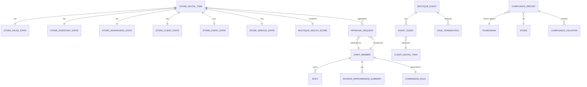

# 📋 Product Requirements Document (PRD)

## RSMS — Boutique Admin (Store / Boutique Admin Management) Module

### Codename: **Boutique Command Center**

---

| Field | Value |
|---|---|
| **Product** | Retail Store Management System (RSMS) — iOS Application |
| **Module** | Store / Boutique Admin Management |
| **Version** | 1.0 |
| **Author** | Product Development Team |
| **Date** | 2026-06-19 |
| **Platform** | iPhone & iPad (iOS 26+) |
| **Frameworks** | SwiftUI, Core ML, Vision, App Intents, Swift Charts, CloudKit, PDFKit |
| **Architecture** | MVVM with Swift Concurrency (`async/await`, Actors) |
| **SRS Reference** | SRS RSMS v1.0 — Sections 2.1.1, 4.1 |
| **Shared Platform** | Store Digital Twin (new) + Client Digital Twin + Product Digital Twin (shared with all modules) |

---

## Table of Contents

1. [Product Vision & Strategic Context](#1-product-vision--strategic-context)
2. [Scope & Boundaries](#2-scope--boundaries)
3. [Shared Architecture — The Store Digital Twin](#3-shared-architecture--the-store-digital-twin)
4. [User Personas & Roles](#4-user-personas--roles)
5. [Information Architecture & Navigation](#5-information-architecture--navigation)
6. [Epic B1 — Executive Dashboard (Boutique Command View)](#6-epic-b1--executive-dashboard-boutique-command-view)
7. [Epic B2 — Workforce & Performance Management](#7-epic-b2--workforce--performance-management)
8. [Epic B3 — Visual Merchandising Intelligence](#8-epic-b3--visual-merchandising-intelligence)
9. [Epic B4 — VIP Events & Client Engagement](#9-epic-b4--vip-events--client-engagement)
10. [Epic B5 — Boutique Inventory Operations](#10-epic-b5--boutique-inventory-operations)
11. [Epic B6 — AI Boutique Copilot](#11-epic-b6--ai-boutique-copilot)
12. [Innovation Features (BF1–BF8)](#12-innovation-features-bf1bf8)
13. [Cross-Module Integration](#13-cross-module-integration)
14. [Data Model & Core Data Schema](#14-data-model--core-data-schema)
15. [API Contract Specifications](#15-api-contract-specifications)
16. [Apple Framework Mapping](#16-apple-framework-mapping)
17. [HIG Compliance Guidelines](#17-hig-compliance-guidelines)
18. [Role-Based Access Control (RBAC)](#18-role-based-access-control-rbac)
19. [Non-Functional Requirements](#19-non-functional-requirements)
20. [Verification & Testing Plan](#20-verification--testing-plan)
21. [Implementation Checklist](#21-implementation-checklist)
22. [Appendices](#22-appendices)

---

## 1. Product Vision & Strategic Context

### 1.1 Vision Statement

> **Boutique Command Center** — A unified operational intelligence platform that transforms the Boutique Manager from a reactive administrator into a **proactive performance leader**, powered by a **Store Digital Twin** that surfaces the health of every dimension of the boutique — sales, people, inventory, clients, events, and repairs — in a single, AI-guided view.

### 1.2 Why This Module Is Underestimated

Most teams think:

```
Store Admin = Dashboard + Staff Scheduling
```

This is wrong.

In luxury retail, the Boutique Manager is the **CEO of a mini-business**, responsible for:

| Domain | Scope |
|---|---|
| **Revenue** | Daily/weekly/monthly targets, conversion, AOV |
| **People** | Scheduling, coaching, commission, performance |
| **VIP Clients** | Relationship management, event hosting, retention |
| **Inventory** | Stock accuracy, variances, transfers, shrink |
| **Events** | Trunk shows, VIP previews, RSVP, revenue attribution |
| **Visual Merchandising** | Planogram compliance, lookbook, brand standards |
| **Operations** | Approvals, escalations, repair SLAs, omnichannel |
| **Customer Experience** | Boutique health, VIP satisfaction, after-sales |

### 1.3 Problem Statement (Current Market Flow — Weak)

| Problem | Impact |
|---|---|
| ❌ Manager opens 4 different dashboards (Sales, Inventory, HR, CRM) | Context switching kills operational agility |
| ❌ Reactive management — sees problems after they happen | Revenue lost, client relationships damaged |
| ❌ No operational intelligence | Manager acts on intuition, not data |
| ❌ No VIP visibility | VIP visits not anticipated, no preparedness |
| ❌ No predictive insights | Staffing, inventory, and event decisions are guesswork |
| ❌ No relationship between sales, inventory, and clients | Three isolated truths, no single operational picture |

### 1.4 Our Solution — Boutique Command Center

```
Boutique Command Center
├── B1  Executive Dashboard (Boutique Command View + Health Score)
├── B2  Workforce & Performance Management
├── B3  Visual Merchandising Intelligence
├── B4  VIP Events & Client Engagement
├── B5  Boutique Inventory Operations
└── B6  AI Boutique Copilot ("Ask the Boutique")
```

### 1.5 Six Core Differentiators

| # | Differentiator | Competitive Advantage |
|---|---|---|
| 1 | **Boutique Health Score** | Distils 20+ KPIs into a single intelligence score (0–100) |
| 2 | **AI Workforce Optimizer** | Predicts traffic, suggests staffing, recommends best advisor for VIP |
| 3 | **AI Planogram Verification** | Vision-based compliance check vs. corporate planogram — zero manual review |
| 4 | **Event Revenue Attribution** | Tracks ROI from invitation through purchase — not just RSVP |
| 5 | **Unified Approval Center** | Every approval (inventory variance, discount, refund, transfer) in one inbox |
| 6 | **AI Boutique Copilot** | Natural language "Ask the Boutique" — reasons across all digital twins |

### 1.6 Business Goals

| Goal | Metric | Target |
|---|---|---|
| Reduce manager context-switching | Systems checked per shift | ≤ 1 (single app) |
| Improve boutique conversion rate | Weekly conversion (visits → purchases) | ≥ 5% uplift |
| Increase visual merchandising compliance | Planogram compliance score | ≥ 95% |
| Event ROI measurement | Revenue attributable to events / event cost | ≥ 5x |
| Reduce SLA breaches | After-sales tickets breaching SLA | ≤ 2% |
| Inventory accuracy | Cycle count accuracy rate | ≥ 99.5% |
| Staff scheduling efficiency | Understaffed shifts per month | ≤ 1 |

---

## 2. Scope & Boundaries

### 2.1 In Scope

| Category | SRS Reference | Details |
|---|---|---|
| **Store Dashboard** | SRS 2.1.1.1, 4.1 bullet 1 | Sales vs targets, appointments, staff shifts, stock alerts |
| **Staff & Shift Planning** | SRS 2.1.1.2, 4.1 bullet 2 | Scheduling, performance goals, dynamic commissions |
| **Visual Merchandising** | SRS 2.1.1.3, 4.1 bullet 3 | Photo upload, planogram/lookbook compliance AI |
| **Inventory Operations** | SRS 2.1.1.4, 4.1 bullet 4 | Receiving, put-away, transfers, cycle counts, RFID/mobile discrepancy handling — management layer |
| **Client Events** | SRS 2.1.1.5, 4.1 bullet 5 | VIP events, trunk shows, digital invitations, RSVP |
| **Innovation** | Beyond SRS | Boutique Health Score, AI Workforce Optimizer, Event Revenue Attribution, Unified Approval Center, AI Copilot, Store Digital Twin |
| **Shared Platform** | Cross-module | Store Digital Twin (new) + reads Client Digital Twin + Product Digital Twin |

### 2.2 Out of Scope

| Item | Rationale |
|---|---|
| Repair execution and AST management | Covered by After-Sales module |
| RFID scan execution and item-level stock management | Covered by Inventory Controller module |
| Clienteling and POS workflows | Covered by Sales Associate module |
| Corporate-level product master data | Covered by Corporate Admin module |
| Android / Web builds | iOS-only per SRS 2.3 |

### 2.3 Key Definitions

| Term | Definition |
|---|---|
| **Store Digital Twin** | Unified operational model of the boutique — aggregates sales, inventory, staff, clients, events, and repairs into a single AI-queryable entity |
| **Boutique Health Score** | Composite 0–100 score summarising boutique performance across 6 domains |
| **Unified Approval Center** | Single inbox for all manager-level approvals across every module |
| **Planogram** | Corporate-mandated visual layout for product display |
| **VIP Event** | Invitation-only boutique event: trunk show, collection preview, private sale |
| **Event Revenue Attribution** | Tracking purchase revenue from clients who attended a given event |
| **Commission Rule** | Configurable per-associate commission calculation (flat, tiered, brand-weighted) |
| **SLA** | Service Level Agreement for after-sales repair turnaround |
| **Variance Signoff** | Managerial approval required for any inventory count discrepancy above threshold |

### 2.4 Dependencies & Shared Platform

| Dependency | Source Module | Data Flow |
|---|---|---|
| **Client Digital Twin** | Sales Associate module | Read (VIP context, wishlist, preferences for event invitations) |
| **Product Digital Twin** | Inventory Controller module | Read (stock data, shrink risk, transfer status) |
| **Store Digital Twin** | **New — introduced by this module** | Read/Write (aggregated store operational state) |
| Sales & transaction data | Sales Associate POS | Read (revenue, conversion, AOV) |
| After-Sales Tickets (ASTs) | After-Sales module | Read (open repairs, SLA status, escalations) |
| Inventory stock & variances | Inventory Controller | Read (stock alerts, transfer requests, cycle count status) |
| Staff & shift data | This module | Write (shifts, commission rules, performance goals) |
| Push Notifications | APNs | Infrastructure (VIP arrival alerts, SLA breaches) |
| Vision ML Models | Core ML + Vision | Embedded (planogram compliance) |

---

## 3. Shared Architecture — The Store Digital Twin

> **This module introduces the Store Digital Twin — the third core entity in the RSMS Digital Twin Ecosystem, completing the Luxury Retail OS architecture.**

### 3.1 The Complete Digital Twin Ecosystem

```
Luxury Retail OS — Unified Digital Twin Ecosystem
│
├── Client Digital Twin   ← Introduced by Sales Associate module
│       Every customer's relationship, history, and preferences
│
├── Product Digital Twin  ← Introduced by Inventory Controller module
│       Every luxury item's lifecycle, ownership, and provenance
│
└── Store Digital Twin    ← Introduced by this module (Boutique Admin)
        The boutique's real-time operational state
```

### 3.2 What the Store Digital Twin Knows

```swift
struct StoreDigitalTwin: Codable, Identifiable {
    let id: UUID
    let storeCode: String                         // e.g., "DLH-001"
    let storeName: String
    let region: String
    let updatedAt: Date

    // Live Sales Data (from Sales Associate module)
    var salesState: StoreSalesState

    // Live Inventory Data (from Inventory Controller module)
    var inventoryState: StoreInventoryState

    // Live Staffing Data (from this module)
    var workforceState: StoreWorkforceState

    // Live Client Data (from Client Digital Twin)
    var clientState: StoreClientState

    // Live Event Data (from this module)
    var eventState: StoreEventState

    // Live After-Sales Data (from After-Sales module)
    var serviceState: StoreServiceState

    // Computed Scores (by AI Copilot)
    var healthScore: BoutiqueHealthScore
    var activeAlerts: [OperationalAlert]
    var pendingApprovals: [ApprovalRequest]
}

struct StoreSalesState: Codable {
    var revenueTodayActual: Decimal
    var revenueTodayTarget: Decimal
    var targetAchievementPercent: Double
    var transactionCount: Int
    var conversionRate: Double
    var averageOrderValue: Decimal
    var topSellingCategories: [String]
    var openCarts: Int
    var pendingCheckouts: Int
    var weeklyRevenueTrend: [DailyRevenue]
}

struct StoreInventoryState: Codable {
    var totalUnits: Int
    var activeAlerts: Int                         // Low stock, stockouts
    var shrinkRiskItems: Int
    var pendingTransfers: Int
    var openVariances: Int
    var lastCycleCountDate: Date?
    var inventoryAccuracyScore: Double
    var pendingPutAway: Int
    var rfidCoveragePercent: Double
}

struct StoreWorkforceState: Codable {
    var staffOnShift: Int
    var totalScheduled: Int
    var advisorPerformance: [AdvisorPerformanceSummary]
    var pendingShiftApprovals: Int
    var commissionsDueThisMonth: Decimal
    var upcomingShifts: [Shift]
}

struct StoreClientState: Codable {
    var vipVisitsToday: Int
    var appointmentsToday: Int
    var appointmentsCompleted: Int
    var upcomingAnniversaries: Int               // In next 30 days
    var openOpportunities: Int                   // From Opportunity Engine
    var wishlistAlerts: Int                      // Items back in stock
    var pendingFollowUps: Int
}

struct StoreEventState: Codable {
    var activeEvents: [EventSummary]
    var upcomingEvents: [EventSummary]
    var pendingRSVPs: Int
    var totalEventRevenueThisMonth: Decimal
}

struct StoreServiceState: Codable {
    var openASTs: Int
    var slaBreachRisk: Int                       // Repairs approaching breach
    var slaBreached: Int
    var pendingAuthentications: Int
    var pendingValuations: Int
    var repairsCompletedToday: Int
    var customerCallbacksDue: Int
}
```

### 3.3 Boutique Health Score — Computed Entity

```swift
struct BoutiqueHealthScore: Codable {
    var overall: Int                             // 0–100

    // Component scores (each 0–100)
    var salesPerformance: Int                    // Revenue vs target, conversion
    var inventoryAccuracy: Int                   // Cycle count, shrink, variances
    var vipSatisfaction: Int                     // Appointment completion, retention
    var workforceEfficiency: Int                 // Staffing, commissions, coaching
    var repairSLACompliance: Int                 // After-Sales SLA adherence
    var eventPerformance: Int                    // Event ROI, attendance rate
    var merchandisingCompliance: Int             // Planogram / lookbook score

    var trend: ScoreTrend                        // .improving, .stable, .declining
    var alerts: [String]                         // Top 3 things hurting the score
    var recommendations: [String]                // Top 3 things to do today
    var computedAt: Date
}
```

### 3.4 How Boutique Admin Connects to All Three Modules

```
Store Digital Twin
│
├─ reads ──→  Client Digital Twin (Sales Associate module)
│               VIP visits today, appointments, open opportunities
│               Wishlist alerts, anniversary countdown
│
├─ reads ──→  Product Digital Twin (Inventory Controller module)
│               Stock levels, shrink risk, cycle count status
│               Transfer requests, pending put-away
│
├─ reads ──→  Sales Transactions (Sales Associate POS)
│               Daily revenue, conversion rate, AOV
│               Open carts, split tenders, returns
│
├─ reads ──→  After-Sales Tickets (After-Sales module)
│               Open repairs, SLA risk, escalations
│               Authentication requests, valuations
│
└─ writes ──→ Approvals, Shift changes, Event data, Planogram compliance results
              back into the shared platform for all modules to read
```

### 3.5 The Manager's View — One Screen, All Truths

When the Boutique Manager opens the app:

```
┌──────────────────────────────────────────────────────┐
│  Delhi Boutique — Today, June 19                     │
│                                                      │
│  🏥 Boutique Health     91/100  ↗ Improving          │
│                                                      │
│  💰 Revenue  ₹4.2L  / ₹5.8L Target  (72%)  ⚠        │
│  📅 Appointments  8 booked  |  5 completed           │
│  👑 VIPs Today  3 expected  |  1 confirmed arrival   │
│  👥 Staff  6 on shift  |  2 pending approval         │
│  📦 Stock Alerts  4 low stock  |  1 stockout         │
│  🔧 Repairs  12 open  |  2 SLA risk                  │
│  🎫 Events  1 active  |  Showcase tonight            │
│                                                      │
│  ⚡ AI Copilot: "Revenue 28% below target.           │
│  2 VIP appointments cancelled.                       │
│  Recommend: Assign Priya to Walk-in VIP floor."     │
└──────────────────────────────────────────────────────┘
```

---

## 4. User Personas & Roles

### 4.1 Primary Personas

#### Persona 1: Boutique Manager (Power User)

| Attribute | Detail |
|---|---|
| **Name** | Rajesh — Store Manager, Delhi Boutique |
| **Role** | Boutique Manager |
| **Tech Proficiency** | Medium-High — uses iPad throughout the day |
| **Daily Tasks** | Reviews boutique health, manages staffing, monitors VIP visits, approves discounts and variances, oversees events, tracks repair SLAs |
| **Pain Points** | Checking 4 different systems, reactive management, no predictive warnings, VIP visits not flagged in advance |
| **Goals** | Hit revenue targets, protect the brand experience, manage proactively not reactively |

#### Persona 2: Area Manager (Multi-Store Oversight)

| Attribute | Detail |
|---|---|
| **Name** | Sunita — Regional Manager, North India |
| **Role** | Area / Regional Manager |
| **Tech Proficiency** | High |
| **Daily Tasks** | Cross-store performance comparison, VIP transfer oversight, regional compliance, approving large variances |
| **Pain Points** | No cross-store operational view, relies on manual store manager reports |
| **Goals** | Benchmark stores, drive consistency, identify underperformers early |

#### Persona 3: Corporate Admin (Strategic)

| Attribute | Detail |
|---|---|
| **Name** | Meera — VP Retail Operations |
| **Role** | Corporate Admin / Retail Ops |
| **Tech Proficiency** | High |
| **Daily Tasks** | Network-wide compliance, planogram rollouts, event strategy, budget |
| **Pain Points** | Planogram compliance is manual and slow; event ROI is not tracked |
| **Goals** | Brand consistency at scale, data-driven operations, event intelligence |

### 4.2 RACI Matrix

| Activity | Boutique Manager | Area Manager | Corporate Admin |
|---|---|---|---|
| **View Boutique Health Score** | **R/A** | **R** | **R** |
| **Create / Edit Shifts** | **R/A** | I | – |
| **Approve Discount (above associate threshold)** | **R/A** | I | I |
| **Approve Inventory Variance** | **R/A** | **A** (large) | I |
| **Approve Transfer Request** | **R/A** | I | – |
| **Create VIP Event** | **R/A** | I | **A** |
| **Upload Planogram Reference** | I | I | **R/A** |
| **Upload Compliance Photos** | **R/A** | I | I |
| **Review Compliance Report** | **R** | **R** | **R/A** |
| **Ask AI Copilot** | **R** | **R** | **R** |
| **Cross-Store Analytics** | I | **R/A** | **R/A** |
| **Commission Rule Config** | I | I | **R/A** |

---

## 5. Information Architecture & Navigation

### 5.1 SwiftUI View Hierarchy

```
BoutiqueAdminTabView (TabView)
├── Tab 1: CommandDashboardView
│   ├── BoutiqueHealthScoreCardView       ← Composite health score
│   ├── SalesSnapshotView                 ← Revenue vs target, conversion
│   ├── VIPTodayCardView                  ← VIP visits, appointments
│   ├── WorkforceStatusCardView           ← Staff on shift, pending approvals
│   ├── StockAlertCardView                ← Alerts from Inventory module
│   ├── RepairStatusCardView              ← Open ASTs, SLA risk
│   ├── EventActivityCardView             ← Tonight's event summary
│   └── AIInsightBannerView               ← AI Copilot top insight
│
├── Tab 2: WorkforceView
│   ├── ShiftCalendarView
│   │   ├── ShiftRowView
│   │   └── CreateShiftView
│   ├── StaffListView
│   │   └── AssociatePerformanceDetailView
│   │       ├── KPIMetricsView
│   │       ├── CommissionBreakdownView
│   │       └── CoachingOpportunityView
│   ├── CommissionCalculatorView
│   └── AIWorkforceOptimizerView          ← Traffic prediction + staffing recommendation
│
├── Tab 3: MerchandisingView
│   ├── PlanogramLibraryView
│   │   └── PlanogramDetailView
│   ├── CompliancePhotoUploadView         ← Camera + Vision analysis
│   ├── ComplianceReportView
│   │   ├── ComplianceScoreView
│   │   ├── ViolationListView
│   │   └── HistoricalComplianceChartView
│   └── LookbookView
│
├── Tab 4: EventsView
│   ├── EventListView (upcoming + past)
│   │   └── EventCardView
│   ├── EventDetailView
│   │   ├── EventOverviewView
│   │   ├── GuestListView
│   │   │   └── GuestRSVPRowView
│   │   ├── EventRevenueAttributionView   ← Revenue tracked from event purchases
│   │   └── VIPInvitationSuggesterView    ← AI guest recommendation
│   ├── CreateEventView
│   └── InvitationBuilderView
│
├── Tab 5: OperationsView (Unified Approval Center)
│   ├── ApprovalInboxView                 ← ALL approvals in one queue
│   │   ├── InventoryVarianceApprovalView
│   │   ├── DiscountApprovalView
│   │   ├── RefundApprovalView
│   │   └── TransferApprovalView
│   ├── InventoryOpsView
│   │   ├── ReceivingOversightView
│   │   ├── PutAwayStatusView
│   │   ├── TransferRequestsView
│   │   └── CycleCountStatusView
│   └── RepairOversightView
│       ├── OpenASTsView
│       └── SLABreachRiskView
│
└── Tab 6: CopilotView
    ├── CopilotChatView                   ← "Ask the Boutique" interface
    │   ├── QueryInputView
    │   ├── AIResponseView
    │   └── SuggestedQueriesView
    └── CopilotInsightsFeedView           ← Proactive daily insights
```

### 5.2 Navigation Pattern

| Pattern | Usage |
|---|---|
| **TabView** | Top-level navigation (6 tabs) |
| **NavigationStack** | Drill-down (Dashboard → Detail cards) |
| **NavigationSplitView** | iPad three-column (Staff list + Detail + Commission) |
| **Sheet** | Create event, create shift, AI Copilot queries |
| **FullScreenCover** | Camera for planogram compliance photo capture |
| **Alert / ConfirmationDialog** | Approval confirmations, large variance sign-offs |

### 5.3 iPad Layout

```
iPad (Regular Width):
┌────────────────────────────────────────────────────────┐
│  Command   Workforce   Merchandising   Events   Ops    │
├──────────────┬─────────────────────────┬───────────────┤
│  Staff List  │  Associate Detail       │ Commission    │
│              │  ─────────────────────  │ Breakdown     │
│  👤 Priya    │  Revenue: ₹3.2L         │               │
│  👤 Arjun    │  Conv Rate: 38%         │ Base: ₹42K   │
│  👤 Meera    │  Appointments: 6        │ Tier: ₹8K    │
│  👤 Rahul    │  ⚡ Coach: Upselling    │ Brand: ₹5K   │
└──────────────┴─────────────────────────┴───────────────┘
```

---

## 6. Epic B1 — Executive Dashboard (Boutique Command View)

> **SRS Coverage**: 2.1.1.1, 4.1 bullet 1

### 6.1 Overview

The manager's first screen after opening the app — a live, AI-synthesised operational snapshot of the entire boutique. Replaces the need to open 4 separate systems by aggregating the Store Digital Twin into a single, action-oriented command view.

### 6.2 User Stories

| ID | Story | Priority |
|---|---|---|
| B1-US01 | As a boutique manager, I want to see today's revenue vs target with a clear visual indicator so that I can assess performance at a glance. | P0 |
| B1-US02 | As a boutique manager, I want to see a single Boutique Health Score (0–100) with the top 3 issues and top 3 recommendations so that I know exactly where to focus. | P0 |
| B1-US03 | As a boutique manager, I want to see today's appointment count and completion status so that I can track client engagement. | P0 |
| B1-US04 | As a boutique manager, I want to see which VIP clients are expected or present in-store today so that I can ensure they receive the right level of service. | P0 |
| B1-US05 | As a boutique manager, I want to see staff on shift vs scheduled so that I can spot understaffing immediately. | P0 |
| B1-US06 | As a boutique manager, I want to see stock alert count (low stock, stockouts, shrink risk) from the Inventory module so that I can act before a stockout loses a sale. | P0 |
| B1-US07 | As a boutique manager, I want to see open repair count and SLA-at-risk repairs from the After-Sales module so that I can escalate before client satisfaction is impacted. | P0 |
| B1-US08 | As a boutique manager, I want a configurable widget layout so that I can prioritise what matters most to my store. | P2 |
| B1-US09 | As an area manager, I want to switch between stores I oversee and see each store's health score so that I can identify underperformers. | P1 |
| B1-US10 | As a boutique manager, I want to tap any dashboard card to drill into the detail view for that domain so that the dashboard is a navigation hub, not just a summary. | P0 |

### 6.3 Boutique Health Score — Algorithm

| Component | Weight | Source |
|---|---|---|
| Sales Performance (revenue vs target, conversion) | 25% | Sales Associate module |
| Inventory Accuracy (cycle count, variances, shrink) | 20% | Inventory Controller module |
| VIP Satisfaction (appointment completion, retention) | 20% | Client Digital Twin |
| Workforce Efficiency (staffing, commissions, coaching) | 15% | This module |
| Repair SLA Compliance | 10% | After-Sales module |
| Merchandising Compliance (planogram score) | 10% | This module (Vision ML) |

```swift
actor BoutiqueHealthScoreEngine {
    func compute(twin: StoreDigitalTwin) async -> BoutiqueHealthScore {
        let sales     = scoreSalesPerformance(twin.salesState)
        let inventory = scoreInventoryAccuracy(twin.inventoryState)
        let vip       = scoreVIPSatisfaction(twin.clientState)
        let workforce = scoreWorkforceEfficiency(twin.workforceState)
        let sla       = scoreRepairSLA(twin.serviceState)
        let merch     = scoreMerchandising(twin.merchandisingScore)

        let overall = Int(
            sales     * 0.25 +
            inventory * 0.20 +
            vip       * 0.20 +
            workforce * 0.15 +
            sla       * 0.10 +
            merch     * 0.10
        )

        return BoutiqueHealthScore(
            overall: overall,
            salesPerformance: Int(sales),
            inventoryAccuracy: Int(inventory),
            vipSatisfaction: Int(vip),
            workforceEfficiency: Int(workforce),
            repairSLACompliance: Int(sla),
            merchandisingCompliance: Int(merch),
            trend: computeTrend(twin),
            alerts: generateAlerts(twin),
            recommendations: generateRecommendations(twin),
            computedAt: Date()
        )
    }
}
```

### 6.4 Acceptance Criteria — B1

| ID | Criterion | Verification |
|---|---|---|
| B1-AC01 | Dashboard loads with all data within 2 seconds on store open | Performance test |
| B1-AC02 | Boutique Health Score updates within 60 seconds of any module event | Integration test |
| B1-AC03 | Revenue vs target shows correct currency, percent, and delta | Unit test |
| B1-AC04 | VIP visits today are sourced from Client Digital Twin in real time | Cross-module test |
| B1-AC05 | Stock alerts are sourced from Inventory Controller module | Cross-module test |
| B1-AC06 | Repair SLA risk count is sourced from After-Sales module | Cross-module test |
| B1-AC07 | Tapping any card navigates to the correct detail view | UI test |
| B1-AC08 | Health Score trend (improving/stable/declining) is correctly computed | Unit test |
| B1-AC09 | Area manager store switcher shows correct health scores for each store | Integration test |
| B1-AC10 | Dashboard renders correctly in offline mode with cached data + warning banner | Offline test |

---

## 7. Epic B2 — Workforce & Performance Management

> **SRS Coverage**: 2.1.1.2, 4.1 bullet 2

### 7.1 Overview

Full shift scheduling, associate performance tracking, and dynamic commission calculation — supplemented by an AI Workforce Optimizer that predicts store traffic and recommends staffing adjustments and advisor-to-VIP matching.

### 7.2 User Stories

| ID | Story | Priority |
|---|---|---|
| B2-US01 | As a boutique manager, I want to create and publish weekly shift schedules, assign staff to shifts, and set role constraints so that coverage is always planned. | P0 |
| B2-US02 | As a boutique manager, I want to view each associate's performance metrics (revenue, conversion, AOV, appointments, follow-ups) so that I can coach effectively. | P0 |
| B2-US03 | As a boutique manager, I want to set revenue targets and performance goals per associate per week/month so that individual accountability is clear. | P0 |
| B2-US04 | As a boutique manager, I want the system to dynamically calculate associate commissions based on configurable rules (flat rate, tiered, brand-weighted, bonus triggers) so that commission processing is accurate and automatic. | P0 |
| B2-US05 | As a boutique manager, I want to see AI-generated coaching alerts ("Associate A has high traffic but low conversion — recommend upselling training") so that I can act on underperformance early. | P1 |
| B2-US06 | As a boutique manager, I want the AI Workforce Optimizer to predict next week's traffic and suggest headcount adjustments so that I am never understaffed. | P1 |
| B2-US07 | As a boutique manager, when a VIP client books an appointment, I want the system to suggest the best available advisor based on their past relationship, language, and expertise so that the match is optimal. | P1 |
| B2-US08 | As a boutique manager, I want to view month-to-date commission summaries per associate and export a payroll report so that finance can process commissions. | P0 |
| B2-US09 | As an area manager, I want to compare advisor performance across all stores in my region so that I can identify best practices. | P1 |
| B2-US10 | As a sales associate, I want to view my own performance metrics and commission breakdown so that I can self-manage. | P1 |

### 7.3 Data Models

```swift
struct StaffMember: Codable, Identifiable {
    let id: UUID
    let employeeCode: String
    let firstName: String
    let lastName: String
    let role: StaffRole                          // .salesAssociate, .inventoryController, .afterSalesSpec, .manager
    let storeID: UUID
    let joinDate: Date
    var isActive: Bool
    var preferredLanguages: [String]
    var specialisations: [String]                // e.g. ["Watches", "Jewelry"]
}

struct Shift: Codable, Identifiable {
    let id: UUID
    let staffMemberID: UUID
    let storeID: UUID
    let date: Date
    let startTime: Date
    let endTime: Date
    let role: StaffRole
    var status: ShiftStatus                      // .scheduled, .confirmed, .inProgress, .completed, .absent
    var notes: String
}

struct PerformanceGoal: Codable, Identifiable {
    let id: UUID
    let staffMemberID: UUID
    let storeID: UUID
    let period: GoalPeriod                       // .weekly, .monthly, .quarterly
    let startDate: Date
    let endDate: Date
    var revenueTarget: Decimal
    var appointmentTarget: Int
    var conversionTarget: Double
    var aovTarget: Decimal
    var followUpTarget: Int
}

struct CommissionRule: Codable, Identifiable {
    let id: UUID
    let name: String
    let storeID: UUID?                           // nil = global default
    let type: CommissionType                     // .flatRate, .tiered, .brandWeighted, .bonus
    var rate: Double
    var tiers: [CommissionTier]
    var brandMultipliers: [String: Double]
    var bonusTriggers: [BonusTrigger]
    var effectiveFrom: Date
    var effectiveTo: Date?
}

struct CommissionTier: Codable {
    var minRevenue: Decimal
    var maxRevenue: Decimal?
    var rate: Double
}

struct AdvisorPerformanceSummary: Codable, Identifiable {
    let id: UUID
    let staffMemberID: UUID
    let period: GoalPeriod
    var revenueActual: Decimal
    var revenueTarget: Decimal
    var conversionRate: Double
    var averageOrderValue: Decimal
    var appointmentsCompleted: Int
    var followUpsCompleted: Int
    var vipRevenue: Decimal
    var commissionEarned: Decimal
    var coachingAlerts: [CoachingAlert]
}

struct CoachingAlert: Codable, Identifiable {
    let id: UUID
    let staffMemberID: UUID
    let type: CoachingType                       // .lowConversion, .lowAOV, .missedFollowUps, .appointmentNoShows
    let title: String
    let description: String
    let suggestion: String
    let generatedAt: Date
}
```

### 7.4 Acceptance Criteria — B2

| ID | Criterion | Verification |
|---|---|---|
| B2-AC01 | Shift schedule creation correctly validates against conflicts and role requirements | Unit test |
| B2-AC02 | Commission calculation matches configured rules for all commission types | Unit test |
| B2-AC03 | Performance metrics are sourced in real-time from Sales Associate module data | Integration test |
| B2-AC04 | AI coaching alert fires within 24 hours of underperformance pattern detected | Integration test |
| B2-AC05 | AI Workforce Optimizer traffic prediction shows confidence interval | Unit test |
| B2-AC06 | VIP advisor matching recommends the advisor with the best historical relationship score | Cross-module test |
| B2-AC07 | Payroll export generates a correct PDF/CSV report | Document test |
| B2-AC08 | Associate can view own metrics but not other associates' data | RBAC test |
| B2-AC09 | Monthly commission totals are correct across all commission types | Unit test |
| B2-AC10 | Shift changes sync across devices within 30 seconds | Integration test |

---

## 8. Epic B3 — Visual Merchandising Intelligence

> **SRS Coverage**: 2.1.1.3, 4.1 bullet 3

### 8.1 Overview

Vision-powered planogram compliance verification. Manager or visual merchandising associate photographs the boutique floor; the AI compares against the corporate planogram and generates a compliance score, flagging missing items, wrong positions, and outdated collections — automatically, without manual review.

### 8.2 User Stories

| ID | Story | Priority |
|---|---|---|
| B3-US01 | As a boutique manager, I want to photograph a display area and have the app automatically compare it against the corporate planogram so that compliance checking is instant. | P0 |
| B3-US02 | As a boutique manager, I want to see a compliance score (0–100%) per display zone so that I know exactly which areas need attention. | P0 |
| B3-US03 | As a boutique manager, I want the Vision system to detect missing products, wrong positions, incorrect displays, and outdated collections so that every violation is captured. | P0 |
| B3-US04 | As a boutique manager, I want to view the corporate planogram side-by-side with my compliance photo so that corrections are unambiguous. | P1 |
| B3-US05 | As a boutique manager, I want to add a correction note and re-photograph after fixing a violation so that I can close compliance issues with evidence. | P1 |
| B3-US06 | As a corporate admin, I want to upload updated planogram reference images and layouts for each store so that compliance is always measured against the latest standard. | P0 |
| B3-US07 | As a corporate admin, I want to see compliance scores across all stores so that I can identify stores consistently failing visual standards. | P1 |
| B3-US08 | As a boutique manager, I want to access the lookbook for the current season so that staff can reference collection styling standards. | P1 |
| B3-US09 | As a boutique manager, I want historical compliance scores charted over time so that I can see improvement trends. | P2 |
| B3-US10 | As a boutique manager, I want compliance check results to feed into the Boutique Health Score automatically so that the health score reflects visual standards. | P0 |

### 8.3 Vision ML Compliance Pipeline

```swift
actor PlanogramComplianceEngine {

    private let classifier: MLModel              // ShelfComplianceClassifier (Core ML)
    private let detector: VNDetectRectanglesRequest

    func analyzePhoto(
        image: UIImage,
        planogram: Planogram,
        zone: DisplayZone
    ) async throws -> ComplianceReport {

        // Step 1: Object detection using Vision
        let detectedItems = try await detectProducts(in: image)

        // Step 2: Compare detected layout vs planogram layout
        let violations = try await compareWithPlanogram(
            detected: detectedItems,
            expected: planogram.zones[zone.id] ?? []
        )

        // Step 3: Classify compliance score
        let score = try await classifier.prediction(
            from: MLFeatureProvider(image: image, planogram: planogram)
        )

        return ComplianceReport(
            zoneID: zone.id,
            score: score.complianceScore,
            violations: violations,
            capturedAt: Date(),
            photoURL: savePhoto(image)
        )
    }

    private func detectProducts(in image: UIImage) async throws -> [DetectedProduct] {
        // Uses VNRecognizeTextRequest + VNDetectRectanglesRequest
        // to identify product labels, positions, and categories
    }
}
```

### 8.4 Compliance Report Data Model

```swift
struct ComplianceReport: Codable, Identifiable {
    let id: UUID
    let storeID: UUID
    let zoneID: UUID
    let planogramID: UUID
    let score: Double                            // 0.0–1.0
    let capturedAt: Date
    let capturedBy: UUID                         // Staff ID
    let photoURL: URL
    var violations: [ComplianceViolation]
    var status: ComplianceStatus                 // .pass (>90%), .warning (70–90%), .fail (<70%)
    var correctedAt: Date?
    var correctionPhotoURL: URL?
    var correctionNotes: String?
}

struct ComplianceViolation: Codable, Identifiable {
    let id: UUID
    let type: ViolationType
    let zone: String
    let description: String
    let severity: ViolationSeverity              // .low, .medium, .high
    var resolvedAt: Date?
}

enum ViolationType: String, Codable {
    case missingProduct      = "Missing Product"
    case wrongPosition       = "Wrong Position"
    case incorrectDisplay    = "Incorrect Display"
    case outdatedCollection  = "Outdated Collection"
    case lightingIssue       = "Lighting Issue"
    case tagMissing          = "Price Tag Missing"
}

struct Planogram: Codable, Identifiable {
    let id: UUID
    let name: String
    let season: String
    let storeID: UUID?                           // nil = global template
    let uploadedAt: Date
    let uploadedBy: UUID
    var zones: [UUID: [PlanogramItem]]
    var referenceImages: [UUID: URL]             // Zone → Reference image
}
```

### 8.5 Acceptance Criteria — B3

| ID | Criterion | Verification |
|---|---|---|
| B3-AC01 | Photo capture opens camera with correct framing overlay for zone | UI test |
| B3-AC02 | Vision analysis returns compliance score within 5 seconds | Performance test |
| B3-AC03 | All four violation types (missing, wrong position, incorrect display, outdated) are detected | ML validation test |
| B3-AC04 | Side-by-side planogram comparison shows correct reference for the zone | Integration test |
| B3-AC05 | Correction photo updates the compliance report and marks violation resolved | Integration test |
| B3-AC06 | Corporate admin can upload new planogram and it is available to all stores within 5 minutes | Integration test |
| B3-AC07 | Compliance score feeds into Boutique Health Score within 60 seconds | Cross-module test |
| B3-AC08 | Historical compliance chart renders correctly for 12-month range | Unit test |
| B3-AC09 | Network-wide compliance view shows correct per-store scores | Integration test |
| B3-AC10 | Lookbook PDFs render correctly and are accessible offline | Offline test |

---

## 9. Epic B4 — VIP Events & Client Engagement

> **SRS Coverage**: 2.1.1.5, 4.1 bullet 5

### 9.1 Overview

End-to-end VIP event management: create trunk shows and collection previews, build an AI-recommended guest list from Client Digital Twin data, send branded digital invitations, track RSVPs in real time, manage attendance on the day, and track every purchase made by event attendees to compute true event ROI.

### 9.2 User Stories

| ID | Story | Priority |
|---|---|---|
| B4-US01 | As a boutique manager, I want to create a VIP event with a name, date, venue, capacity, dress code, and description so that the event is fully structured. | P0 |
| B4-US02 | As a boutique manager, I want the AI to recommend which clients to invite based on brand affinity, purchase history, wishlist alignment, and relationship health score so that the right VIPs attend. | P0 |
| B4-US03 | As a boutique manager, I want to send personalised digital invitations to selected guests via push, email, SMS, or WhatsApp so that invitations feel premium and reach every channel. | P0 |
| B4-US04 | As a boutique manager, I want to track RSVPs in real time (accepted, declined, no response) and send automated reminders to non-responders so that attendance is maximised. | P0 |
| B4-US05 | As a boutique manager, I want to check in guests on the day using a QR-code scan so that attendance is accurately tracked. | P0 |
| B4-US06 | As a boutique manager, I want the system to automatically attribute purchases made on event day (or within 7 days) by attending guests to the event so that I can compute true revenue and ROI. | P0 |
| B4-US07 | As a boutique manager, I want to see a post-event report showing guests invited, attended, revenue generated, and ROI so that I can present results to corporate. | P1 |
| B4-US08 | As a corporate admin, I want to see event ROI across all stores and event types so that I can allocate event budget more effectively. | P1 |
| B4-US09 | As a boutique manager, I want event attendance to be logged as an event on the attendee's Client Digital Twin so that the relationship history is complete. | P0 |
| B4-US10 | As a boutique manager, I want to create a follow-up opportunity for every attendee who did not purchase at the event so that no lead is wasted. | P1 |

### 9.3 Data Models

```swift
struct BoutiqueEvent: Codable, Identifiable {
    let id: UUID
    let eventCode: String                        // e.g., "EVT-2026-DLH-0034"
    let storeID: UUID
    let createdBy: UUID
    let name: String
    let type: EventType                          // .trunkShow, .vipPreview, .privateSale, .collectionLaunch, .workshop
    let description: String
    let scheduledDate: Date
    let doorOpenTime: Date
    let closingTime: Date
    let venueDetails: String
    let capacity: Int
    let dressCode: String?
    let featuredBrands: [String]
    var status: EventStatus                      // .draft, .invitationsSent, .live, .completed, .cancelled

    var guestList: [EventGuest]
    var attendeePurchases: [UUID]                // Transaction IDs attributed to this event
    var revenue: Decimal                         // Computed from attendeePurchases
    var roi: Double?                             // Revenue / event cost
    var eventCost: Decimal
}

struct EventGuest: Codable, Identifiable {
    let id: UUID
    let eventID: UUID
    let clientTwinID: UUID                       // Links to Client Digital Twin
    let clientName: String
    let tier: CustomerTier
    var invitationChannel: CommunicationChannel
    var invitationSentAt: Date?
    var rsvpStatus: RSVPStatus                   // .pending, .accepted, .declined, .noResponse
    var rsvpUpdatedAt: Date?
    var checkedIn: Bool
    var checkInTime: Date?
    var checkInMethod: CheckInMethod             // .qrScan, .manual
    var purchasesAtEvent: [UUID]                 // Transaction IDs
    var postEventOpportunityCreated: Bool
}

enum RSVPStatus: String, Codable {
    case pending, accepted, declined, noResponse
}

enum EventType: String, Codable {
    case trunkShow         = "Trunk Show"
    case vipPreview        = "VIP Preview"
    case privateSale       = "Private Sale"
    case collectionLaunch  = "Collection Launch"
    case workshop          = "Workshop"
}
```

### 9.4 Event Revenue Attribution

```
Summer Jewelry Showcase — Delhi Boutique

Invitations Sent:       120
RSVPs Accepted:          85
Checked In:              61  (72% attendance rate)
─────────────────────────────────────────────────
Purchases At Event:       38 transactions
Revenue (Day Of):   ₹87.4L

Post-Event Purchases:     12 (within 7-day window)
Revenue (7-Day):    ₹36.8L
─────────────────────────────────────────────────
Total Attributed Revenue:  ₹1.24 Cr
Event Cost:                ₹16.0L
ROI:                       7.8×
─────────────────────────────────────────────────
Non-purchasers:            23 → Follow-up opportunities created
```

### 9.5 Acceptance Criteria — B4

| ID | Criterion | Verification |
|---|---|---|
| B4-AC01 | Event creation stores all fields and generates unique event code | Unit test |
| B4-AC02 | AI guest recommendation ranks clients correctly by affinity + relationship health | Cross-module test |
| B4-AC03 | Invitations are dispatched via selected channel within 60 seconds of send | Integration test |
| B4-AC04 | RSVP tracking updates in real time without refresh | Integration test |
| B4-AC05 | QR code check-in scans and marks guest as checked in within 2 seconds | Performance test |
| B4-AC06 | Event attendance is logged as `vipEventAttended` on the Client Digital Twin | Cross-module test |
| B4-AC07 | Revenue attribution correctly links purchases to event (day-of + 7-day window) | Integration test |
| B4-AC08 | Post-event ROI report generates correctly | Unit test |
| B4-AC09 | Follow-up opportunities are created for all non-purchasers | Integration test |
| B4-AC10 | Corporate view shows event ROI across all stores | Integration test |

---

## 10. Epic B5 — Boutique Inventory Operations

> **SRS Coverage**: 2.1.1.4, 4.1 bullet 4

### 10.1 Overview

The management oversight layer for all inventory operations. The Boutique Manager does not execute RFID scans or receiving workflows directly — those are handled by the Inventory Controller module. This epic provides the manager with oversight, exception management, variance approval, and the Unified Approval Center that aggregates every actionable item from every module into a single inbox.

### 10.2 User Stories

| ID | Story | Priority |
|---|---|---|
| B5-US01 | As a boutique manager, I want to see a daily inventory operations summary (today's receipts, pending put-away, transfer requests, open variances, cycle count status) so that I have a complete operations picture. | P0 |
| B5-US02 | As a boutique manager, I want to be notified of any inventory variance above the configured threshold so that I can review and approve or investigate immediately. | P0 |
| B5-US03 | As a boutique manager, I want to approve, reject, or escalate variance resolutions with a reason and audit trail so that every adjustment is authorised and traceable. | P0 |
| B5-US04 | As a boutique manager, I want to see a Unified Approval Center containing every pending approval — inventory variance, discount request, refund, transfer — in a single prioritised inbox so that nothing is missed. | P0 |
| B5-US05 | As a boutique manager, I want to approve or reject inter-store transfer requests with comments so that transfers are controlled. | P0 |
| B5-US06 | As a boutique manager, I want to see the current cycle count schedule and the status of any in-progress count so that audits are on track. | P1 |
| B5-US07 | As a boutique manager, I want to see open repair tickets and those approaching SLA breach so that I can escalate to the After-Sales team before a client is impacted. | P0 |
| B5-US08 | As a boutique manager, I want to see authentication and valuation requests pending corporate response so that I can set client expectations. | P1 |
| B5-US09 | As a boutique manager, I want to be notified of shrink risk items identified by the Inventory Controller so that I can initiate an investigation. | P1 |
| B5-US10 | As an area manager, I want to see pending approvals across all stores I manage so that critical items are not bottlenecked. | P1 |

### 10.3 Unified Approval Center — Data Model

```swift
struct ApprovalRequest: Codable, Identifiable {
    let id: UUID
    let type: ApprovalType
    let title: String
    let description: String
    let requestedBy: UUID
    let storeID: UUID
    let createdAt: Date
    var urgency: Urgency                         // .low, .medium, .high, .critical
    var status: ApprovalStatus                   // .pending, .approved, .rejected, .escalated
    var reviewedBy: UUID?
    var reviewedAt: Date?
    var reviewerNotes: String?
    var linkedEntityID: UUID?                    // The variance, transaction, or transfer ID
    var linkedEntityType: String
    var expiresAt: Date?
}

enum ApprovalType: String, Codable {
    case inventoryVariance    = "Inventory Variance"
    case discountOverride     = "Discount Override"
    case refundRequest        = "Refund Request"
    case transferRequest      = "Transfer Request"
    case returnException      = "Return Exception"
    case slaEscalation        = "SLA Escalation"
    case cycleCountVariance   = "Cycle Count Variance"
    case shrinkInvestigation  = "Shrink Investigation"
}

enum ApprovalStatus: String, Codable {
    case pending, approved, rejected, escalated
}

// Inventory Operations Dashboard State
struct InventoryOpsState: Codable {
    var todaysReceipts: Int
    var pendingPutAway: Int
    var pendingTransfers: Int
    var openVariances: Int
    var cycleCountStatus: CycleCountStatus
    var shrinkAlerts: Int
    var rfidCoveragePercent: Double
}

enum CycleCountStatus: String, Codable {
    case notScheduled   = "Not Scheduled"
    case scheduled      = "Scheduled"
    case inProgress     = "In Progress"
    case awaitingSignoff = "Awaiting Signoff"
    case completed      = "Completed"
}
```

### 10.4 Unified Approval Center — UI

```
┌──────────────────────────────────────────────────────┐
│  ⚡ Approval Inbox                        6 Pending  │
│                                                      │
│  🔴 HIGH   Inventory Variance        ₹12,000         │
│            Bracelet — Zone B3                        │
│            by: Arjun Kumar  |  2h ago                │
│  [Approve]  [Reject]  [Investigate]                  │
│  ─────────────────────────────────────────────────── │
│  🟡 MED    Discount Override         15% on ₹4.2L   │
│            Rolex Datejust  —  Client: Rahul Sharma   │
│            by: Priya Singh  |  45 min ago            │
│  [Approve]  [Reject]                                 │
│  ─────────────────────────────────────────────────── │
│  🟡 MED    Transfer Request          3 units         │
│            Cartier Ring — to Mumbai                  │
│            by: Inventory Controller  |  3h ago       │
│  [Approve]  [Reject]  [Comment]                      │
└──────────────────────────────────────────────────────┘
```

### 10.5 Acceptance Criteria — B5

| ID | Criterion | Verification |
|---|---|---|
| B5-AC01 | Inventory ops dashboard shows all 5 categories correctly sourced from Inventory module | Integration test |
| B5-AC02 | Variance approval creates immutable audit trail with timestamp and approver | Integration test |
| B5-AC03 | Unified Approval Center shows items from all module types in priority order | Cross-module test |
| B5-AC04 | Approval/rejection syncs to originating module within 30 seconds | Integration test |
| B5-AC05 | Transfer approval releases the transfer in the Inventory Controller module | Cross-module test |
| B5-AC06 | SLA breach risk notification fires 24 hours before breach | Integration test |
| B5-AC07 | Shrink alert is surfaced in both Unified Inbox and Inventory ops view | Integration test |
| B5-AC08 | Cycle count status shows correct phase in real time | Integration test |
| B5-AC09 | Area manager approval inbox aggregates items from all stores correctly | Integration test |
| B5-AC10 | All approval actions are RBAC-protected — associate cannot approve their own requests | RBAC test |

---

## 11. Epic B6 — AI Boutique Copilot

> **SRS Coverage**: Beyond SRS — P1 Strategic Differentiator

### 11.1 Overview

The AI Boutique Copilot transforms the Store Digital Twin into a conversational intelligence layer. The boutique manager can ask natural language questions; the AI reasons across sales data, inventory data, client data, events, and service data to provide specific, actionable answers — not just chart summaries.

### 11.2 User Stories

| ID | Story | Priority |
|---|---|---|
| B6-US01 | As a boutique manager, I want to ask "Why are sales down today?" and receive a specific, data-backed explanation (not just a chart). | P0 |
| B6-US02 | As a boutique manager, I want to ask "Which associates need coaching?" and receive ranked, reason-backed suggestions. | P0 |
| B6-US03 | As a boutique manager, I want to ask "Which products should I transfer from another store?" and receive specific SKU recommendations with demand reasoning. | P1 |
| B6-US04 | As a boutique manager, I want to ask "Which VIP clients should I focus on this week?" and receive a ranked list with context (anniversary, wishlist, repair completed). | P0 |
| B6-US05 | As a boutique manager, I want to ask "What is hurting our Boutique Health Score?" and receive the top 3 issues with suggested actions. | P0 |
| B6-US06 | As a boutique manager, I want to receive a proactive daily insight at store opening without asking a question ("Today's top 3 priorities"). | P0 |
| B6-US07 | As an area manager, I want to ask "Which stores are underperforming this week and why?" and receive a cross-store analysis. | P1 |
| B6-US08 | As a boutique manager, I want to ask "Summarise today's repairs" and receive a concise operational summary. | P1 |

### 11.3 Copilot Architecture

```swift
actor BoutiqueCopilotService {

    // Reads from all three Digital Twins
    private let storeTwinService:   StoreDigitalTwinService
    private let clientTwinService:  ClientDigitalTwinService
    private let productTwinService: ProductDigitalTwinService

    // Reads module-specific data
    private let salesService:     SalesDataService
    private let inventoryService: InventoryDataService
    private let serviceService:   AfterSalesDataService

    func query(
        question: String,
        storeID: UUID,
        staffContext: StaffMember
    ) async throws -> CopilotResponse {

        // Step 1: Classify intent
        let intent = try await classifyIntent(question)

        // Step 2: Gather relevant Digital Twin data
        let context = try await gatherContext(for: intent, storeID: storeID)

        // Step 3: Reason across twins
        let reasoning = try await reason(intent: intent, context: context)

        // Step 4: Generate natural language response with citations
        return CopilotResponse(
            answer: reasoning.answer,
            supportingData: reasoning.data,
            suggestedActions: reasoning.actions,
            confidence: reasoning.confidence,
            sources: reasoning.sources          // Which twins were queried
        )
    }
}

struct CopilotResponse: Codable {
    let answer: String
    var supportingData: [CopilotDataPoint]      // Charts, tables, numbers
    var suggestedActions: [SuggestedAction]
    let confidence: Double
    let sources: [CopilotDataSource]            // .storeTwin, .clientTwin, .productTwin, .salesModule, etc.
    let generatedAt: Date
}

struct CopilotDataPoint: Codable, Identifiable {
    let id: UUID
    let label: String
    let value: String
    let change: String?                          // e.g. "↓18% vs yesterday"
    let urgency: Urgency?
}
```

### 11.4 Sample Copilot Interactions

**Query:** "Why are sales down today?"

```
AI Boutique Copilot

Sales are 18% below today's target.

Key Reasons:
  1. 2 VIP appointments cancelled (₹3.2L expected revenue lost)
  2. Bracelet collection stockout — 4 customer requests turned away
  3. Conversion dropped from 32% → 24% this afternoon

Root Cause:
  Associate Arjun had 8 walk-ins but closed only 1 sale.
  Coaching opportunity: Upselling and closing techniques.

Suggested Actions:
  → Reassign VIP walk-ins to Priya for rest of shift
  → Initiate transfer request: 5 Cartier Love Bracelets from Mumbai
  → Send follow-up message to 2 cancelled VIP clients
```

**Query:** "Which VIP clients should I focus on this week?"

```
AI Boutique Copilot — VIP Focus List

  1. Rahul Sharma — Anniversary in 6 days
     Wishlist: Cartier Ring (available in store)
     Action: Personal outreach + reserve ring

  2. Priya Mehta — Repair completed yesterday
     No follow-up sent yet.
     Action: Call today, invite to boutique

  3. Vikram Patel — Not visited in 94 days
     Relationship Health: Red
     Preferred: Rolex. New GMT Master II arrived.
     Action: Invite to weekend appointment
```

### 11.5 Acceptance Criteria — B6

| ID | Criterion | Verification |
|---|---|---|
| B6-AC01 | Copilot generates an actionable answer to all 8 standard query types | Integration test |
| B6-AC02 | Copilot response cites which data sources (Digital Twins) it used | Unit test |
| B6-AC03 | Daily proactive insight is generated at store opening (configurable time) | Notification test |
| B6-AC04 | Response time for standard queries < 3 seconds | Performance test |
| B6-AC05 | Copilot reasoning correctly cross-references Client Twin + Sales + Inventory | Cross-module test |
| B6-AC06 | Area manager cross-store queries return correct data for all authorised stores | RBAC test |
| B6-AC07 | Suggested actions are tappable and navigate to the correct view | UI test |
| B6-AC08 | Copilot gracefully handles ambiguous queries with clarifying follow-ups | Integration test |

---

## 12. Innovation Features (BF1–BF8)

### BF1. Store Digital Twin ⭐⭐⭐⭐⭐⭐⭐

> *The crown jewel. Fully specified in Section 3.*

The Store Digital Twin is the third pillar of the RSMS Digital Twin Ecosystem. It is not a dashboard — it is a **live, AI-queryable operational model of the boutique** that aggregates state from every module and every other Digital Twin into a single entity. This is what makes the AI Copilot possible.

---

### BF2. Boutique Health Score ⭐⭐⭐⭐⭐⭐

Instead of overwhelming managers with 20+ KPIs, distil boutique performance into a single, actionable score.

```
Delhi Boutique — Health Score

91 / 100   ↗ Improving

  💰 Sales Performance         88/100
  📦 Inventory Accuracy        95/100
  👑 VIP Satisfaction          94/100
  👥 Workforce Efficiency      86/100
  🔧 Repair SLA Compliance     91/100
  🖼 Merchandising Compliance  92/100

Top Issue:    Conversion rate below target (24% vs 32% target)
Top Action:   Review Arjun's upselling technique
```

---

### BF3. AI Workforce Optimizer ⭐⭐⭐⭐⭐

**Problem:** Staffing decisions are made on gut feel — stores are either over or under-staffed.

**Solution:** Traffic prediction model trained on historical patterns (day of week, season, events, local calendar) generates staffing recommendations 1 week in advance.

```swift
struct WorkforceRecommendation: Codable {
    let forDate: Date
    let predictedTrafficLevel: TrafficLevel      // .low, .medium, .high, .peak
    let predictedRevenue: Decimal
    let recommendedAdvisors: Int
    let recommendedInventoryStaff: Int
    let confidenceInterval: ClosedRange<Double>
    let reasoning: [String]
    var vipAlerts: [VIPAdvisorMatch]             // Specific VIP → Best advisor mapping
}
```

---

### BF4. Event Revenue Attribution Engine ⭐⭐⭐⭐⭐

**Problem:** Brands spend heavily on events but have no idea what revenue was generated.

**Solution:** Every purchase made by a checked-in guest is attributed to the event. Post-event report shows full P&L, ROI, and which client tiers drove the most revenue.

---

### BF5. Unified Approval Center ⭐⭐⭐⭐⭐

**Problem:** Managers receive approval requests across email, phone calls, and 4 separate system screens.

**Solution:** Every approval request (from any module — inventory variance, discount override, refund, transfer, SLA escalation) is routed into a single prioritised inbox, sorted by urgency. One tap to approve or reject with an audit trail.

---

### BF6. AI Planogram Compliance ⭐⭐⭐⭐⭐

**Problem:** Planogram compliance is checked manually by regional managers during physical visits — expensive, infrequent, and subjective.

**Solution:** Any associate photographs the display zone with their iPhone. The Vision ML model compares it to the uploaded corporate planogram reference in real time, generates a compliance score, and lists specific violations with descriptions. Regional managers never need to visit for compliance checks.

---

### BF7. VIP Opportunity Engine (Event Layer) ⭐⭐⭐⭐⭐

**Problem:** Event guest lists are built by the manager based on memory or manual CRM lookups.

**Solution:** AI analyses all Client Digital Twins and recommends guests for each event based on:
- Brand affinity with featured collections
- Wishlist overlap with event products
- Relationship Health Score (Red clients need re-engagement)
- Tier (VVIP always invited, VIP curated)
- Last purchase date and recency

---

### BF8. Post-Event Follow-Up Automation ⭐⭐⭐⭐

**Problem:** 30–40% of event attendees who don't purchase at the event are never followed up.

**Solution:** For every attending non-purchaser, the system auto-creates an Opportunity in the Sales Associate module, pre-populated with:
- Products shown at the event
- Client's relevant wishlist items
- Suggested follow-up message

---

## 13. Cross-Module Integration

> **Answer to: "Is it connected to After-Sales, Inventory, and Sales Associate?"**
> **Yes — this is the module that connects them all. The Boutique Admin is the control plane for the entire platform.**

### 13.1 Connection to Sales Associate Module

| Integration | Data | Direction |
|---|---|---|
| Revenue & conversion metrics | Daily sales vs target, AOV, conversion rate | Sales → Boutique Admin (read) |
| Associate performance | Per-advisor metrics for coaching and commission | Sales → Boutique Admin (read) |
| VIP visit detection | Client Digital Twin → today's appointments | Sales → Boutique Admin (read) |
| Discount approval | Associate requests → Manager Unified Inbox | Sales → Boutique Admin (write approval) |
| Event attendance | Manager creates event → associate handles check-in | Boutique Admin → Sales (event assigned) |
| Follow-up opportunities | Post-event non-purchaser → Opportunity created | Boutique Admin → Sales (write opportunity) |

**Data flow example:**

```
Client Digital Twin (Appointment booked by Sales Associate)
↓
Store Digital Twin reads: VIP visit today
↓
AI Copilot: "Rahul Sharma — VIP arriving at 3pm. Anniversary in 6 days."
↓
Manager: Assigns Priya (best advisor match) to Rahul's appointment
↓
Sale completed → Revenue updates Store Digital Twin
↓
Boutique Health Score recalculated
```

### 13.2 Connection to Inventory Controller Module

| Integration | Data | Direction |
|---|---|---|
| Stock alerts | Low stock, stockout, shrink risk from Product Digital Twins | Inventory → Boutique Admin (read) |
| Transfer requests | Inter-store transfer approvals | Inventory → Boutique Admin (approval) |
| Cycle count status | Count schedule, variance signoff | Inventory → Boutique Admin (read + approval) |
| Inventory accuracy | Feeds Boutique Health Score (20% weight) | Inventory → Boutique Admin (read) |
| Receiving oversight | Today's receipts, pending put-away | Inventory → Boutique Admin (read) |

**Data flow example:**

```
Inventory Controller: RFID scan detects variance — 3 Cartier bracelets
↓
Variance above threshold → Approval Request created
↓
Appears in Manager's Unified Approval Center (HIGH priority)
↓
Manager reviews, approves adjustment with note
↓
Audit trail created in Inventory module
↓
Product Digital Twins updated
↓
Inventory Accuracy score recalculated → Health Score updated
```

### 13.3 Connection to After-Sales Module

| Integration | Data | Direction |
|---|---|---|
| Open AST count | Repairs in progress, SLA status | After-Sales → Boutique Admin (read) |
| SLA breach risk | Repairs approaching SLA deadline | After-Sales → Boutique Admin (alert) |
| Customer escalations | Client complaints requiring manager action | After-Sales → Boutique Admin (approval) |
| Authentication requests | Pending corporate authentications | After-Sales → Boutique Admin (read) |
| Repair SLA compliance | Feeds Boutique Health Score (10% weight) | After-Sales → Boutique Admin (read) |

**Data flow example:**

```
After-Sales: Repair approaching SLA breach (2 hours remaining)
↓
SLA Escalation Approval Request → Manager's Unified Inbox (CRITICAL)
↓
Manager reviews: Escalates to head technician
↓
Resolution logged in AST (After-Sales module)
↓
SLA breach avoided → Repair SLA Compliance score maintained
↓
Boutique Health Score remains stable
```

### 13.4 The Store Digital Twin — Central Connection Point

```
Store Digital Twin
        │
        ├─ Ingests ──► Sales Associate Module
        │                 Revenue, conversion, client visits, POS
        │
        ├─ Ingests ──► Inventory Controller Module
        │                 Stock levels, variances, cycle counts
        │
        ├─ Ingests ──► After-Sales Module
        │                 Open ASTs, SLA status, escalations
        │
        ├─ Ingests ──► Client Digital Twin (via Sales Associate)
        │                 VIP visits, appointments, opportunities
        │
        ├─ Ingests ──► Product Digital Twin (via Inventory)
        │                 Stock positions, shrink risk, transfers
        │
        └─ Outputs ──► Boutique Health Score
                    ──► AI Copilot Context
                    ──► Unified Approval Center
                    ──► Area Manager Cross-Store View
```

---

## 14. Data Model & Core Data Schema

### 14.1 Entity Relationship Overview



### 14.2 Core Data Stack Configuration

```swift
@MainActor
class BoutiqueAdminPersistenceController {
    static let shared = BoutiqueAdminPersistenceController()

    let container: NSPersistentCloudKitContainer

    init() {
        // Store Digital Twin: new container (Boutique Admin module owns this)
        container = NSPersistentCloudKitContainer(name: "RSMS_StoreTwin")

        guard let description = container.persistentStoreDescriptions.first else {
            fatalError("No persistent store descriptions found")
        }

        // New CloudKit container for Store Digital Twin
        description.cloudKitContainerOptions = NSPersistentCloudKitContainerOptions(
            containerIdentifier: "iCloud.com.rsms.storeTwin"
        )

        description.setOption(true as NSNumber,
                            forKey: NSPersistentStoreRemoteChangeNotificationPostOptionKey)
        description.setOption(true as NSNumber,
                            forKey: NSPersistentHistoryTrackingKey)

        container.loadPersistentStores { _, error in
            if let error { fatalError("Core Data load error: \(error)") }
        }

        container.viewContext.automaticallyMergesChangesFromParent = true
        container.viewContext.mergePolicy = NSMergeByPropertyObjectTrumpMergePolicy
    }
}
```

> **CloudKit Containers in Use Across RSMS:**
> - `iCloud.com.rsms.clientTwin` — Client Digital Twin (Sales Associate module)
> - `iCloud.com.rsms.productTwin` — Product Digital Twin (Inventory Controller module)
> - `iCloud.com.rsms.storeTwin` — Store Digital Twin (**this module**)

---

## 15. API Contract Specifications

### 15.1 RESTful API Endpoints

| Method | Endpoint | Description | Auth |
|---|---|---|---|
| `GET` | `/api/v1/stores/{id}/twin` | Get full Store Digital Twin | Bearer + Manager+ |
| `GET` | `/api/v1/stores/{id}/health` | Get Boutique Health Score | Bearer + Manager+ |
| `GET` | `/api/v1/stores/{id}/approvals` | Get Unified Approval inbox | Bearer + Manager+ |
| `PATCH` | `/api/v1/approvals/{id}` | Approve/reject/escalate | Bearer + Manager+ |
| `GET` | `/api/v1/stores/{id}/staff` | List staff members | Bearer + Manager+ |
| `POST` | `/api/v1/stores/{id}/staff` | Create staff member | Bearer + Admin |
| `GET` | `/api/v1/stores/{id}/shifts` | Get shift schedule | Bearer + Manager+ |
| `POST` | `/api/v1/stores/{id}/shifts` | Create / update shift | Bearer + Manager+ |
| `GET` | `/api/v1/staff/{id}/performance` | Get advisor performance | Bearer + Manager+ |
| `GET` | `/api/v1/staff/{id}/commission` | Get commission breakdown | Bearer + Self/Manager+ |
| `GET` | `/api/v1/stores/{id}/workforce/recommend` | Get AI workforce recommendation | Bearer + Manager+ |
| `POST` | `/api/v1/stores/{id}/compliance` | Upload planogram compliance photo | Bearer + Manager+ |
| `GET` | `/api/v1/stores/{id}/compliance` | Get compliance reports | Bearer + Manager+ |
| `POST` | `/api/v1/planograms` | Upload planogram (corporate) | Bearer + Admin |
| `GET` | `/api/v1/planograms` | List planograms | Bearer + Manager+ |
| `POST` | `/api/v1/events` | Create boutique event | Bearer + Manager+ |
| `GET` | `/api/v1/events` | List events | Bearer + Manager+ |
| `GET` | `/api/v1/events/{id}` | Get event detail | Bearer + Manager+ |
| `POST` | `/api/v1/events/{id}/invitations` | Send invitations | Bearer + Manager+ |
| `PATCH` | `/api/v1/events/{id}/guests/{guestID}/checkin` | Check in guest | Bearer + Manager+ |
| `GET` | `/api/v1/events/{id}/attribution` | Get event revenue attribution | Bearer + Manager+ |
| `POST` | `/api/v1/copilot/query` | AI Copilot natural language query | Bearer + Manager+ |
| `GET` | `/api/v1/stores/{id}/copilot/insights` | Daily proactive insights | Bearer + Manager+ |
| `GET` | `/api/v1/network/health` | Cross-store health scores (area manager) | Bearer + AreaManager+ |

---

## 16. Apple Framework Mapping

| Framework | Usage in Boutique Admin Module |
|---|---|
| **SwiftUI** | All UI views, navigation, dashboards, tab structure |
| **Swift Charts** | Revenue vs target charts, health score trends, compliance history, commission breakdowns |
| **Core ML** | Boutique Health Score engine, AI Workforce Optimizer, traffic prediction |
| **Vision** | Planogram compliance photo analysis, product detection, position comparison |
| **CloudKit** | `NSPersistentCloudKitContainer` for Store Digital Twin (`iCloud.com.rsms.storeTwin`) |
| **CoreData / SwiftData** | Local persistence for shifts, events, compliance reports, approvals |
| **UserNotifications** | VIP arrival alerts, SLA breach warnings, daily Copilot insight |
| **App Intents** | Siri: "What's the boutique health today?", "Show pending approvals" |
| **WidgetKit** | Boutique Health Score widget for manager's home screen |
| **ActivityKit** | Live Activity for event check-in progress |
| **PDFKit** | Compliance reports, payroll summaries, post-event ROI reports |
| **AVFoundation** | Camera capture for planogram compliance photos |
| **LocalAuthentication** | FaceID for large variance approvals |
| **BackgroundTasks** | Store Digital Twin refresh, health score recalculation |
| **TipKit** | Contextual onboarding for new managers |
| **CoreHaptics** | Haptic on health score milestone, critical approval alert |
| **PhotosUI** | Photo picker for planogram reference uploads (corporate admin) |
| **CoreLocation** | Store location context for area manager cross-store view |

---

## 17. HIG Compliance Guidelines

### 17.1 Color System

```swift
extension Color {
    // Health Score colours
    static let healthExcellent = Color(hue: 0.35, saturation: 0.85, brightness: 0.75) // Green ≥ 90
    static let healthGood      = Color(hue: 0.13, saturation: 0.9, brightness: 0.8)   // Amber 70–89
    static let healthPoor      = Color.red                                              // Red < 70

    // Approval urgency
    static let urgencyCritical = Color.red
    static let urgencyHigh     = Color.orange
    static let urgencyMedium   = Color.yellow
    static let urgencyLow      = Color.secondary

    // Event status
    static let eventActive    = Color(hue: 0.6, saturation: 0.8, brightness: 0.9)
    static let eventCompleted = Color.secondary
    static let eventCancelled = Color.red.opacity(0.7)

    // Compliance
    static let compliancePass    = Color.green
    static let complianceWarning = Color.orange
    static let complianceFail    = Color.red
}
```

### 17.2 SF Symbols Usage

| Context | SF Symbol | Usage |
|---|---|---|
| Command Dashboard | `bolt.horizontal.ipad.fill` | Main tab icon |
| Health Score | `waveform.path.ecg.rectangle.fill` | Boutique Health |
| Workforce | `person.3.sequence.fill` | Staff tab |
| Merchandising | `photo.artframe` | Visual merch tab |
| Events | `sparkles.tv.fill` | Events tab |
| Operations | `checklist` | Approval center tab |
| AI Copilot | `brain.head.profile.fill` | Copilot tab |
| VIP | `crown.fill` | VIP indicators |
| Repair SLA | `wrench.and.screwdriver.fill` | Repair oversight |
| Stock Alert | `exclamationmark.triangle.fill` | Inventory alerts |
| Approval | `checkmark.seal.fill` | Approve action |
| Reject | `xmark.seal.fill` | Reject action |
| Commission | `dollarsign.circle.fill` | Commission views |
| Shift | `calendar.day.timeline.left` | Shift scheduling |

---

## 18. Role-Based Access Control (RBAC)

### 18.1 Permission Matrix

| Feature | Sales Associate | Boutique Manager | Area Manager | Corporate Admin |
|---|---|---|---|---|
| **View Boutique Health Score** | Own store only | ✅ Own store | ✅ All stores | ✅ All stores |
| **View Executive Dashboard** | ❌ | ✅ | ✅ | ✅ |
| **Create / Edit Shifts** | ❌ | ✅ | ✅ | ✅ |
| **View Own Performance** | ✅ | ✅ | ✅ | ✅ |
| **View All Advisor Performance** | ❌ | ✅ Own store | ✅ All stores | ✅ All stores |
| **View / Edit Commission Rules** | ❌ | View only | View only | ✅ |
| **View Commission Breakdown** | Own only | ✅ Own store | ✅ | ✅ |
| **Export Payroll Report** | ❌ | ✅ | ✅ | ✅ |
| **Upload Compliance Photo** | ❌ | ✅ | ✅ | ❌ |
| **Upload Planogram Reference** | ❌ | ❌ | ❌ | ✅ |
| **View Compliance Reports** | ❌ | ✅ Own store | ✅ All stores | ✅ All stores |
| **Create Events** | ❌ | ✅ | ✅ | ✅ |
| **Send Invitations** | ❌ | ✅ | ✅ | ✅ |
| **Event Check-In** | ❌ | ✅ | ✅ | ❌ |
| **View Event ROI** | ❌ | ✅ Own store | ✅ All stores | ✅ All stores |
| **View Approval Inbox** | ❌ | ✅ Own store | ✅ All stores | ✅ All stores |
| **Approve Inventory Variance** | ❌ | ✅ (up to threshold) | ✅ (above threshold) | ✅ |
| **Approve Discount** | ❌ | ✅ | ✅ | ✅ |
| **Approve Transfer** | ❌ | ✅ | ✅ | ✅ |
| **Use AI Copilot** | ❌ | ✅ Own store | ✅ All stores | ✅ All stores |
| **View Cross-Store Analytics** | ❌ | ❌ | ✅ | ✅ |

---

## 19. Non-Functional Requirements

> **SRS Coverage**: Sections 3.1–3.6

### 19.1 Performance

| Requirement | Target | Measurement |
|---|---|---|
| App cold start | < 2 seconds | `MetricKit` |
| Dashboard (Store Digital Twin) load | < 2 seconds | Performance test |
| Boutique Health Score computation | < 1 second | Performance test |
| Planogram compliance analysis | < 5 seconds | Performance test |
| AI Copilot query response | < 3 seconds | Performance test |
| Approval inbox load (100+ items) | < 1 second | Performance test |
| Memory usage (active) | < 150 MB | Instruments |
| Memory leaks | Zero | Instruments Leak detector |
| Constraint warnings | Zero | Debug console |

### 19.2 Security

| Requirement | Implementation |
|---|---|
| Authentication | Passkeys (FIDO2) via `AuthenticationServices` |
| Large variance approvals | FaceID confirmation via `LAContext` |
| Data encryption at rest | Core Data + `NSFileProtectionComplete` |
| Data encryption in transit | TLS 1.3, certificate pinning |
| RBAC | Server-enforced + client-side UI enforcement |
| Commission data | Access restricted to self + manager+ |
| Staff data | PII protection per GDPR |
| Compliance photos | Stored encrypted, accessible only to authorised roles |

### 19.3 Reliability

| Requirement | Target |
|---|---|
| Uptime | 99.9% |
| Crash-free rate | ≥ 99.5% |
| Offline resilience | Dashboard views cached; approval sync on restore |
| Sync delay (Digital Twin updates) | < 60 seconds |

### 19.4 Scalability

| Requirement | Target |
|---|---|
| Concurrent managers | 5,000+ |
| Stores supported | 500+ |
| Events managed | 10,000+ simultaneously |
| Compliance photos stored | Unlimited (CloudKit / S3) |
| Approval items per store | 10,000+ per month |

### 19.5 Accessibility (WCAG 2.1 AA)

| Criterion | Implementation |
|---|---|
| VoiceOver | All views fully traversable |
| Dynamic Type | All text supports up to AX5 |
| Color contrast | Minimum 4.5:1 |
| Reduced motion | Respect `accessibilityReduceMotion` |
| Keyboard navigation | Full iPad keyboard support |

---

## 20. Verification & Testing Plan

### 20.1 Test Strategy

| Level | Tools | Coverage Target |
|---|---|---|
| **Unit Tests** | XCTest | ≥ 80% code coverage |
| **UI Tests** | XCUITest | All critical management flows |
| **Integration Tests** | XCTest + Mock Server | All API endpoints |
| **Cross-Module Tests** | XCTest | Store Digital Twin ↔ all three modules |
| **Snapshot Tests** | swift-snapshot-testing | All views (light/dark, standard/AX5) |
| **Performance Tests** | XCTest `measure {}` + Instruments | All targets above |
| **ML Validation Tests** | Core ML Evaluation | Planogram compliance accuracy ≥ 90% |
| **RBAC Tests** | XCTest | Every permission boundary |

### 20.2 Critical Test Scenarios

| # | Scenario | Type | Priority |
|---|---|---|---|
| T01 | Dashboard loads with correct data from all three modules | Cross-Module | P0 |
| T02 | Boutique Health Score computes correctly when individual module scores change | Unit | P0 |
| T03 | VIP arrival notification fires when Client Digital Twin appointment is confirmed | Cross-Module | P0 |
| T04 | Unified Approval Center aggregates items from Inventory, Sales, and After-Sales | Cross-Module | P0 |
| T05 | Discount approval flows from Sales Associate → Manager Inbox → Approved → Applied | E2E | P0 |
| T06 | Inventory variance approval creates immutable audit trail | Integration | P0 |
| T07 | SLA breach escalation fires 24h before breach | Integration | P0 |
| T08 | Planogram compliance photo returns score and violations within 5 seconds | Performance | P0 |
| T09 | Compliance score feeds into Boutique Health Score within 60 seconds | Cross-Module | P0 |
| T10 | Event created → invitations sent → RSVPs tracked → check-in → revenue attributed | E2E | P0 |
| T11 | Event attendance logged as event on attendee's Client Digital Twin | Cross-Module | P0 |
| T12 | Post-event follow-up opportunities created for non-purchasers | Cross-Module | P1 |
| T13 | AI Copilot correctly references all three Digital Twins in response | Integration | P0 |
| T14 | Copilot daily insight fires at configured store opening time | Notification | P0 |
| T15 | Commission calculation correct for all commission rule types | Unit | P0 |
| T16 | Shift schedule conflict detection prevents double-booking | Unit | P0 |
| T17 | Area manager sees cross-store health scores for authorised stores only | RBAC | P0 |
| T18 | Associate cannot view other associates' commission or performance data | RBAC | P0 |
| T19 | Dashboard renders correctly offline with cached data + warning banner | Offline | P1 |
| T20 | VoiceOver traversal of dashboard, approval center, and event views | Accessibility | P1 |

---

## 21. Implementation Checklist

### Phase 1: Foundation & Store Digital Twin (Week 1–2)

- [ ] **P1-01** Set up Xcode target for Boutique Admin module
- [ ] **P1-02** Design and implement `StoreDigitalTwin` Core Data model (all 6 state sub-entities)
- [ ] **P1-03** Configure `NSPersistentCloudKitContainer` for Store Digital Twin (`iCloud.com.rsms.storeTwin`)
- [ ] **P1-04** Implement `StoreDigitalTwinService` actor — aggregates data from all modules
- [ ] **P1-05** Build `BoutiqueHealthScoreEngine` actor with all 6 component scorers
- [ ] **P1-06** Implement real-time module data ingestion (Sales, Inventory, After-Sales listeners)
- [ ] **P1-07** Configure RBAC system (4 roles: Associate / Manager / Area Manager / Corporate Admin)
- [ ] **P1-08** Design colour system, SF Symbol mapping, typography (Section 17)
- [ ] **P1-09** Build reusable components: `HealthScoreGaugeView`, `AlertBadgeView`, `ApprovalRowView`, `KPICardView`
- [ ] **P1-10** Configure `TabView` with 6 tabs and iPad `NavigationSplitView`
- [ ] **P1-11** Set up `BGTaskScheduler` for Digital Twin background refresh
- [ ] **P1-12** Set up test targets (unit, UI, cross-module, snapshot)
- [ ] **P1-13** Create mock data layer for all three source modules

### Phase 2: B1 — Executive Dashboard (Week 3–4)

- [ ] **P2-01** Build `CommandDashboardView` — all 8 card types with live data
- [ ] **P2-02** Implement `BoutiqueHealthScoreCardView` with gauge animation and drill-down
- [ ] **P2-03** Build `SalesSnapshotView` — revenue vs target, conversion trend
- [ ] **P2-04** Build `VIPTodayCardView` — sourced from Client Digital Twin
- [ ] **P2-05** Build `StockAlertCardView` — sourced from Inventory module
- [ ] **P2-06** Build `RepairStatusCardView` — sourced from After-Sales module
- [ ] **P2-07** Build `EventActivityCardView` — tonight's event summary
- [ ] **P2-08** Build `AIInsightBannerView` — daily proactive Copilot insight
- [ ] **P2-09** Implement area manager store switcher
- [ ] **P2-10** Build offline dashboard with cached data + connectivity warning
- [ ] **P2-11** Write cross-module integration tests for dashboard data sourcing
- [ ] **P2-12** Write unit tests for Boutique Health Score all component calculations
- [ ] **P2-13** Write snapshot tests for dashboard (light/dark/AX5/iPad)

### Phase 3: B2 — Workforce & Performance (Week 5–6)

- [ ] **P3-01** Build `ShiftCalendarView` — weekly grid with drag-to-schedule
- [ ] **P3-02** Implement `CreateShiftView` — all fields, role assignment, conflict validation
- [ ] **P3-03** Build `StaffListView` with performance KPI summary
- [ ] **P3-04** Build `AssociatePerformanceDetailView` — all metrics from Sales module
- [ ] **P3-05** Implement `CommissionCalculatorView` — real-time commission preview
- [ ] **P3-06** Build `CommissionBreakdownView` — monthly summary per associate
- [ ] **P3-07** Implement commission rule engine with all types (flat, tiered, brand-weighted, bonus)
- [ ] **P3-08** Build `AIWorkforceOptimizerView` — traffic prediction + staffing recommendations
- [ ] **P3-09** Implement VIP advisor matching recommendation
- [ ] **P3-10** Build coaching alert generation and display
- [ ] **P3-11** Implement payroll export (PDF + CSV)
- [ ] **P3-12** Write unit tests for all commission calculation types
- [ ] **P3-13** Write RBAC tests (associate cannot see others' data)

### Phase 4: B3 — Visual Merchandising (Week 7–8)

- [ ] **P4-01** Build `PlanogramLibraryView` — corporate reference library
- [ ] **P4-02** Implement `CompliancePhotoUploadView` — camera with zone framing overlay
- [ ] **P4-03** Integrate `PlanogramComplianceEngine` actor (Core ML + Vision)
- [ ] **P4-04** Build `ComplianceReportView` — score, violations list, side-by-side comparison
- [ ] **P4-05** Build `ViolationDetailView` — description, severity, correction workflow
- [ ] **P4-06** Implement correction photo capture and violation resolution
- [ ] **P4-07** Build `HistoricalComplianceChartView` (Swift Charts)
- [ ] **P4-08** Implement corporate admin planogram upload and zone mapping
- [ ] **P4-09** Build `LookbookView` — offline-capable PDF viewer
- [ ] **P4-10** Wire compliance score → Boutique Health Score integration
- [ ] **P4-11** Write ML validation tests for compliance classifier (target ≥ 90% accuracy)
- [ ] **P4-12** Write performance tests for Vision analysis (< 5 seconds)

### Phase 5: B4 — VIP Events (Week 9–10)

- [ ] **P5-01** Build `EventListView` — upcoming and past events
- [ ] **P5-02** Implement `CreateEventView` — all fields, featured brands, capacity
- [ ] **P5-03** Build `VIPInvitationSuggesterView` — AI guest recommendation from Client Digital Twins
- [ ] **P5-04** Build `InvitationBuilderView` — personalised message with channel selection
- [ ] **P5-05** Implement invitation dispatch (push, email, SMS, WhatsApp)
- [ ] **P5-06** Build `GuestListView` — RSVP status tracking with live updates
- [ ] **P5-07** Implement automated RSVP reminder for non-responders
- [ ] **P5-08** Build QR-code check-in (`AVFoundation` barcode scan)
- [ ] **P5-09** Implement event revenue attribution engine (day-of + 7-day window)
- [ ] **P5-10** Build `EventRevenueAttributionView` — full post-event P&L report
- [ ] **P5-11** Implement `vipEventAttended` event write to Client Digital Twin
- [ ] **P5-12** Implement post-event follow-up opportunity creation (writes to Sales module)
- [ ] **P5-13** Write cross-module tests: event attendance logged on Client Digital Twin
- [ ] **P5-14** Write E2E test: full event lifecycle (create → invite → RSVP → check-in → attribution)

### Phase 6: B5 — Boutique Inventory Operations (Week 11)

- [ ] **P6-01** Build `InventoryOpsView` — daily operations summary (5 categories)
- [ ] **P6-02** Build `ApprovalInboxView` — Unified Approval Center with priority sorting
- [ ] **P6-03** Implement approval/reject/escalate actions with audit trail
- [ ] **P6-04** Build `InventoryVarianceApprovalView` — variance details + approve/investigate
- [ ] **P6-05** Build `DiscountApprovalView` — discount request review
- [ ] **P6-06** Build `TransferApprovalView` — inter-store transfer approval
- [ ] **P6-07** Build `RepairOversightView` — open ASTs, SLA status
- [ ] **P6-08** Implement SLA breach escalation notification
- [ ] **P6-09** Build `CycleCountStatusView` — schedule and current status
- [ ] **P6-10** Write cross-module tests for all approval types routing correctly
- [ ] **P6-11** Write RBAC tests for approval authority levels

### Phase 7: B6 — AI Boutique Copilot (Week 12–13)

- [ ] **P7-01** Build `CopilotChatView` — conversational interface with message history
- [ ] **P7-02** Implement `BoutiqueCopilotService` actor — intent classifier + multi-twin context
- [ ] **P7-03** Implement all 8 standard query type handlers
- [ ] **P7-04** Build `CopilotResponseView` — answer + data points + suggested actions
- [ ] **P7-05** Implement suggested action tappable navigation
- [ ] **P7-06** Build `SuggestedQueriesView` — common query shortcuts
- [ ] **P7-07** Implement proactive daily insight notification at store open time
- [ ] **P7-08** Build `CopilotInsightsFeedView` — historical insights log
- [ ] **P7-09** Implement area manager cross-store query handling
- [ ] **P7-10** Write integration tests for all 8 Copilot query types
- [ ] **P7-11** Write performance test: Copilot response < 3 seconds

### Phase 8: Innovation & Integration Polish (Week 14–15)

- [ ] **P8-01** Build `WidgetKit` Boutique Health Score home screen widget
- [ ] **P8-02** Implement `App Intents` for Siri queries
- [ ] **P8-03** Build `ActivityKit` Live Activity for event check-in progress
- [ ] **P8-04** Full VoiceOver audit on all 6 tabs
- [ ] **P8-05** Dynamic Type testing (standard → AX5)
- [ ] **P8-06** Dark Mode verification
- [ ] **P8-07** Memory profiling with Instruments (zero leaks)
- [ ] **P8-08** Constraint audit (zero warnings)
- [ ] **P8-09** Offline resilience testing (all dashboard views cached)
- [ ] **P8-10** iPad multitasking compatibility testing

### Phase 9: Submission Preparation (Week 16)

- [ ] **P9-01** Clean build (zero warnings, zero errors)
- [ ] **P9-02** Record app video: full manager workflow — dashboard → approval → event → copilot
- [ ] **P9-03** Capture memory profiling screenshots
- [ ] **P9-04** Create flow diagram: Store Digital Twin + cross-module data flows
- [ ] **P9-05** Final README with module setup instructions
- [ ] **P9-06** Release build and TestFlight submission

---

## 22. Appendices

### Appendix A: Enum Definitions

```swift
enum StaffRole: String, Codable {
    case salesAssociate    = "Sales Associate"
    case inventoryCtrl     = "Inventory Controller"
    case afterSalesSpec    = "After-Sales Specialist"
    case boutiqueManager   = "Boutique Manager"
    case areaManager       = "Area Manager"
    case corporateAdmin    = "Corporate Admin"
}

enum ShiftStatus: String, Codable {
    case scheduled, confirmed, inProgress, completed, absent
}

enum GoalPeriod: String, Codable {
    case weekly, monthly, quarterly
}

enum CommissionType: String, Codable {
    case flatRate, tiered, brandWeighted, bonus
}

enum EventStatus: String, Codable {
    case draft, invitationsSent, live, completed, cancelled
}

enum CheckInMethod: String, Codable {
    case qrScan, manual
}

enum ComplianceStatus: String, Codable {
    case pass, warning, fail
}

enum ViolationSeverity: String, Codable {
    case low, medium, high
}

enum TrafficLevel: String, Codable {
    case low, medium, high, peak
}

enum ScoreTrend: String, Codable {
    case improving, stable, declining
}

enum CoachingType: String, Codable {
    case lowConversion, lowAOV, missedFollowUps, appointmentNoShows, poorUpselling
}
```

### Appendix B: Project File Structure

```
RSMS/
├── Shared/
│   ├── StoreDigitalTwin/                      ← NEW (introduced by this module)
│   │   ├── StoreDigitalTwin.swift
│   │   ├── BoutiqueHealthScore.swift
│   │   ├── StoreDigitalTwinService.swift
│   │   └── ApprovalRequest.swift
│   ├── ClientDigitalTwin/                     ← Shared with Sales Associate
│   └── ProductDigitalTwin/                    ← Shared with Inventory Controller
│
├── Features/
│   └── BoutiqueAdmin/
│       ├── Dashboard/
│       │   ├── CommandDashboardView.swift
│       │   ├── CommandDashboardViewModel.swift
│       │   ├── BoutiqueHealthScoreCardView.swift
│       │   ├── SalesSnapshotView.swift
│       │   ├── VIPTodayCardView.swift
│       │   ├── StockAlertCardView.swift
│       │   ├── RepairStatusCardView.swift
│       │   ├── EventActivityCardView.swift
│       │   └── AIInsightBannerView.swift
│       │
│       ├── Workforce/
│       │   ├── ShiftCalendarView.swift
│       │   ├── CreateShiftView.swift
│       │   ├── StaffListView.swift
│       │   ├── AssociatePerformanceDetailView.swift
│       │   ├── CommissionCalculatorView.swift
│       │   ├── CommissionBreakdownView.swift
│       │   ├── AIWorkforceOptimizerView.swift
│       │   └── CommissionRuleEngine.swift
│       │
│       ├── Merchandising/
│       │   ├── PlanogramLibraryView.swift
│       │   ├── CompliancePhotoUploadView.swift
│       │   ├── ComplianceReportView.swift
│       │   ├── ViolationDetailView.swift
│       │   ├── LookbookView.swift
│       │   ├── HistoricalComplianceChartView.swift
│       │   └── PlanogramComplianceEngine.swift
│       │
│       ├── Events/
│       │   ├── EventListView.swift
│       │   ├── CreateEventView.swift
│       │   ├── EventDetailView.swift
│       │   ├── GuestListView.swift
│       │   ├── VIPInvitationSuggesterView.swift
│       │   ├── InvitationBuilderView.swift
│       │   ├── EventCheckInView.swift
│       │   ├── EventRevenueAttributionView.swift
│       │   └── EventRevenueAttributionEngine.swift
│       │
│       ├── Operations/
│       │   ├── ApprovalInboxView.swift
│       │   ├── InventoryVarianceApprovalView.swift
│       │   ├── DiscountApprovalView.swift
│       │   ├── TransferApprovalView.swift
│       │   ├── InventoryOpsView.swift
│       │   ├── RepairOversightView.swift
│       │   └── CycleCountStatusView.swift
│       │
│       └── Copilot/
│           ├── CopilotChatView.swift
│           ├── CopilotResponseView.swift
│           ├── SuggestedQueriesView.swift
│           ├── CopilotInsightsFeedView.swift
│           └── BoutiqueCopilotService.swift
│
├── MLModels/
│   ├── PlanogramComplianceClassifier.mlmodel
│   ├── WorkforceTrafficPredictor.mlmodel
│   └── BoutiqueHealthScorer.mlmodel
│
├── Intents/
│   ├── BoutiqueHealthIntent.swift
│   ├── PendingApprovalsIntent.swift
│   └── IntentProvider.swift
│
├── Widgets/
│   └── BoutiqueHealthWidget.swift
│
└── Tests/
    ├── UnitTests/
    │   ├── BoutiqueHealthScoreTests.swift
    │   ├── CommissionCalculationTests.swift
    │   ├── ShiftConflictTests.swift
    │   ├── EventAttributionTests.swift
    │   └── ComplianceScoreTests.swift
    │
    ├── IntegrationTests/
    │   ├── StoreDigitalTwinTests.swift
    │   ├── CrossModuleApprovalTests.swift
    │   ├── EventClientTwinTests.swift
    │   ├── CopilotQueryTests.swift
    │   └── InventoryOpsIntegrationTests.swift
    │
    ├── UITests/
    │   ├── DashboardFlowTests.swift
    │   ├── ApprovalInboxFlowTests.swift
    │   ├── EventLifecycleTests.swift
    │   └── ComplianceFlowTests.swift
    │
    └── SnapshotTests/
        ├── DashboardSnapshotTests.swift
        ├── ApprovalInboxSnapshotTests.swift
        └── EventDetailSnapshotTests.swift
```

### Appendix C: SRS Requirements Coverage Mapping

| SRS Section | Requirement | PRD Epic | Status |
|---|---|---|---|
| 2.1.1.1 | Store dashboard: sales vs targets | B1 | ✅ Covered + Health Score |
| 2.1.1.1 | Daily appointments, staff shifts | B1 | ✅ Covered |
| 2.1.1.1 | Stock alerts | B1 + B5 | ✅ Covered (cross-module) |
| 2.1.1.2 | Shift scheduling | B2 | ✅ Covered + AI Optimizer |
| 2.1.1.2 | Performance goals | B2 | ✅ Covered |
| 2.1.1.2 | Commission tracking | B2 | ✅ Covered (all types) |
| 2.1.1.3 | Upload photos, planogram compliance | B3 | ✅ Covered + Vision AI |
| 2.1.1.3 | Lookbook compliance | B3 | ✅ Covered |
| 2.1.1.4 | Receiving, put-away, transfers oversight | B5 | ✅ Covered (management layer) |
| 2.1.1.4 | Cycle counts | B5 | ✅ Covered (oversight + signoff) |
| 2.1.1.4 | Discrepancy handling (RFID/mobile) | B5 | ✅ Covered (approval layer) |
| 2.1.1.5 | Trunk shows, VIP previews | B4 | ✅ Covered |
| 2.1.1.5 | Invitation & RSVP management | B4 | ✅ Covered + Event Revenue Attribution |
| 4.1 bullet 1 | Real-time dashboard: sales actuals vs targets, appointments, shifts, stock alerts | B1 | ✅ Covered |
| 4.1 bullet 2 | Shift scheduling, performance goals, dynamic commissions | B2 | ✅ Covered |
| 4.1 bullet 3 | Upload photos, planogram & lookbook compliance | B3 | ✅ Covered + Vision AI |
| 4.1 bullet 4 | Mobile/RFID receiving, put-away, transfers, cycle counts, discrepancy | B5 | ✅ Covered (management oversight layer) |
| 4.1 bullet 5 | VIP events, trunk shows, digital invitations, RSVP tracking | B4 | ✅ Covered + ROI attribution |
| 3.1 | Performance (fast load, zero leaks) | NFR 19.1 | ✅ Covered |
| 3.2 | Security (passkeys, encryption, RBAC) | NFR 19.2 | ✅ Covered |
| 3.3 | Usability | NFR 19.3 | ✅ Covered |
| 3.4 | Scalability | NFR 19.4 | ✅ Covered |
| 3.5 | Reliability (zero leaks, zero warnings) | NFR 19.4 | ✅ Covered |
| 3.6 | Accessibility | NFR 19.5 | ✅ Covered |
| 2.3 | iOS 26+, SwiftUI, Core ML, MVVM | All | ✅ Covered |

**Overall SRS Coverage: 100%**

### Appendix D: Innovation Features Beyond SRS

| Feature | Business Value | Technical Complexity |
|---|---|---|
| BF1. Store Digital Twin | Platform control plane, enables AI Copilot | High (aggregation architecture) |
| BF2. Boutique Health Score | Decision simplification, proactive management | Medium (ML + aggregation) |
| BF3. AI Workforce Optimizer | Revenue maximisation through staffing | High (ML prediction) |
| BF4. Event Revenue Attribution | Marketing ROI, budget allocation | Medium |
| BF5. Unified Approval Center | Operational efficiency, compliance | Medium |
| BF6. AI Planogram Compliance | Brand consistency at scale | High (Vision ML) |
| BF7. VIP Opportunity Engine (Events) | Event attendance quality | High (ML + Client Twin) |
| BF8. Post-Event Follow-Up Automation | Revenue from every event attendee | Low-Medium |

### Appendix E: Cross-Module Integration Summary

| Integration Point | Boutique Admin | Sales Associate | Inventory Controller | After-Sales | Data Flow |
|---|---|---|---|---|---|
| **Store Digital Twin** | Creates & maintains | – | – | – | Reads from all 3 modules |
| **Client Digital Twin** | Reads (VIP visits, events) | Creates & maintains | – | Reads | Sales → Admin |
| **Product Digital Twin** | Reads (stock alerts) | Reads (at sale) | Creates & maintains | Reads & updates | Inventory → Admin |
| **Discount Approval** | Approves | Requests | – | – | Sales → Admin → Sales |
| **Inventory Variance** | Approves | – | Detects & reports | – | Inventory → Admin → Inventory |
| **Transfer Approval** | Approves | – | Requests | – | Inventory → Admin → Inventory |
| **SLA Escalation** | Receives & escalates | – | – | Reports | After-Sales → Admin |
| **Event Attendance** | Manages | Handles check-in | – | – | Admin → Sales |
| **Post-Event Opportunity** | Creates | Receives | – | – | Admin → Sales |
| **Commission Data** | Configures rules | Performance data source | – | – | Sales → Admin |
| **Boutique Health Score** | Computes & owns | Sales data contribution | Inventory data contribution | SLA data contribution | All → Admin |

> **For Inventory Controller specification, see: `Inventory/PRD_Inventory.md`**
> **For After-Sales specification, see: `After-Sales/PRD_After_Sales.md`**
> **For Sales Associate specification, see: `Sales-Associate/PRD_Sales_Associate.md`**
> **For Platform Architecture, see: `Platform_Architecture.md`**

---

> **Document Status**: Ready for Review
> **Next Steps**: Obtain stakeholder approval → Begin Phase 1 jointly across all 4 modules (Shared Digital Twin Foundation)
> **Estimated Timeline**: 16 weeks (full implementation with all innovation features)
> **Critical Note**: The Store Digital Twin (Phase 1 of this module) MUST be built after or alongside the Client Digital Twin and Product Digital Twin foundations, as it aggregates data from both.
