# 📋 Product Requirements Document (PRD)

## RSMS — Corporate Admin / Retail Ops Module

### Codename: **Retail Operations Command Center**

---

| Field | Value |
|---|---|
| **Product** | Retail Store Management System (RSMS) — iOS Application |
| **Module** | Corporate Admin / Retail Ops |
| **Version** | 1.0 |
| **Author** | Product Development Team |
| **Date** | 2026-06-19 |
| **Platform** | iPhone & iPad (iOS 26+) |
| **Frameworks** | SwiftUI, Core ML, Swift Charts, App Intents, CloudKit, PDFKit, Vision |
| **Architecture** | MVVM with Swift Concurrency (`async/await`, Actors) |
| **SRS Reference** | SRS RSMS v1.0 — Sections 2.2 (User Type 1: Corporate Admin / Retail Ops) |
| **Shared Platform** | Reads ALL Digital Twins (Client, Product, Store); writes Product master, pricing, promotions, compliance policies |

---

## Table of Contents

1. [Product Vision & Strategic Context](#1-product-vision--strategic-context)
2. [Scope & Boundaries](#2-scope--boundaries)
3. [Platform Position — The Corporate Layer](#3-platform-position--the-corporate-layer)
4. [User Personas & Roles](#4-user-personas--roles)
5. [Information Architecture & Navigation](#5-information-architecture--navigation)
6. [Epic C1 — Enterprise Control Tower](#6-epic-c1--enterprise-control-tower)
7. [Epic C2 — Product & Assortment Management](#7-epic-c2--product--assortment-management)
8. [Epic C3 — Pricing & Promotion Intelligence](#8-epic-c3--pricing--promotion-intelligence)
9. [Epic C4 — Compliance & Governance Center](#9-epic-c4--compliance--governance-center)
10. [Epic C5 — Retail Performance Intelligence](#10-epic-c5--retail-performance-intelligence)
11. [Epic C6 — Corporate AI Copilot](#11-epic-c6--corporate-ai-copilot)
12. [Innovation Features (CF1–CF8)](#12-innovation-features-cf1cf8)
13. [Cross-Module Integration](#13-cross-module-integration)
14. [Data Model & Core Data Schema](#14-data-model--core-data-schema)
15. [API Contract Specifications](#15-api-contract-specifications)
16. [Apple Framework Mapping](#16-apple-framework-mapping)
17. [HIG Compliance Guidelines](#17-hig-compliance-guidelines)
18. [Role-Based Access Control (RBAC)](#18-role-based-access-control-rbac)
19. [Non-Functional Requirements](#19-non-functional-requirements)
20. [Verification & Testing Plan](#20-verification--testing-plan)
21. [Implementation Checklist](#21-implementation-checklist)
22. [Appendices](#22-appendices)

---

## 1. Product Vision & Strategic Context

### 1.1 Vision Statement

> **Retail Operations Command Center** — A unified enterprise intelligence platform that positions the Corporate Admin as a **Retail Intelligence Operator** rather than a configuration manager, powered by the **Retail Digital Twin** that provides a live, AI-queryable view of every product, store, client, and operation across the entire luxury retail network.

### 1.2 The Hierarchy of Roles

| Role | Function |
|---|---|
| Sales Associate | Revenue Generator — earns money |
| Inventory Controller | Asset Guardian — protects assets |
| After-Sales Specialist | Retention Driver — keeps clients loyal |
| Boutique Manager | Store CEO — runs the boutique |
| **Corporate Admin / Retail Ops** | **Retail Intelligence Operator — controls everything** |

The Corporate Admin does not sell products, scan barcodes, or process repairs. They govern the policies, standards, and strategies that every other role executes. This module is the **command layer** on top of all four operational modules.

### 1.3 Problem Statement

| Problem | Impact |
|---|---|
| ❌ Corporate teams work in Excel, ERP, email, and BI tools | No real-time visibility; decisions lag by days |
| ❌ Product decisions are disconnected from stores | Wrong assortment in wrong locations |
| ❌ Pricing changes take time to propagate | Revenue leakage, compliance risk |
| ❌ Promotion effectiveness is unclear | Budget wasted on ineffective campaigns |
| ❌ Compliance is manually audited | Brand standards inconsistently enforced |
| ❌ No real-time enterprise visibility | Leadership flying blind on network-wide operations |
| ❌ No AI-assisted strategic decision-making | Decisions based on lagged, incomplete data |

### 1.4 Our Solution — Retail Operations Command Center

```
Retail Operations Command Center
├── C1  Enterprise Control Tower (Retail Health Score + Network View)
├── C2  Product & Assortment Management (Product master, collections, assortment AI)
├── C3  Pricing & Promotion Intelligence (Rules, campaigns, bundles, ROI simulator)
├── C4  Compliance & Governance Center (Heatmaps, audit trails, policy enforcement)
├── C5  Retail Performance Intelligence (Unified analytics across all modules)
└── C6  Corporate AI Copilot ("Ask the Network")
```

### 1.5 The Five Corporate Differentiators

| # | Differentiator | Why It Matters |
|---|---|---|
| 1 | **Retail Health Score** | 500+ KPIs distilled into a single enterprise score per store and network-wide |
| 2 | **Assortment Intelligence Engine** | AI recommends which collections go to which stores based on client profiles and local demand |
| 3 | **AI Promotion Simulator** | Predicts revenue, margin, and inventory impact before a promotion is launched |
| 4 | **Compliance Heatmap** | Visual network map showing every store's compliance score by dimension |
| 5 | **Corporate AI Copilot** | "Ask the Network" — natural language queries across all Digital Twins |

### 1.6 Business Goals

| Goal | Metric | Target |
|---|---|---|
| Reduce time-to-pricing-change | Hours from decision to live in all stores | ≤ 1 hour |
| Promotion ROI accuracy | Actual vs AI-predicted revenue within | ≤ 10% variance |
| Network compliance score | Average planogram + pricing compliance | ≥ 95% |
| Assortment efficiency | Sell-through rate improvement | ≥ 10% uplift |
| Executive decision speed | Time from data to action | ≤ 30 minutes |
| Retail Health Score visibility | Network score visible to C-suite in real time | Always live |

---

## 2. Scope & Boundaries

### 2.1 In Scope

| Category | Details |
|---|---|
| **Product & Assortment** | Product master data, collections, categories, attributes, lifecycle, store assortment rules |
| **Pricing & Promotions** | Pricing rules, regional pricing, discount policies, campaigns, bundles, promotion ROI |
| **Compliance & Governance** | Planogram compliance (network-wide), pricing compliance, privacy, warranty, store standards |
| **Retail Performance** | Cross-store analytics aggregating all four module data streams |
| **Enterprise Control Tower** | Network health dashboard, store-level drill-down, Retail Health Score |
| **Corporate AI Copilot** | Natural language enterprise intelligence across all Digital Twins |
| **Retail Digital Twin** | Aggregates Client Digital Twin + Product Digital Twin + Store Digital Twin into a single enterprise-level entity |
| **Policy Governance** | Warranty policies, authentication rules, repair SLA standards, data privacy settings |

### 2.2 Out of Scope

| Item | Rationale |
|---|---|
| POS / checkout execution | Sales Associate module |
| Inventory receiving / RFID scanning | Inventory Controller module |
| Repair execution | After-Sales module |
| Shift scheduling at store level | Boutique Admin module |
| Individual client interactions | Sales Associate module |
| Android / Web builds | iOS-only per SRS 2.3 |

### 2.3 Key Definitions

| Term | Definition |
|---|---|
| **Retail Digital Twin** | Enterprise-level aggregation of all Store Digital Twins, Client Digital Twins, and Product Digital Twins — the highest-level entity in the platform |
| **Retail Health Score** | Composite enterprise score (0–100) computed from sales, inventory, compliance, service, and retention KPIs across all stores |
| **Assortment Rule** | Corporate-defined policy governing which products/collections are available at which stores |
| **Promotion** | Time-limited pricing or discount campaign applied to products or categories at specified stores |
| **Planogram** | Corporate-mandated visual merchandising layout for product display |
| **Compliance Heatmap** | Visual map of all stores colour-coded by compliance score |
| **Promotion Simulator** | AI tool that forecasts promotion outcomes before launch |
| **Collection** | A curated group of products tied to a season, brand, or occasion |
| **SKU** | Stock Keeping Unit — item-level product identifier |
| **Serial Rule** | Corporate policy governing when serial number capture is mandatory |

### 2.4 Dependencies & Shared Platform

| Dependency | Source | Data Flow |
|---|---|---|
| **Client Digital Twin** | Sales Associate module | Read (client segments, retention, VIP engagement) |
| **Product Digital Twin** | Inventory Controller module | Read/Write (master product data, authentication/warranty rules) |
| **Store Digital Twin** | Boutique Admin module | Read (all store operational states) |
| **Sales & transaction data** | Sales Associate POS | Read (revenue, conversion, AOV per store/collection) |
| **Inventory data** | Inventory Controller | Read (stockouts, shrink, transfer efficiency per store) |
| **After-Sales data** | After-Sales module | Read/Write (repair SLA policies, authentication standards, warranty rules) |
| **Planogram compliance** | Boutique Admin module (Vision ML) | Read (per-store compliance scores, feed corporate heatmap) |
| **Promotion rules** | This module | Write (pushes to Sales Associate POS and Inventory) |
| **Assortment rules** | This module | Write (pushes to Inventory Controller) |
| **Pricing rules** | This module | Write (pushes to Sales Associate POS) |

---

## 3. Platform Position — The Corporate Layer

### 3.1 The Complete RSMS Architecture

```
Luxury Retail OS — Full Digital Twin Ecosystem
│
├── OPERATIONAL MODULES (Execute)
│   ├── Sales Associate Module          → Client Digital Twin (creates & maintains)
│   ├── Inventory Controller Module     → Product Digital Twin (creates & maintains)
│   ├── After-Sales Module              → Product Digital Twin (updates with service history)
│   └── Boutique Admin Module           → Store Digital Twin (creates & maintains)
│
└── CORPORATE MODULE (Governs & Observes)           ← THIS MODULE
    └── Corporate Admin / Retail Ops
        ├── Reads ALL Digital Twins (enterprise-level aggregation)
        ├── Writes MASTER DATA (products, pricing, promotions, policies)
        └── Controls GOVERNANCE (compliance, assortment, standards)
```

### 3.2 The Retail Digital Twin — Enterprise Entity

```swift
/// The highest-level entity in the RSMS platform.
/// Aggregates all three Digital Twins into a single enterprise-level intelligence model.
struct RetailDigitalTwin: Codable, Identifiable {
    let id: UUID
    let organizationCode: String                    // e.g., "RSMS-INDIA"
    let updatedAt: Date

    // Aggregated from all Store Digital Twins
    var networkSalesState: NetworkSalesState
    var networkInventoryState: NetworkInventoryState
    var networkComplianceState: NetworkComplianceState
    var networkServiceState: NetworkServiceState
    var networkEventState: NetworkEventState

    // Aggregated from all Client Digital Twins
    var clientIntelligence: NetworkClientIntelligence

    // Aggregated from all Product Digital Twins
    var productIntelligence: NetworkProductIntelligence

    // Computed at the corporate level
    var retailHealthScore: RetailHealthScore
    var activePromotions: [Promotion]
    var activeCollections: [Collection]
    var networkAlerts: [EnterpriseAlert]
    var pendingCorporateActions: [CorporateAction]
}

struct NetworkSalesState: Codable {
    var totalRevenueToday: Decimal
    var totalRevenueTarget: Decimal
    var networkConversionRate: Double
    var networkAOV: Decimal
    var topStores: [StoreRevenueSummary]
    var bottomStores: [StoreRevenueSummary]
    var topCollections: [CollectionPerformance]
    var promotionRevenue: Decimal
    var weeklyRevenueTrend: [DailyRevenue]
}

struct NetworkInventoryState: Codable {
    var totalSKUs: Int
    var totalUnits: Int
    var networkStockoutCount: Int
    var networkShrinkValue: Decimal
    var networkInventoryAccuracy: Double
    var rfidCoverage: Double
    var pendingTransfers: Int
    var storeInventoryScores: [StoreInventoryScore]
}

struct NetworkComplianceState: Codable {
    var networkPlanogramScore: Double
    var networkPricingComplianceScore: Double
    var storeComplianceScores: [StoreComplianceScore]
    var openViolations: Int
    var criticalViolations: Int
    var lastAuditDate: Date?
}

struct NetworkClientIntelligence: Codable {
    var totalActiveClients: Int
    var vipClientCount: Int
    var vvipClientCount: Int
    var retentionRate12Month: Double
    var averageLifetimeSpend: Decimal
    var clientsAtRisk: Int                          // Relationship health = Red
    var topClientsByRevenue: [ClientRevenueSummary]
}

struct NetworkProductIntelligence: Codable {
    var totalActiveProducts: Int
    var totalCollections: Int
    var repairRateByCategory: [String: Double]
    var authenticationRequestsPending: Int
    var warrantyClaimsThisMonth: Int
    var topProductsByRevenue: [ProductRevenueSummary]
}
```

### 3.3 The Retail Health Score — Enterprise Composite

```swift
struct RetailHealthScore: Codable {
    var overall: Int                                // 0–100 across all stores

    // Component scores
    var salesPerformance: Int                       // Revenue vs targets, conversion
    var inventoryHealth: Int                        // Accuracy, stockouts, shrink
    var storeCompliance: Int                        // Planogram, pricing, standards
    var repairSLAPerformance: Int                   // SLA adherence network-wide
    var clientRetention: Int                        // 12-month retention, VIP churn
    var promotionEffectiveness: Int                 // Active promotion ROI

    // Store-level breakdown
    var storeScores: [UUID: Int]                    // Per-store health scores

    var trend: ScoreTrend                           // .improving, .stable, .declining
    var networkAlerts: [String]                     // Top 5 issues
    var networkRecommendations: [String]            // Top 5 actions
    var computedAt: Date
}
```

### 3.4 Corporate → Stores — The Policy Cascade

```
Corporate Admin writes:
│
├── Pricing Rules ──────────────────────────────→ Sales Associate POS (applied at checkout)
│                                                  Boutique Admin (targets based on margin)
│
├── Promotion Campaigns ─────────────────────────→ Sales Associate POS (applied at cart)
│                                                  Boutique Admin (performance tracking)
│
├── Assortment Rules ────────────────────────────→ Inventory Controller (what to stock where)
│                                                  Sales Associate (catalog filtered by store)
│
├── Planogram References ────────────────────────→ Boutique Admin (compliance benchmark)
│
├── Warranty Policies ───────────────────────────→ After-Sales (warranty validation rules)
│                                                  Sales Associate (warranty registration at POS)
│
├── Authentication Standards ────────────────────→ After-Sales (auth request workflow)
│                                                  Inventory Controller (serialization rules)
│
└── Repair SLA Standards ────────────────────────→ After-Sales (SLA enforcement)
                                                   Boutique Admin (SLA escalation thresholds)
```

---

## 4. User Personas & Roles

### 4.1 Primary Personas

#### Persona 1: VP Retail Operations (Power User)

| Attribute | Detail |
|---|---|
| **Name** | Meera — VP Retail Operations |
| **Role** | Corporate Admin / Retail Ops |
| **Tech Proficiency** | High — uses iPad for executive decision-making |
| **Daily Tasks** | Reviews Retail Health Score, monitors network performance, approves promotions, reviews compliance, initiates collections |
| **Pain Points** | No real-time enterprise view, promotions take days to propagate, compliance is manually checked, no AI support for strategic decisions |
| **Goals** | Consistent brand experience across all stores, data-driven assortment decisions, promotional ROI clarity, proactive compliance enforcement |

#### Persona 2: Product Manager

| Attribute | Detail |
|---|---|
| **Name** | Arjun — Product & Assortment Manager |
| **Role** | Corporate Admin (Product Focus) |
| **Tech Proficiency** | High |
| **Daily Tasks** | Creates products, manages collections, assigns assortment rules, monitors sell-through, manages product lifecycle |
| **Pain Points** | No assortment intelligence, product launches are manual, lifecycle management is spreadsheet-based |
| **Goals** | Right products in right stores, fast collection launches, clear sell-through visibility |

#### Persona 3: Finance & Pricing Manager

| Attribute | Detail |
|---|---|
| **Name** | Asha — Pricing & Finance Manager |
| **Role** | Corporate Admin (Pricing Focus) |
| **Tech Proficiency** | High |
| **Daily Tasks** | Manages pricing rules, launches promotions, monitors margin, reviews discount discipline |
| **Pain Points** | Pricing changes are slow, promotion ROI is unclear, discount abuse at stores is invisible |
| **Goals** | Margin protection, pricing consistency, promotional ROI, real-time discount oversight |

#### Persona 4: Compliance Officer

| Attribute | Detail |
|---|---|
| **Name** | Rahul — Compliance & Standards Manager |
| **Role** | Corporate Admin (Compliance Focus) |
| **Tech Proficiency** | Medium-High |
| **Daily Tasks** | Monitors planogram compliance, pricing compliance, reviews store audits, manages GDPR/privacy, tracks warranty policy adherence |
| **Pain Points** | Manual compliance audits, no network-wide heatmap, violations found weeks after they occur |
| **Goals** | 95%+ network compliance, real-time violation detection, automated audit trails |

### 4.2 RACI Matrix

| Activity | Corporate Admin | Area Manager | Boutique Manager | Sales Associate |
|---|---|---|---|---|
| **Create / Edit Products** | **R/A** | I | I | – |
| **Manage Collections** | **R/A** | I | I | – |
| **Define Assortment Rules** | **R/A** | I | I | – |
| **Create Pricing Rules** | **R/A** | I | I | – |
| **Launch Promotions** | **R/A** | I | I | – |
| **Upload Planogram Reference** | **R/A** | I | I | – |
| **View Network Compliance** | **R/A** | **R** | View own | – |
| **Define Warranty Policies** | **R/A** | I | I | – |
| **Define SLA Standards** | **R/A** | I | I | – |
| **View Retail Health Score** | **R/A** | **R** | View own | – |
| **Use Corporate AI Copilot** | **R/A** | **R** | – | – |
| **Export Network Analytics** | **R/A** | **R** | View own | – |
| **Manage Commission Rules** | **R/A** | I | I | – |
| **GDPR Erasure** | **R/A** | I | I | – |

---

## 5. Information Architecture & Navigation

### 5.1 SwiftUI View Hierarchy

```
CorporateAdminTabView (TabView)
├── Tab 1: EnterpriseControlTowerView
│   ├── RetailHealthScoreCardView           ← Network-wide composite score
│   ├── NetworkRevenueSnapshotView          ← Revenue vs target, all stores
│   ├── StoreHealthNetworkMapView           ← Visual store map coloured by health
│   ├── ActivePromotionsSummaryView         ← Live promotions and performance
│   ├── ComplianceStatusBannerView          ← Network compliance at a glance
│   ├── OpenRepairsSummaryView              ← Service state from After-Sales
│   ├── VIPEngagementSummaryView            ← Network VIP metrics
│   └── AINetworkInsightBannerView          ← Top corporate Copilot insight
│
├── Tab 2: ProductAssortmentView
│   ├── ProductLibraryView
│   │   ├── ProductRowView
│   │   └── ProductFilterView
│   ├── ProductDetailView
│   │   ├── ProductMasterDataView
│   │   ├── ProductDigitalTwinMiniView      ← Live: sales, stock, repairs, authenticity
│   │   ├── StoreAssortmentView             ← Which stores carry this product
│   │   └── CollectionAssignmentView
│   ├── CreateProductView
│   ├── CollectionListView
│   │   └── CollectionDetailView
│   ├── CreateCollectionView
│   └── AssortmentIntelligenceView          ← AI store-placement recommendations
│
├── Tab 3: PricingPromotionView
│   ├── PricingRuleListView
│   │   └── PricingRuleDetailView
│   ├── CreatePricingRuleView
│   ├── PromotionListView
│   │   └── PromotionDetailView
│   ├── CreatePromotionView
│   ├── PromotionSimulatorView              ← AI-powered pre-launch forecast
│   ├── PromotionPerformanceDashboardView   ← Live promotion ROI, conversion lift
│   └── BundleBuilderView
│
├── Tab 4: ComplianceView
│   ├── ComplianceHeatmapView               ← Network map coloured by compliance
│   │   └── StoreComplianceDetailView
│   ├── ViolationListView (network-wide)
│   │   └── ViolationDetailView
│   ├── PlanogramManagementView
│   │   ├── PlanogramUploadView
│   │   └── PlanogramVersionHistoryView
│   ├── PolicyManagementView
│   │   ├── WarrantyPolicyView
│   │   ├── AuthenticationPolicyView
│   │   ├── SLAPolicyView
│   │   └── PrivacyPolicyView
│   └── AuditTrailView
│
├── Tab 5: PerformanceIntelligenceView
│   ├── NetworkSalesDashboardView
│   │   ├── RevenueByStoreChartView
│   │   ├── RevenueByCollectionChartView
│   │   └── ConversionTrendChartView
│   ├── InventoryIntelligenceView
│   │   ├── StockoutNetworkView
│   │   ├── ShrinkAnalyticsView
│   │   └── TransferEfficiencyView
│   ├── ServiceIntelligenceView
│   │   ├── RepairSLANetworkView
│   │   ├── WarrantyClaimsView
│   │   └── AuthenticationRequestsView
│   ├── ClientRetentionView
│   │   ├── RetentionByStoreView
│   │   ├── VIPChurnView
│   │   └── LifetimeValueView
│   └── EventIntelligenceView
│       ├── EventROINetworkView
│       └── VIPEngagementView
│
└── Tab 6: CopilotView
    ├── CorporateCopilotChatView            ← "Ask the Network" interface
    │   ├── QueryInputView
    │   ├── AIResponseView
    │   └── SuggestedQueriesView
    └── NetworkInsightsFeedView             ← Proactive daily enterprise insights
```

### 5.2 Navigation Pattern

| Pattern | Usage |
|---|---|
| **TabView** | Top-level navigation (6 tabs) |
| **NavigationStack** | Drill-down (Network → Store → Product → Digital Twin) |
| **NavigationSplitView** | iPad three-column (collection list + products + digital twin) |
| **Sheet** | Create product, create promotion, promotion simulator |
| **Alert / ConfirmationDialog** | Publish promotion, archive collection, policy changes |

### 5.3 iPad Layout

```
iPad (Regular Width):
┌─────────────────────────────────────────────────────────┐
│  Products          │  Collection Detail  │  Product Twin │
│  ─────────────     │  Cartier Love       │               │
│  📦 Cartier Love   │  ─────────────────  │  Revenue: ↗   │
│  📦 Rolex GMT      │  8 SKUs             │  Stock: 3 stores│
│  📦 Bulgari        │  ₹2.4 Cr revenue    │  Repairs: 2   │
│  📦 Van Cleef      │  Stores: 5          │  Auth: Valid  │
│  ─────────────     │  Sell-through: 67%  │               │
└─────────────────────────────────────────────────────────┘
```

---

## 6. Epic C1 — Enterprise Control Tower

> **SRS Coverage**: 2.2 User Type 1 — "Manages product, pricing, promotions, compliance; high technical proficiency"

### 6.1 Overview

The Corporate Admin's first screen — a live enterprise operational snapshot aggregated from all four modules and all three Digital Twins. Shows the network-wide Retail Health Score, revenue vs targets across all stores, compliance status, service health, and the top AI-generated insight for the day.

### 6.2 User Stories

| ID | Story | Priority |
|---|---|---|
| C1-US01 | As a corporate admin, I want to see the Retail Health Score for the entire network and for each individual store so that I know which stores need attention immediately. | P0 |
| C1-US02 | As a corporate admin, I want to see total network revenue vs target with store-level breakdown so that I can identify underperformers. | P0 |
| C1-US03 | As a corporate admin, I want to see a visual store network map colour-coded by health score so that geographic performance patterns are instantly visible. | P0 |
| C1-US04 | As a corporate admin, I want to see active promotion performance (revenue generated, conversion lift) across all stores so that I can pull or extend promotions in real time. | P0 |
| C1-US05 | As a corporate admin, I want to see the network compliance status (planogram + pricing) with the count of critical violations so that I can prioritise compliance actions. | P0 |
| C1-US06 | As a corporate admin, I want to see network-level After-Sales health (open repairs, SLA breach count) so that service quality issues are visible at the corporate level. | P0 |
| C1-US07 | As a corporate admin, I want to see VIP client engagement metrics (retention rate, at-risk VIPs) across the network so that client relationship strategy can be informed. | P1 |
| C1-US08 | As a corporate admin, I want to tap any dashboard card to drill into the detailed intelligence view for that domain. | P0 |
| C1-US09 | As a corporate admin, I want the AI Copilot to surface the most important insight or action for today at app open without me having to ask. | P0 |
| C1-US10 | As a corporate admin, I want to configure Retail Health Score component weights to reflect my organisation's strategic priorities. | P2 |

### 6.3 Retail Health Score — Enterprise Algorithm

| Component | Weight | Source |
|---|---|---|
| Sales Performance (revenue vs targets, conversion) | 25% | Sales Associate module |
| Inventory Health (accuracy, stockouts, shrink) | 20% | Inventory Controller module |
| Store Compliance (planogram + pricing compliance) | 20% | Boutique Admin module |
| Client Retention (12-month retention, VIP at-risk) | 15% | Client Digital Twin |
| Repair SLA (network-wide SLA adherence) | 10% | After-Sales module |
| Promotion Effectiveness (active promo ROI vs forecast) | 10% | This module (C3) |

```swift
actor RetailHealthScoreEngine {
    func compute(twin: RetailDigitalTwin) async -> RetailHealthScore {
        let sales      = scoreSalesPerformance(twin.networkSalesState)
        let inventory  = scoreInventoryHealth(twin.networkInventoryState)
        let compliance = scoreCompliance(twin.networkComplianceState)
        let retention  = scoreClientRetention(twin.clientIntelligence)
        let sla        = scoreRepairSLA(twin.networkServiceState)
        let promotion  = scorePromotionEffectiveness(twin.activePromotions)

        let overall = Int(
            sales * 0.25 + inventory * 0.20 + compliance * 0.20 +
            retention * 0.15 + sla * 0.10 + promotion * 0.10
        )

        return RetailHealthScore(
            overall: overall,
            salesPerformance: Int(sales),
            inventoryHealth: Int(inventory),
            storeCompliance: Int(compliance),
            clientRetention: Int(retention),
            repairSLAPerformance: Int(sla),
            promotionEffectiveness: Int(promotion),
            storeScores: computePerStoreScores(twin),
            trend: computeTrend(twin),
            networkAlerts: generateAlerts(twin),
            networkRecommendations: generateRecommendations(twin),
            computedAt: Date()
        )
    }
}
```

### 6.4 Acceptance Criteria — C1

| ID | Criterion | Verification |
|---|---|---|
| C1-AC01 | Retail Health Score is computed correctly from all 6 component sources | Unit test |
| C1-AC02 | Dashboard aggregates data from all 4 modules correctly | Cross-module test |
| C1-AC03 | Store network map renders with correct health colour coding | UI test |
| C1-AC04 | Dashboard loads within 3 seconds on network open | Performance test |
| C1-AC05 | Health score updates within 5 minutes of any module event | Integration test |
| C1-AC06 | Drill-down from any card navigates to correct detail view | UI test |
| C1-AC07 | Daily AI insight is generated at corporate login time | Notification test |
| C1-AC08 | VIP engagement metrics are sourced from Client Digital Twin | Cross-module test |
| C1-AC09 | Network compliance status sourced from Boutique Admin compliance reports | Cross-module test |
| C1-AC10 | Dashboard renders correctly offline with cached Retail Digital Twin data | Offline test |

---

## 7. Epic C2 — Product & Assortment Management

> **SRS Coverage**: 2.2 — "Manages product, pricing, promotions, compliance"

### 7.1 Overview

The product master data governance layer for the entire platform. Corporate creates products, manages collections, controls assortment rules, and uses the Assortment Intelligence Engine to determine optimal store placement — ensuring the right products are in the right stores.

### 7.2 User Stories

| ID | Story | Priority |
|---|---|---|
| C2-US01 | As a corporate admin, I want to create a product with all master data (name, SKU, category, brand, attributes, images) and have a Product Digital Twin automatically initialised so that every product is tracked from creation. | P0 |
| C2-US02 | As a corporate admin, I want to create and manage collections (a group of products tied to a season, brand, or occasion) and assign them to stores so that collections are launched systematically. | P0 |
| C2-US03 | As a corporate admin, I want to define assortment rules (which products/collections are available at which stores) so that inventory allocation is policy-driven. | P0 |
| C2-US04 | As a corporate admin, I want to see the sell-through rate and revenue performance for every product and collection, sourced from the Product Digital Twin, so that I can make lifecycle decisions. | P0 |
| C2-US05 | As a corporate admin, I want to use the Assortment Intelligence Engine to get AI-recommended store placements for a new collection based on client profiles and local demand. | P1 |
| C2-US06 | As a corporate admin, I want to manage the product lifecycle (active, discontinued, clearance, archived) and have the status propagate to all stores automatically. | P0 |
| C2-US07 | As a corporate admin, I want to define serialisation rules per product type (when serial capture is mandatory) and have these rules enforce the Product Digital Twin creation workflow. | P0 |
| C2-US08 | As a corporate admin, I want to link authentication and warranty rules to a product at the master data level so that both the Inventory and After-Sales modules enforce them consistently. | P0 |
| C2-US09 | As a corporate admin, I want to see a live product view showing: inventory across all stores, sales performance, repair history, and authenticity status — the Product Digital Twin — from one screen. | P1 |
| C2-US10 | As a corporate admin, I want to export a product performance report (sell-through, revenue, returns, repairs) for board-level presentations. | P1 |

### 7.3 Data Models

```swift
struct ProductMaster: Codable, Identifiable {
    let id: UUID
    let sku: String                               // e.g., "CART-LV-RG-001"
    let createdAt: Date
    let createdBy: UUID

    // Identity
    var name: String
    var brand: String
    var category: ProductCategory
    var subcategory: String
    var description: String
    var images: [URL]

    // Attributes
    var attributes: [String: String]              // e.g., ["Material": "Gold", "Size": "16cm"]
    var sizes: [String]
    var colours: [String]

    // Commercial
    var basePrice: Decimal
    var taxClass: TaxClass
    var currencyCode: String
    var regionalPricing: [String: Decimal]        // Region → Price

    // Lifecycle
    var lifecycleStatus: ProductLifecycleStatus   // .active, .discontinued, .clearance, .archived
    var launchDate: Date?
    var discontinuationDate: Date?

    // Rules
    var serialisationRequired: Bool
    var serialRule: SerialRule?
    var warrantyRule: WarrantyRule
    var authenticationRule: AuthenticationRule
    var repairServiceRule: RepairServiceRule

    // Assortment
    var assignedCollections: [UUID]
    var assortmentRules: [AssortmentRule]

    // Digital Twin Link
    var productTwinID: UUID                       // Links to Product Digital Twin
}

struct Collection: Codable, Identifiable {
    let id: UUID
    let collectionCode: String                    // e.g., "CART-LOVE-SS26"
    let name: String
    let brand: String
    let season: String
    let launchDate: Date
    let endDate: Date?
    var products: [UUID]                          // Product master IDs
    var assignedStores: [UUID]
    var status: CollectionStatus                  // .draft, .active, .discontinued
    var sellThroughTarget: Double                 // e.g., 0.85 = 85%
}

struct AssortmentRule: Codable, Identifiable {
    let id: UUID
    let productID: UUID?                          // nil = applies to full collection
    let collectionID: UUID?
    var targetStores: [UUID]
    var minQuantity: Int
    var maxQuantity: Int?
    var priority: Int
    var effectiveFrom: Date
    var effectiveTo: Date?
    var conditions: [AssortmentCondition]         // e.g., "Only stores with Watches category"
}

struct WarrantyRule: Codable {
    var standardPeriodMonths: Int
    var extendedPeriodMonths: Int?
    var coverageType: WarrantyCoverageType        // .manufacturerDefects, .comprehensive
    var requiresRegistration: Bool
    var registrationDeadlineDays: Int
}

struct AuthenticationRule: Codable {
    var requiresCertificate: Bool
    var certificateProvider: String
    var rfidRequired: Bool
    var serialRequired: Bool
    var photoEvidenceRequired: Bool
}
```

### 7.4 Assortment Intelligence Engine

```swift
actor AssortmentIntelligenceEngine {

    func recommendStores(
        for collection: Collection,
        network: RetailDigitalTwin
    ) async throws -> [StoreAssortmentRecommendation] {
        // Factors analyzed:
        // 1. Client Digital Twin — brand affinity, purchase history per store catchment
        // 2. Product Digital Twin — sell-through of similar products per store
        // 3. Store Digital Twin — current assortment depth, storage capacity
        // 4. Geographic and demographic fit

        return recommendations.sorted { $0.fitScore > $1.fitScore }
    }
}

struct StoreAssortmentRecommendation: Codable {
    let storeID: UUID
    let storeName: String
    var fitScore: Double                          // 0.0–1.0
    var recommendedQuantity: Int
    var reasoning: [String]
    var clientAffinityScore: Double
    var historicalSellThrough: Double
    var currentInventoryDepth: Int
}
```

### 7.5 Acceptance Criteria — C2

| ID | Criterion | Verification |
|---|---|---|
| C2-AC01 | Product creation initialises a Product Digital Twin automatically | Cross-module test |
| C2-AC02 | Serialisation rules enforce serial capture in Inventory Controller module | Cross-module test |
| C2-AC03 | Warranty rules are enforced during POS warranty registration in Sales Associate | Cross-module test |
| C2-AC04 | Authentication rules are enforced in After-Sales authentication workflow | Cross-module test |
| C2-AC05 | Assortment rules correctly restrict product visibility in store catalogs | Integration test |
| C2-AC06 | Lifecycle status change propagates to all stores within 5 minutes | Integration test |
| C2-AC07 | AI assortment recommendation includes ≥ 3 reasoning factors per store | Unit test |
| C2-AC08 | Collection sell-through is correctly sourced from Product Digital Twin | Cross-module test |
| C2-AC09 | Product Digital Twin mini-view shows live data from all modules | Cross-module test |
| C2-AC10 | Product performance export generates correct PDF/CSV | Document test |

---

## 8. Epic C3 — Pricing & Promotion Intelligence

> **SRS Coverage**: 2.2 — "Manages pricing, promotions, compliance"

### 8.1 Overview

The pricing governance and promotional campaign management layer. Corporate defines pricing rules (base, regional, tiered), creates time-limited promotional campaigns, builds product bundles, and uses the **AI Promotion Simulator** to forecast revenue, margin, and inventory impact before publishing. Live promotion performance dashboards track actual vs forecasted outcomes in real time.

### 8.2 User Stories

| ID | Story | Priority |
|---|---|---|
| C3-US01 | As a corporate admin, I want to define base pricing rules and regional pricing variations per product/category so that the correct price is always applied at checkout regardless of store. | P0 |
| C3-US02 | As a corporate admin, I want to create time-limited promotional campaigns with a discount type, value, target products/categories, target stores, and date range so that promotions are systematically launched. | P0 |
| C3-US03 | As a corporate admin, I want to define product bundles (e.g., watch + strap + case = bundle price) so that cross-sell promotions are structured. | P1 |
| C3-US04 | As a corporate admin, I want to use the AI Promotion Simulator to forecast the revenue uplift, margin impact, and inventory draw-down of a planned promotion before publishing so that I never launch a margin-negative campaign. | P0 |
| C3-US05 | As a corporate admin, I want to see a live promotion performance dashboard showing revenue generated, conversion lift, units sold, and ROI per promotion so that I can act on underperforming campaigns immediately. | P0 |
| C3-US06 | As a corporate admin, I want to pause, extend, or terminate a promotion mid-campaign and have the change propagate to all store POS systems immediately. | P0 |
| C3-US07 | As a corporate admin, I want to see discount override rates per store and per associate so that pricing discipline is visible and I can act on abuse. | P1 |
| C3-US08 | As a corporate admin, I want to set maximum discount authority levels per role (associate threshold, manager threshold) so that the RBAC system enforces pricing discipline. | P0 |
| C3-US09 | As a corporate admin, I want to see historical promotion comparisons (current vs prior campaigns of the same type) so that I can assess improvement. | P1 |
| C3-US10 | As a corporate admin, I want to export a promotion ROI report for finance and board-level presentations. | P1 |

### 8.3 Data Models

```swift
struct PricingRule: Codable, Identifiable {
    let id: UUID
    let name: String
    var type: PricingRuleType                     // .base, .regional, .tiered, .clientTier
    var applicableProducts: [String]              // SKUs, or empty = all
    var applicableCategories: [ProductCategory]
    var applicableStores: [UUID]                  // empty = all
    var price: Decimal?                           // For base/regional rules
    var tiers: [PriceTier]                        // For tiered rules
    var clientTierMultiplier: [CustomerTier: Double]
    var currencyCode: String
    var effectiveFrom: Date
    var effectiveTo: Date?
    var priority: Int                             // Higher priority overrides lower
}

struct Promotion: Codable, Identifiable {
    let id: UUID
    let promotionCode: String                     // e.g., "PROMO-SS26-CART-15"
    let createdAt: Date
    let createdBy: UUID
    var name: String
    var description: String
    var type: PromotionType                       // .percentageDiscount, .fixedAmount, .bundle, .bogo, .freeGift
    var discountValue: Double                     // Percentage or fixed amount
    var applicableProducts: [String]              // SKUs
    var applicableCategories: [ProductCategory]
    var targetStores: [UUID]                      // empty = all stores
    var minimumCartValue: Decimal?
    var maximumDiscountCap: Decimal?
    var startDate: Date
    var endDate: Date
    var status: PromotionStatus                   // .draft, .scheduled, .active, .paused, .expired, .terminated

    // Simulation results (pre-launch)
    var simulationResult: PromotionSimulationResult?

    // Live performance
    var actualRevenue: Decimal
    var actualUnits: Int
    var actualROI: Double?
    var conversionLift: Double?
}

struct PromotionSimulationResult: Codable {
    let simulatedAt: Date
    var forecastRevenue: Decimal
    var forecastUnits: Int
    var forecastMarginImpact: Decimal             // Revenue delta minus discount cost
    var forecastInventoryDraw: Int
    var affectedStores: [UUID]
    var confidenceInterval: ClosedRange<Double>
    var riskFlags: [String]                       // e.g., "High margin erosion on SKU X"
    var breakEvenThreshold: Decimal               // Minimum revenue to make promotion worthwhile
}

struct DiscountPolicy: Codable, Identifiable {
    let id: UUID
    var associateMaxDiscountPct: Double           // e.g., 0.05 = 5%
    var managerMaxDiscountPct: Double             // e.g., 0.15 = 15%
    var corporateApprovalThreshold: Double        // e.g., 0.25 = 25%+
    var storeID: UUID?                            // nil = global policy
    var effectiveFrom: Date
}
```

### 8.4 AI Promotion Simulator

```
┌──────────────────────────────────────────────────────────┐
│  🧪 AI Promotion Simulator                               │
│                                                          │
│  Promotion: 15% off Cartier Love Collection              │
│  Duration: June 20 – July 20                            │
│  Target: Mumbai + Delhi + Bangalore                      │
│                                                          │
│  ──────────────────────────────────────────────────────  │
│  📈 Forecast Revenue Uplift      +₹42.8L                 │
│  💰 Margin Impact               -₹6.4L (net +₹36.4L)    │
│  📦 Inventory Draw              68 units                 │
│  🏪 Affected Stores             3                        │
│  🎯 Break-even Revenue          ₹18.0L                   │
│                                                          │
│  ⚠️  Risk Flags:                                         │
│  • High sell-through risk: Mumbai (only 12 units)        │
│  • Margin eroded on SKU CART-LV-RG-S: 34% margin → 19%  │
│                                                          │
│  Confidence: 87%                                         │
│                                                          │
│  [Publish Promotion]   [Adjust]   [Cancel]              │
└──────────────────────────────────────────────────────────┘
```

### 8.5 Acceptance Criteria — C3

| ID | Criterion | Verification |
|---|---|---|
| C3-AC01 | Pricing rule propagates to all assigned store POS systems within 60 seconds | Integration test |
| C3-AC02 | Promotion simulator generates forecast within 5 seconds | Performance test |
| C3-AC03 | Promotion goes live in store POS systems within 60 seconds of publishing | Integration test |
| C3-AC04 | Promotion pause/terminate propagates to all stores within 30 seconds | Integration test |
| C3-AC05 | Live promotion performance dashboard shows real-time revenue (≤ 2 min lag) | Integration test |
| C3-AC06 | Discount override rates per associate are correctly sourced from Sales Associate data | Cross-module test |
| C3-AC07 | Maximum discount authority levels enforce RBAC correctly in Sales Associate POS | Cross-module test |
| C3-AC08 | Promotion simulation forecast is within 15% of actual outcome (validation test) | ML validation |
| C3-AC09 | Promotion comparison shows correct historical campaign data | Unit test |
| C3-AC10 | ROI export report generates correct PDF | Document test |

---

## 9. Epic C4 — Compliance & Governance Center

> **SRS Coverage**: 2.2 — "Manages compliance; high technical proficiency"

### 9.1 Overview

Network-wide compliance management. The Corporate Compliance Officer can see every store's compliance status across planogram, pricing, privacy, warranty, and authentication dimensions — visualised as a colour-coded heatmap. Violations are auto-detected, tracked, and managed through a corrective action workflow. Policy definitions (warranty, authentication, SLA, privacy) are maintained here and cascade to all modules.

### 9.2 User Stories

| ID | Story | Priority |
|---|---|---|
| C4-US01 | As a corporate admin, I want to see a network-wide compliance heatmap showing every store's planogram, pricing, and policy compliance score so that I can identify violations at a glance. | P0 |
| C4-US02 | As a corporate admin, I want to drill into any store on the heatmap and see the specific violations (missing display, wrong price, incomplete audit) so that I can direct corrective action. | P0 |
| C4-US03 | As a corporate admin, I want to upload and version-control planogram reference images per store and season so that compliance is always measured against the current standard. | P0 |
| C4-US04 | As a corporate admin, I want to define and manage warranty policies (coverage, duration, registration deadline) and have them automatically enforced in the Sales Associate POS and After-Sales module. | P0 |
| C4-US05 | As a corporate admin, I want to define authentication standards per product category and have them enforced in the Inventory Controller (serialisation) and After-Sales (authentication workflow). | P0 |
| C4-US06 | As a corporate admin, I want to define repair SLA standards per service type and have them enforced in the After-Sales module with escalation to the Boutique Admin. | P0 |
| C4-US07 | As a corporate admin, I want to manage GDPR privacy settings (consent templates, data retention periods, right-to-erasure workflow) so that all modules comply with data privacy regulations. | P0 |
| C4-US08 | As a corporate admin, I want to see an immutable audit trail of all compliance reviews, violation resolutions, and policy changes with timestamps and actor IDs. | P0 |
| C4-US09 | As a corporate admin, I want to set compliance score thresholds that trigger automatic escalation to Area Managers and Boutique Managers. | P1 |
| C4-US10 | As a corporate admin, I want to export a network-wide compliance report for regulatory purposes and board presentations. | P1 |

### 9.3 Compliance Heatmap

```
Network Compliance Heatmap — June 2026

Mumbai Store         ██████████  98%  ✅
Delhi Store          ████████░░  84%  ⚠️
Bangalore Store      ██████████  96%  ✅
Chennai Store        █████░░░░░  74%  🔴  ← Critical
Kolkata Store        █████████░  93%  ✅
Hyderabad Store      ███████░░░  78%  ⚠️

Legend:  ✅ ≥ 90%    ⚠️ 70–89%    🔴 < 70%

[Tap any store to see violations]
```

### 9.4 Data Models

```swift
struct StoreComplianceScore: Codable, Identifiable {
    let id: UUID
    let storeID: UUID
    let computedAt: Date
    var planogramScore: Double
    var pricingComplianceScore: Double
    var privacyComplianceScore: Double
    var warrantyComplianceScore: Double
    var authenticationComplianceScore: Double
    var overallScore: Double                      // Weighted composite
    var violations: [ComplianceViolation]         // From Boutique Admin compliance reports
    var trend: ScoreTrend
}

struct WarrantyPolicy: Codable, Identifiable {
    let id: UUID
    let name: String
    var applicableCategories: [ProductCategory]
    var standardPeriodMonths: Int
    var extendedOptions: [ExtendedWarrantyOption]
    var requiresRegistrationWithinDays: Int
    var coverageDetails: String
    var claimProcess: String
    var effectiveFrom: Date
    var effectiveTo: Date?
    var version: Int
}

struct AuthenticationPolicy: Codable, Identifiable {
    let id: UUID
    let name: String
    var applicableCategories: [ProductCategory]
    var rfidRequired: Bool
    var serialRequired: Bool
    var certificateRequired: Bool
    var photoEvidenceRequired: Bool
    var corporateSignoffRequired: Bool
    var turnaroundDays: Int
    var effectiveFrom: Date
    var version: Int
}

struct SLAPolicy: Codable, Identifiable {
    let id: UUID
    let serviceType: ServiceType                  // .standardRepair, .expressRepair, .authentication, .valuation
    var targetDays: Int
    var escalationThresholdDays: Int              // Trigger escalation X days before breach
    var corporateEscalationDays: Int              // Trigger corporate alert
    var penaltyClauses: [String]
    var effectiveFrom: Date
    var version: Int
}

struct PrivacyPolicy: Codable, Identifiable {
    let id: UUID
    let name: String
    var consentTemplate: String
    var dataRetentionPeriodDays: Int
    var allowsProfilingDefault: Bool
    var allowsMarketingDefault: Bool
    var erasureWorkflowURL: URL
    var effectiveFrom: Date
    var version: Int
    var jurisdictions: [String]                   // e.g., ["IN", "AE", "GB"]
}
```

### 9.5 Acceptance Criteria — C4

| ID | Criterion | Verification |
|---|---|---|
| C4-AC01 | Heatmap renders with correct compliance scores for all stores | Integration test |
| C4-AC02 | Drill-down shows correct violations sourced from Boutique Admin compliance reports | Cross-module test |
| C4-AC03 | Warranty policy propagates to Sales Associate POS warranty registration | Cross-module test |
| C4-AC04 | Warranty policy propagates to After-Sales warranty validation workflow | Cross-module test |
| C4-AC05 | Authentication policy enforces serialisation in Inventory Controller | Cross-module test |
| C4-AC06 | SLA policy enforces escalation thresholds in After-Sales module | Cross-module test |
| C4-AC07 | GDPR erasure workflow correctly flags all client data for deletion | Security test |
| C4-AC08 | Audit trail is immutable — no record can be deleted or modified | Security test |
| C4-AC09 | Compliance threshold breach triggers escalation notification to Area Manager | Integration test |
| C4-AC10 | Network compliance export generates correct PDF report | Document test |

---

## 10. Epic C5 — Retail Performance Intelligence

> **SRS Coverage**: 2.2 — "Compliance reporting for sales, inventory, client KPIs, and regulatory needs"; "Analytics"

### 10.1 Overview

The unified analytics layer that aggregates performance data from all four operational modules into a single intelligence view. Corporate sees sales, inventory, service, client, and event performance across the entire network — not four separate dashboards, but one connected intelligence layer that can explain the "why" behind every metric.

### 10.2 User Stories

| ID | Story | Priority |
|---|---|---|
| C5-US01 | As a corporate admin, I want to see network-wide sales analytics (revenue, conversion, AOV) broken down by store, collection, associate, and time period so that I can identify performance patterns. | P0 |
| C5-US02 | As a corporate admin, I want to see inventory intelligence (stockout rate, shrink value, transfer efficiency, accuracy) across the network so that I can make sourcing and allocation decisions. | P0 |
| C5-US03 | As a corporate admin, I want to see After-Sales service performance (repair SLA adherence, authentication request volume, warranty claim rate) across all stores so that service quality is monitored at the corporate level. | P0 |
| C5-US04 | As a corporate admin, I want to see client retention analytics (12-month retention rate, VIP churn, new vs returning clients, lifetime value distribution) so that relationship strategy can be informed. | P0 |
| C5-US05 | As a corporate admin, I want to see event intelligence (total event ROI across the network, attendance rates, revenue attribution) so that the event strategy can be optimised. | P1 |
| C5-US06 | As a corporate admin, I want to see a unified explanation when a metric is underperforming (e.g., "Revenue down 18% — root cause: inventory shortage + promotion underperformance + 3 VIP appointments cancelled") so that I act on root causes, not symptoms. | P0 |
| C5-US07 | As a corporate admin, I want to compare store performance head-to-head on any metric so that benchmarks and best practices can be identified. | P1 |
| C5-US08 | As a corporate admin, I want to export any analytics view as a PDF or CSV report for board, finance, or regulatory purposes. | P1 |
| C5-US09 | As a corporate admin, I want to set performance alerts (e.g., if any store's conversion drops below 20%, notify me) so that I am proactively informed. | P1 |
| C5-US10 | As a corporate admin, I want to see AI-generated demand forecasts per product category per store for the next 30/60/90 days so that assortment and replenishment decisions are data-driven. | P1 |

### 10.3 Analytics Metrics

| Category | Metric | Source Module |
|---|---|---|
| **Sales** | Revenue (actual vs target), conversion rate, AOV, units sold | Sales Associate |
| **Sales** | Revenue by store, collection, brand, associate, time | Sales Associate |
| **Sales** | Promotion revenue contribution, promotion conversion lift | C3 (this module) |
| **Inventory** | Stockout rate, shrink value, inventory accuracy | Inventory Controller |
| **Inventory** | Transfer efficiency, RFID coverage, put-away time | Inventory Controller |
| **Inventory** | Sell-through by collection, replenishment lag | Inventory + C2 |
| **Service** | Repair SLA adherence rate, average repair time | After-Sales |
| **Service** | Warranty claim rate by category, authentication volume | After-Sales |
| **Service** | Customer satisfaction (post-repair NPS) | After-Sales |
| **Clients** | 12-month retention rate, new vs returning | Client Digital Twin |
| **Clients** | VIP churn rate, at-risk VIP count, lifetime value | Client Digital Twin |
| **Clients** | Opportunity conversion rate | Sales Associate |
| **Events** | Event ROI, attendance rate, revenue attributed | Boutique Admin |
| **Compliance** | Network planogram score, pricing compliance | Boutique Admin |
| **Promotions** | Promotion ROI, actual vs forecast | C3 (this module) |

### 10.4 Unified Explanation Engine

```swift
actor RetailExplanationEngine {
    func explain(
        metric: AnalyticsMetric,
        value: Double,
        expected: Double,
        twin: RetailDigitalTwin
    ) async throws -> MetricExplanation {
        // Cross-references all Digital Twins to find correlated factors
        // Returns ranked causal factors with supporting data
    }
}

struct MetricExplanation: Codable {
    let metric: String
    let actualValue: Double
    let expectedValue: Double
    let variance: Double
    var rootCauses: [CausalFactor]               // Ranked by impact
    var supportingData: [AnalyticsDataPoint]
    var suggestedActions: [CorporateAction]
}

struct CausalFactor: Codable, Identifiable {
    let id: UUID
    let description: String
    let impact: Double                            // Estimated contribution to variance
    let source: String                            // Which module/twin identified it
    let evidence: [String]
}
```

### 10.5 Acceptance Criteria — C5

| ID | Criterion | Verification |
|---|---|---|
| C5-AC01 | Sales analytics correctly aggregate data from all store POS systems | Integration test |
| C5-AC02 | Inventory intelligence correctly sources data from Inventory Controller | Cross-module test |
| C5-AC03 | Service performance metrics correctly source from After-Sales module | Cross-module test |
| C5-AC04 | Client retention metrics correctly source from Client Digital Twin | Cross-module test |
| C5-AC05 | Unified explanation engine identifies ≥ 2 root causes for any underperforming metric | Integration test |
| C5-AC06 | Store comparison view shows correct relative metrics for any two stores | Unit test |
| C5-AC07 | Data export generates correct PDF and CSV for all analytics views | Document test |
| C5-AC08 | Performance alert fires when configured threshold is breached | Integration test |
| C5-AC09 | Demand forecast is generated for all active products within 10 seconds | Performance test |
| C5-AC10 | All charts render correctly with Swift Charts in light/dark/AX5 | Snapshot test |

---

## 11. Epic C6 — Corporate AI Copilot

> **SRS Coverage**: "AI‑assisted recommendations, client segmentation, and demand forecasting" — Beyond SRS — Strategic Differentiator

### 11.1 Overview

The "Ask the Network" enterprise intelligence layer. Corporate Admins can ask natural language questions; the AI reasons across the Retail Digital Twin (which aggregates all other Digital Twins) to provide specific, data-backed answers with actionable suggestions. This transforms corporate decision-making from reactive report-reading to proactive, conversational intelligence.

### 11.2 User Stories

| ID | Story | Priority |
|---|---|---|
| C6-US01 | As a corporate admin, I want to ask "Which stores need attention this week?" and receive a ranked list with specific reasons. | P0 |
| C6-US02 | As a corporate admin, I want to ask "Why is the Cartier Love collection underperforming?" and receive a cross-module causal analysis. | P0 |
| C6-US03 | As a corporate admin, I want to ask "Which promotion generated the highest ROI last quarter?" and receive an instant comparison. | P0 |
| C6-US04 | As a corporate admin, I want to ask "Which VIP clients are at risk of churning?" and receive a ranked list from the Client Digital Twin. | P0 |
| C6-US05 | As a corporate admin, I want to ask "What inventory transfers should we initiate across the network?" and receive specific SKU and store recommendations. | P1 |
| C6-US06 | As a corporate admin, I want to ask "Summarise this week's repair SLA performance" and receive a concise service quality summary. | P1 |
| C6-US07 | As a corporate admin, I want to receive a proactive daily enterprise intelligence briefing at 8am without asking a question. | P0 |
| C6-US08 | As a corporate admin, I want to ask "Which products should be marked for clearance?" and receive an AI-driven sell-through analysis. | P2 |

### 11.3 Copilot Architecture

```swift
actor CorporateCopilotService {

    // Reads from the Retail Digital Twin (top-level aggregation)
    private let retailTwinService: RetailDigitalTwinService

    // Reads from individual module services for deep-dives
    private let salesService:       SalesDataService
    private let inventoryService:   InventoryDataService
    private let serviceService:     AfterSalesDataService
    private let clientService:      ClientIntelligenceService

    func query(
        question: String,
        adminContext: StaffMember
    ) async throws -> CorporateCopilotResponse {

        let intent  = try await classifyIntent(question)
        let context = try await gatherRetailTwinContext(for: intent)
        let answer  = try await reason(intent: intent, context: context)

        return CorporateCopilotResponse(
            answer: answer.narrative,
            supportingData: answer.data,
            affectedEntities: answer.entities,    // Stores, products, clients, promos
            suggestedActions: answer.actions,
            confidence: answer.confidence,
            sources: answer.digitalTwinSources    // Which twins were queried
        )
    }
}

struct CorporateCopilotResponse: Codable {
    let answer: String
    var supportingData: [CopilotDataPoint]
    var affectedEntities: [AffectedEntity]        // With drill-down links
    var suggestedActions: [CorporateAction]
    let confidence: Double
    let sources: [String]
    let generatedAt: Date
}

struct CorporateAction: Codable, Identifiable {
    let id: UUID
    let title: String
    let description: String
    let module: RSMSModule                        // .inventory, .sales, .afterSales, .boutiqueAdmin, .corporate
    let deepLinkView: String                      // Navigation target
    let urgency: Urgency
}
```

### 11.4 Sample Corporate Copilot Interactions

**Query:** "Which stores need attention this week?"

```
Corporate AI Copilot

Stores requiring immediate attention:

  1. 🔴 Chennai Store — Retail Health: 74/100
     • Planogram compliance: 64% (6 violations)
     • Inventory accuracy: 71% (3 unresolved variances)
     • Revenue: -22% vs target
     Action: Schedule compliance review + approve variances

  2. 🟡 Hyderabad Store — Retail Health: 78/100
     • 2 repair SLA breaches this week
     • Conversion rate: 19% (network avg: 28%)
     Action: Sales coaching + after-sales escalation

  3. 🟡 Delhi Store — Retail Health: 81/100
     • Cartier bracelet collection stockout (12 requests turned away)
     Action: Initiate transfer from Mumbai (8 units available)
```

**Query:** "Why is the Cartier Love collection underperforming?"

```
Corporate AI Copilot

Cartier Love Collection — Underperformance Analysis

Actual Revenue: ₹38.4L vs Target: ₹61.0L (-37%)

Root Causes (ranked by impact):

  1. Inventory shortage (42% of impact)
     Mumbai and Delhi sold out 12 days into the season.
     Warehouse has 18 units. Recommend: Replenish both stores.

  2. Wrong store placement (28% of impact)
     Chennai and Hyderabad have lowest brand affinity scores for Cartier.
     Recommend: Reassign allocation to Bangalore and Kolkata.

  3. Event exposure gap (18% of impact)
     No trunk show scheduled. Collection performs 2.4× better with events.
     Recommend: Schedule VIP preview at Delhi.

  4. Associate knowledge gap (12% of impact)
     3 associates in Mumbai have not completed Cartier training module.
```

### 11.5 Acceptance Criteria — C6

| ID | Criterion | Verification |
|---|---|---|
| C6-AC01 | Copilot correctly references Retail Digital Twin (all 3 sub-twins) | Cross-module test |
| C6-AC02 | Response time for standard queries < 4 seconds | Performance test |
| C6-AC03 | Daily enterprise briefing delivered at configured time | Notification test |
| C6-AC04 | Root-cause analysis identifies ≥ 2 causal factors with % impact | Integration test |
| C6-AC05 | Suggested actions are tappable and navigate to the correct module view | UI test |
| C6-AC06 | Copilot correctly handles queries about all 5 analytics categories | Integration test |
| C6-AC07 | Area manager-level queries correctly scope to authorised stores only | RBAC test |
| C6-AC08 | Copilot gracefully handles ambiguous queries with clarifying options | Integration test |

---

## 12. Innovation Features (CF1–CF8)

### CF1. Retail Digital Twin ⭐⭐⭐⭐⭐⭐⭐

> *The highest-level entity in the RSMS platform. Fully specified in Section 3.*

The Retail Digital Twin aggregates all Store Digital Twins (from Boutique Admin), all Client Digital Twins (from Sales Associate), and all Product Digital Twins (from Inventory Controller) into a single enterprise-level intelligence model. This is what makes the Corporate AI Copilot possible and what elevates RSMS from a collection of retail modules to a **Luxury Retail Operating System**.

---

### CF2. Retail Health Score ⭐⭐⭐⭐⭐⭐

**Problem:** Corporate leadership drowns in 500+ KPIs with no single source of truth on "how are we doing today?"

**Solution:** A single composite score (0–100) computed from 6 weighted domains across all stores — visible at a glance, drillable to store and domain level, trended over time.

---

### CF3. Assortment Intelligence Engine ⭐⭐⭐⭐⭐⭐

**Problem:** New collection placement decisions are made based on gut feel or spreadsheet analysis — too slow and often wrong.

**Solution:** AI analyses the Client Digital Twins (brand affinity per store catchment), Product Digital Twins (sell-through of similar products), and Store Digital Twins (current depth, capacity) to recommend the optimal stores for each collection with explainable reasoning.

---

### CF4. AI Promotion Simulator ⭐⭐⭐⭐⭐⭐

**Problem:** Promotions are launched based on experience — no one knows if a campaign will be profitable until it runs.

**Solution:** Before publishing, the simulator forecasts:
- Revenue uplift (and break-even threshold)
- Margin impact per SKU
- Inventory draw-down per store
- Risk flags (margin erosion, stockout risk)

**This is the feature that pays for the entire platform investment.**

---

### CF5. Compliance Heatmap ⭐⭐⭐⭐⭐

**Problem:** Corporate compliance teams visit stores for audits — expensive, infrequent, reactive.

**Solution:** The planogram compliance photos taken by Boutique Managers (using Vision AI) feed directly into a network-wide compliance heatmap visible at corporate level in real time. Critical violations are flagged within hours, not weeks.

---

### CF6. Unified Retail Intelligence ⭐⭐⭐⭐⭐

**Problem:** Corporate analytics teams run separate reports for sales, inventory, service, and clients — then manually connect the dots.

**Solution:** The C5 Performance Intelligence view shows all four data streams in one place, with the Explanation Engine identifying cross-domain root causes automatically.

---

### CF7. Demand Forecasting Engine ⭐⭐⭐⭐⭐

**Problem:** Replenishment decisions lag behind demand signals — stores stock out before corporate acts.

**Solution:** Core ML model trained on historical sales, seasonal patterns, local events, and Client Digital Twin wishlist signals generates 30/60/90-day demand forecasts per SKU per store.

---

### CF8. Policy Cascade Architecture ⭐⭐⭐⭐⭐

**Problem:** Policy changes (warranty, authentication, SLA) require manual configuration in each module separately.

**Solution:** Corporate defines a policy once in C4 — it cascades automatically to:
- Inventory Controller (authentication rules, serialisation enforcement)
- After-Sales (warranty validation, SLA thresholds, escalation rules)
- Sales Associate POS (warranty registration, discount authority)
- Boutique Admin (compliance benchmarks, SLA escalation thresholds)

---

## 13. Cross-Module Integration

> **Answer: "Is it connected to After-Sales, Inventory, Sales Associate, and Boutique Admin?"**
> **Yes — the Corporate Admin is the GOVERNANCE LAYER above all four modules. Every policy it writes is enforced in every module. Every data point it reads comes from those four modules.**

### 13.1 Connection to Sales Associate Module

| Integration | Flow | Direction |
|---|---|---|
| Pricing rules | Corporate defines → POS applies at checkout | Corporate → Sales |
| Promotion campaigns | Corporate publishes → Cart discount applied | Corporate → Sales |
| Discount authority RBAC | Corporate sets thresholds → POS enforces | Corporate → Sales |
| Commission rules | Corporate configures → Boutique Admin applies | Corporate → Boutique |
| Revenue & conversion analytics | Sales reports → C5 aggregates | Sales → Corporate |
| Client retention metrics | Client Digital Twin → C5 and Copilot | Sales → Corporate |
| Promotion performance (actual) | Sales reports → Promotion dashboard | Sales → Corporate |

### 13.2 Connection to Inventory Controller Module

| Integration | Flow | Direction |
|---|---|---|
| Assortment rules | Corporate defines → Inventory enforces (what to stock) | Corporate → Inventory |
| Serialisation rules | Corporate sets per product → Inventory enforces at receiving | Corporate → Inventory |
| Authentication standards | Corporate sets → Inventory enforces at serialisation | Corporate → Inventory |
| Inventory performance | Inventory reports → C5 and Copilot | Inventory → Corporate |
| Stockout alerts | Inventory fires → Enterprise Control Tower | Inventory → Corporate |
| Shrink analytics | Inventory reports → C5 network view | Inventory → Corporate |
| Demand forecast delivery | Corporate publishes → Inventory replenishment guidance | Corporate → Inventory |

### 13.3 Connection to After-Sales Module

| Integration | Flow | Direction |
|---|---|---|
| Warranty policies | Corporate defines → After-Sales validates | Corporate → After-Sales |
| Authentication policies | Corporate defines → After-Sales workflow | Corporate → After-Sales |
| Repair SLA standards | Corporate defines → After-Sales enforces, Boutique Admin escalates | Corporate → After-Sales |
| Service performance | After-Sales reports → C5 and Retail Health Score | After-Sales → Corporate |
| Warranty claim analytics | After-Sales reports → C4 compliance view | After-Sales → Corporate |
| Authentication volume | After-Sales reports → C4 and Copilot | After-Sales → Corporate |

### 13.4 Connection to Boutique Admin Module

| Integration | Flow | Direction |
|---|---|---|
| Planogram references | Corporate uploads → Boutique Admin compliance benchmark | Corporate → Boutique |
| Store targets | Corporate sets → Boutique Admin dashboard | Corporate → Boutique |
| Compliance scores | Boutique Admin reports → Corporate heatmap | Boutique → Corporate |
| Store Digital Twin | Boutique Admin maintains → Corporate Retail Digital Twin reads | Boutique → Corporate |
| Commission rule definitions | Corporate defines → Boutique Admin applies | Corporate → Boutique |
| Event ROI | Boutique Admin reports → C5 event intelligence | Boutique → Corporate |
| Policy compliance | Corporate defines thresholds → Boutique Admin escalates | Corporate → Boutique |

### 13.5 The Complete Policy → Execution → Analytics Loop

```
CORPORATE ADMIN (This Module)
        │
        ├── WRITES ──────────────────────────────────────────────────────┐
        │   Products, Pricing, Promotions, Assortment Rules,              │
        │   Warranty Policies, Auth Standards, SLA, Planograms            │
        │                                                                  ▼
        │                                               OPERATIONAL MODULES (Execute)
        │                                               ├── Sales Associate
        │                                               ├── Inventory Controller
        │                                               ├── After-Sales
        │                                               └── Boutique Admin
        │                                                         │
        └── READS ◄──────────────────────────────────────────────┘
            Revenue, Stock, Compliance, Service, Client, Event data
                    │
                    ▼
            Retail Digital Twin (aggregation)
                    │
                    ▼
            Retail Health Score + AI Copilot + Analytics
                    │
                    ▼
            Corporate Decision → New Policy → Loop repeats
```

---

## 14. Data Model & Core Data Schema

### 14.1 Entity Relationship Overview

```mermaid
erDiagram
    RETAIL_DIGITAL_TWIN ||--|| NETWORK_SALES_STATE : "has"
    RETAIL_DIGITAL_TWIN ||--|| NETWORK_INVENTORY_STATE : "has"
    RETAIL_DIGITAL_TWIN ||--|| NETWORK_COMPLIANCE_STATE : "has"
    RETAIL_DIGITAL_TWIN ||--|| NETWORK_CLIENT_INTELLIGENCE : "has"
    RETAIL_DIGITAL_TWIN ||--|| NETWORK_PRODUCT_INTELLIGENCE : "has"
    RETAIL_DIGITAL_TWIN ||--|| RETAIL_HEALTH_SCORE : "computes"
    RETAIL_DIGITAL_TWIN ||--o{ PROMOTION : "manages"

    PRODUCT_MASTER ||--o{ ASSORTMENT_RULE : "governs"
    PRODUCT_MASTER }o--|| COLLECTION : "belongs to"
    PRODUCT_MASTER ||--|| WARRANTY_RULE : "has"
    PRODUCT_MASTER ||--|| AUTHENTICATION_RULE : "has"

    PRICING_RULE }o--|| STORE : "applies to"
    PROMOTION }o--|| STORE : "targets"
    PROMOTION ||--o| PROMOTION_SIMULATION_RESULT : "simulated by"

    WARRANTY_POLICY }o--|| PRODUCT_MASTER : "governs"
    SLA_POLICY }o--|| SERVICE_TYPE : "governs"
    AUTHENTICATION_POLICY }o--|| PRODUCT_MASTER : "governs"

    STORE_COMPLIANCE_SCORE }o--|| STORE : "for"
    STORE_COMPLIANCE_SCORE ||--o{ COMPLIANCE_VIOLATION : "contains"
```



### 14.2 Core Data Stack Configuration

```swift
@MainActor
class CorporateAdminPersistenceController {
    static let shared = CorporateAdminPersistenceController()

    let container: NSPersistentCloudKitContainer

    init() {
        // Corporate Admin: new container (owns product master, pricing, promotions, policies)
        container = NSPersistentCloudKitContainer(name: "RSMS_CorporateAdmin")

        guard let description = container.persistentStoreDescriptions.first else {
            fatalError("No persistent store descriptions found")
        }

        description.cloudKitContainerOptions = NSPersistentCloudKitContainerOptions(
            containerIdentifier: "iCloud.com.rsms.corporate"
        )

        description.setOption(true as NSNumber,
                            forKey: NSPersistentStoreRemoteChangeNotificationPostOptionKey)
        description.setOption(true as NSNumber,
                            forKey: NSPersistentHistoryTrackingKey)

        container.loadPersistentStores { _, error in
            if let error { fatalError("Core Data load error: \(error)") }
        }

        container.viewContext.automaticallyMergesChangesFromParent = true
        container.viewContext.mergePolicy = NSMergeByPropertyObjectTrumpMergePolicy
    }
}
```

> **Complete CloudKit Container Map for RSMS:**
> - `iCloud.com.rsms.clientTwin` — Client Digital Twin (Sales Associate module)
> - `iCloud.com.rsms.productTwin` — Product Digital Twin (Inventory Controller module)
> - `iCloud.com.rsms.storeTwin` — Store Digital Twin (Boutique Admin module)
> - `iCloud.com.rsms.corporate` — Corporate master data: products, pricing, promotions, policies (**this module**)

---

## 15. API Contract Specifications

### 15.1 RESTful API Endpoints

| Method | Endpoint | Description | Auth |
|---|---|---|---|
| `GET` | `/api/v1/network/twin` | Get full Retail Digital Twin | Bearer + Corporate |
| `GET` | `/api/v1/network/health` | Get Retail Health Score | Bearer + Corporate/Area |
| `GET` | `/api/v1/products` | Search/list product master | Bearer + Corporate |
| `POST` | `/api/v1/products` | Create product | Bearer + Corporate |
| `GET` | `/api/v1/products/{id}` | Get product detail + Digital Twin | Bearer + Corporate |
| `PATCH` | `/api/v1/products/{id}` | Update product | Bearer + Corporate |
| `GET` | `/api/v1/collections` | List collections | Bearer + Corporate |
| `POST` | `/api/v1/collections` | Create collection | Bearer + Corporate |
| `GET` | `/api/v1/assortment/recommend` | AI assortment recommendation | Bearer + Corporate |
| `GET` | `/api/v1/pricing-rules` | List pricing rules | Bearer + Corporate |
| `POST` | `/api/v1/pricing-rules` | Create pricing rule | Bearer + Corporate |
| `PATCH` | `/api/v1/pricing-rules/{id}` | Update/deactivate rule | Bearer + Corporate |
| `GET` | `/api/v1/promotions` | List promotions | Bearer + Corporate |
| `POST` | `/api/v1/promotions` | Create promotion | Bearer + Corporate |
| `POST` | `/api/v1/promotions/{id}/simulate` | Run AI simulator | Bearer + Corporate |
| `PATCH` | `/api/v1/promotions/{id}/publish` | Publish promotion | Bearer + Corporate |
| `PATCH` | `/api/v1/promotions/{id}/pause` | Pause promotion | Bearer + Corporate |
| `PATCH` | `/api/v1/promotions/{id}/terminate` | Terminate promotion | Bearer + Corporate |
| `GET` | `/api/v1/promotions/{id}/performance` | Live promotion performance | Bearer + Corporate |
| `GET` | `/api/v1/compliance/heatmap` | Network compliance heatmap | Bearer + Corporate/Area |
| `GET` | `/api/v1/compliance/stores/{id}` | Store compliance detail | Bearer + Corporate/Area |
| `POST` | `/api/v1/planograms` | Upload planogram | Bearer + Corporate |
| `GET` | `/api/v1/policies/warranty` | List warranty policies | Bearer + Corporate |
| `POST` | `/api/v1/policies/warranty` | Create warranty policy | Bearer + Corporate |
| `GET` | `/api/v1/policies/sla` | List SLA policies | Bearer + Corporate |
| `POST` | `/api/v1/policies/sla` | Create SLA policy | Bearer + Corporate |
| `GET` | `/api/v1/policies/authentication` | List authentication policies | Bearer + Corporate |
| `POST` | `/api/v1/policies/authentication` | Create authentication policy | Bearer + Corporate |
| `GET` | `/api/v1/analytics/sales` | Network sales analytics | Bearer + Corporate/Area |
| `GET` | `/api/v1/analytics/inventory` | Network inventory analytics | Bearer + Corporate/Area |
| `GET` | `/api/v1/analytics/service` | Network service analytics | Bearer + Corporate/Area |
| `GET` | `/api/v1/analytics/clients` | Network client analytics | Bearer + Corporate/Area |
| `GET` | `/api/v1/analytics/explain` | Root cause explanation | Bearer + Corporate |
| `GET` | `/api/v1/analytics/forecast` | Demand forecast | Bearer + Corporate |
| `POST` | `/api/v1/copilot/query` | Corporate Copilot query | Bearer + Corporate/Area |
| `GET` | `/api/v1/copilot/insights` | Daily enterprise insights | Bearer + Corporate/Area |
| `GET` | `/api/v1/audit-trail` | Immutable audit log | Bearer + Corporate |

---

## 16. Apple Framework Mapping

| Framework | Usage in Corporate Admin Module |
|---|---|
| **SwiftUI** | All UI views, navigation, enterprise dashboards |
| **Swift Charts** | Network revenue charts, compliance trends, promotion ROI, retention analytics, demand forecasting |
| **Core ML** | Retail Health Score engine, Assortment Intelligence, Promotion Simulator, Demand Forecasting |
| **Vision** | Not used directly — compliance photos taken by Boutique Admin; corporate reads processed scores |
| **CloudKit** | `NSPersistentCloudKitContainer` for corporate container; reads all 3 Digital Twin containers |
| **CoreData / SwiftData** | Product master, pricing rules, promotions, policies, compliance records |
| **UserNotifications** | Retail Health Score alerts, promotion performance alerts, compliance breach notifications |
| **App Intents** | Siri: "What's the Retail Health Score today?", "Show underperforming stores" |
| **WidgetKit** | Retail Health Score + network revenue widget for executive home screen |
| **PDFKit** | Compliance reports, promotion ROI reports, product performance exports, regulatory exports |
| **BackgroundTasks** | Retail Digital Twin aggregation, health score recalculation, forecast computation |
| **LocalAuthentication** | FaceID for publishing promotions, policy changes |
| **PhotosUI** | Planogram reference image upload |
| **TipKit** | Contextual onboarding for new corporate admins |
| **AuthenticationServices** | Passkeys for corporate-level authentication |

---

## 17. HIG Compliance Guidelines

### 17.1 Color System

```swift
extension Color {
    // Retail Health Score
    static let healthExcellent = Color(hue: 0.35, saturation: 0.85, brightness: 0.75)  // ≥ 90
    static let healthGood      = Color(hue: 0.13, saturation: 0.9, brightness: 0.8)    // 70–89
    static let healthPoor      = Color.red                                               // < 70

    // Compliance heatmap
    static let compliancePass    = Color.green
    static let complianceWarning = Color.orange
    static let complianceFail    = Color.red

    // Promotion status
    static let promoActive      = Color(hue: 0.6, saturation: 0.8, brightness: 0.9)
    static let promoPaused      = Color.orange
    static let promoExpired     = Color.secondary
    static let promoTerminated  = Color.red.opacity(0.7)

    // Product lifecycle
    static let lifecycleActive       = Color.green
    static let lifecycleClearance    = Color.orange
    static let lifecycleDiscontinued = Color.secondary
}
```

### 17.2 SF Symbols Usage

| Context | SF Symbol | Usage |
|---|---|---|
| Control Tower | `antenna.radiowaves.left.and.right.circle.fill` | Main dashboard |
| Retail Health | `waveform.path.ecg.rectangle.fill` | Health score |
| Products | `cube.fill` | Product management |
| Collections | `square.stack.fill` | Collections |
| Pricing | `tag.fill` | Pricing rules |
| Promotions | `sparkle` | Promotions |
| Simulator | `wand.and.stars.inverse` | AI Promotion Simulator |
| Compliance | `checkmark.shield.fill` | Compliance |
| Heatmap | `map.fill` | Compliance heatmap |
| Analytics | `chart.line.uptrend.xyaxis.circle.fill` | Performance intelligence |
| Copilot | `brain.head.profile.fill` | Corporate AI Copilot |
| Network Alert | `exclamationmark.triangle.fill` | Enterprise alerts |
| Policy | `doc.badge.gearshape.fill` | Policy management |
| Audit | `lock.doc.fill` | Audit trail |

---

## 18. Role-Based Access Control (RBAC)

### 18.1 Permission Matrix

| Feature | Sales Associate | Boutique Manager | Area Manager | Corporate Admin |
|---|---|---|---|---|
| **Retail Digital Twin** | ❌ | ❌ | ✅ Read | ✅ Read/Write |
| **Retail Health Score** | ❌ | Own store | ✅ All stores | ✅ All stores |
| **Create / Edit Products** | ❌ | ❌ | ❌ | ✅ |
| **Manage Collections** | ❌ | ❌ | ❌ | ✅ |
| **Define Assortment Rules** | ❌ | ❌ | ❌ | ✅ |
| **Create Pricing Rules** | ❌ | ❌ | ❌ | ✅ |
| **Publish Promotions** | ❌ | ❌ | ❌ | ✅ |
| **View Promotion Performance** | ❌ | Own store | ✅ | ✅ |
| **Use Promotion Simulator** | ❌ | ❌ | ❌ | ✅ |
| **View Compliance Heatmap** | ❌ | Own store | ✅ Region | ✅ All |
| **Upload Planogram Reference** | ❌ | ❌ | ❌ | ✅ |
| **Define Warranty Policies** | ❌ | ❌ | ❌ | ✅ |
| **Define SLA Standards** | ❌ | ❌ | ❌ | ✅ |
| **Define Auth Standards** | ❌ | ❌ | ❌ | ✅ |
| **GDPR Erasure** | ❌ | ❌ | ❌ | ✅ |
| **View Network Analytics** | ❌ | Own store | ✅ Region | ✅ All |
| **Use Corporate AI Copilot** | ❌ | ❌ | ✅ Region scope | ✅ All scope |
| **Export Regulatory Reports** | ❌ | ❌ | ❌ | ✅ |
| **View Audit Trail** | ❌ | Own store | ✅ Region | ✅ All |
| **Set Commission Rules** | ❌ | ❌ | ❌ | ✅ |
| **Set Discount Authority** | ❌ | ❌ | ❌ | ✅ |

---

## 19. Non-Functional Requirements

> **SRS Coverage**: Sections 3.1–3.6

### 19.1 Performance

| Requirement | Target | Measurement |
|---|---|---|
| App cold start | < 2 seconds | `MetricKit` |
| Retail Digital Twin load | < 3 seconds | Performance test |
| Retail Health Score computation | < 2 seconds | Performance test |
| Promotion Simulator forecast | < 5 seconds | Performance test |
| Compliance heatmap render | < 2 seconds | Performance test |
| Corporate Copilot response | < 4 seconds | Performance test |
| Network analytics load (500+ stores) | < 3 seconds | Performance test |
| Pricing rule propagation to all stores | < 60 seconds | Integration test |
| Promotion publish to all stores | < 60 seconds | Integration test |
| Memory usage (active) | < 150 MB | Instruments |
| Memory leaks | Zero | Instruments Leak detector |
| Constraint warnings | Zero | Debug console |

### 19.2 Security

| Requirement | Implementation |
|---|---|
| Authentication | Passkeys (FIDO2) via `AuthenticationServices` |
| Promotion publishing | FaceID confirmation via `LAContext` |
| Policy changes | FaceID confirmation for any policy write |
| Data encryption at rest | Core Data + `NSFileProtectionComplete` |
| Data encryption in transit | TLS 1.3, certificate pinning |
| RBAC | Server-enforced + client-side UI enforcement |
| Audit trail | Immutable (append-only, cryptographically signed) |
| GDPR | Consent management, right-to-erasure, data export, jurisdiction-aware |
| PCI-DSS | No card data stored at corporate level; payment processor handles all card data |

### 19.3 Scalability

| Requirement | Target |
|---|---|
| Stores supported | 500+ |
| Products in master catalog | 100,000+ SKUs |
| Active promotions simultaneously | 1,000+ |
| Concurrent corporate users | 500+ |
| Analytics data history | 5 years rolling |
| Audit trail retention | 7 years (regulatory) |

### 19.4 Reliability

| Requirement | Target |
|---|---|
| Uptime | 99.9% |
| Crash-free rate | ≥ 99.5% |
| Offline resilience | Read: Retail Digital Twin cached; Write: queued and synced on restore |
| Policy propagation reliability | 99.99% (pricing and promotions are revenue-critical) |

### 19.5 Accessibility (WCAG 2.1 AA)

| Criterion | Implementation |
|---|---|
| VoiceOver | All views fully traversable |
| Dynamic Type | All text supports up to AX5 |
| Color contrast | Minimum 4.5:1 |
| Reduced motion | Respect `accessibilityReduceMotion` |
| Keyboard navigation | Full iPad keyboard support |

---

## 20. Verification & Testing Plan

### 20.1 Test Strategy

| Level | Tools | Coverage Target |
|---|---|---|
| **Unit Tests** | XCTest | ≥ 80% code coverage |
| **UI Tests** | XCUITest | All critical corporate workflows |
| **Integration Tests** | XCTest + Mock Server | All API endpoints |
| **Cross-Module Tests** | XCTest | Policy cascade to all 4 modules |
| **Snapshot Tests** | swift-snapshot-testing | All views (light/dark, standard/AX5) |
| **Performance Tests** | XCTest + Instruments | All performance targets |
| **ML Validation Tests** | Core ML Evaluation | Promotion simulator ≤ 15% forecast error |
| **RBAC Tests** | XCTest | All permission boundaries |
| **Security Tests** | OWASP checklist | Audit trail immutability, GDPR |

### 20.2 Critical Test Scenarios

| # | Scenario | Type | Priority |
|---|---|---|---|
| T01 | Retail Digital Twin correctly aggregates from all 3 sub-twins | Cross-Module | P0 |
| T02 | Retail Health Score computes correctly from all 6 component sources | Unit | P0 |
| T03 | Pricing rule propagates to Sales Associate POS within 60 seconds | Cross-Module | P0 |
| T04 | Promotion publishes to all targeted store POS within 60 seconds | Cross-Module | P0 |
| T05 | Promotion simulator forecast is within 15% of actual | ML Validation | P0 |
| T06 | Warranty policy enforced in After-Sales module validation | Cross-Module | P0 |
| T07 | Authentication policy enforced in Inventory Controller serialisation | Cross-Module | P0 |
| T08 | SLA policy correctly sets escalation thresholds in After-Sales | Cross-Module | P0 |
| T09 | Compliance heatmap shows correct scores from Boutique Admin compliance reports | Cross-Module | P0 |
| T10 | Assortment rule restricts product catalog in Sales Associate module | Cross-Module | P0 |
| T11 | Product lifecycle change (discontinue) propagates to all stores within 5 minutes | Integration | P0 |
| T12 | Corporate Copilot correctly references all Digital Twins in response | Integration | P0 |
| T13 | Root-cause explanation identifies ≥ 2 causal factors for underperformance | Integration | P0 |
| T14 | GDPR erasure flags all client data across all modules | Security | P0 |
| T15 | Audit trail is append-only and cannot be modified | Security | P0 |
| T16 | RBAC: Sales associate cannot access any corporate features | RBAC | P0 |
| T17 | Promotion pause propagates to all stores within 30 seconds | Integration | P0 |
| T18 | Demand forecast generates for all active SKUs within 10 seconds | Performance | P1 |
| T19 | Dashboard renders correctly offline with cached data | Offline | P1 |
| T20 | VoiceOver traversal of all 6 tabs | Accessibility | P1 |

---

## 21. Implementation Checklist

### Phase 1: Foundation & Retail Digital Twin (Week 1–2)

- [ ] **P1-01** Set up Xcode target for Corporate Admin module
- [ ] **P1-02** Design and implement `RetailDigitalTwin` Core Data model (all network state sub-entities)
- [ ] **P1-03** Configure `NSPersistentCloudKitContainer` for corporate container (`iCloud.com.rsms.corporate`)
- [ ] **P1-04** Implement `RetailDigitalTwinService` actor — aggregates from Store, Client, and Product twins
- [ ] **P1-05** Build `RetailHealthScoreEngine` actor with all 6 component scorers
- [ ] **P1-06** Implement policy cascade architecture — writes to all 4 module APIs
- [ ] **P1-07** Configure RBAC system (4 roles: Associate / Manager / Area / Corporate)
- [ ] **P1-08** Design colour system, SF Symbol mapping (Section 17)
- [ ] **P1-09** Build reusable components: `RetailHealthGaugeView`, `NetworkMapView`, `ComplianceHeatmapCell`, `PolicyRowView`
- [ ] **P1-10** Configure `TabView` with 6 tabs and iPad `NavigationSplitView`
- [ ] **P1-11** Set up `BGTaskScheduler` for Retail Digital Twin background aggregation
- [ ] **P1-12** Set up test targets (unit, integration, cross-module, snapshot, ML validation)
- [ ] **P1-13** Create mock data layer for all 4 module data sources

### Phase 2: C1 — Enterprise Control Tower (Week 3–4)

- [ ] **P2-01** Build `EnterpriseControlTowerView` — all dashboard cards
- [ ] **P2-02** Implement `RetailHealthScoreCardView` with network + per-store breakdown
- [ ] **P2-03** Build `StoreHealthNetworkMapView` — MapKit overlay with health colour coding
- [ ] **P2-04** Build `NetworkRevenueSnapshotView` — revenue vs target, store breakdown
- [ ] **P2-05** Build `ActivePromotionsSummaryView` — live promotion performance
- [ ] **P2-06** Build `ComplianceStatusBannerView` — network compliance at a glance
- [ ] **P2-07** Build `VIPEngagementSummaryView` — client retention metrics
- [ ] **P2-08** Build `AINetworkInsightBannerView` — daily Copilot insight
- [ ] **P2-09** Implement offline dashboard with Retail Digital Twin cache
- [ ] **P2-10** Write cross-module integration tests for all dashboard data sources
- [ ] **P2-11** Write unit tests for Retail Health Score all component scorers
- [ ] **P2-12** Write snapshot tests for dashboard (light/dark/AX5/iPhone/iPad)

### Phase 3: C2 — Product & Assortment Management (Week 5–6)

- [ ] **P3-01** Build `ProductLibraryView` — search, filter, lifecycle indicators
- [ ] **P3-02** Implement `CreateProductView` — all master data fields
- [ ] **P3-03** Implement Product Digital Twin auto-initialisation on product creation
- [ ] **P3-04** Build `ProductDetailView` — master data + live Digital Twin mini-view
- [ ] **P3-05** Build `CollectionListView` and `CreateCollectionView`
- [ ] **P3-06** Implement `CollectionDetailView` — products, stores, sell-through analytics
- [ ] **P3-07** Build `AssortmentRuleEditorView` — store targeting, quantity rules
- [ ] **P3-08** Implement `AssortmentIntelligenceEngine` actor (Core ML + Digital Twin analysis)
- [ ] **P3-09** Build `AssortmentIntelligenceView` — store recommendations with reasoning
- [ ] **P3-10** Implement product lifecycle status change propagation to all stores
- [ ] **P3-11** Wire serialisation, warranty, and authentication rules to Inventory and After-Sales
- [ ] **P3-12** Write cross-module tests: product creation → Product Digital Twin initialised
- [ ] **P3-13** Write cross-module tests: assortment rule → catalog restricted in Sales Associate
- [ ] **P3-14** Write cross-module tests: warranty rule → After-Sales validation enforced

### Phase 4: C3 — Pricing & Promotion Intelligence (Week 7–8)

- [ ] **P4-01** Build `PricingRuleListView` and `CreatePricingRuleView`
- [ ] **P4-02** Implement pricing rule propagation to Sales Associate POS
- [ ] **P4-03** Build `PromotionListView` and `CreatePromotionView` — all promotion types
- [ ] **P4-04** Implement `PromotionSimulatorView` and `PromotionSimulatorEngine` (Core ML)
- [ ] **P4-05** Implement promotion publish/pause/terminate with real-time store propagation
- [ ] **P4-06** Build `PromotionPerformanceDashboardView` — live revenue, conversion lift, ROI
- [ ] **P4-07** Build `BundleBuilderView` — product bundle configuration
- [ ] **P4-08** Implement discount authority RBAC configuration (associate/manager/corporate thresholds)
- [ ] **P4-09** Build promotion comparison view (current vs historical)
- [ ] **P4-10** Implement promotion ROI export (PDF + CSV)
- [ ] **P4-11** Write cross-module tests: pricing rule propagation to POS (< 60 seconds)
- [ ] **P4-12** Write cross-module tests: promotion discount applied correctly at checkout
- [ ] **P4-13** Write ML validation tests for promotion simulator (≤ 15% error threshold)

### Phase 5: C4 — Compliance & Governance (Week 9–10)

- [ ] **P5-01** Build `ComplianceHeatmapView` — network map with colour coding
- [ ] **P5-02** Implement `StoreComplianceDetailView` — drill-down from heatmap
- [ ] **P5-03** Build `ViolationListView` (network-wide) and `ViolationDetailView`
- [ ] **P5-04** Implement planogram upload and version control (corporate admin only)
- [ ] **P5-05** Build `WarrantyPolicyView` — create, edit, version, effective dates
- [ ] **P5-06** Implement warranty policy cascade to After-Sales and Sales Associate POS
- [ ] **P5-07** Build `AuthenticationPolicyView` — create, edit, version
- [ ] **P5-08** Implement authentication policy cascade to Inventory Controller and After-Sales
- [ ] **P5-09** Build `SLAPolicyView` — turnaround days, escalation thresholds
- [ ] **P5-10** Implement SLA policy cascade to After-Sales and Boutique Admin
- [ ] **P5-11** Build `PrivacyPolicyView` — consent templates, retention, jurisdiction
- [ ] **P5-12** Implement GDPR erasure workflow across all modules
- [ ] **P5-13** Build `AuditTrailView` — immutable, chronological audit log
- [ ] **P5-14** Write security tests: audit trail immutability
- [ ] **P5-15** Write cross-module tests: all 4 policy types cascade correctly

### Phase 6: C5 — Retail Performance Intelligence (Week 11)

- [ ] **P6-01** Build `NetworkSalesDashboardView` — revenue, conversion, AOV charts
- [ ] **P6-02** Build `InventoryIntelligenceView` — stockout, shrink, accuracy network views
- [ ] **P6-03** Build `ServiceIntelligenceView` — SLA, warranty claims, authentication volume
- [ ] **P6-04** Build `ClientRetentionView` — retention rate, VIP churn, LTV
- [ ] **P6-05** Build `EventIntelligenceView` — event ROI, attendance, engagement
- [ ] **P6-06** Implement `RetailExplanationEngine` — root cause analysis cross all twins
- [ ] **P6-07** Build store comparison view — head-to-head any two stores
- [ ] **P6-08** Implement `DemandForecastingEngine` — 30/60/90-day SKU-level forecasts
- [ ] **P6-09** Implement performance alert configuration (threshold → push notification)
- [ ] **P6-10** Build analytics export (PDF + CSV) for all analytics views
- [ ] **P6-11** Write cross-module tests for all analytics data sourcing
- [ ] **P6-12** Write unit tests for root cause explanation engine

### Phase 7: C6 — Corporate AI Copilot (Week 12–13)

- [ ] **P7-01** Build `CorporateCopilotChatView` — enterprise query interface
- [ ] **P7-02** Implement `CorporateCopilotService` actor — Retail Digital Twin reasoning
- [ ] **P7-03** Implement all 8 standard corporate query handlers
- [ ] **P7-04** Build `CorporateCopilotResponseView` — narrative + data + actions + affected entities
- [ ] **P7-05** Implement suggested action navigation (drill-down to correct module view)
- [ ] **P7-06** Build `NetworkInsightsFeedView` — historical enterprise insights
- [ ] **P7-07** Implement daily enterprise briefing notification at configured time
- [ ] **P7-08** Write integration tests for all 8 Copilot query types
- [ ] **P7-09** Write performance tests: Copilot < 4 seconds

### Phase 8: Innovation & Integration Polish (Week 14–15)

- [ ] **P8-01** Build `WidgetKit` Retail Health Score executive home screen widget
- [ ] **P8-02** Implement `App Intents` for Siri enterprise queries
- [ ] **P8-03** Full VoiceOver audit on all 6 tabs
- [ ] **P8-04** Dynamic Type testing (standard → AX5)
- [ ] **P8-05** Dark Mode verification
- [ ] **P8-06** Memory profiling with Instruments (zero leaks)
- [ ] **P8-07** Constraint audit (zero warnings)
- [ ] **P8-08** Offline resilience testing (all key views cached)
- [ ] **P8-09** iPad multitasking compatibility

### Phase 9: Submission Preparation (Week 16)

- [ ] **P9-01** Clean build (zero warnings, zero errors)
- [ ] **P9-02** Record app video: corporate workflow — dashboard → product → promotion → compliance → copilot
- [ ] **P9-03** Capture memory profiling screenshots
- [ ] **P9-04** Create flow diagram: Retail Digital Twin + policy cascade + analytics loop
- [ ] **P9-05** Final README with module setup instructions
- [ ] **P9-06** Release build and TestFlight submission

---

## 22. Appendices

### Appendix A: Enum Definitions

```swift
enum ProductCategory: String, Codable, CaseIterable {
    case watches, jewelry, leather, couture, accessories, fragrance, gifts
}

enum ProductLifecycleStatus: String, Codable {
    case active, discontinued, clearance, archived
}

enum CollectionStatus: String, Codable {
    case draft, active, discontinued
}

enum PricingRuleType: String, Codable {
    case base, regional, tiered, clientTier
}

enum PromotionType: String, Codable {
    case percentageDiscount = "Percentage Discount"
    case fixedAmount        = "Fixed Amount"
    case bundle             = "Bundle"
    case bogo               = "Buy One Get One"
    case freeGift           = "Free Gift"
}

enum PromotionStatus: String, Codable {
    case draft, scheduled, active, paused, expired, terminated
}

enum ServiceType: String, Codable {
    case standardRepair, expressRepair, authentication, valuation, warranty
}

enum WarrantyCoverageType: String, Codable {
    case manufacturerDefects, comprehensive, limitedParts
}

enum TaxClass: String, Codable {
    case standard, reduced, exempt, luxury
}

enum CorporateActionType: String, Codable {
    case initiateTransfer, launchPromotion, scheduleEvent, openCompliance, contactStore
}
```

### Appendix B: Project File Structure

```
RSMS/
├── Shared/
│   ├── RetailDigitalTwin/                     ← NEW (introduced by this module)
│   │   ├── RetailDigitalTwin.swift
│   │   ├── RetailHealthScore.swift
│   │   ├── RetailDigitalTwinService.swift
│   │   └── RetailExplanationEngine.swift
│   ├── ClientDigitalTwin/                     ← Sales Associate module
│   ├── ProductDigitalTwin/                    ← Inventory Controller module
│   └── StoreDigitalTwin/                      ← Boutique Admin module
│
├── Features/
│   └── CorporateAdmin/
│       ├── ControlTower/
│       │   ├── EnterpriseControlTowerView.swift
│       │   ├── EnterpriseControlTowerViewModel.swift
│       │   ├── RetailHealthScoreCardView.swift
│       │   ├── StoreHealthNetworkMapView.swift
│       │   ├── NetworkRevenueSnapshotView.swift
│       │   ├── ActivePromotionsSummaryView.swift
│       │   └── AINetworkInsightBannerView.swift
│       │
│       ├── ProductAssortment/
│       │   ├── ProductLibraryView.swift
│       │   ├── ProductDetailView.swift
│       │   ├── CreateProductView.swift
│       │   ├── CollectionListView.swift
│       │   ├── CollectionDetailView.swift
│       │   ├── CreateCollectionView.swift
│       │   ├── AssortmentRuleEditorView.swift
│       │   ├── AssortmentIntelligenceView.swift
│       │   └── AssortmentIntelligenceEngine.swift
│       │
│       ├── PricingPromotion/
│       │   ├── PricingRuleListView.swift
│       │   ├── CreatePricingRuleView.swift
│       │   ├── PromotionListView.swift
│       │   ├── CreatePromotionView.swift
│       │   ├── PromotionSimulatorView.swift
│       │   ├── PromotionSimulatorEngine.swift
│       │   ├── PromotionPerformanceDashboardView.swift
│       │   └── BundleBuilderView.swift
│       │
│       ├── Compliance/
│       │   ├── ComplianceHeatmapView.swift
│       │   ├── StoreComplianceDetailView.swift
│       │   ├── ViolationListView.swift
│       │   ├── PlanogramManagementView.swift
│       │   ├── WarrantyPolicyView.swift
│       │   ├── AuthenticationPolicyView.swift
│       │   ├── SLAPolicyView.swift
│       │   ├── PrivacyPolicyView.swift
│       │   └── AuditTrailView.swift
│       │
│       ├── Performance/
│       │   ├── NetworkSalesDashboardView.swift
│       │   ├── InventoryIntelligenceView.swift
│       │   ├── ServiceIntelligenceView.swift
│       │   ├── ClientRetentionView.swift
│       │   ├── EventIntelligenceView.swift
│       │   ├── DemandForecastView.swift
│       │   ├── StoreComparisonView.swift
│       │   └── DemandForecastingEngine.swift
│       │
│       └── Copilot/
│           ├── CorporateCopilotChatView.swift
│           ├── CorporateCopilotResponseView.swift
│           ├── NetworkInsightsFeedView.swift
│           └── CorporateCopilotService.swift
│
├── MLModels/
│   ├── PromotionSimulator.mlmodel
│   ├── AssortmentIntelligenceEngine.mlmodel
│   ├── DemandForecastingEngine.mlmodel
│   └── RetailHealthScorer.mlmodel
│
├── Intents/
│   ├── RetailHealthScoreIntent.swift
│   ├── UnderperformingStoresIntent.swift
│   └── CorporateIntentProvider.swift
│
├── Widgets/
│   └── RetailHealthScoreWidget.swift
│
└── Tests/
    ├── UnitTests/
    │   ├── RetailHealthScoreTests.swift
    │   ├── PromotionSimulatorTests.swift
    │   ├── AssortmentIntelligenceTests.swift
    │   ├── DemandForecastTests.swift
    │   └── RootCauseExplanationTests.swift
    │
    ├── IntegrationTests/
    │   ├── RetailDigitalTwinTests.swift
    │   ├── PolicyCascadeTests.swift            ← CRITICAL: tests all 4 policy types
    │   ├── PricingPropagationTests.swift
    │   ├── PromotionPropagationTests.swift
    │   └── ComplianceHeatmapTests.swift
    │
    ├── UITests/
    │   ├── ControlTowerFlowTests.swift
    │   ├── ProductCreationFlowTests.swift
    │   ├── PromotionLaunchFlowTests.swift
    │   └── CopilotQueryFlowTests.swift
    │
    └── SnapshotTests/
        ├── ControlTowerSnapshotTests.swift
        ├── ComplianceHeatmapSnapshotTests.swift
        └── PromotionSimulatorSnapshotTests.swift
```

### Appendix C: SRS Requirements Coverage Mapping

| SRS Section | Requirement | PRD Epic | Status |
|---|---|---|---|
| 2.2 (User Type 1) | Manages product, pricing, promotions | C2, C3 | ✅ Covered |
| 2.2 (User Type 1) | Compliance | C4 | ✅ Covered + Heatmap |
| 2.2 (User Type 1) | High technical proficiency | All — enterprise-grade UX | ✅ Covered |
| 1.2 (Vision) | Centralised platform for product master data | C2 | ✅ Covered |
| 1.2 (Vision) | Pricing and allocations across boutiques | C3, C2 | ✅ Covered |
| 1.2 (Vision) | Compliance reporting for sales, inventory, client KPIs | C4, C5 | ✅ Covered |
| 1.2 (Vision) | AI-assisted recommendations, segmentation, demand forecasting | CF7, CF3, C5 | ✅ Covered |
| 3.1 | Performance | NFR 19.1 | ✅ Covered |
| 3.2 | Security (passkeys, encryption, RBAC, GDPR) | NFR 19.2 | ✅ Covered |
| 3.3 | Usability | All | ✅ Covered |
| 3.4 | Scalability (500+ stores, 100k+ SKUs) | NFR 19.3 | ✅ Covered |
| 3.5 | Reliability (zero leaks, zero warnings) | NFR 19.4 | ✅ Covered |
| 3.6 | Accessibility | NFR 19.5 | ✅ Covered |
| 2.3 | iOS 26+, SwiftUI, Core ML, MVVM | All | ✅ Covered |

**Overall SRS Coverage: 100%**

### Appendix D: The Complete RSMS Digital Twin Hierarchy

```
Retail Digital Twin (Corporate Admin)           ← HIGHEST LEVEL
        │
        ├── Store Digital Twin × N (Boutique Admin)
        │       │
        │       ├── Sales State (from Sales Associate)
        │       ├── Inventory State (from Inventory Controller)
        │       ├── Client State (from Client Digital Twin)
        │       ├── Service State (from After-Sales)
        │       └── Event State (from Boutique Admin)
        │
        ├── Client Digital Twin × N (Sales Associate)
        │       Preferences, purchases, repairs, events, wishlists
        │
        └── Product Digital Twin × N (Inventory Controller)
                Provenance, inventory, ownership, warranty, repairs, authentication
```

### Appendix E: Cross-Module Integration Summary

| Integration | Corporate → Sales | Corporate → Inventory | Corporate → After-Sales | Corporate → Boutique |
|---|---|---|---|---|
| **Writes** | Pricing rules, promotions, assortment catalog | Assortment rules, serialisation rules | Warranty policies, auth policies, SLA standards | Planogram references, store targets, commission rules |
| **Reads** | Revenue, conversion, promotion performance, client retention | Stock levels, shrink, accuracy, transfer efficiency | SLA adherence, warranty claims, auth volume | Store compliance scores, event ROI, health scores |
| **Enforcement** | Discount RBAC at POS | Serial capture, auth at receiving | SLA escalation, warranty validation | Compliance benchmark, SLA escalation thresholds |

> **For Inventory Controller specification, see: `Inventory/PRD_Inventory.md`**
> **For After-Sales specification, see: `After-Sales/PRD_After_Sales.md`**
> **For Sales Associate specification, see: `Sales-Associate/PRD_Sales_Associate.md`**
> **For Boutique Admin specification, see: `Boutique-Admin/PRD_Boutique_Admin.md`**
> **For Platform Architecture, see: `Platform_Architecture.md`**

---

> **Document Status**: Ready for Review
> **Next Steps**: Obtain stakeholder approval → Begin Phase 1 across all 5 modules simultaneously (Shared Digital Twin Foundation)
> **Estimated Timeline**: 16 weeks (full implementation with all innovation features)
> **Critical Note**: The Retail Digital Twin (this module's Phase 1) is the LAST Digital Twin to be built, as it aggregates from the other three. It should be started after the Client Digital Twin, Product Digital Twin, and Store Digital Twin foundations are in place.
