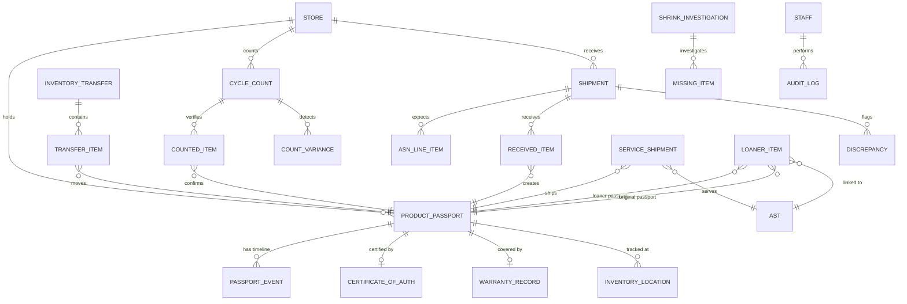

# 📋 Product Requirements Document (PRD)

## RSMS — Inventory Controller (Smart Inventory & Asset Control Tower) Module

### Codename: **Inventory Intelligence OS**

---

| Field | Value |
|---|---|
| **Product** | Retail Store Management System (RSMS) — iOS Application |
| **Module** | Inventory Controller (Smart Inventory & Asset Control Tower) |
| **Version** | 1.0 |
| **Author** | Product Development Team |
| **Date** | 2026-06-18 |
| **Platform** | iPhone & iPad (iOS 26+) |
| **Frameworks** | SwiftUI, Core ML, Vision, AVFoundation, Swift Charts, CoreNFC, CloudKit |
| **Architecture** | MVVM with Swift Concurrency (`async/await`, Actors) |
| **SRS Reference** | SRS RSMS v1.0 — Sections 2.1.3, 4.3 |
| **Shared Platform** | Product Digital Twin Platform (shared with After-Sales Module) |

---

## Table of Contents

1. [Product Vision & Strategic Context](#1-product-vision--strategic-context)
2. [Scope & Boundaries](#2-scope--boundaries)
3. [Shared Architecture — Product Digital Twin Platform](#3-shared-architecture--product-passport-platform)
4. [User Personas & Roles](#4-user-personas--roles)
5. [Information Architecture & Navigation](#5-information-architecture--navigation)
6. [Epic I1 — Vision Inventory Capture & RFID Stock Management](#6-epic-i1--vision-inventory-capture--rfid-stock-management)
7. [Epic I2 — Smart ASN & Transfer Engine](#7-epic-i2--smart-asn--transfer-engine)
8. [Epic I3 — Cycle Count & Audit Control](#8-epic-i3--cycle-count--audit-control)
9. [Epic I4 — Product Authentication & Serialization (Product Digital Twin)](#9-epic-i4--product-authentication--serialization-product-passport)
10. [Epic I5 — Service Logistics & Loaner Tracking](#10-epic-i5--service-logistics--loaner-tracking)
11. [Epic I6 — Inventory Intelligence Dashboard](#11-epic-i6--inventory-intelligence-dashboard)
12. [Innovation Features (IF1–IF10)](#12-innovation-features-if1if10)
13. [Data Model & Core Data Schema](#13-data-model--core-data-schema)
14. [API Contract Specifications](#14-api-contract-specifications)
15. [Apple Framework Mapping](#15-apple-framework-mapping)
16. [HIG Compliance Guidelines](#16-hig-compliance-guidelines)
17. [Role-Based Access Control (RBAC)](#17-role-based-access-control-rbac)
18. [Non-Functional Requirements](#18-non-functional-requirements)
19. [Verification & Testing Plan](#19-verification--testing-plan)
20. [Implementation Checklist](#20-implementation-checklist)
21. [Appendices](#21-appendices)

---

## 1. Product Vision & Strategic Context

### 1.1 Vision Statement

> **Inventory Intelligence OS** — A vision-powered, asset-centric inventory platform that transforms stock counting into **continuous inventory intelligence**, anchored by a **Product Digital Twin** that gives every luxury item a permanent digital identity shared across the entire RSMS ecosystem.

### 1.2 Problem Statement

The current inventory landscape for luxury retail suffers from:

| Problem | Impact |
|---|---|
| ❌ Slow, manual counting | Cycle counts take entire shifts; stores shut down for inventory nights |
| ❌ Inventory mismatches | Physical vs. system discrepancies discovered too late |
| ❌ Shrink discovered reactively | Loss is found during audits, not prevented proactively |
| ❌ Manual ASN reconciliation | Shipments matched by hand against delivery notes |
| ❌ Poor cross-store visibility | No real-time view across the boutique network |
| ❌ Serial number tracking gaps | High-value items lose provenance once they leave receiving |
| ❌ Disconnected service inventory | Repair parts, loaners, and service shipments tracked in separate systems |
| ❌ No predictive intelligence | Stockouts and overstocks addressed reactively |

### 1.3 Current Market Flow (Weak)

```
Shipment Arrives → Manual Scan → Inventory Updated → Cycle Count → Variance Found → Investigation
```

### 1.4 Our Solution Architecture

```
Inventory Intelligence OS
├── I1  Vision Inventory Capture & RFID Stock Management
├── I2  Smart ASN & Transfer Engine
├── I3  Cycle Count & Audit Control
├── I4  Product Authentication & Serialization (Product Digital Twin)
├── I5  Service Logistics & Loaner Tracking
└── I6  Inventory Intelligence Dashboard
```

### 1.5 Seven Core Differentiators

| # | Differentiator | Competitive Advantage |
|---|---|---|
| 1 | Vision-powered multi-barcode capture | Scan 15–50 products from a single camera frame; no RFID hardware required |
| 2 | Inventory Heatmap | Visual store map showing accuracy zones (Green / Yellow / Red) |
| 3 | Visual Receiving | Photo-backed shipment reconciliation (Expected / Received / Missing / Damaged / Extra) |
| 4 | Inventory Confidence Scoring | Per-store accuracy percentage and letter grade (A+ to F) |
| 5 | Product Digital Twin (Shared with After-Sales) | Every luxury item has a permanent digital identity, lifecycle, and provenance trail |
| 6 | Shrink Investigation Center | Automatic investigation cases with last-scan, last-location, last-employee |
| 7 | Autonomous Inventory Forecasting | Predictive stockout risk, shrink risk, and smart replenishment suggestions |

### 1.6 Business Goals

| Goal | Metric | Target |
|---|---|---|
| Increase inventory accuracy | Store-level accuracy score | ≥ 98% |
| Reduce shrink | Annual shrink rate | < 1% of inventory value |
| Accelerate cycle counts | Time to complete full store count | < 2 hours (down from 8+) |
| Eliminate ASN mismatches | Auto-match rate on shipments | ≥ 95% |
| Improve transfer efficiency | Average transfer completion time | < 48 hours |
| Reduce stockouts | Stockout events per month | < 3 per store |
| Service logistics SLA | Repair shipments within SLA | ≥ 95% |

---

## 2. Scope & Boundaries

### 2.1 In Scope

| Category | Details |
|---|---|
| **SRS 2.1.3.1** | RFID Stock Management — Item-level scans, exception reconciliation, shrink analytics |
| **SRS 2.1.3.2** | Transfers & Replenishment — Inter-store, DC-to-store, vendor returns; ASN matching |
| **SRS 2.1.3.3** | Compliance & Audit — Cycle count schedules, audit trails, variance signoff |
| **SRS 2.1.3.4** | Serialization & Certificates — Serial capture, certificates of authenticity linkage/printing |
| **SRS 2.1.3.5** | Repairs Logistics — Intake/outbound to service centers, loaners, SLA tracking |
| **SRS 4.3** | All detailed functional requirements for Inventory Controller |
| **Shared Platform** | Product Digital Twin — Shared data layer with After-Sales module |
| **Innovation** | 10 additional enterprise/intelligence features (IF1–IF10) |

### 2.2 Out of Scope

| Item | Rationale |
|---|---|
| POS / Checkout operations | Covered by Sales Associate module |
| Clienteling (core CRM) | Covered by Sales Associate module |
| Store admin / shift management | Covered by Store Admin module |
| Repair workflow execution | Covered by After-Sales module (reads shared Product Digital Twin) |
| Android / Web builds | iOS-only per SRS 2.3 |

### 2.3 Key Definitions

| Term | Definition |
|---|---|
| **SKU** | Stock Keeping Unit — item-level product identifier |
| **RFID** | Radio Frequency Identification tag for item-level tracking |
| **ASN** | Advanced Shipping Notice — pre-shipment manifest from warehouse or vendor |
| **Product Digital Twin** | Shared digital identity record for every luxury item (core of the platform) |
| **Cycle Count** | Scheduled physical verification of inventory against system records |
| **Shrink** | Inventory loss from theft, damage, administrative error, or vendor fraud |
| **Variance** | Difference between system-recorded and physically-counted inventory |
| **Loaner** | Temporary replacement item issued to a customer during repairs |
| **COA** | Certificate of Authenticity — brand-issued document verifying item provenance |

### 2.4 Dependencies & Shared Platform

| Dependency | Module / System | Type |
|---|---|---|
| **Product Digital Twin Platform** | **Shared Core (Inventory ↔ After-Sales)** | **Read / Write** |
| Product Catalog / SKU Data | Product Master Module | Read |
| Customer Profile Data | Clienteling Module | Read |
| After-Sales Tickets (AST) | After-Sales Module | Read / Write (via Passport) |
| Warranty Records | After-Sales Module (Shared) | Read / Write |
| Authentication Records | After-Sales Module (Shared) | Read / Write |
| Push Notifications | APNs / Cloud Messaging | Infrastructure |
| AI/ML Models | Core ML / Vision | Embedded |
| Cloud Sync | CloudKit / Backend API | Infrastructure |

---

## 3. Shared Architecture — Product Digital Twin Platform

> **This is the single most important architectural decision in the entire RSMS system.**

### 3.1 The Problem with Separate Databases

Most retail vendors build:

```
❌ Inventory Database (standalone)
❌ After-Sales Database (standalone)
```

This creates:
- Duplicate product records
- No shared history
- Manual re-entry at every customer visit
- Disconnected warranty, authentication, and valuation records

### 3.2 Our Architecture: Product Digital Twin Platform

```
Product Digital Twin Platform
│
├── Inventory Controller Module
│     Creates & maintains Product Digital Twin at receiving
│     Tracks movements (transfers, counts, locations)
│     Issues Certificates of Authenticity
│     Manages loaner inventory
│
├── After-Sales Service Module
│     Reads existing Passport (no re-entry)
│     Appends repair history, QA results
│     Updates warranty records
│     Processes authentication requests
│     Generates valuation letters
│
├── Warranty Center (Shared)
│     Tracks warranty lifecycle
│     Extends warranty post-service
│
├── Authentication Center (Shared)
│     Verifies product identity
│     Issues/re-issues digital certificates
│
└── Customer Portal (Shared)
      Customer views their product's full passport
      Tracks repairs, warranty, authenticity
```

### 3.3 The Shared Entity: Product Digital Twin

Every luxury item has a permanent digital identity:

```swift
struct ProductDigitalTwin: Codable, Identifiable {
    let id: UUID
    let productID: UUID
    let serialNumber: String
    let productName: String
    let brand: String
    let sku: String
    let category: ProductCategory
    let createdAt: Date                       // When first received into system
    let createdByModule: OriginModule         // .inventory or .afterSales
    
    // Identity
    var certificateOfAuthenticity: AuthCertificate?
    var rfidTag: String?
    var barcodeData: String?
    
    // Warranty
    var warrantyRecord: WarrantyRecord?
    
    // Lifecycle Timeline (unified)
    var events: [PassportEvent]               // Chronological timeline of ALL events
    
    // Current State
    var currentLocation: AssetLocation        // Which store, shelf, service center, or customer
    var currentCustodian: CustodianInfo?      // Who currently has physical possession
    var inventoryStatus: InventoryStatus      // .inStock, .inTransit, .onDisplay, .sold, .inRepair, .loaned, .returned
}

enum OriginModule: String, Codable {
    case inventory      // Product first entered via receiving/intake
    case afterSales     // Product first entered via customer walk-in (no purchase record)
}

struct PassportEvent: Codable, Identifiable {
    let id: UUID
    let date: Date
    let type: PassportEventType
    let title: String
    let description: String
    let location: String
    let performedBy: UUID?                   // Staff ID
    let module: OriginModule                 // Which module created this event
    let documents: [Document]
    let photos: [ServicePhoto]
    var metadata: [String: String]           // Flexible key-value for module-specific data
}

enum PassportEventType: String, Codable, CaseIterable {
    // Inventory Events
    case received            // Product received at store
    case shelved             // Placed on display/storage
    case transferred         // Moved between stores
    case cycleCountVerified  // Confirmed during count
    case rfidScanned         // RFID verification event
    
    // Sales Events
    case sold                // Purchased by customer
    case returned            // Returned by customer
    
    // After-Sales Events
    case repairCreated       // AST opened
    case repairCompleted     // Repair finished
    case qaPassed            // Quality assurance passed
    case warrantyValidated   // Warranty checked
    case warrantyExtended    // Warranty extended post-service
    case authenticated       // Authentication verified
    case valuationIssued     // Valuation letter generated
    
    // Logistics Events
    case shippedToService    // Sent to service center
    case returnedFromService // Returned from service center
    case loanerIssued        // Loaner item given to customer
    case loanerReturned      // Loaner returned
    
    // Custody Events
    case custodyTransfer     // Handoff between personnel
}

enum InventoryStatus: String, Codable {
    case inStock         // Available in store
    case inTransit       // Being transferred
    case onDisplay       // On store floor
    case sold            // Purchased by customer
    case inRepair        // Currently being serviced
    case loaned          // Issued as loaner
    case reserved        // Reserved for customer
    case damaged         // Damaged, not sellable
    case missing         // Cannot be located
    case retired         // No longer in active inventory
}
```

### 3.4 How the Connection Works

#### Inventory Creates the Product Digital Twin

```
Product Arrives at Store
       ↓
Scan Barcode / RFID
       ↓
Capture Serial Number
       ↓
Generate Product Digital Twin    ← PASSPORT CREATED HERE
       ↓
Issue Certificate of Authenticity
       ↓
Passport stored in shared platform
```

#### After-Sales Reads the Same Passport

```
Customer Brings Item for Repair
       ↓
Scan Product / Enter Serial
       ↓
Load Existing Passport       ← NO RE-ENTRY NEEDED
       ↓
System immediately knows:
  • Purchase Date
  • Purchase Store
  • Warranty Status & Expiry
  • Transfer History
  • Previous Repairs
  • Previous Authentications
  • Previous Valuations
  • Certificate of Authenticity
       ↓
Create AST → Linked to Passport
       ↓
Repair events appended to same timeline
```

#### Example: Cartier Watch Lifecycle

```
Product Digital Twin — Cartier Tank Française — SN: CTR-2026-00891

│
├─ 📦 Received             Delhi Warehouse      Jan 05, 2026   [Inventory]
├─ 🏷 RFID Tagged          Delhi Store           Jan 06, 2026   [Inventory]
├─ 📋 COA Issued           Certificate #A-8812   Jan 06, 2026   [Inventory]
├─ 🔄 Transferred          Delhi → Mumbai        Feb 12, 2026   [Inventory]
├─ ✅ Cycle Count Verified  Mumbai Store           Mar 01, 2026   [Inventory]
├─ 🛍 Sold                 VIP Client Vikram     Mar 15, 2026   [Sales]
├─ 🔧 Repair #1 Created    Crown alignment       Jun 10, 2026   [After-Sales]
├─ ⏳ Shipped to Service    Service Center A      Jun 11, 2026   [Logistics]
├─ 🔧 Repair #1 Completed  Crown replaced        Jun 18, 2026   [After-Sales]
├─ ✅ QA Passed             Inspector Aisha       Jun 18, 2026   [After-Sales]
├─ 📄 Warranty Extended     +1 Year               Jun 18, 2026   [After-Sales]
├─ 📋 Valuation Issued      Insurance ₹12.5L      Sep 01, 2026   [After-Sales]
└─ ✅ Re-Authenticated      Certificate #A-9901   Nov 20, 2026   [After-Sales]
```

### 3.5 Loaner Inventory Connection

```
Customer gives:   Cartier Watch (for repair)
                        ↓
Inventory Module: Issue Loaner Watch #L001
                        ↓
After-Sales Module: Links Loaner to AST
                        ↓
Repair Completed:
                        ↓
Return Loaner → Close AST
Both modules update the same passport timeline.
```

### 3.6 Warranty Connection (Zero Duplication)

```
Inventory captures at receiving:
  • Serial Number
  • Certificate of Authenticity
  • Purchase Date (when sold)
           ↓
After-Sales uses for:
  • Warranty Validation (reads from Passport)
  • Warranty Extension (writes to Passport)
           ↓
No duplicate records. Single source of truth.
```

### 3.7 Authentication Connection

```
Inventory generates at receiving:
  • Certificate of Authenticity
           ↓
After-Sales can later:
  • Request Re-Authentication (reads from Passport)
  • Issue updated certificate (writes to Passport)
           ↓
Same passport. Same identity. Complete provenance.
```

---

## 4. User Personas & Roles

### 4.1 Primary Personas

#### Persona 1: Inventory Controller (Power User)

| Attribute | Detail |
|---|---|
| **Name** | Priya — Senior Inventory Specialist |
| **Role** | Inventory Controller |
| **Tech Proficiency** | High — comfortable with iPad/iPhone workflows, RFID equipment |
| **Daily Tasks** | Receiving shipments, cycle counts, transfer management, shrink investigations, serial number capture |
| **Pain Points** | Manual counting, paper-based ASN matching, no vision-based tools, reactive shrink detection |
| **Goals** | 98%+ accuracy, zero unexplained variances, automated receiving, proactive shrink detection |

#### Persona 2: Boutique Manager (Oversight)

| Attribute | Detail |
|---|---|
| **Name** | Rajesh — Store Manager, Delhi Boutique |
| **Role** | Boutique Manager |
| **Tech Proficiency** | Medium |
| **Daily Tasks** | Reviews inventory health, approves variances, monitors transfers, oversees compliance |
| **Pain Points** | No real-time visibility, manual signoff processes, no store-level scoring |
| **Goals** | Zero SLA breaches on transfers, high accuracy scores, minimal shrink |

#### Persona 3: Corporate Admin (Strategic)

| Attribute | Detail |
|---|---|
| **Name** | Meera — VP Retail Operations |
| **Role** | Corporate Admin / Retail Ops |
| **Tech Proficiency** | High |
| **Daily Tasks** | Cross-store analytics, compliance reviews, policy setting, demand forecasting |
| **Pain Points** | No centralized visibility, no predictive tools, manual reporting |
| **Goals** | Network-wide accuracy ≥ 98%, shrink < 1%, data-driven replenishment |

#### Persona 4: After-Sales Specialist (Cross-Module User)

| Attribute | Detail |
|---|---|
| **Name** | Aisha — Service Technician Lead |
| **Role** | After-Sales Specialist |
| **Tech Proficiency** | High |
| **Interaction with Inventory** | Reads Product Digital Twin during AST creation, initiates service shipments, manages loaners |
| **Goals** | Instant access to product history, seamless loaner management |

### 4.2 RACI Matrix

| Activity | Inventory Controller | Boutique Manager | Corporate Admin | After-Sales Specialist |
|---|---|---|---|---|
| Shipment Receiving | **R** | I | – | – |
| ASN Matching | **R/A** | I | – | – |
| Cycle Counting | **R** | **A** | I | – |
| Variance Signoff | I | **R/A** | I | – |
| Transfer Creation | **R** | **A** | I | – |
| Serial Number Capture | **R** | I | I | – |
| COA Generation | **R/A** | I | I | – |
| Shrink Investigation | **R** | **R/A** | **A** | – |
| Loaner Issuance | **R** | I | – | **R** |
| Service Shipment Tracking | **R** | I | I | **R** |
| Inventory Analytics | I | **R** | **R/A** | – |
| Product Digital Twin Creation | **R/A** | I | I | I |
| Passport Read (for AST) | – | – | – | **R** |

> **R** = Responsible, **A** = Accountable, **I** = Informed, **C** = Consulted

---

## 5. Information Architecture & Navigation

### 5.1 SwiftUI View Hierarchy

```
InventoryTabView (TabView)
├── Tab 1: InventoryDashboardView
│   ├── InventoryHealthCardView
│   ├── AccuracyScoreGaugeView
│   ├── ActiveAlertsListView
│   ├── RecentActivityFeedView
│   └── QuickActionsGridView
│
├── Tab 2: StockManagementView
│   ├── ProductListView (with search, filter, sort)
│   │   └── ProductRowView
│   ├── ProductDetailView
│   │   ├── ProductHeaderView
│   │   ├── ProductDigitalTwinTimelineView      ← SHARED COMPONENT
│   │   ├── InventoryLocationView
│   │   ├── MovementHistoryView
│   │   └── ActionButtonBarView
│   ├── VisionCaptureView (multi-barcode)
│   │   ├── CameraOverlayView
│   │   ├── DetectedItemsListView
│   │   └── ReconciliationResultView
│   └── RFIDScanView
│       ├── ScanProgressView
│       └── ScanResultsView
│
├── Tab 3: ReceivingTransfersView
│   ├── ReceivingView
│   │   ├── ShipmentListView
│   │   ├── ASNMatchingView
│   │   │   ├── ExpectedItemsView
│   │   │   ├── ReceivedItemsView
│   │   │   └── DiscrepancyReportView
│   │   └── VisualReceivingView
│   │       ├── PhotoCaptureView
│   │       └── ConditionReportView
│   ├── TransferManagementView
│   │   ├── ActiveTransfersListView
│   │   ├── CreateTransferView
│   │   ├── TransferDetailView
│   │   └── TransferTrackingView
│   └── VendorReturnsView
│       ├── ReturnRequestFormView
│       └── ReturnTrackingView
│
├── Tab 4: AuditComplianceView
│   ├── CycleCountView
│   │   ├── ScheduledCountsListView
│   │   ├── CountExecutionView
│   │   │   ├── ZoneSelectionView
│   │   │   ├── ScanCountView
│   │   │   └── VarianceReviewView
│   │   └── CountHistoryView
│   ├── AuditTrailView
│   │   ├── AuditLogListView
│   │   └── AuditLogDetailView
│   ├── VarianceManagementView
│   │   ├── OpenVariancesListView
│   │   ├── VarianceDetailView
│   │   └── ManagerApprovalView
│   └── ShrinkInvestigationView
│       ├── InvestigationCasesListView
│       ├── InvestigationDetailView
│       └── InvestigationReportView
│
└── Tab 5: InsightsView
    ├── InventoryAnalyticsDashboardView
    │   ├── AccuracyTrendsChartView
    │   ├── ShrinkAnalyticsChartView
    │   ├── TransferMetricsChartView
    │   └── StoreComparisonView
    ├── PredictiveInsightsView
    │   ├── StockoutRiskView
    │   ├── ReplenishmentSuggestionsView
    │   └── ShrinkRiskPredictionView
    └── InventoryHeatmapView
        ├── StoreLayoutView
        └── ZoneAccuracyOverlayView
```

### 5.2 Navigation Pattern

Per Apple HIG:

| Pattern | Usage |
|---|---|
| **TabView** | Top-level module navigation (5 tabs) |
| **NavigationStack** | Hierarchical drill-down within each tab |
| **NavigationSplitView** | Three-column layout on iPad (sidebar + detail + inspector) |
| **Sheet (.sheet)** | Modal creation flows (new transfer, new count) |
| **FullScreenCover** | Vision camera overlay, RFID scanning |
| **Alert / ConfirmationDialog** | Variance signoff, destructive actions |

### 5.3 iPad-Specific Layout

```
iPad (Regular Width):
┌─────────────────────────────────────────────────────┐
│  Sidebar          │  Detail View      │  Inspector  │
│  (NavigationSplit │  (Content)        │  (Optional) │
│   View)           │                   │             │
│  ○ Dashboard      │  [Selected Item   │  [Passport  │
│  ○ Stock          │   Full Detail]    │   Timeline] │
│  ○ Receiving      │                   │             │
│  ○ Audit          │                   │             │
│  ○ Insights       │                   │             │
└─────────────────────────────────────────────────────┘
```

---

## 6. Epic I1 — Vision Inventory Capture & RFID Stock Management

> **SRS Coverage**: 2.1.3.1, 4.3 bullet 1

### 6.1 Overview

AI-powered inventory capture using the device camera to detect multiple barcodes simultaneously, combined with RFID scanning for item-level verification. Automatically flags discrepancies between physical and system inventory and generates shrink analytics.

### 6.2 User Stories

| ID | Story | Priority |
|---|---|---|
| I1-US01 | As an inventory controller, I want to scan multiple barcodes in a single camera frame so that I can count inventory 10x faster than manual scanning. | P0 |
| I1-US02 | As an inventory controller, I want the system to process item-level RFID scans so that I can instantly reconcile physical vs. system inventory. | P0 |
| I1-US03 | As an inventory controller, I want the system to automatically flag missing items, unexpected items, wrong-location items, and duplicate scans so that exceptions are caught immediately. | P0 |
| I1-US04 | As an inventory controller, I want to see real-time shrink analytics after each scan session so that I can identify loss patterns. | P0 |
| I1-US05 | As an inventory controller, I want the system to generate an Inventory Validation Report comparing System vs Physical inventory so that I have an auditable record. | P0 |
| I1-US06 | As an inventory controller, I want to scan product barcodes using only iPhone/iPad camera (no external hardware) so that setup is zero-cost. | P0 |
| I1-US07 | As a boutique manager, I want to see an Inventory Heatmap showing accuracy by store zone (Green/Yellow/Red) so that I can instantly see problem areas. | P1 |
| I1-US08 | As an inventory controller, I want to scan NFC/RFID tags using the device's NFC reader so that I can verify individual high-value items. | P1 |
| I1-US09 | As a boutique manager, I want scan sessions to automatically update the Product Digital Twin for each verified item so that the timeline stays current. | P0 |
| I1-US10 | As a corporate admin, I want aggregated scan accuracy data across all stores so that I can compare performance. | P1 |

### 6.3 Vision Framework — Multi-Barcode Detection

```swift
actor VisionInventoryScanner {
    private let barcodeRequest: VNDetectBarcodesRequest
    
    init() {
        barcodeRequest = VNDetectBarcodesRequest()
        barcodeRequest.symbologies = [
            .ean13, .ean8, .upce, .code128, .code39,
            .qr, .dataMatrix, .pdf417
        ]
    }
    
    func scanFrame(_ pixelBuffer: CVPixelBuffer) async throws -> [DetectedBarcode] {
        let handler = VNImageRequestHandler(cvPixelBuffer: pixelBuffer, options: [:])
        try handler.perform([barcodeRequest])
        
        guard let results = barcodeRequest.results else { return [] }
        
        return results.compactMap { observation in
            guard let payload = observation.payloadStringValue else { return nil }
            return DetectedBarcode(
                value: payload,
                symbology: observation.symbology,
                boundingBox: observation.boundingBox,
                confidence: observation.confidence
            )
        }
    }
}

struct DetectedBarcode: Identifiable {
    let id = UUID()
    let value: String
    let symbology: VNBarcodeSymbology
    let boundingBox: CGRect
    let confidence: VNConfidence
}
```

### 6.4 Inventory Validation Engine

```swift
struct InventoryValidationResult: Codable, Identifiable {
    let id: UUID
    let sessionDate: Date
    let storeID: UUID
    let zone: String?
    let performedBy: UUID
    
    var systemItems: [InventoryItem]       // What the system says should be here
    var scannedItems: [ScannedItem]        // What was physically detected
    
    var matchedItems: [InventoryItem]      // Present in both
    var missingItems: [InventoryItem]      // In system, not scanned
    var unexpectedItems: [ScannedItem]     // Scanned, not in system
    var wrongLocationItems: [InventoryItem]// In system but assigned to different zone
    var duplicateScans: [ScannedItem]      // Scanned more than once
    
    var accuracyScore: Double              // matchedItems / systemItems × 100
    var varianceCount: Int                 // Total exceptions
    var shrinkIndicators: [ShrinkIndicator]
}

struct ShrinkIndicator: Codable, Identifiable {
    let id: UUID
    let type: ShrinkType                  // .missing, .damaged, .administrative, .vendor
    let itemCount: Int
    let estimatedValue: Decimal
    let riskLevel: RiskLevel
}
```

### 6.5 RFID / NFC Integration

```swift
class NFCInventoryScanner: NSObject, NFCTagReaderSessionDelegate {
    var session: NFCTagReaderSession?
    var onTagDetected: ((String) -> Void)?
    
    func startScan() {
        session = NFCTagReaderSession(
            pollingOption: [.iso14443, .iso15693],
            delegate: self
        )
        session?.alertMessage = "Hold near RFID tag to scan"
        session?.begin()
    }
    
    func tagReaderSession(_ session: NFCTagReaderSession, didDetect tags: [NFCTag]) {
        // Read tag data and match against Product Digital Twin
    }
}
```

**Apple Framework Usage:**

| Framework | Purpose |
|---|---|
| `Vision` | `VNDetectBarcodesRequest` for multi-barcode detection from camera frames |
| `AVFoundation` | Camera capture session for continuous barcode scanning |
| `CoreNFC` | `NFCTagReaderSession` for RFID/NFC tag reading on supported devices |
| `Core ML` | Shelf analysis model for detecting product placement and gaps |

### 6.6 Acceptance Criteria — I1

| ID | Criterion | Verification |
|---|---|---|
| I1-AC01 | Vision scanner detects ≥ 15 barcodes in a single frame within 2 seconds | Performance test |
| I1-AC02 | RFID/NFC scan reads tag data and matches against Product Digital Twin | Integration test |
| I1-AC03 | Validation engine correctly identifies missing, unexpected, and wrong-location items | Unit test |
| I1-AC04 | Shrink analytics display value breakdown by type | UI test |
| I1-AC05 | Inventory Heatmap renders with correct zone-level accuracy colors | UI test |
| I1-AC06 | Scan session creates `cycleCountVerified` event on each matched Product Digital Twin | Integration test |
| I1-AC07 | Accuracy score is calculated as (matched / expected) × 100 | Unit test |
| I1-AC08 | Scan results persist offline and sync when connectivity is restored | Offline test |
| I1-AC09 | Duplicate scan detection prevents double-counting | Unit test |
| I1-AC10 | All scan sessions generate an immutable audit log entry | Audit test |

---

## 7. Epic I2 — Smart ASN & Transfer Engine

> **SRS Coverage**: 2.1.3.2, 4.3 bullet 2

### 7.1 Overview

Automated Advanced Shipping Notice (ASN) matching for all inbound shipments, with visual receiving that captures photos of expected vs. received items. Supports inter-store transfers, DC-to-store replenishment, and vendor returns.

### 7.2 User Stories

| ID | Story | Priority |
|---|---|---|
| I2-US01 | As an inventory controller, I want to scan an incoming shipment and have the system auto-match against the ASN so that I don't manually reconcile. | P0 |
| I2-US02 | As an inventory controller, I want the system to highlight discrepancies (missing, damaged, extra items) between ASN and received shipment so that I can create exception cases. | P0 |
| I2-US03 | As an inventory controller, I want to capture photos of received items and any damage so that I have visual evidence for disputes. | P0 |
| I2-US04 | As an inventory controller, I want to initiate an inter-store transfer with items, destination, and expected delivery date so that I can move stock. | P0 |
| I2-US05 | As a receiving store, I want to confirm receipt of transferred items and flag any discrepancies so that chain of custody is complete. | P0 |
| I2-US06 | As an inventory controller, I want to create vendor return requests with reason codes and supporting photos so that the process is documented. | P1 |
| I2-US07 | As a boutique manager, I want to see all active transfers with real-time status (Created / In Transit / Received / Exception) so that I can track movements. | P0 |
| I2-US08 | As an inventory controller, I want each received product to automatically generate a Product Digital Twin so that every item has a digital identity from day one. | P0 |
| I2-US09 | As an inventory controller, I want the system to auto-capture serial numbers during receiving and link them to the Product Digital Twin so that provenance starts at intake. | P0 |
| I2-US10 | As a corporate admin, I want to see ASN match rates per supplier so that I can identify problematic vendors. | P1 |

### 7.3 Supported Transfer Flows

```
┌─────────────┐     ┌─────────────┐
│  Warehouse  │────→│    Store    │   DC-to-Store Replenishment
└─────────────┘     └─────────────┘

┌─────────────┐     ┌─────────────┐
│   Store A   │────→│   Store B   │   Inter-Store Transfer
└─────────────┘     └─────────────┘

┌─────────────┐     ┌─────────────┐
│    Store    │────→│   Vendor    │   Vendor Return
└─────────────┘     └─────────────┘

┌─────────────┐     ┌─────────────┐
│   Vendor    │────→│    Store    │   Vendor Shipment
└─────────────┘     └─────────────┘
```

### 7.4 Data Models

```swift
struct Shipment: Codable, Identifiable {
    let id: UUID
    let asnNumber: String                     // Advanced Shipping Notice ID
    let shipmentDate: Date
    let expectedArrivalDate: Date
    var actualArrivalDate: Date?
    let origin: ShipmentEndpoint              // Warehouse / Store / Vendor
    let destination: ShipmentEndpoint
    let expectedItems: [ASNLineItem]
    var receivedItems: [ReceivedItem]
    var status: ShipmentStatus                // .pending, .inTransit, .received, .exception, .completed
    var discrepancies: [ShipmentDiscrepancy]
    var receivingPhotos: [ServicePhoto]
    var receivedBy: UUID?
    var notes: String
}

struct ASNLineItem: Codable, Identifiable {
    let id: UUID
    let sku: String
    let productName: String
    let serialNumber: String?
    let expectedQuantity: Int
    let unitValue: Decimal
}

struct ReceivedItem: Codable, Identifiable {
    let id: UUID
    let sku: String
    let serialNumber: String?
    let condition: ItemCondition              // .good, .damaged, .defective
    let scannedAt: Date
    let photo: ServicePhoto?
    var matchedToASN: Bool
    var twinID: UUID?                     // Link to generated Product Digital Twin
}

struct ShipmentDiscrepancy: Codable, Identifiable {
    let id: UUID
    let type: DiscrepancyType                 // .missing, .damaged, .extra, .wrongItem
    let sku: String
    let expectedQuantity: Int
    let receivedQuantity: Int
    let description: String
    let photos: [ServicePhoto]
    var resolutionStatus: ResolutionStatus     // .open, .investigating, .resolved
    var resolutionNotes: String?
}

enum DiscrepancyType: String, Codable {
    case missing    = "Missing"
    case damaged    = "Damaged"
    case extra      = "Extra"
    case wrongItem  = "Wrong Item"
}

struct InventoryTransfer: Codable, Identifiable {
    let id: UUID
    let transferNumber: String                // e.g., "TRF-2026-DLH-MUM-00045"
    let createdAt: Date
    let createdBy: UUID
    let sourceStore: UUID
    let destinationStore: UUID
    var items: [TransferItem]
    var status: TransferStatus                // .created, .approved, .packed, .inTransit, .received, .exception, .completed
    var expectedDeliveryDate: Date
    var actualDeliveryDate: Date?
    var shipmentTrackingNumber: String?
    var notes: String
    var statusHistory: [TransferStatusEvent]
}

struct TransferItem: Codable, Identifiable {
    let id: UUID
    let twinID: UUID                      // Links to Product Digital Twin
    let sku: String
    let serialNumber: String?
    let productName: String
    var receivedCondition: ItemCondition?
}
```

### 7.5 Visual Receiving UI

Instead of a plain text confirmation, the system shows:

```
┌──────────────────────────────────────────┐
│         📦 Shipment #ASN-2026-4481       │
│                                          │
│  Expected:  24 items                     │
│  Received:  22 items                     │
│  Missing:    1 item   ⚠️                │
│  Damaged:    1 item   🔴                │
│  Extra:      0 items                     │
│                                          │
│  ┌─────────┐  ┌─────────┐  ┌─────────┐  │
│  │  Photo  │  │  Photo  │  │  Photo  │  │
│  │ Received│  │ Damaged │  │ Receipt │  │
│  └─────────┘  └─────────┘  └─────────┘  │
│                                          │
│  [Approve with Exceptions]  [Flag All]   │
└──────────────────────────────────────────┘
```

### 7.6 Acceptance Criteria — I2

| ID | Criterion | Verification |
|---|---|---|
| I2-AC01 | ASN auto-match correctly identifies all matching items within 3 seconds | Performance test |
| I2-AC02 | Discrepancies (missing, damaged, extra) are flagged with correct type | Unit test |
| I2-AC03 | Photos are captured and linked to shipment and individual discrepancies | UI test |
| I2-AC04 | Product Digital Twin is auto-generated for each received item | Integration test |
| I2-AC05 | Serial numbers are captured and linked to Passport during receiving | Integration test |
| I2-AC06 | Inter-store transfer status updates in real-time | E2E test |
| I2-AC07 | Transfer cannot proceed without manager approval (configurable) | RBAC test |
| I2-AC08 | Vendor return creates exception case with photos and reason code | Unit test |
| I2-AC09 | All transfer events create digital twin events on involved items | Integration test |
| I2-AC10 | ASN match rates are calculated per supplier for corporate analytics | Unit test |

---

## 8. Epic I3 — Cycle Count & Audit Control

> **SRS Coverage**: 2.1.3.3, 4.3 bullet 3

### 8.1 Overview

Scheduled and ad-hoc cycle counting with zone-based execution, real-time variance detection, mandatory managerial signoff, and immutable audit trails.

### 8.2 User Stories

| ID | Story | Priority |
|---|---|---|
| I3-US01 | As an inventory controller, I want to execute scheduled cycle counts by zone so that I can systematically verify all inventory. | P0 |
| I3-US02 | As an inventory controller, I want real-time variance detection during counting so that discrepancies are caught immediately, not after the fact. | P0 |
| I3-US03 | As a boutique manager, I want to review and approve all variances with my digital signature so that accountability is maintained. | P0 |
| I3-US04 | As a corporate admin, I want immutable audit trails for every count, including who counted, when, on which device, what variance was found, and who approved. | P0 |
| I3-US05 | As a boutique manager, I want to schedule recurring cycle counts (daily, weekly, monthly) for specific zones so that counting is systematic. | P0 |
| I3-US06 | As an inventory controller, I want a Confidence Score after each count showing inventory accuracy percentage and letter grade (A+ to F) so that I know the state of my store. | P1 |
| I3-US07 | As a corporate admin, I want to compare Confidence Scores across all stores so that I can identify underperformers. | P1 |
| I3-US08 | As an inventory controller, I want to use Vision multi-barcode scanning during cycle counts so that counting is fast. | P0 |
| I3-US09 | As a boutique manager, I want count results to automatically update Product Digital Twins for verified items so that the timeline stays current. | P0 |
| I3-US10 | As a corporate admin, I want to set audit compliance policies (minimum count frequency, mandatory zones) so that standards are enforced. | P1 |

### 8.3 Data Models

```swift
struct CycleCount: Codable, Identifiable {
    let id: UUID
    let countNumber: String                   // e.g., "CC-2026-DLH-0034"
    let storeID: UUID
    let scheduledDate: Date
    let zone: StoreZone?                      // nil = full store count
    let createdBy: UUID
    var status: CountStatus                   // .scheduled, .inProgress, .pendingApproval, .approved, .rejected
    
    var countedBy: UUID?
    var countStartedAt: Date?
    var countCompletedAt: Date?
    var deviceID: String?
    
    var systemItems: [InventoryItem]
    var countedItems: [CountedItem]
    var variances: [CountVariance]
    
    var accuracyScore: Double                 // (matched / expected) × 100
    var confidenceGrade: ConfidenceGrade      // .aPlus, .a, .b, .c, .d, .f
    
    var approvedBy: UUID?
    var approvedAt: Date?
    var approvalNotes: String?
    var approvalSignature: Data?              // Digital signature
}

struct CountedItem: Codable, Identifiable {
    let id: UUID
    let sku: String
    let serialNumber: String?
    let twinID: UUID?
    let scannedAt: Date
    let scanMethod: ScanMethod                // .vision, .rfid, .manual
    var matchStatus: MatchStatus              // .matched, .unmatched, .duplicate
}

struct CountVariance: Codable, Identifiable {
    let id: UUID
    let sku: String
    let productName: String
    let systemQuantity: Int
    let countedQuantity: Int
    let varianceQuantity: Int                 // counted - system
    let varianceType: VarianceType            // .surplus, .shortage
    let estimatedValue: Decimal
    var investigationStatus: InvestigationStatus
    var notes: String
}

enum ConfidenceGrade: String, Codable {
    case aPlus = "A+"    // ≥ 99%
    case a     = "A"     // ≥ 97%
    case b     = "B"     // ≥ 95%
    case c     = "C"     // ≥ 90%
    case d     = "D"     // ≥ 85%
    case f     = "F"     // < 85%
}
```

### 8.4 Audit Trail (Immutable)

```swift
struct AuditLogEntry: Codable, Identifiable {
    let id: UUID
    let timestamp: Date
    let action: AuditAction
    let performedBy: UUID
    let deviceID: String
    let storeID: UUID
    let entityType: String                    // "CycleCount", "Transfer", "Shipment"
    let entityID: UUID
    let previousState: String?               // JSON snapshot
    let newState: String?                     // JSON snapshot
    let ipAddress: String?
    let notes: String?
    
    // Immutability guarantee
    let hash: String                          // SHA-256 hash of entry contents
    let previousHash: String?                 // Hash of previous entry (blockchain-like chain)
}
```

### 8.5 Acceptance Criteria — I3

| ID | Criterion | Verification |
|---|---|---|
| I3-AC01 | Cycle count identifies all variances in real-time during scanning | Unit test |
| I3-AC02 | Manager approval with digital signature is required before variance resolution | RBAC test |
| I3-AC03 | Audit trail entries are immutable (hash-chained) and include all required fields | Integration test |
| I3-AC04 | Confidence Score is correctly calculated and assigned proper letter grade | Unit test |
| I3-AC05 | Scheduled counts trigger notifications to assigned staff | Notification test |
| I3-AC06 | Vision multi-barcode scanning works during count execution | Performance test |
| I3-AC07 | Count completion updates `cycleCountVerified` event on matched Product Digital Twins | Integration test |
| I3-AC08 | Cross-store Confidence Score comparison displays correctly | UI test |
| I3-AC09 | Count cannot be approved if variances exceed configurable threshold without escalation | Business logic test |
| I3-AC10 | All count data persists offline and syncs when connectivity is restored | Offline test |

---

## 9. Epic I4 — Product Authentication & Serialization (Product Digital Twin)

> **SRS Coverage**: 2.1.3.4, 4.3 bullet 4

### 9.1 Overview

Serial number capture for high-value merchandise with automatic Certificate of Authenticity generation. This epic is the **origin point** for the Product Digital Twin — every luxury item receives its permanent digital identity at this stage.

### 9.2 User Stories

| ID | Story | Priority |
|---|---|---|
| I4-US01 | As an inventory controller, I want to capture the serial number of each high-value item during receiving so that every item has a unique identifier. | P0 |
| I4-US02 | As an inventory controller, I want the system to auto-generate a Product Digital Twin for each serialized item so that its digital identity begins at intake. | P0 |
| I4-US03 | As an inventory controller, I want to automatically link/print a localized Certificate of Authenticity for each item so that the certificate is available at point of sale. | P0 |
| I4-US04 | As an inventory controller, I want to scan RFID/NFC tags and associate them with the Product Digital Twin so that items can be tracked electronically. | P1 |
| I4-US05 | As a boutique manager, I want to view the complete Product Digital Twin timeline for any item in my store so that I can see its full history. | P0 |
| I4-US06 | As a corporate admin, I want to search any product by serial number across all stores and see its passport so that I have network-wide visibility. | P0 |
| I4-US07 | As an inventory controller, I want the Certificate of Authenticity to include a QR code that links to the product's digital passport so that authenticity can be verified externally. | P1 |
| I4-US08 | As an inventory controller, I want to capture photos of each item during serialization so that the passport has a visual baseline. | P1 |
| I4-US09 | As a customer (post-purchase), I want to access my product's passport via the Customer Portal so that I have a complete ownership record. | P1 |
| I4-US10 | As a corporate admin, I want serialization compliance reporting (% of items with complete passports) so that I can enforce standards. | P1 |

### 9.3 Certificate of Authenticity Generation

```swift
struct CertificateOfAuthenticity: Codable, Identifiable {
    let id: UUID
    let certificateNumber: String             // e.g., "COA-2026-DLH-00891"
    let issuedDate: Date
    let issuedBy: UUID                        // Staff ID
    let storeID: UUID
    
    // Product Details
    let twinID: UUID                      // Links to Product Digital Twin
    let productName: String
    let brand: String
    let serialNumber: String
    let sku: String
    let category: ProductCategory
    
    // Certificate Data
    let description: String
    let materials: [String]                   // e.g., ["18K White Gold", "VVS1 Diamond"]
    let specifications: [String: String]      // Key-value pairs
    let photos: [ServicePhoto]
    
    // Security
    let digitalSignature: Data               // CryptoKit P256 ECDSA
    let qrCodeData: Data                     // Links to digital passport
    let verificationURL: URL                 // Public verification endpoint
    
    // Localization
    let language: String                     // Certificate language
    let localizedFields: [String: String]    // Localized product descriptions
}
```

### 9.4 Product Digital Twin Creation Flow

```
Product Received
       ↓
Scan Barcode → Match to ASN
       ↓
Enter / Scan Serial Number
       ↓
Capture Product Photos (baseline condition)
       ↓
Scan RFID Tag (if applicable)
       ↓
╔══════════════════════════════════════╗
║  Product Digital Twin CREATED           ║
║                                      ║
║  Passport ID: PP-2026-DLH-00891     ║
║  Serial: CTR-2026-00891             ║
║  Brand: Cartier                     ║
║  Product: Tank Française            ║
║  Category: Watch                    ║
║  Location: Delhi Store              ║
║  Status: In Stock                   ║
║                                      ║
║  Timeline Events: 1                 ║
║  └─ 📦 Received  Jan 06, 2026      ║
║                                      ║
║  [Generate COA]  [View Passport]    ║
╚══════════════════════════════════════╝
       ↓
Generate Certificate of Authenticity
       ↓
COA linked to Passport
       ↓
Item shelved → Passport updated
```

### 9.5 Acceptance Criteria — I4

| ID | Criterion | Verification |
|---|---|---|
| I4-AC01 | Serial number is captured and stored in Product Digital Twin | Integration test |
| I4-AC02 | Product Digital Twin is auto-created at receiving with correct initial event | Unit test |
| I4-AC03 | Certificate of Authenticity includes QR code linking to digital passport | Unit test |
| I4-AC04 | COA is generated as a printable, localized PDF via PDFKit | Document test |
| I4-AC05 | RFID tag data is associated with the correct Product Digital Twin | Integration test |
| I4-AC06 | Passport timeline correctly displays all events in chronological order | UI test |
| I4-AC07 | Cross-store serial number search returns correct passport within 2 seconds | Performance test |
| I4-AC08 | Baseline photos are captured and stored on the passport | UI test |
| I4-AC09 | Digital signature on COA is verifiable via CryptoKit | Security test |
| I4-AC10 | Serialization compliance report shows correct % of items with complete passports | Unit test |

---

## 10. Epic I5 — Service Logistics & Loaner Tracking

> **SRS Coverage**: 2.1.3.5, 4.3 bullet 5

### 10.1 Overview

Tracks inbound/outbound shipments to service centers, monitors SLA compliance on repair logistics, and manages the full loaner item lifecycle. **This epic is the direct bridge between Inventory and After-Sales modules** — both modules view the same Product Digital Twin for the asset being serviced.

### 10.2 User Stories

| ID | Story | Priority |
|---|---|---|
| I5-US01 | As an inventory controller, I want to create a service shipment when an item needs to be sent to a repair center so that I can track the outbound movement. | P0 |
| I5-US02 | As an inventory controller, I want to track shipment status in real-time (Packed / Shipped / In Transit / Delivered / Returned) so that I know where the item is. | P0 |
| I5-US03 | As an inventory controller, I want SLA tracking on each service shipment so that I'm alerted if delivery deadlines are at risk. | P0 |
| I5-US04 | As an inventory controller, I want to issue a loaner item to a customer when their item goes for repair, linking the loaner to the AST. | P0 |
| I5-US05 | As an inventory controller, I want to track all outstanding loaners with expected return dates so that I can follow up on overdue loaners. | P0 |
| I5-US06 | As an inventory controller, I want loaner return to be recorded with condition verification so that damage is caught. | P1 |
| I5-US07 | As a boutique manager, I want to see the complete Asset Journey (Store → Service Center → Technician → QA → Store) for each item in service. | P0 |
| I5-US08 | As an inventory controller, I want the Product Digital Twin to be updated when an item is shipped to/from service so that the timeline reflects the movement. | P0 |
| I5-US09 | As a boutique manager, I want a loaner inventory dashboard showing total loaners, available, issued, and overdue. | P1 |
| I5-US10 | As a corporate admin, I want service logistics SLA compliance metrics across all stores. | P1 |

### 10.3 Data Models

```swift
struct ServiceShipment: Codable, Identifiable {
    let id: UUID
    let shipmentNumber: String
    let ticketID: UUID                        // Links to After-Sales Ticket (AST)
    let twinID: UUID                      // Links to Product Digital Twin
    let createdAt: Date
    let createdBy: UUID
    
    let origin: ShipmentEndpoint              // Store
    let destination: ShipmentEndpoint         // Service Center
    let direction: ShipmentDirection          // .outbound (to service) or .inbound (from service)
    
    var status: ServiceShipmentStatus
    var trackingNumber: String?
    var carrier: String?
    var slaDeadline: Date
    var isSLABreached: Bool
    
    var statusHistory: [ShipmentStatusEvent]
    var photos: [ServicePhoto]
    var notes: String
}

struct LoanerItem: Codable, Identifiable {
    let id: UUID
    let loanertwinID: UUID                // Product Digital Twin of the loaner item
    let customerID: UUID
    let ticketID: UUID                        // AST that triggered the loaner
    let originaltwinID: UUID              // Passport of the item being repaired
    
    let issuedAt: Date
    let issuedBy: UUID
    var expectedReturnDate: Date
    var actualReturnDate: Date?
    
    var status: LoanerStatus                  // .issued, .overdue, .returned, .damaged
    var returnCondition: ItemCondition?
    var returnNotes: String?
    var returnPhotos: [ServicePhoto]
}

enum LoanerStatus: String, Codable {
    case issued   = "Issued"
    case overdue  = "Overdue"
    case returned = "Returned"
    case damaged  = "Returned - Damaged"
}
```

### 10.4 Asset Journey View

```
Asset Journey — Cartier Tank #CTR-2026-00891

    📦 Delhi Store               Jun 10, 10:00 AM
    │   Packed by: Priya
    │   Condition: Photos captured
    │
    🚚 In Transit                Jun 10, 2:00 PM
    │   Carrier: BlueDart
    │   Tracking: BD-7839204
    │
    🏭 Service Center A          Jun 11, 9:30 AM
    │   Received by: Service Team
    │
    👩‍🔧 Technician Aisha          Jun 12, 10:00 AM
    │   Repair: Crown alignment
    │
    ✅ QA Inspection             Jun 18, 3:00 PM
    │   Inspector: Aisha K.
    │   Result: PASS
    │
    🚚 Return Transit            Jun 19, 10:00 AM
    │   Tracking: BD-7839251
    │
    📦 Delhi Store               Jun 20, 9:00 AM  ← Current
        Ready for customer pickup
```

### 10.5 Acceptance Criteria — I5

| ID | Criterion | Verification |
|---|---|---|
| I5-AC01 | Service shipment is linked to both AST and Product Digital Twin | Integration test |
| I5-AC02 | Real-time status tracking updates within 60 seconds of carrier scan | E2E test |
| I5-AC03 | SLA breach is flagged when shipment exceeds deadline | Unit test |
| I5-AC04 | Loaner issuance links loaner Passport, customer, and AST | Integration test |
| I5-AC05 | Overdue loaners trigger notification to inventory controller and manager | Notification test |
| I5-AC06 | Loaner return captures condition and photos | UI test |
| I5-AC07 | Asset Journey shows complete Store → Service → Store timeline | UI test |
| I5-AC08 | Product Digital Twin updated with `shippedToService` and `returnedFromService` events | Integration test |
| I5-AC09 | Loaner dashboard shows correct counts (available, issued, overdue) | Unit test |
| I5-AC10 | Service logistics SLA compliance metrics are accurate across stores | Unit test |

---

## 11. Epic I6 — Inventory Intelligence Dashboard

> **SRS Coverage**: Beyond SRS — Innovation Layer

### 11.1 Overview

Corporate-level analytics, predictive insights, and operational intelligence powered by Core ML and Swift Charts. Transforms inventory data into actionable business intelligence.

### 11.2 User Stories

| ID | Story | Priority |
|---|---|---|
| I6-US01 | As a boutique manager, I want a single Inventory Health Score for my store so that I have one metric to track. | P0 |
| I6-US02 | As a corporate admin, I want to compare inventory accuracy, shrink, and compliance across all stores so that I can benchmark. | P0 |
| I6-US03 | As a corporate admin, I want to see shrink analytics broken down by type (theft, damage, administrative, vendor) and trend over time. | P0 |
| I6-US04 | As a boutique manager, I want transfer efficiency metrics (average time, completion rate, exception rate) so that I can optimize logistics. | P1 |
| I6-US05 | As a corporate admin, I want AI-powered stockout risk predictions so that I can act proactively. | P1 |
| I6-US06 | As a corporate admin, I want smart replenishment suggestions (Store A overstocked, Store B understocked → suggest transfer) so that stock is balanced. | P1 |
| I6-US07 | As a boutique manager, I want cycle count compliance tracking (scheduled vs completed, on-time rate) so that I can enforce standards. | P1 |
| I6-US08 | As a corporate admin, I want to export inventory analytics as PDF or CSV for board reporting. | P1 |

### 11.3 Analytics Metrics

| Metric | Calculation | Visualization |
|---|---|---|
| Inventory Accuracy | (Matched items / System items) × 100, across recent counts | Gauge chart (0-100%) |
| Shrink Rate | (Lost item value / Total inventory value) × 100 | Line chart (trend) |
| ASN Match Rate | Auto-matched items / Total expected items × 100 | KPI card per supplier |
| Transfer Completion Time | Mean(receivedDate - createdDate) | Bar chart by route |
| Cycle Count Compliance | Completed on-time / Scheduled × 100 | Gauge chart |
| Stockout Events | Count of stockout incidents per period | Area chart (monthly) |
| Loaner Utilization | Issued loaners / Total loaner inventory | Horizontal bar |
| Inventory Health Score | Weighted: Accuracy(35%) + Shrink(25%) + Compliance(20%) + Transfers(20%) | Circular gauge (0-100) |
| Store Risk Score | Composite of accuracy, shrink, variance trends, compliance | Color-coded scorecard (A+ to F) |

### 11.4 Apple Framework: Swift Charts

```swift
struct InventoryAccuracyChartView: View {
    let data: [StoreAccuracyMetric]
    
    var body: some View {
        Chart(data) { metric in
            BarMark(
                x: .value("Store", metric.storeName),
                y: .value("Accuracy %", metric.accuracyScore)
            )
            .foregroundStyle(by: .value("Grade", metric.confidenceGrade.rawValue))
            .annotation(position: .top) {
                Text(String(format: "%.1f%%", metric.accuracyScore))
                    .font(.caption2)
            }
        }
        .chartForegroundStyleScale([
            "A+": .green, "A": .green.opacity(0.8),
            "B": .blue, "C": .orange,
            "D": .red.opacity(0.7), "F": .red
        ])
        .chartYScale(domain: 80...100)
    }
}
```

### 11.5 Acceptance Criteria — I6

| ID | Criterion | Verification |
|---|---|---|
| I6-AC01 | Dashboard loads all metrics within 3 seconds | Performance test |
| I6-AC02 | Charts are interactive with drill-down capability | UI test |
| I6-AC03 | Store comparison shows data for all active stores | Integration test |
| I6-AC04 | Inventory Health Score updates in real-time | Unit test |
| I6-AC05 | Predictive insights refresh daily with new data | ML pipeline test |
| I6-AC06 | Export analytics as PDF or CSV | Document test |
| I6-AC07 | Data filters work correctly (date range, store, category) | UI test |
| I6-AC08 | Role-based visibility enforced (managers see own store, corporate sees all) | RBAC test |

---

## 12. Innovation Features (IF1–IF10)

These features elevate Inventory Intelligence OS from a standard stock management system to an enterprise-grade luxury retail intelligence platform.

### IF1. Inventory Heatmap ⭐⭐⭐⭐⭐

**Problem:** Managers walk the store to find problem areas.

**Solution:** Visual store layout with zone-level accuracy overlay:

```
┌──────────────────────────────────────────┐
│  Store Layout — Delhi Boutique           │
│                                          │
│  ┌──────┐  ┌──────┐  ┌──────┐           │
│  │ 🟢   │  │ 🟡   │ │ 🔴   │           │
│  │ A1   │  │ B1   │  │ C1   │           │
│  │ 99%  │  │ 94%  │  │ 82%  │           │
│  └──────┘  └──────┘  └──────┘           │
│  ┌──────┐  ┌──────┐  ┌──────┐           │
│  │ 🟢   │  │ 🟢   │  │ 🟡   │           │
│  │ A2   │  │ B2   │  │ C2   │           │
│  │ 100% │  │ 98%  │  │ 91%  │           │
│  └──────┘  └──────┘  └──────┘           │
│                                          │
│  Legend: 🟢 ≥97%  🟡 ≥90%  🔴 <90%     │
└──────────────────────────────────────────┘
```

---

### IF2. Shrink Investigation Center ⭐⭐⭐⭐⭐

**Problem:** Items go missing and investigations are manual.

**Solution:** Automatic investigation case creation when shrink is detected:

```swift
struct ShrinkInvestigation: Codable, Identifiable {
    let id: UUID
    let caseNumber: String                    // e.g., "SHR-2026-DLH-0012"
    let createdAt: Date
    let storeID: UUID
    
    let missingItems: [MissingItemRecord]
    var totalEstimatedLoss: Decimal
    
    // Auto-gathered evidence
    var lastScanDate: Date?
    var lastScanLocation: String?
    var lastScannedBy: UUID?
    var relatedVariances: [CountVariance]
    var relatedTransfers: [InventoryTransfer]
    var recentCustodyEvents: [CustodyEvent]
    
    var status: InvestigationStatus           // .open, .investigating, .resolved, .escalated
    var assignedTo: UUID?
    var findings: String?
    var resolution: ShrinkResolution?         // .found, .confirmedLoss, .adminError, .vendorIssue
    var confidenceScore: Double               // AI-generated likelihood assessment
}
```

---

### IF3. Inventory Risk Score ⭐⭐⭐⭐⭐

**Problem:** No single metric tells you which store needs attention.

**Solution:** Composite risk score per store:

| Component | Weight | Source |
|---|---|---|
| Inventory Accuracy | 35% | Latest cycle count accuracy |
| Shrink Rate | 25% | Rolling 90-day shrink rate |
| Audit Compliance | 20% | Scheduled vs completed counts |
| Transfer Efficiency | 20% | On-time transfer completion rate |

**Display:** Color-coded scorecard. Corporate instantly sees: `Delhi = 96 (Healthy)` vs. `Mumbai = 71 (Risky)`.

---

### IF4. Smart Replenishment Suggestions ⭐⭐⭐⭐

**Problem:** Stockouts at one store while another is overstocked.

**Solution:** AI detects imbalances and suggests transfers:

```swift
struct ReplenishmentSuggestion: Codable, Identifiable {
    let id: UUID
    let sku: String
    let productName: String
    let sourceStore: UUID                     // Overstocked
    let destinationStore: UUID                // Understocked
    let suggestedQuantity: Int
    let reason: String                        // e.g., "Delhi has 8 units, Mumbai has 0 and sold 3 last month"
    let confidenceScore: Double
    let estimatedImpact: String               // e.g., "Prevents 2 stockouts over next 30 days"
    var status: SuggestionStatus              // .suggested, .approved, .transferCreated, .dismissed
}
```

---

### IF5. Vision-Based Shelf Compliance ⭐⭐⭐⭐⭐

**Problem:** Planogram violations go undetected until audits.

**Solution:** Employee takes photo of shelf, AI detects:

```swift
struct ShelfComplianceResult: Codable {
    let analysisDate: Date
    let shelfID: String
    let storeID: UUID
    
    var missingProducts: [String]             // SKUs that should be there but aren't
    var wrongPlacement: [PlacementError]      // Items in wrong position
    var lowFacingCount: [FacingAlert]         // Products with fewer facings than planogram
    var planogramViolations: [PlanogramViolation]
    
    var complianceScore: Double               // 0.0 – 1.0
    var photoEvidence: ServicePhoto
}
```

**Apple Framework:** Custom Core ML model (`ShelfComplianceClassifier.mlmodel`) + Vision framework for product detection.

---

### IF6. Digital Store Twin ⭐⭐⭐⭐⭐⭐⭐

**Problem:** Managers must physically walk the store to know inventory state.

**Solution:** Real-time digital representation of every shelf and zone:

```
Digital Store Twin — Delhi Boutique

Store
├── Zone A: Watches
│    ├── Shelf A1: 12/12 items ✅
│    ├── Shelf A2: 10/12 items ⚠️ (2 missing)
│    └── Shelf A3: 8/8 items ✅
│
├── Zone B: Jewelry
│    ├── Shelf B1: 24/24 items ✅
│    └── Shelf B2: 20/22 items ⚠️ (2 missing)
│
└── Zone C: Leather
     ├── Shelf C1: 6/8 items 🔴 (2 missing)
     └── Shelf C2: 15/15 items ✅
```

Manager sees what's missing, what's misplaced, and what's low — **without walking the store**.

---

### IF7. Inventory Memory System (Product Digital Twin Deep History) ⭐⭐⭐⭐⭐⭐⭐

**Problem:** Products have no life story.

**Solution:** Every item's complete journey is accessible — born, moved, sold, repaired, authenticated, valued. This is the full manifestation of the Product Digital Twin concept.

```
Rolex Submariner — SN: RX-2026-00221

Born:        Geneva, Switzerland
Received:    Delhi Warehouse, Jan 2026
Transferred: Mumbai Store, Feb 2026
Sold:        VIP Client Vikram, Mar 2026
Repaired:    Service Center A, Jun 2026
Authenticated: Certificate #A-9901, Nov 2026
Valued:      ₹18.5L for Insurance, Dec 2026
```

**Luxury brands love provenance. This is the killer feature.**

---

### IF8. Autonomous Inventory Investigator ⭐⭐⭐⭐⭐⭐⭐

**Problem:** When variance is found, manager spends hours investigating.

**Solution:** AI automatically generates an investigation report:

```swift
struct AutoInvestigationReport: Codable {
    let varianceID: UUID
    let generatedAt: Date
    
    // Auto-analyzed factors
    var lastKnownLocation: String
    var lastScanTimestamp: Date
    var lastEmployee: UUID
    var relatedShipments: [Shipment]
    var relatedTransfers: [InventoryTransfer]
    var relatedVariances: [CountVariance]      // Historical patterns
    var employeeInteractionHistory: [AuditLogEntry]
    
    // AI Assessment
    var likelyCause: String                    // e.g., "Administrative error during transfer TRF-2026-DLH-MUM-00045"
    var confidenceScore: Double
    var recommendedActions: [String]
}
```

---

### IF9. Inventory Health Forecast ⭐⭐⭐⭐⭐⭐⭐

**Problem:** Most systems report current state; none predict future state.

**Solution:** Core ML model predicts:

| Prediction | Example Output |
|---|---|
| Stockout Risk | Store A — SKU X: 87% risk of stockout in 4 days |
| Shrink Risk | Store B — High risk, repeated discrepancies in Zone C |
| Transfer Need | Store C needs 5 units of SKU Y within 7 days |

---

### IF10. Vision-Based Continuous Inventory ⭐⭐⭐⭐⭐⭐⭐

**Problem:** Dedicated counting sessions are disruptive and infrequent.

**Solution:** Associates walk through the store with phone camera running; system continuously updates inventory:

```
Associate walks through store
       ↓
Phone camera captures shelf
       ↓
Vision detects all visible barcodes
       ↓
System updates "last seen" for each product
       ↓
No dedicated cycle count needed
       ↓
Inventory stays continuously accurate
```

**This is genuinely disruptive.** No inventory nights. No counting sessions. Inventory counts itself.

---

## 13. Data Model & Core Data Schema

### 13.1 Entity Relationship Overview



### 13.2 Core Data / SwiftData Stack Configuration

```swift
@MainActor
class InventoryPersistenceController {
    static let shared = InventoryPersistenceController()
    
    let container: NSPersistentCloudKitContainer
    
    init() {
        // SHARED container with After-Sales module
        container = NSPersistentCloudKitContainer(name: "RSMS_ProductDigitalTwin")
        
        guard let description = container.persistentStoreDescriptions.first else {
            fatalError("No persistent store descriptions found")
        }
        
        // CloudKit sync — SAME container as After-Sales
        description.cloudKitContainerOptions = NSPersistentCloudKitContainerOptions(
            containerIdentifier: "iCloud.com.rsms.ProductDigitalTwin"  // SHARED identifier
        )
        
        description.setOption(true as NSNumber,
                            forKey: NSPersistentStoreRemoteChangeNotificationPostOptionKey)
        description.setOption(true as NSNumber,
                            forKey: NSPersistentHistoryTrackingKey)
        
        container.loadPersistentStores { _, error in
            if let error { fatalError("Core Data load error: \(error)") }
        }
        
        container.viewContext.automaticallyMergesChangesFromParent = true
        container.viewContext.mergePolicy = NSMergeByPropertyObjectTrumpMergePolicy
    }
}
```

> **CRITICAL**: Both Inventory and After-Sales modules use the **same** CloudKit container (`iCloud.com.rsms.ProductDigitalTwin`) so that Product Digital Twins are shared in real-time across both modules.

### 13.3 Offline Support Strategy

| Scenario | Behavior |
|---|---|
| No connectivity | Scan sessions, counts, and receiving queue locally |
| Connectivity restored | Background sync via `BGTaskScheduler` + CloudKit push |
| Conflict resolution | Server-wins for inventory status; client-wins for photos/notes |
| Sync indicator | Subtle cloud icon in nav bar with sync status |

---

## 14. API Contract Specifications

### 14.1 RESTful API Endpoints

| Method | Endpoint | Description | Auth |
|---|---|---|---|
| `GET` | `/api/v1/passport/{serialNumber}` | Get Product Digital Twin (SHARED) | Bearer + Role |
| `POST` | `/api/v1/passport` | Create Product Digital Twin | Bearer + Inventory |
| `PATCH` | `/api/v1/passport/{id}/event` | Append event to Passport | Bearer + Role |
| `GET` | `/api/v1/passport/search` | Search passports by criteria | Bearer + Role |
| `GET` | `/api/v1/inventory/products` | List inventory (paginated, filterable) | Bearer + Role |
| `GET` | `/api/v1/inventory/products/{id}` | Get product detail with passport | Bearer + Role |
| `POST` | `/api/v1/shipments` | Create shipment receiving session | Bearer + Inventory |
| `GET` | `/api/v1/shipments` | List shipments | Bearer + Role |
| `PATCH` | `/api/v1/shipments/{id}/receive` | Process receiving with discrepancies | Bearer + Inventory |
| `POST` | `/api/v1/transfers` | Create inventory transfer | Bearer + Inventory |
| `PATCH` | `/api/v1/transfers/{id}` | Update transfer status | Bearer + Role |
| `GET` | `/api/v1/transfers` | List transfers | Bearer + Role |
| `POST` | `/api/v1/counts` | Create cycle count session | Bearer + Inventory |
| `PATCH` | `/api/v1/counts/{id}` | Submit count results | Bearer + Inventory |
| `PATCH` | `/api/v1/counts/{id}/approve` | Manager approval of variance | Bearer + Manager |
| `GET` | `/api/v1/counts` | List cycle counts | Bearer + Role |
| `POST` | `/api/v1/service-shipments` | Create service logistics shipment | Bearer + Role |
| `POST` | `/api/v1/loaners` | Issue loaner item | Bearer + Role |
| `PATCH` | `/api/v1/loaners/{id}/return` | Record loaner return | Bearer + Role |
| `POST` | `/api/v1/certificates` | Generate Certificate of Authenticity | Bearer + Inventory |
| `GET` | `/api/v1/analytics/inventory` | Inventory analytics dashboard | Bearer + Manager+ |
| `GET` | `/api/v1/analytics/inventory/store/{id}` | Store-specific analytics | Bearer + Manager+ |
| `GET` | `/api/v1/investigations` | List shrink investigations | Bearer + Manager+ |
| `POST` | `/api/v1/scan-sessions` | Submit vision scan session results | Bearer + Inventory |
| `GET` | `/api/v1/audit-log` | Retrieve audit trail entries | Bearer + Manager+ |

### 14.2 Networking Layer (Swift Concurrency)

```swift
// Uses the SAME APIClient actor as After-Sales module
// Shared networking layer ensures consistent auth and error handling
extension APIClient {
    func fetchPassport(serialNumber: String) async throws -> ProductDigitalTwin {
        try await fetch(.passport(serialNumber: serialNumber))
    }
    
    func appendPassportEvent(twinID: UUID, event: PassportEvent) async throws {
        try await post(.passportEvent(twinID: twinID), body: event)
    }
}
```

---

## 15. Apple Framework Mapping

| Framework | Usage in Inventory Module |
|---|---|
| **SwiftUI** | All UI views, navigation, layout, animations |
| **Vision** | `VNDetectBarcodesRequest` for multi-barcode detection; shelf compliance model |
| **Core ML** | Shelf compliance classifier, stockout prediction, shrink risk model |
| **AVFoundation** | Camera capture for vision scanning, barcode detection, photo capture |
| **CoreNFC** | `NFCTagReaderSession` for RFID/NFC tag reading |
| **PDFKit** | Certificate of Authenticity generation, audit reports |
| **Swift Charts** | All analytics visualizations (accuracy, shrink, compliance) |
| **CoreData / SwiftData** | Local persistence with CloudKit sync (shared container) |
| **CloudKit** | `NSPersistentCloudKitContainer` for cross-module sync |
| **CoreLocation** | Location capture for scan sessions and custody events |
| **LocalAuthentication** | Biometric auth for variance approvals and sensitive operations |
| **CryptoKit** | Digital signatures for COA and audit trail hash chaining |
| **BackgroundTasks** | `BGTaskScheduler` for offline sync |
| **UserNotifications** | Push notifications for SLA alerts, count reminders, overdue loaners |
| **MapKit** | Service shipment tracking map |
| **TipKit** | Contextual onboarding tips for new inventory controllers |
| **CoreHaptics** | Haptic feedback for scan confirmations and alerts |
| **ActivityKit** | Live Activities for ongoing cycle counts |
| **PhotosUI** | `PhotosPicker` for selecting existing photos during receiving |

---

## 16. HIG Compliance Guidelines

### 16.1 General Principles

| HIG Principle | Implementation |
|---|---|
| **Clarity** | SF Symbols for consistent iconography; clear typography hierarchy |
| **Deference** | Content-first design; data tables and metrics prominent |
| **Depth** | Layered navigation with smooth transitions |
| **Direct Manipulation** | Drag to reorder count zones; swipe actions on transfer rows |
| **Feedback** | Haptic feedback on scan confirmation, variance detection, approvals |
| **Consistency** | Unified card design, color coding, and typography across all views |

### 16.2 Color System

```swift
extension Color {
    // Inventory accuracy colors
    static let accuracyHigh = Color.green           // ≥ 97%
    static let accuracyMedium = Color.yellow        // ≥ 90%
    static let accuracyLow = Color.red              // < 90%
    
    // Shipment status colors
    static let shipmentPending = Color.gray
    static let shipmentInTransit = Color.blue
    static let shipmentReceived = Color.green
    static let shipmentException = Color.orange
    
    // Transfer status colors
    static let transferActive = Color.blue
    static let transferCompleted = Color.green
    static let transferDelayed = Color.orange
    static let transferException = Color.red
    
    // Loaner status colors
    static let loanerIssued = Color.orange
    static let loanerOverdue = Color.red
    static let loanerReturned = Color.green
    
    // Confidence grade colors
    static let gradeA = Color.green
    static let gradeB = Color.blue
    static let gradeC = Color.orange
    static let gradeD = Color.red.opacity(0.7)
    static let gradeF = Color.red
}
```

### 16.3 SF Symbols Usage

| Context | SF Symbol | Usage |
|---|---|---|
| Dashboard | `chart.bar.xaxis.ascending` | Analytics tab |
| Stock | `shippingbox` | Stock management tab |
| Receiving | `tray.and.arrow.down.fill` | Receiving tab |
| Audit | `checkmark.shield.fill` | Audit compliance tab |
| Insights | `brain` | Intelligence tab |
| Scan | `barcode.viewfinder` | Vision scanner button |
| RFID | `wave.3.right` | NFC/RFID scan button |
| Transfer | `arrow.left.arrow.right` | Transfer actions |
| Variance | `exclamationmark.triangle.fill` | Variance alerts |
| Loaner | `arrow.2.squarepath` | Loaner management |
| Passport | `doc.text.fill` | Product Digital Twin |
| Certificate | `seal.fill` | Certificate of Authenticity |
| Shrink | `magnifyingglass` | Investigation center |
| Heatmap | `map.fill` | Store heatmap |

---

## 17. Role-Based Access Control (RBAC)

### 17.1 Permission Matrix

| Feature | Inventory Controller | Boutique Manager | Corporate Admin | After-Sales Specialist |
|---|---|---|---|---|
| **Receive Shipments** | ✅ | ✅ | ❌ | ❌ |
| **ASN Matching** | ✅ | ✅ | ❌ | ❌ |
| **Create Transfers** | ✅ | ✅ | ✅ | ❌ |
| **Approve Transfers** | ❌ | ✅ | ✅ | ❌ |
| **Execute Cycle Counts** | ✅ | ✅ | ❌ | ❌ |
| **Approve Variances** | ❌ | ✅ | ✅ | ❌ |
| **Generate COA** | ✅ | ✅ | ✅ | ❌ |
| **Create Product Digital Twin** | ✅ | ✅ | ✅ | ❌ |
| **Read Product Digital Twin** | ✅ Own store | ✅ Own store | ✅ All stores | ✅ (for AST creation) |
| **Append digital twin events** | ✅ Inventory events | ✅ Inventory events | ✅ All events | ✅ Service events |
| **Issue Loaners** | ✅ | ✅ | ❌ | ✅ |
| **Shrink Investigations** | ✅ | ✅ | ✅ | ❌ |
| **View Analytics** | ❌ | ✅ Own store | ✅ All stores | ❌ |
| **Export Data** | ❌ | ✅ | ✅ | ❌ |
| **Set Policies** | ❌ | ❌ | ✅ | ❌ |
| **Audit Trail Access** | ✅ Read own | ✅ Read store | ✅ Read all | ❌ |

---

## 18. Non-Functional Requirements

> **SRS Coverage**: Sections 3.1–3.6

### 18.1 Performance

| Requirement | Target | Measurement |
|---|---|---|
| App cold start time | < 2 seconds | `MetricKit` |
| Vision multi-barcode detection | < 2 seconds for 15+ barcodes | Performance test |
| RFID/NFC tag read | < 1 second per tag | Device test |
| ASN auto-match | < 3 seconds for 100-item shipment | Performance test |
| Core Data fetch (product list) | < 100ms for 1000 records | `os_signpost` |
| Passport search by serial | < 2 seconds network-wide | API test |
| Chart rendering | < 500ms | Time Profiler |
| Memory usage (active) | < 150 MB | Instruments |
| Memory leaks | Zero | Instruments Leak detector |
| Constraint warnings | Zero | Debug console monitoring |

### 18.2 Security

| Requirement | Implementation |
|---|---|
| Authentication | Passkeys (FIDO2) via `AuthenticationServices` |
| Session management | JWT tokens with refresh, 15-min access token expiry |
| Data encryption (at rest) | Core Data + `NSFileProtectionComplete` |
| Data encryption (in transit) | TLS 1.3, certificate pinning |
| Role-based access | Server-enforced RBAC with client-side UI enforcement |
| Biometric for sensitive ops | `LAContext` for variance approvals and COA signing |
| Digital signatures | `CryptoKit` P256 ECDSA for certificates and audit trail |
| Audit trail integrity | Hash-chained immutable log entries |
| GDPR compliance | Data export, right to deletion, consent management |

### 18.3 Usability

| Requirement | Implementation |
|---|---|
| Onboarding | `TipKit` contextual tips for first-use of scanner, counts, transfers |
| Learnability | < 30 minutes for trained staff to complete full receiving workflow |
| Error recovery | All errors show descriptive message with retry action |
| Undo support | `UndoManager` integration for destructive edits |
| Localization | `String(localized:)` for all user-facing text; RTL support |
| Accessibility | Full VoiceOver, Dynamic Type, Reduce Motion, High Contrast |

### 18.4 Scalability

| Requirement | Target |
|---|---|
| Concurrent users | 1,000+ simultaneous |
| Product Digital Twins | 500,000+ |
| Scan sessions per day | 10,000+ |
| Stores supported | 500+ |
| API throughput | 10,000 requests/minute |

### 18.5 Reliability

| Requirement | Target |
|---|---|
| Uptime | 99.9% |
| Data consistency | Eventual consistency with conflict resolution |
| Crash-free rate | ≥ 99.5% |
| Offline resilience | Full offline scanning, counting, and receiving |
| Recovery time | < 5 minutes from infrastructure failure |

### 18.6 Accessibility (WCAG 2.1 AA)

| Criterion | Implementation |
|---|---|
| Text alternatives | All images have `.accessibilityLabel` |
| Keyboard navigation | Full keyboard support on iPad |
| Color contrast | Minimum 4.5:1 ratio |
| Focus management | Logical focus order via `.focusable()` |
| Reduced motion | Respect `accessibilityReduceMotion` preference |
| Large text | All text supports Dynamic Type up to AX5 |
| Haptic alternatives | Visual indicators alongside all haptic feedback |

---

## 19. Verification & Testing Plan

### 19.1 Test Strategy

| Level | Tools | Coverage Target |
|---|---|---|
| **Unit Tests** | XCTest | ≥ 80% code coverage |
| **UI Tests** | XCUITest | All critical user flows |
| **Integration Tests** | XCTest + Mock Server | All API endpoints |
| **Snapshot Tests** | swift-snapshot-testing | All views in light/dark mode |
| **Performance Tests** | XCTest `measure {}` + Instruments | All performance targets |
| **Accessibility Audit** | Xcode Accessibility Inspector | Full VoiceOver traversal |
| **Memory Profiling** | Instruments (Leaks, Allocations) | Zero leaks |
| **ML Model Testing** | Create ML evaluation metrics | ≥ 85% accuracy |
| **Cross-Module Tests** | XCTest | Product Digital Twin shared data integrity |

### 19.2 Critical Test Scenarios

| # | Scenario | Type | Priority |
|---|---|---|---|
| T01 | Vision scanner detects 20 barcodes in single frame | ML/Vision | P0 |
| T02 | Full receiving flow: ASN → Scan → Match → Passport creation | E2E | P0 |
| T03 | Cycle count with variance detection and manager approval | E2E | P0 |
| T04 | Product Digital Twin created by Inventory, read by After-Sales | Cross-Module | P0 |
| T05 | Inter-store transfer: Create → Pack → Ship → Receive → Confirm | E2E | P0 |
| T06 | Loaner issued, linked to AST, returned with condition check | E2E | P0 |
| T07 | Shrink investigation auto-creates with correct evidence | Integration | P0 |
| T08 | COA generated with valid digital signature and QR code | Unit | P0 |
| T09 | Offline scan session syncs when online | Integration | P0 |
| T10 | Audit trail entries are immutable (hash verification) | Security | P0 |
| T11 | Inventory Heatmap renders correct zone colors | UI | P1 |
| T12 | Stockout risk prediction with known inputs | ML | P1 |
| T13 | Smart replenishment suggestion generated correctly | Unit | P1 |
| T14 | Variance approval requires manager role (RBAC enforcement) | RBAC | P0 |
| T15 | VoiceOver traversal of scan results view | Accessibility | P1 |
| T16 | Memory profiling during 100-item receiving session | Performance | P0 |
| T17 | Dark mode rendering of all views | Snapshot | P1 |
| T18 | Dynamic Type AX5 rendering of all views | Snapshot | P1 |
| T19 | Passport timeline shows events from both Inventory and After-Sales | Cross-Module | P0 |
| T20 | Confidence Score correctly calculated across multiple count sessions | Unit | P1 |

### 19.3 Submission Deliverables (per SRS Section 5)

| Deliverable | Description | Tool |
|---|---|---|
| 5.1 Code base | Complete Xcode project, clean build | Xcode |
| 5.2 App Video demo | Screen recording of full inventory flow | QuickTime / Simulator |
| 5.3 Memory Profile Screenshot | Instruments showing zero leaks | Instruments |
| 5.4 Flow diagram | Architecture + user flow + Product Digital Twin data flow | Draw.io / Mermaid |

---

## 20. Implementation Checklist

### Phase 1: Foundation & Shared Platform (Week 1–2)

- [ ] **P1-01** Set up Xcode project with MVVM architecture (shared with After-Sales)
- [ ] **P1-02** Design and implement **Product Digital Twin** Core Data model (SHARED entity)
- [ ] **P1-03** Configure shared `NSPersistentCloudKitContainer` (`iCloud.com.rsms.ProductDigitalTwin`)
- [ ] **P1-04** Create shared `APIClient` actor with Swift Concurrency networking
- [ ] **P1-05** Implement `AuthManager` with Passkeys + JWT token management
- [ ] **P1-06** Design and implement color system (Section 16.2)
- [ ] **P1-07** Create reusable UI components: `ConfidenceBadge`, `HeatmapZone`, `PassportTimelineRow`, `ScanResultRow`
- [ ] **P1-08** Set up `NavigationSplitView` for iPad + `NavigationStack` for iPhone
- [ ] **P1-09** Configure `TabView` with 5 tabs and SF Symbols
- [ ] **P1-10** Implement RBAC system with shared `UserRole` and permission checks
- [ ] **P1-11** Set up `BGTaskScheduler` for background sync
- [ ] **P1-12** Create mock data layer for development and testing
- [ ] **P1-13** Configure test targets (unit, UI, snapshot, cross-module)
- [ ] **P1-14** Implement immutable audit trail with hash-chaining

### Phase 2: I1 — Vision Inventory Capture & RFID (Week 3–4)

- [ ] **P2-01** Implement `VisionCaptureView` — full-screen camera with barcode overlay
- [ ] **P2-02** Build `VisionInventoryScanner` actor with `VNDetectBarcodesRequest`
- [ ] **P2-03** Implement multi-barcode detection (15–50 simultaneous)
- [ ] **P2-04** Build `InventoryValidationEngine` — system vs. physical reconciliation
- [ ] **P2-05** Implement exception detection (missing, unexpected, wrong-location, duplicate)
- [ ] **P2-06** Build `ShrinkAnalyticsView` with type breakdown
- [ ] **P2-07** Implement RFID/NFC scanning via `CoreNFC`
- [ ] **P2-08** Build `InventoryHeatmapView` — store layout with zone accuracy overlay
- [ ] **P2-09** Implement scan session → Product Digital Twin event creation
- [ ] **P2-10** Build offline scan queue with sync
- [ ] **P2-11** Write unit tests for validation engine
- [ ] **P2-12** Write performance tests for Vision scanner

### Phase 3: I2 — ASN & Transfers (Week 5–6)

- [ ] **P3-01** Build `ASNMatchingView` — scan and auto-match against ASN
- [ ] **P3-02** Implement `VisualReceivingView` — photos, damage capture
- [ ] **P3-03** Build discrepancy reporting (missing, damaged, extra)
- [ ] **P3-04** Implement auto Product Digital Twin creation at receiving
- [ ] **P3-05** Build `CreateTransferView` — item selection, destination, expected date
- [ ] **P3-06** Implement transfer status workflow (Created → Approved → Packed → In Transit → Received)
- [ ] **P3-07** Build `TransferDetailView` with status timeline
- [ ] **P3-08** Implement vendor return workflow with reason codes
- [ ] **P3-09** Build serial number capture during receiving → Passport linkage
- [ ] **P3-10** Write integration tests for ASN matching
- [ ] **P3-11** Write E2E tests for complete transfer lifecycle

### Phase 4: I3 — Cycle Count & Audit (Week 7–8)

- [ ] **P4-01** Build `CycleCountView` — zone selection, scan execution
- [ ] **P4-02** Implement real-time variance detection during count
- [ ] **P4-03** Build `VarianceManagementView` — detail, investigation, resolution
- [ ] **P4-04** Implement manager approval flow with digital signature
- [ ] **P4-05** Build `AuditTrailView` — immutable log viewer with search and filters
- [ ] **P4-06** Implement Confidence Score calculation and letter grade assignment
- [ ] **P4-07** Build `ScheduledCountsView` — recurring count scheduling
- [ ] **P4-08** Implement Vision scanning integration during counts
- [ ] **P4-09** Build count → Product Digital Twin `cycleCountVerified` event
- [ ] **P4-10** Write unit tests for Confidence Score calculation
- [ ] **P4-11** Write integration tests for audit trail hash verification

### Phase 5: I4 — Serialization & Product Digital Twin (Week 9–10)

- [ ] **P5-01** Build `SerialNumberCaptureView` — manual entry + camera OCR
- [ ] **P5-02** Implement Product Digital Twin auto-creation with initial events
- [ ] **P5-03** Build `CertificateOfAuthenticityView` — generation, preview, print
- [ ] **P5-04** Implement COA PDF generation via `PDFKit` with QR code
- [ ] **P5-05** Implement digital signature for COA via `CryptoKit`
- [ ] **P5-06** Build `ProductDigitalTwinTimelineView` — shared component for both modules
- [ ] **P5-07** Implement cross-store passport search
- [ ] **P5-08** Build baseline photo capture for new passports
- [ ] **P5-09** Implement serialization compliance reporting
- [ ] **P5-10** Write cross-module tests: Passport created by Inventory → readable by After-Sales
- [ ] **P5-11** Write security tests for COA digital signature verification

### Phase 6: I5 — Service Logistics & Loaners (Week 11)

- [ ] **P6-01** Build `ServiceShipmentView` — create, track, receive
- [ ] **P6-02** Implement service shipment status workflow with SLA tracking
- [ ] **P6-03** Build `LoanerManagementView` — issue, track, return
- [ ] **P6-04** Implement loaner-to-AST linkage (shared with After-Sales)
- [ ] **P6-05** Build `AssetJourneyView` — Store → Service Center → Store timeline
- [ ] **P6-06** Implement overdue loaner notifications
- [ ] **P6-07** Build service shipment → Passport event creation
- [ ] **P6-08** Implement `MapKit` tracking for service shipments
- [ ] **P6-09** Write integration tests for loaner lifecycle
- [ ] **P6-10** Write cross-module tests: loaner linked to AST

### Phase 7: I6 — Intelligence Dashboard (Week 12)

- [ ] **P7-01** Build `InventoryAnalyticsDashboardView` with Swift Charts
- [ ] **P7-02** Implement all 9 analytics metrics from Section 11.3
- [ ] **P7-03** Build `InventoryHealthScoreView` — circular gauge
- [ ] **P7-04** Implement store comparison and Store Risk Score
- [ ] **P7-05** Build `StockoutRiskView` with ML predictions
- [ ] **P7-06** Implement smart replenishment suggestions
- [ ] **P7-07** Build shrink analytics with trend visualization
- [ ] **P7-08** Implement analytics export (PDF/CSV)
- [ ] **P7-09** Write unit tests for metric calculations
- [ ] **P7-10** Write ML model accuracy tests

### Phase 8: Innovation Features (Week 13–14)

- [ ] **P8-01** Build Inventory Heatmap (IF1) — zone-level accuracy overlay
- [ ] **P8-02** Implement Shrink Investigation Center (IF2) — auto-case creation
- [ ] **P8-03** Build Inventory Risk Score (IF3) — composite per-store metric
- [ ] **P8-04** Implement Smart Replenishment Suggestions (IF4) — AI transfer recommendations
- [ ] **P8-05** Build Vision-Based Shelf Compliance (IF5) — planogram verification
- [ ] **P8-06** Implement Digital Store Twin (IF6) — real-time store visualization
- [ ] **P8-07** Build Inventory Memory System (IF7) — deep passport history
- [ ] **P8-08** Implement Autonomous Investigator (IF8) — AI investigation reports
- [ ] **P8-09** Build Inventory Health Forecast (IF9) — predictive stockout/shrink risk
- [ ] **P8-10** Implement Continuous Vision Inventory (IF10) — walk-through scanning

### Phase 9: Cross-Module Integration & Polish (Week 15–16)

- [ ] **P9-01** Verify Product Digital Twin shared data integrity across both modules
- [ ] **P9-02** Verify loaner ↔ AST linkage end-to-end
- [ ] **P9-03** Verify warranty data read/write from both modules
- [ ] **P9-04** Verify service logistics data visible in both modules
- [ ] **P9-05** Full VoiceOver audit on all views
- [ ] **P9-06** Dynamic Type testing (standard through AX5)
- [ ] **P9-07** Dark Mode verification on all views
- [ ] **P9-08** Memory profiling with Instruments (zero leaks)
- [ ] **P9-09** Constraint audit (zero warnings)
- [ ] **P9-10** Performance profiling against all targets
- [ ] **P9-11** Snapshot test suite (light/dark × standard/large × iPhone/iPad)
- [ ] **P9-12** Offline resilience testing
- [ ] **P9-13** iPad multitasking compatibility
- [ ] **P9-14** Final UI polish: animations, transitions, haptics

### Phase 10: Submission Preparation (Week 17)

- [ ] **P10-01** Clean Xcode project build (zero warnings)
- [ ] **P10-02** Record app video demo — full inventory flow + passport flow
- [ ] **P10-03** Capture memory profiling screenshots
- [ ] **P10-04** Create flow diagrams — architecture + data flow + passport ecosystem
- [ ] **P10-05** Prepare code base submission
- [ ] **P10-06** Final README with setup instructions
- [ ] **P10-07** Release build and TestFlight submission

---

## 21. Appendices

### Appendix A: Enum Definitions

```swift
enum ProductCategory: String, Codable {
    case watch, jewelry, leather, couture, accessories
}

enum ItemCondition: String, Codable {
    case good       = "Good"
    case damaged    = "Damaged"
    case defective  = "Defective"
}

enum ShipmentStatus: String, Codable {
    case pending    = "Pending"
    case inTransit  = "In Transit"
    case received   = "Received"
    case exception  = "Exception"
    case completed  = "Completed"
}

enum TransferStatus: String, Codable {
    case created    = "Created"
    case approved   = "Approved"
    case packed     = "Packed"
    case inTransit  = "In Transit"
    case received   = "Received"
    case exception  = "Exception"
    case completed  = "Completed"
}

enum CountStatus: String, Codable {
    case scheduled        = "Scheduled"
    case inProgress       = "In Progress"
    case pendingApproval  = "Pending Approval"
    case approved         = "Approved"
    case rejected         = "Rejected"
}

enum VarianceType: String, Codable {
    case surplus   = "Surplus"
    case shortage  = "Shortage"
}

enum MatchStatus: String, Codable {
    case matched    = "Matched"
    case unmatched  = "Unmatched"
    case duplicate  = "Duplicate"
}

enum ScanMethod: String, Codable {
    case vision   = "Vision"
    case rfid     = "RFID"
    case manual   = "Manual"
}

enum ShrinkType: String, Codable {
    case missing        = "Missing"
    case damaged        = "Damaged"
    case administrative = "Administrative Error"
    case vendor         = "Vendor Issue"
}

enum InvestigationStatus: String, Codable {
    case open          = "Open"
    case investigating = "Investigating"
    case resolved      = "Resolved"
    case escalated     = "Escalated"
}

enum ShrinkResolution: String, Codable {
    case found       = "Item Found"
    case confirmedLoss = "Confirmed Loss"
    case adminError  = "Administrative Error"
    case vendorIssue = "Vendor Issue"
}

enum ResolutionStatus: String, Codable {
    case open          = "Open"
    case investigating = "Investigating"
    case resolved      = "Resolved"
}

enum ServiceShipmentStatus: String, Codable {
    case created     = "Created"
    case packed      = "Packed"
    case shipped     = "Shipped"
    case inTransit   = "In Transit"
    case delivered   = "Delivered"
    case returned    = "Returned"
}

enum ShipmentDirection: String, Codable {
    case outbound = "Outbound"   // Store → Service Center
    case inbound  = "Inbound"    // Service Center → Store
}

enum AuditAction: String, Codable {
    case created, updated, approved, rejected, deleted
    case scanned, counted, transferred, received
    case loanerIssued, loanerReturned
    case passportCreated, passportEventAdded
    case investigationOpened, investigationResolved
}

enum SuggestionStatus: String, Codable {
    case suggested      = "Suggested"
    case approved       = "Approved"
    case transferCreated = "Transfer Created"
    case dismissed      = "Dismissed"
}
```

### Appendix B: Project File Structure (Inventory Module)

```
RSMS/
├── Shared/                                    ← SHARED WITH AFTER-SALES
│   ├── ProductDigitalTwin/
│   │   ├── ProductDigitalTwin.swift
│   │   ├── PassportEvent.swift
│   │   ├── PassportEventType.swift
│   │   ├── InventoryStatus.swift
│   │   └── ProductDigitalTwinService.swift       ← Shared CRUD operations
│   ├── Warranty/
│   │   ├── WarrantyRecord.swift
│   │   └── WarrantyStatus.swift
│   ├── Authentication/
│   │   ├── AuthCertificate.swift
│   │   └── CertificateOfAuthenticity.swift
│   ├── Networking/
│   │   ├── APIClient.swift
│   │   ├── Endpoints.swift
│   │   └── APIError.swift
│   ├── Persistence/
│   │   ├── SharedPersistenceController.swift
│   │   ├── RSMS_ProductDigitalTwin.xcdatamodeld/  ← SHARED DATA MODEL
│   │   └── OfflineSyncManager.swift
│   ├── Auth/
│   │   ├── AuthManager.swift
│   │   ├── RBACManager.swift
│   │   └── UserRole.swift
│   └── Components/
│       ├── ProductDigitalTwinTimelineView.swift   ← SHARED UI COMPONENT
│       ├── StatusBadgeView.swift
│       └── InfoCardView.swift
│
├── Features/
│   └── Inventory/
│       ├── Dashboard/
│       │   ├── InventoryDashboardView.swift
│       │   ├── InventoryDashboardViewModel.swift
│       │   ├── InventoryHealthCardView.swift
│       │   ├── AccuracyScoreGaugeView.swift
│       │   └── QuickActionsGridView.swift
│       │
│       ├── VisionCapture/
│       │   ├── VisionCaptureView.swift
│       │   ├── VisionInventoryScanner.swift
│       │   ├── DetectedItemsListView.swift
│       │   ├── ReconciliationResultView.swift
│       │   └── RFIDScanView.swift
│       │
│       ├── Receiving/
│       │   ├── ShipmentListView.swift
│       │   ├── ASNMatchingView.swift
│       │   ├── VisualReceivingView.swift
│       │   ├── DiscrepancyReportView.swift
│       │   └── ReceivingViewModel.swift
│       │
│       ├── Transfers/
│       │   ├── TransferManagementView.swift
│       │   ├── CreateTransferView.swift
│       │   ├── TransferDetailView.swift
│       │   ├── TransferTrackingView.swift
│       │   └── TransferViewModel.swift
│       │
│       ├── CycleCount/
│       │   ├── CycleCountView.swift
│       │   ├── CountExecutionView.swift
│       │   ├── VarianceManagementView.swift
│       │   ├── ManagerApprovalView.swift
│       │   ├── AuditTrailView.swift
│       │   └── CycleCountViewModel.swift
│       │
│       ├── Serialization/
│       │   ├── SerialNumberCaptureView.swift
│       │   ├── CertificateOfAuthenticityView.swift
│       │   ├── COAPDFGenerator.swift
│       │   └── SerializationViewModel.swift
│       │
│       ├── ServiceLogistics/
│       │   ├── ServiceShipmentView.swift
│       │   ├── LoanerManagementView.swift
│       │   ├── AssetJourneyView.swift
│       │   └── ServiceLogisticsViewModel.swift
│       │
│       ├── Intelligence/
│       │   ├── InventoryAnalyticsDashboardView.swift
│       │   ├── InventoryHealthScoreView.swift
│       │   ├── StockoutRiskView.swift
│       │   ├── ReplenishmentSuggestionsView.swift
│       │   ├── ShrinkAnalyticsView.swift
│       │   └── StoreComparisonView.swift
│       │
│       └── Innovation/
│           ├── InventoryHeatmapView.swift
│           ├── ShrinkInvestigationView.swift
│           ├── DigitalStoreTwinView.swift
│           ├── ShelfComplianceView.swift
│           ├── ContinuousVisionInventoryView.swift
│           └── InventoryForecastView.swift
│
├── Models/
│   ├── Shipment.swift
│   ├── InventoryTransfer.swift
│   ├── CycleCount.swift
│   ├── ShrinkInvestigation.swift
│   ├── ServiceShipment.swift
│   ├── LoanerItem.swift
│   ├── InventoryValidationResult.swift
│   ├── AuditLogEntry.swift
│   ├── ReplenishmentSuggestion.swift
│   ├── ShelfComplianceResult.swift
│   └── Enums/
│       └── InventoryEnums.swift
│
├── MLModels/
│   ├── ShelfComplianceClassifier.mlmodel
│   ├── StockoutPredictor.mlmodel
│   └── ShrinkRiskModel.mlmodel
│
└── Tests/
    ├── UnitTests/
    │   ├── ValidationEngineTests.swift
    │   ├── ConfidenceScoreTests.swift
    │   ├── ASNMatchingTests.swift
    │   ├── AuditTrailHashTests.swift
    │   ├── TransferWorkflowTests.swift
    │   └── MetricCalculationTests.swift
    │
    ├── IntegrationTests/
    │   ├── PassportCreationTests.swift
    │   ├── CrossModulePassportTests.swift        ← CRITICAL
    │   ├── LoanerASLinkageTests.swift            ← CRITICAL
    │   ├── OfflineSyncTests.swift
    │   └── NotificationTests.swift
    │
    ├── UITests/
    │   ├── VisionScannerTests.swift
    │   ├── ReceivingFlowTests.swift
    │   ├── CycleCountFlowTests.swift
    │   └── TransferFlowTests.swift
    │
    └── SnapshotTests/
        ├── DashboardSnapshotTests.swift
        ├── HeatmapSnapshotTests.swift
        └── PassportTimelineSnapshotTests.swift
```

### Appendix C: SRS Requirements Coverage Mapping

| SRS Section | Requirement | PRD Epic | Status |
|---|---|---|---|
| 2.1.3.1 | Item-level RFID scans | I1 | ✅ Covered + Vision multi-barcode |
| 2.1.3.1 | Physical vs systemic exception reconciliation | I1 | ✅ Covered + Validation Engine |
| 2.1.3.1 | Shrink analytics | I1 + I6 | ✅ Covered + AI-powered investigation |
| 2.1.3.2 | ASN matching | I2 | ✅ Covered + Visual Receiving |
| 2.1.3.2 | Inter-store transfers | I2 | ✅ Covered + Status tracking |
| 2.1.3.2 | DC-to-store replenishment | I2 | ✅ Covered |
| 2.1.3.2 | Vendor returns | I2 | ✅ Covered + Reason codes |
| 2.1.3.3 | Cycle count schedules | I3 | ✅ Covered + Zone-based |
| 2.1.3.3 | Audit trails | I3 | ✅ Covered + Hash-chained immutable |
| 2.1.3.3 | Variance signoff (managerial) | I3 | ✅ Covered + Digital signature |
| 2.1.3.4 | Serial number capture | I4 | ✅ Covered + Product Digital Twin |
| 2.1.3.4 | Certificates of Authenticity | I4 | ✅ Covered + Digital + QR |
| 2.1.3.5 | Intake/outbound to service centers | I5 | ✅ Covered + SLA tracking |
| 2.1.3.5 | Loaners | I5 | ✅ Covered + AST linkage |
| 2.1.3.5 | SLA tracking | I5 | ✅ Covered + Breach alerts |
| 4.3 bullet 1 | Item-level RFID scans + shrink analytics | I1 | ✅ Covered |
| 4.3 bullet 2 | ASN matching for transfers + replenishment + vendor returns | I2 | ✅ Covered |
| 4.3 bullet 3 | Cycle counts + immutable audit trails + managerial signoff | I3 | ✅ Covered |
| 4.3 bullet 4 | Serial capture + COA linkage/printing | I4 | ✅ Covered |
| 4.3 bullet 5 | Inbound/outbound tracking + SLA + loaners | I5 | ✅ Covered |
| 3.1 | Performance (fast load, zero leaks) | NFR 18.1 | ✅ Covered |
| 3.2 | Security (passkeys, encryption, RBAC) | NFR 18.2 | ✅ Covered |
| 3.3 | Usability (user-friendly) | NFR 18.3 | ✅ Covered |
| 3.4 | Scalability | NFR 18.4 | ✅ Covered |
| 3.5 | Reliability (zero leaks, zero warnings) | NFR 18.5 | ✅ Covered |
| 3.6 | Accessibility | NFR 18.6 | ✅ Covered |
| 2.3 | iOS 26+, SwiftUI, Core ML, MVVM | All | ✅ Covered |

**Overall SRS Coverage: 100%**

### Appendix D: Innovation Features Beyond SRS

| Feature | Business Value | Technical Complexity |
|---|---|---|
| IF1. Inventory Heatmap | Instant problem zone visibility | Medium |
| IF2. Shrink Investigation Center | Automated loss investigation | Medium |
| IF3. Inventory Risk Score | Single store health metric | Medium |
| IF4. Smart Replenishment | Prevent stockouts, balance inventory | High (ML) |
| IF5. Shelf Compliance | Planogram enforcement | High (ML) |
| IF6. Digital Store Twin | Remote store monitoring | High |
| IF7. Inventory Memory System | Complete product provenance | Medium |
| IF8. Autonomous Investigator | Save hours of manual investigation | High (ML) |
| IF9. Inventory Health Forecast | Predict stockouts and shrink | High (ML) |
| IF10. Continuous Vision Inventory | Eliminate dedicated counting sessions | Very High (ML) |

### Appendix E: Cross-Module Integration Points

| Integration Point | Inventory Module | After-Sales Module | Data Flow |
|---|---|---|---|
| **Product Digital Twin** | Creates at receiving | Reads at AST creation | Inventory → After-Sales |
| **digital twin events** | Writes inventory events | Writes service events | Bidirectional |
| **Warranty Records** | Captures at sale | Validates & extends | Bidirectional |
| **Certificate of Auth** | Generates at receiving | Re-authenticates | Inventory → After-Sales |
| **Loaner Items** | Manages loaner inventory | Links to AST | Bidirectional |
| **Service Shipments** | Tracks physical logistics | Tracks repair status | Bidirectional |
| **Parts Inventory** | Holds parts stock | Allocates parts to repairs | Inventory → After-Sales |
| **Customer Data** | References at sale | References at AST | Both read from Clienteling |

---

> **Document Status**: Ready for Review
> **Next Steps**: Obtain stakeholder approval → Begin Phase 1 (Shared Platform Foundation)
> **Estimated Timeline**: 17 weeks (full implementation with all innovation features)
> **Critical Note**: Phase 1 MUST be implemented jointly with After-Sales to establish the shared Product Digital Twin Platform.
