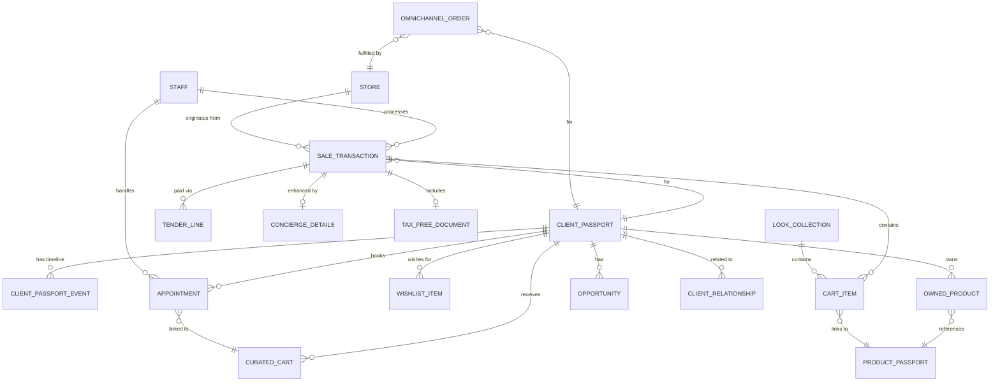

# 📋 Product Requirements Document (PRD)

## RSMS — Sales Associate (Luxury Clienteling & Selling OS) Module

### Codename: **Client Advisor Experience Platform**

---

| Field | Value |
|---|---|
| **Product** | Retail Store Management System (RSMS) — iOS Application |
| **Module** | Sales Associate (Client Advisor) |
| **Version** | 1.0 |
| **Author** | Product Development Team |
| **Date** | 2026-06-19 |
| **Platform** | iPhone & iPad (iOS 26+) |
| **Frameworks** | SwiftUI, Core ML, Vision, App Intents, PassKit, CloudKit, MapKit |
| **Architecture** | MVVM with Swift Concurrency (`async/await`, Actors) |
| **SRS Reference** | SRS RSMS v1.0 — Sections 2.1.2, 4.2 |
| **Shared Platform** | Client Digital Twin Platform + Product Digital Twin Platform (shared with Inventory & After-Sales) |

---

## Table of Contents

1. [Product Vision & Strategic Context](#1-product-vision--strategic-context)
2. [Scope & Boundaries](#2-scope--boundaries)
3. [Shared Architecture — The Digital Twin Ecosystem](#3-shared-architecture--the-dual-passport-ecosystem)
4. [User Personas & Roles](#4-user-personas--roles)
5. [Information Architecture & Navigation](#5-information-architecture--navigation)
6. [Epic S1 — Clienteling Hub (Client Digital Twin)](#6-epic-s1--clienteling-hub-client-passport)
7. [Epic S2 — Appointment & Remote Selling](#7-epic-s2--appointment--remote-selling)
8. [Epic S3 — Assisted Selling Intelligence](#8-epic-s3--assisted-selling-intelligence)
9. [Epic S4 — Luxury POS & Checkout](#9-epic-s4--luxury-pos--checkout)
10. [Epic S5 — Omnichannel Fulfillment](#10-epic-s5--omnichannel-fulfillment)
11. [Epic S6 — Client Intelligence Dashboard](#11-epic-s6--client-intelligence-dashboard)
12. [Innovation Features (SF1–SF10)](#12-innovation-features-sf1sf10)
13. [Data Model & Core Data Schema](#13-data-model--core-data-schema)
14. [API Contract Specifications](#14-api-contract-specifications)
15. [Apple Framework Mapping](#15-apple-framework-mapping)
16. [HIG Compliance Guidelines](#16-hig-compliance-guidelines)
17. [Role-Based Access Control (RBAC)](#17-role-based-access-control-rbac)
18. [Non-Functional Requirements](#18-non-functional-requirements)
19. [Verification & Testing Plan](#19-verification--testing-plan)
20. [Implementation Checklist](#20-implementation-checklist)
21. [Appendices](#21-appendices)

---

## 1. Product Vision & Strategic Context

### 1.1 Vision Statement

> **Client Advisor Experience Platform** — A relationship-first luxury selling system that transforms transactional POS operations into a **personalised luxury journey**, anchored by a **Client Digital Twin** that gives every customer a permanent digital identity shared across the entire RSMS ecosystem.

### 1.2 Why This Module Matters Most

| Module | Role in the Business |
|---|---|
| Inventory Controller | Cost Centre — tracks and protects assets |
| After-Sales Service | Retention Centre — keeps customers loyal |
| **Sales Associate** | **Revenue Centre — where money is made** |

Most retail systems treat sales associates as **POS operators**. Luxury brands treat them as **Client Advisors, Relationship Managers, Personal Shoppers, and Luxury Consultants**. This module reflects that distinction in every design decision.

### 1.3 Problem Statement

| Problem | Impact |
|---|---|
| ❌ No client memory | Associates ask the same questions at every visit |
| ❌ No relationship building | Transactions without loyalty or context |
| ❌ No personalisation | Generic product presentations to all customers |
| ❌ No luxury experience | Same checkout flow as a grocery store |
| ❌ Lost follow-ups | Anniversary and wishlist opportunities missed |
| ❌ Weak remote selling | Phone calls and WhatsApp messages with no structure |
| ❌ No unified omnichannel | BOPIS, endless aisle, and ship-from-store managed manually |
| ❌ Associates rely on intuition | No data-driven selling support |

### 1.4 Current Market Flow (Weak)

```
Customer Walks In → Associate Asks Questions → Browse Products → Purchase → Customer Leaves
```

### 1.5 Our Solution Architecture

```
Client Advisor Experience Platform
├── S1  Clienteling Hub (Client Digital Twin)
├── S2  Appointment & Remote Selling
├── S3  Assisted Selling Intelligence
├── S4  Luxury POS & Checkout
├── S5  Omnichannel Fulfillment
└── S6  Client Intelligence Dashboard
```

### 1.6 Six Core Differentiators

| # | Differentiator | Competitive Advantage |
|---|---|---|
| 1 | Client Digital Twin — Unified Relationship Timeline | Every customer visit, purchase, repair, event, wishlist in one living identity |
| 2 | AI Client Memory | Associate sees complete context before greeting the customer |
| 3 | Occasion-Based Selling | System builds entire luxury collections for weddings, anniversaries, travel |
| 4 | Concierge Checkout | Gift wrap, personalised note, warranty registration and service passport creation at POS |
| 5 | Unified Inventory Visibility | Live stock across current store, nearby stores, warehouse, and in-transit — powering endless aisle |
| 6 | Opportunity Engine | Proactive outreach triggers: warranty expiring, wishlist in stock, repair complete, anniversary approaching |

### 1.7 Business Goals

| Goal | Metric | Target |
|---|---|---|
| Increase conversion rate | % of store visits resulting in purchase | ≥ 40% |
| Increase average order value | Mean transaction value | ≥ 15% uplift vs baseline |
| Improve client retention | 12-month repeat purchase rate | ≥ 60% |
| Increase remote selling revenue | % revenue via curated carts | ≥ 20% |
| Reduce missed opportunities | Follow-up completion rate | ≥ 85% |
| BOPIS completion rate | % BOPIS orders fulfilled on time | ≥ 95% |

---

## 2. Scope & Boundaries

### 2.1 In Scope

| Category | Details |
|---|---|
| **SRS 2.1.2.1** | Clienteling — client profiles, preferences, sizes, anniversaries, wishlists, privacy consents |
| **SRS 2.1.2.2** | Appointment & Remote Selling — booking, reminders, video consults, curated carts |
| **SRS 2.1.2.3** | Assisted Selling — guided catalogs, look builder, AI recommendations, cross-sell/upsell |
| **SRS 2.1.2.4** | POS & Checkout — carting, discounts, split tenders, tax-free, gift receipts, exchanges/returns |
| **SRS 2.1.2.5** | Omnichannel — BOPIS pickup, endless-aisle ordering, ship-from-store packing slips |
| **SRS 4.2** | All detailed functional requirements for Sales Associate |
| **Shared Platform** | Client Digital Twin (new) + Product Digital Twin (shared with Inventory & After-Sales) |
| **Innovation** | 10 additional enterprise/luxury features (SF1–SF10) |

### 2.2 Out of Scope

| Item | Rationale |
|---|---|
| Store admin / shift management | Covered by Store Admin module |
| Inventory receiving / cycle counts | Covered by Inventory Controller module |
| Repair workflow execution | Covered by After-Sales module |
| Product master data management | Covered by Product Master module |
| Android / Web builds | iOS-only per SRS 2.3 |

### 2.3 Key Definitions

| Term | Definition |
|---|---|
| **Client Digital Twin** | Unified digital identity for every customer — the core entity of this module |
| **Product Digital Twin** | Shared digital identity for every luxury item — created by Inventory, read here |
| **AST** | After-Sales Ticket — created by After-Sales module, visible in Client Digital Twin |
| **BOPIS** | Buy Online, Pick Up In Store |
| **Endless Aisle** | Selling inventory not physically in the current store by sourcing from other locations |
| **Ship-From-Store** | Fulfilling online orders from store stock |
| **Curated Cart** | A private, shareable link with selected products, styling notes, and recommendations |
| **OMS** | Order Management System — orchestrates omnichannel orders |
| **Split Tender** | Payment split across multiple methods (e.g. card + store credit) |

### 2.4 Dependencies & Shared Platform

| Dependency | Module / System | Type |
|---|---|---|
| **Client Digital Twin Platform** | **New — introduced by this module** | **Read / Write** |
| **Product Digital Twin Platform** | **Shared with Inventory & After-Sales** | **Read** (writes sale event) |
| Inventory Stock Data | Inventory Controller Module | Read (real-time stock checks) |
| After-Sales Ticket (AST) Data | After-Sales Module | Read (service history), Write (initiate AST) |
| Warranty Records | Shared Platform (Inventory & After-Sales) | Read / Write (register warranty at sale) |
| Authentication & Valuation Records | Shared Platform | Read |
| Payment Gateway | POS / Payments Module | Integration |
| Push Notifications | APNs / Cloud Messaging | Infrastructure |
| AI/ML Models | Core ML | Embedded |
| Cloud Sync | CloudKit / Backend API | Infrastructure |

---

## 3. Shared Architecture — The Digital Twin Ecosystem

> **This module introduces the Client Digital Twin — the second core entity in the RSMS platform, complementing the Product Digital Twin introduced by the Inventory module. Together, they form the Connected Luxury Asset Ecosystem.**

### 3.1 Why the Dual Passport Architecture?

Most retail platforms create three separate silos:

```
❌ CRM Module      (Customer records, no product history)
❌ Inventory Module (Product records, no customer history)
❌ Service Module   (Repair records, disconnected from both)
```

This creates a **Fancy CRM + Fancy Inventory + Fancy Service** — three disconnected systems that don't feel like a platform.

### 3.2 The Two Core Entities

```
1. Client Digital Twin    ← introduced by Sales Associate module
       ↕
2. Product Digital Twin   ← introduced by Inventory Controller module
```

Everything else in the platform is a **workflow on top of these two entities**.

### 3.3 Full Platform Architecture

```
Luxury Retail OS — Connected Ecosystem
│
├── Client Digital Twin (Core Entity #1)
│
├── Product Digital Twin (Core Entity #2)
│
├── Sales Associate Module          ← THIS MODULE
│     ↕  Client Digital Twin (creates & maintains)
│     ↕  Product Digital Twin (reads at sale, writes sale event)
│
├── Inventory Controller Module
│     ↕  Product Digital Twin (creates at receiving)
│
├── After-Sales Service Module
│     ↕  Product Digital Twin (reads, appends service events)
│     ↕  Client Digital Twin (reads for VIP context, concierge mode)
│
├── Authentication Center (Shared)
├── Valuation Center (Shared)
├── Warranty Center (Shared)
└── Omnichannel Engine (Shared)
```

### 3.4 The Client Digital Twin — New Core Entity

```swift
// Introduced by the Sales Associate module
// Shared across ALL modules
struct ClientDigitalTwin: Codable, Identifiable {
    let id: UUID
    let customerID: UUID

    // Identity
    let firstName: String
    let lastName: String
    let email: String?
    let phone: String?
    let dateOfBirth: Date?

    // Tier
    var tier: CustomerTier                      // .standard, .vip, .vvip
    var lifetimeSpend: Decimal
    var preferredStore: UUID?
    var preferredAdvisor: UUID?

    // Preferences (for AI Client Memory)
    var preferences: ClientPreferences

    // Passport Timeline (unified across all modules)
    var events: [ClientDigitalTwinEvent]

    // Owned Products (links to Product Digital Twins)
    var ownedProducts: [OwnedProduct]

    // Active Wishlist
    var wishlistItems: [WishlistItem]

    // Privacy & Consent
    var consentStatus: ConsentRecord
    var gdprFlags: GDPRFlags
}

struct ClientPreferences: Codable {
    var preferredBrands: [String]
    var preferredCategories: [ProductCategory]
    var preferredColors: [String]
    var preferredMaterials: [String]
    var sizes: SizeProfile
    var communicationChannel: CommunicationChannel  // .push, .sms, .email, .whatsapp
    var languagePreference: String
    var shoppingOccasions: [String]                 // e.g. ["Wedding", "Corporate", "Travel"]
    var anniversaryDate: Date?
    var birthdayDate: Date?
    var notes: String
}

struct SizeProfile: Codable {
    var ring: String?
    var dress: String?
    var suit: String?
    var shirt: String?
    var shoes: String?
    var wrist: String?                              // For watches
    var custom: [String: String]                    // Brand-specific sizes
}

struct OwnedProduct: Codable, Identifiable {
    let id: UUID
    let twinID: UUID                            // Links to Product Digital Twin
    let productName: String
    let serialNumber: String
    let purchaseDate: Date
    let purchaseStore: UUID
    let purchasePrice: Decimal
    var currentWarrantyStatus: WarrantyStatus
}

struct ClientDigitalTwinEvent: Codable, Identifiable {
    let id: UUID
    let date: Date
    let type: ClientEventType
    let title: String
    let description: String
    let location: String
    let performedBy: UUID?                          // Staff ID
    let linkedProductDigitalTwinID: UUID?              // If event is product-related
    let metadata: [String: String]
}

enum ClientEventType: String, Codable, CaseIterable {
    // Sales Events
    case boutiqueVisit       // Walked into store
    case purchase            // Made a purchase
    case returnProcessed     // Returned an item
    case exchange            // Exchanged an item

    // Relationship Events
    case appointmentBooked   // Booked an appointment
    case appointmentCompleted// Completed appointment
    case remoteSellSession   // Participated in remote selling
    case curatedCartViewed   // Opened a curated cart link

    // Product Events
    case wishlistAdded       // Added item to wishlist
    case wishlistFulfilled   // Wishlist item purchased

    // Service Events (from After-Sales module)
    case repairInitiated     // New AST created
    case repairCompleted     // Repair finished
    case warrantyRegistered  // Warranty registered at checkout
    case authenticationDone  // Product authenticated
    case valuationReceived   // Received valuation letter

    // Engagement Events
    case vipEventAttended    // Attended a trunk show or VIP event
    case outreachSent        // Follow-up message sent
    case feedbackProvided    // Post-purchase survey completed
}
```

### 3.5 How Modules Connect Through the Passport Ecosystem

#### At Sale (Sales Associate creates bridge between both passports)

```
Customer Purchases Rolex Submariner
          ↓
Sales Associate scans product
          ↓
Load Product Digital Twin (from Inventory module)
          ↓
Link Product to Client Digital Twin
          ↓
Append `sold` event to Product Digital Twin
Append `purchase` event to Client Digital Twin
          ↓
Register warranty → written to Product Digital Twin
          ↓
Product Digital Twin now knows its owner.
Client Digital Twin now shows owned products.
```

#### When Customer Returns for Service (After-Sales reads both passports)

```
Customer arrives at store with Rolex for repair
          ↓
Scan product serial number
          ↓
Load Product Digital Twin → full history (no re-entry)
Load Client Digital Twin → VIP tier, preferences, previous interactions
          ↓
Create AST pre-filled with:
  • Product details (from Product Digital Twin)
  • Customer details (from Client Digital Twin)
  • Warranty status (from Product Digital Twin)
  • Previous repairs (from Product Digital Twin)
          ↓
Append `repairInitiated` event to Client Digital Twin
```

#### When Associate Opens Client Profile (full 360° view)

```
Associate greets customer
          ↓
Open Client Digital Twin
          ↓
See in one screen:
  • Prefers Rolex, size M, black leather
  • Anniversary in 2 weeks
  • Wishlist: Rolex GMT Master II (available in Delhi store)
  • Last repair: 2 months ago — completed, QA passed
  • Warranty on Submariner expiring in 3 months
  • VIP tier — lifetime spend ₹48L
```

### 3.6 Complete Lifecycle Example

```
Client Digital Twin — Rahul Sharma — VIP Tier

│
├─ 🏬 Boutique Visit        Delhi Store           Jan 10, 2026   [Sales]
├─ 🛍 Purchase              Rolex Submariner       Jan 10, 2026   [Sales]
│      → Product Digital Twin linked: SN RX-2026-00221
│      → Warranty registered: 5 years
├─ 📋 Wishlist Added        Rolex GMT Master II    Feb 05, 2026   [Sales]
├─ 📅 Appointment Booked    Remote Selling         Mar 01, 2026   [Sales]
├─ 🔧 Repair Initiated      Crown alignment        Jun 10, 2026   [After-Sales]
├─ 🔧 Repair Completed      Crown replaced         Jun 18, 2026   [After-Sales]
├─ 🎫 VIP Event Attended    New Collection Launch  Aug 15, 2026   [Store Admin]
├─ 📄 Valuation Received    Insurance ₹18.5L       Sep 01, 2026   [After-Sales]
└─ 🛍 New Purchase          Cartier Tank           Nov 20, 2026   [Sales]
       → New Product Digital Twin linked: SN CTR-2026-00891
```

### 3.7 Shared CloudKit Container

All three modules use the same CloudKit container for real-time data sharing:

```swift
// Product Digital Twin — Shared with Inventory and After-Sales
let ProductDigitalTwinContainerID = "iCloud.com.rsms.ProductDigitalTwin"

// Client Digital Twin — New, introduced by Sales Associate, shared with all modules
let ClientDigitalTwinContainerID  = "iCloud.com.rsms.ClientDigitalTwin"
```

> **For the full Product Digital Twin specification, see: `Inventory/PRD_Inventory.md`, Section 3.**
> **For the After-Sales integration points, see: `After-Sales/PRD_After_Sales.md`, Section 3.**

---

## 4. User Personas & Roles

### 4.1 Primary Personas

#### Persona 1: Sales Associate / Client Advisor (Power User)

| Attribute | Detail |
|---|---|
| **Name** | Priya — Senior Client Advisor, Delhi Boutique |
| **Role** | Sales Associate |
| **Tech Proficiency** | High — comfortable with iPad/iPhone while assisting customers |
| **Daily Tasks** | Client greetings, product presentations, look building, checkout, BOPIS handling, follow-ups |
| **Pain Points** | No client context before greeting, no inventory visibility, manual cart sharing, no cross-store stock |
| **Goals** | Personalised every interaction, hit revenue targets, build long-term client relationships |

#### Persona 2: Boutique Manager (Oversight)

| Attribute | Detail |
|---|---|
| **Name** | Rajesh — Store Manager, Delhi Boutique |
| **Role** | Boutique Manager |
| **Tech Proficiency** | Medium |
| **Daily Tasks** | Reviews associate performance, manages VIP appointments, monitors daily targets, approves discounts |
| **Pain Points** | No real-time advisor performance view, reactive management |
| **Goals** | High conversion, high AOV, retention metrics, zero missed follow-ups |

#### Persona 3: Corporate Admin (Strategic)

| Attribute | Detail |
|---|---|
| **Name** | Meera — VP Retail Operations |
| **Role** | Corporate Admin / Retail Ops |
| **Tech Proficiency** | High |
| **Daily Tasks** | Network-wide sales analytics, campaign performance, client tier analytics |
| **Pain Points** | No centralised client intelligence, no cross-store selling insights |
| **Goals** | Revenue growth, client retention, data-driven assortment planning |

#### Persona 4: End Customer (Indirect)

| Attribute | Detail |
|---|---|
| **Name** | Rahul — VIP Client, ₹48L lifetime spend |
| **Role** | Customer |
| **Interaction** | Receives personalised outreach, accesses curated cart links, interacts with BOPIS |
| **Goals** | Seamless luxury experience, personalised recommendations, effortless purchases |

### 4.2 RACI Matrix

| Activity | Sales Associate | Boutique Manager | Corporate Admin |
|---|---|---|---|
| Client Digital Twin Creation | **R/A** | I | – |
| Client Profile Updates | **R** | I | – |
| Appointment Booking | **R** | **A** | I |
| Curated Cart Creation | **R/A** | I | – |
| Look Building | **R/A** | I | – |
| POS Checkout | **R** | **A** | – |
| Discount Approval | I | **R/A** | I |
| BOPIS Fulfillment | **R** | **A** | – |
| Client Digital Twin Read (cross-module) | **R** | **R** | **R** |
| Follow-up Outreach | **R** | **A** | I |
| Analytics Review | I | **R** | **R/A** |

---

## 5. Information Architecture & Navigation

### 5.1 SwiftUI View Hierarchy

```
SalesAssociateTabView (TabView)
├── Tab 1: ClientHubView
│   ├── ClientListView (search, filter, VIP indicators)
│   │   └── ClientRowView
│   ├── ClientDigitalTwinView
│   │   ├── ClientHeaderView (tier badge, lifetime spend, preferred advisor)
│   │   ├── AIClientMemoryCardView          ← Key innovation
│   │   ├── ClientDigitalTwinTimelineView      ← Unified lifecycle timeline
│   │   ├── OwnedProductsListView           ← Links to Product Digital Twins
│   │   │   └── ProductDigitalTwinMiniCardView
│   │   ├── WishlistView
│   │   ├── ActiveOpportunitiesView         ← Opportunity Engine
│   │   ├── PreferencesView
│   │   └── ClientActionBarView
│   └── AddClientView
│
├── Tab 2: AppointmentsView
│   ├── AppointmentCalendarView
│   │   └── AppointmentCardView
│   ├── AppointmentDetailView
│   │   ├── ClientContextCardView
│   │   ├── PreparationNotesView
│   │   └── CuratedCartPreviewView
│   ├── CreateAppointmentView
│   └── RemoteSellingView
│       ├── CuratedCartBuilderView
│       │   ├── ProductSearchView
│       │   ├── StyleNotesView
│       │   └── CartPreviewView
│       └── CuratedCartShareView
│
├── Tab 3: SellingView
│   ├── CatalogBrowserView (with AI suggestions)
│   │   └── ProductCardView
│   ├── LookBuilderView
│   │   ├── AnchorProductView
│   │   ├── SuggestedAddOnsView
│   │   └── OccasionPickerView
│   ├── ProductDetailView
│   │   ├── ProductInfoView
│   │   ├── InventoryAvailabilityView     ← Live stock from Inventory module
│   │   ├── ProductDigitalTwinMiniView       ← From shared platform
│   │   └── AddToCartButton
│   └── ActiveCartView
│
├── Tab 4: CheckoutView
│   ├── CartReviewView
│   │   ├── CartItemListView
│   │   ├── DiscountApplyView
│   │   └── TaxFreeEligibilityView
│   ├── PaymentView
│   │   ├── SplitTenderView
│   │   ├── ApplePayView
│   │   └── AlternativePaymentView
│   ├── ConciergeCheckoutView             ← Key differentiator
│   │   ├── GiftWrapView
│   │   ├── PersonalisedNoteView
│   │   ├── WarrantyRegistrationView      ← Writes to Product Digital Twin
│   │   └── DeliverySchedulerView
│   └── ReceiptView
│       ├── DigitalReceiptView
│       └── TaxFreeDocumentView
│
├── Tab 5: OmnichannelView
│   ├── BOPISQueueView
│   │   ├── PendingPickupsListView
│   │   └── PickupVerificationView
│   ├── EndlessAisleView
│   │   ├── CrossStoreInventoryView
│   │   └── OrderPlacementView
│   └── ShipFromStoreView
│       ├── PackingSlipGeneratorView
│       └── ShipmentHandoffView
│
└── Tab 6: DashboardView
    ├── AdvisorDashboardView
    │   ├── TodayAgendaView
    │   ├── ActiveOpportunitiesView
    │   ├── SalesGoalGaugeView
    │   └── RecentActivityFeedView
    └── ManagerDashboardView (Manager+ only)
        ├── ConversionRateChartView
        ├── TopAdvisorsView
        └── StorePerformanceView
```

### 5.2 Navigation Pattern

| Pattern | Usage |
|---|---|
| **TabView** | Top-level module navigation (6 tabs) |
| **NavigationStack** | Hierarchical drill-down (Client → Passport → Product Digital Twin) |
| **NavigationSplitView** | Three-column layout on iPad (client list + passport + details) |
| **Sheet (.sheet)** | Curated cart builder, appointment creation, look builder |
| **FullScreenCover** | POS checkout flow, camera capture |
| **Alert / ConfirmationDialog** | Discount approval, destructive actions |

### 5.3 iPad Layout

```
iPad (Regular Width):
┌─────────────────────────────────────────────────────┐
│  Client List      │  Client Digital Twin  │  Detail     │
│  (NavigationSplit │  (Timeline +      │  (Product   │
│   View)           │   Opportunities)  │   Passport) │
│  🔍 Search        │                   │             │
│  ─────────────    │  [Client Header]  │  [Product   │
│  👑 Rahul S.      │  [AI Memory Card] │   History]  │
│  🌟 Priya M.      │  [Timeline]       │             │
│  ─────────────    │  [Wishlist]       │             │
└─────────────────────────────────────────────────────┘
```

---

## 6. Epic S1 — Clienteling Hub (Client Digital Twin)

> **SRS Coverage**: 2.1.2.1, 4.2 bullet 1

### 6.1 Overview

The heart of the module. Every customer has a **Client Digital Twin** — a comprehensive digital identity capturing preferences, purchase history, wishlist, appointments, service history (from After-Sales), and a live relationship timeline. Associates see the full picture before saying hello.

### 6.2 User Stories

| ID | Story | Priority |
|---|---|---|
| S1-US01 | As a sales associate, I want to search for a client by name, phone, or email so that I can open their Client Digital Twin immediately when they arrive. | P0 |
| S1-US02 | As a sales associate, I want to see a client's full preference profile (brands, sizes, colours, occasions) so that I can personalise my presentation. | P0 |
| S1-US03 | As a sales associate, I want to see a client's complete Relationship Timeline (visits, purchases, repairs, events, wishlists) in one view so that I know their full history. | P0 |
| S1-US04 | As a sales associate, I want to see all products the client owns (linked to their Product Digital Twins) so that I can see their collection without asking. | P0 |
| S1-US05 | As a sales associate, I want to see the client's active wishlist so that I can surface items immediately during the visit. | P0 |
| S1-US06 | As a sales associate, I want to create and update a client's privacy consent record so that GDPR compliance is always maintained. | P0 |
| S1-US07 | As a sales associate, I want to record a new client profile with all preference fields so that the Client Digital Twin is created immediately at first visit. | P0 |
| S1-US08 | As a boutique manager, I want to see all active client relationships and upcoming anniversaries / birthdays so that I can prepare outreach. | P1 |
| S1-US09 | As a sales associate, I want to add a wishlist item for a customer and be notified when it comes back in stock so that I never miss a sales opportunity. | P0 |
| S1-US10 | As a sales associate, I want to log notes after each client interaction so that the next associate has full context. | P1 |

### 6.3 Client Digital Twin — Key Data Models

> *Full `ClientDigitalTwin` struct is defined in Section 3.4 above.*

```swift
struct WishlistItem: Codable, Identifiable {
    let id: UUID
    let ClientDigitalTwinID: UUID
    let sku: String
    let productName: String
    let addedDate: Date
    let addedBy: UUID                              // Associate ID
    var isAvailable: Bool                          // Live from Inventory module
    var availableStores: [UUID]                    // Which stores have stock
    var notifyOnRestock: Bool
    var notes: String
}

struct ConsentRecord: Codable {
    var marketingEmail: Bool
    var marketingSMS: Bool
    var marketingWhatsApp: Bool
    var marketingPush: Bool
    var dataProcessing: Bool
    var profilingForRecommendations: Bool
    var consentDate: Date
    var consentVersion: String
    var withdrawnDate: Date?
}

struct GDPRFlags: Codable {
    var canStore: Bool
    var canProcess: Bool
    var canProfile: Bool
    var rightToErasureRequested: Bool
    var exportRequested: Bool
}
```

### 6.4 Acceptance Criteria — S1

| ID | Criterion | Verification |
|---|---|---|
| S1-AC01 | Client search returns results within 1 second for 100k+ records | Performance test |
| S1-AC02 | Relationship Timeline shows all event types from all modules | Cross-module integration test |
| S1-AC03 | Owned products list links correctly to Product Digital Twins from Inventory | Integration test |
| S1-AC04 | Wishlist in-stock notification fires within 60 seconds of inventory update | E2E test |
| S1-AC05 | Privacy consent is saved with timestamp and version | Integration test |
| S1-AC06 | New Client Digital Twin is created with unique ID and initial `boutiqueVisit` event | Unit test |
| S1-AC07 | Client tier (Standard / VIP / VVIP) is computed from lifetime spend | Unit test |
| S1-AC08 | GDPR right-to-erasure flag marks all passport data for deletion | Security test |
| S1-AC09 | Interaction notes are saved with author, timestamp, and associated event | Integration test |
| S1-AC10 | Offline client profile creation queues and syncs when connectivity is restored | Offline test |

---

## 7. Epic S2 — Appointment & Remote Selling

> **SRS Coverage**: 2.1.2.2, 4.2 bullet 2

### 7.1 Overview

Structured appointment management with automated reminders, pre-appointment client context preparation, and a full remote selling suite enabling associates to create shareable curated carts with products, styling notes, and videos.

### 7.2 User Stories

| ID | Story | Priority |
|---|---|---|
| S2-US01 | As a sales associate, I want to book an appointment for a client with date, time, type (in-store/video), and assigned advisor so that visits are organised. | P0 |
| S2-US02 | As a sales associate, I want automated appointment reminders sent to the client (push/SMS/email) so that no-shows are reduced. | P0 |
| S2-US03 | As a sales associate, I want to see a pre-appointment briefing card showing the client's preferences, recent purchases, and wishlist before the meeting. | P0 |
| S2-US04 | As a sales associate, I want to create a Curated Cart with selected products, styling notes, videos, and personal recommendations so that I can share it with the client before or after a consultation. | P0 |
| S2-US05 | As a client, I want to receive a private, branded link to a curated cart so that I can browse and purchase at my convenience. | P0 |
| S2-US06 | As a sales associate, I want to see when a client has viewed my curated cart so that I can follow up at the right time. | P1 |
| S2-US07 | As a boutique manager, I want to see all appointments for today and this week across all advisors so that I can manage staffing. | P0 |
| S2-US08 | As a sales associate, I want to log video consultation notes and outcomes so that the interaction is captured in the Client Digital Twin. | P1 |
| S2-US09 | As a sales associate, I want to convert a curated cart directly to a checkout when the client approves so that the purchase is seamless. | P1 |
| S2-US10 | As a corporate admin, I want to see appointment conversion rates per advisor and store so that I can measure effectiveness. | P1 |

### 7.3 Data Models

```swift
struct Appointment: Codable, Identifiable {
    let id: UUID
    let appointmentNumber: String             // e.g., "APT-2026-DLH-00234"
    let ClientDigitalTwinID: UUID
    let advisorID: UUID
    let storeID: UUID
    let scheduledAt: Date
    let durationMinutes: Int
    let type: AppointmentType                 // .inStore, .videoConsult, .phoneCall, .remoteCart
    var status: AppointmentStatus             // .scheduled, .confirmed, .inProgress, .completed, .cancelled, .noShow
    var preparationNotes: String
    var outcome: AppointmentOutcome?
    var linkedCartID: UUID?
    var remindersSent: [ReminderLog]
}

struct CuratedCart: Codable, Identifiable {
    let id: UUID
    let cartNumber: String                    // e.g., "CART-2026-DLH-00089"
    let createdAt: Date
    let createdBy: UUID                       // Associate ID
    let ClientDigitalTwinID: UUID

    var items: [CuratedCartItem]
    var stylingNote: String
    var personalMessage: String
    var videos: [URL]

    var shareLink: URL                        // Private branded link
    var expiresAt: Date
    var viewedAt: Date?
    var viewCount: Int
    var convertedToOrderAt: Date?

    var status: CartStatus                    // .draft, .shared, .viewed, .converted, .expired
}

struct CuratedCartItem: Codable, Identifiable {
    let id: UUID
    let sku: String
    let productName: String
    let unitPrice: Decimal
    let quantity: Int
    var stylingNote: String                   // Per-item note from associate
    var twinID: UUID?                     // Product Digital Twin link
}
```

### 7.4 Acceptance Criteria — S2

| ID | Criterion | Verification |
|---|---|---|
| S2-AC01 | Appointment reminders fire at configurable intervals (24h, 2h before) | Notification test |
| S2-AC02 | Pre-appointment briefing card shows complete client context | Integration test |
| S2-AC03 | Curated cart generates a unique shareable URL | Unit test |
| S2-AC04 | Cart view notification fires within 60 seconds of client opening link | E2E test |
| S2-AC05 | Cart-to-checkout conversion works without requiring re-entry of cart items | Integration test |
| S2-AC06 | Appointment completion logs `appointmentCompleted` event on Client Digital Twin | Integration test |
| S2-AC07 | Appointment calendar shows all advisors' schedules (manager view) | UI test |
| S2-AC08 | Video consult notes are saved and timestamped | Unit test |
| S2-AC09 | Appointment conversion rates are correct in analytics | Unit test |
| S2-AC10 | Offline appointment booking queues and syncs when connectivity is restored | Offline test |

---

## 8. Epic S3 — Assisted Selling Intelligence

> **SRS Coverage**: 2.1.2.3, 4.2 bullet 3

### 8.1 Overview

AI-powered selling tools: a guided digital catalogue, a Look Builder for curating complete luxury collections, occasion-based selling, and real-time cross-sell / upsell recommendations powered by the client's preference profile and purchase history.

### 8.2 User Stories

| ID | Story | Priority |
|---|---|---|
| S3-US01 | As a sales associate, I want a guided digital catalogue filtered by the client's preferences (brand, category, colour) so that product discovery is personalised. | P0 |
| S3-US02 | As a sales associate, I want to use a Look Builder to select an anchor product and see AI-suggested complementary items (strap, case, extension) so that I can present a complete luxury collection. | P0 |
| S3-US03 | As a sales associate, I want to select an occasion (Wedding, Anniversary, Corporate, Birthday, Travel) and have the system auto-build a complete recommended luxury collection so that the presentation is effortless. | P0 |
| S3-US04 | As a sales associate, I want to see AI-generated cross-sell and upsell recommendations based on what's already in the cart and the client's history so that I maximise AOV. | P0 |
| S3-US05 | As a sales associate, I want real-time inventory availability shown for every product in the catalogue so that I never promise an out-of-stock item. | P0 |
| S3-US06 | As a sales associate, I want to see which wishlist items are available in store today so that I can surface them immediately. | P0 |
| S3-US07 | As a sales associate, I want to add any catalogue product to the cart or curated cart directly from the product detail view so that the selling flow is frictionless. | P0 |
| S3-US08 | As a sales associate, I want to see the client's purchase history to avoid recommending items they already own. | P1 |
| S3-US09 | As a sales associate, I want to view the Product Digital Twin for any product in the catalogue so that I can speak to its authenticity and provenance. | P1 |
| S3-US10 | As a boutique manager, I want to see which AI recommendations led to conversions so that I can measure AI effectiveness. | P2 |

### 8.3 Look Builder Data Model

```swift
struct LookCollection: Codable, Identifiable {
    let id: UUID
    let createdAt: Date
    let createdBy: UUID                       // Associate ID
    let ClientDigitalTwinID: UUID?

    var anchorProduct: CartItem               // Primary item (e.g., the watch)
    var complementaryItems: [CartItem]        // AI-suggested additions
    var occasion: Occasion?
    var stylingTheme: String
    var totalValue: Decimal

    var aiGenerationMetadata: AIRecommendationMetadata?
}

struct AIRecommendationMetadata: Codable {
    let modelVersion: String
    let confidenceScore: Double
    let reasons: [String]                     // e.g. ["Client prefers black leather", "Purchased Rolex previously"]
    let alternativeItems: [CartItem]
}

enum Occasion: String, Codable, CaseIterable {
    case wedding      = "Wedding"
    case anniversary  = "Anniversary"
    case birthday     = "Birthday"
    case corporate    = "Corporate"
    case travel       = "Travel"
    case graduation   = "Graduation"
    case festive      = "Festive"
    case everyday     = "Everyday Luxury"
}
```

### 8.4 AI Recommendation Engine — Core ML

```swift
actor RecommendationEngine {
    private let model: MLModel               // Trained on luxury purchase co-occurrence data

    func generateLookRecommendations(
        anchorSKU: String,
        ClientDigitalTwin: ClientDigitalTwin,
        excludeSKUs: [String]               // Items client already owns
    ) async throws -> [RecommendedItem] {
        // Returns ranked list of complementary products with confidence scores
    }

    func generateOccasionCollection(
        occasion: Occasion,
        ClientDigitalTwin: ClientDigitalTwin,
        budget: ClosedRange<Decimal>?
    ) async throws -> LookCollection {
        // Returns complete occasion-based collection
    }

    func generateCrossSellItems(
        cartItems: [CartItem],
        ClientDigitalTwin: ClientDigitalTwin
    ) async throws -> [RecommendedItem] {
        // Returns upsell / cross-sell suggestions for current cart
    }
}
```

### 8.5 Acceptance Criteria — S3

| ID | Criterion | Verification |
|---|---|---|
| S3-AC01 | Catalogue filters correctly by client preferences on load | Integration test |
| S3-AC02 | Look Builder generates complementary items within 2 seconds | Performance test |
| S3-AC03 | Occasion-based collection generates minimum 5 items for all occasions | Unit test |
| S3-AC04 | AI cross-sell recommendations exclude items the client already owns | Integration test |
| S3-AC05 | Real-time inventory availability is accurate (< 30 second lag from Inventory module) | Integration test |
| S3-AC06 | Wishlist items available in current store are highlighted on load | Integration test |
| S3-AC07 | Add-to-cart works from product detail view and look builder | UI test |
| S3-AC08 | Product Digital Twin link from catalogue opens correct passport | Integration test |
| S3-AC09 | AI recommendation confidence score is logged for analytics | Unit test |
| S3-AC10 | Offline catalogue browse uses cached data and surfaces availability warning | Offline test |

---

## 9. Epic S4 — Luxury POS & Checkout

> **SRS Coverage**: 2.1.2.4, 4.2 bullet 4

### 9.1 Overview

A full luxury POS engine supporting split tenders, discounts, tax-free transactions, gift receipts, exchanges and returns — with a **Concierge Checkout** layer that allows associates to add gift wrapping, personalised notes, delivery scheduling, and warranty registration at the point of sale, creating the Product Digital Twin link at the moment of ownership transfer.

### 9.2 User Stories

| ID | Story | Priority |
|---|---|---|
| S4-US01 | As a sales associate, I want to build a cart with multiple items, apply item-level and cart-level discounts (with approval), and see a live total with tax so that checkout is accurate. | P0 |
| S4-US02 | As a sales associate, I want to accept payment via multiple methods in a single transaction (Apple Pay, card, UPI, cash, store credit, gift card) so that clients can pay how they prefer. | P0 |
| S4-US03 | As a sales associate, I want to process a tax-free sale for tourist customers by capturing passport details and generating the required tax-free documentation. | P0 |
| S4-US04 | As a sales associate, I want to generate a digital gift receipt with no price so that gifting is seamless. | P0 |
| S4-US05 | As a sales associate, I want to process a product exchange (return + re-purchase) in a single flow so that the transaction is handled correctly. | P0 |
| S4-US06 | As a sales associate, I want to process a return with reason code, condition assessment, and refund to original payment method so that returns are compliant. | P0 |
| S4-US07 | As a sales associate, I want the Concierge Checkout layer to let me add gift wrap, personalised note, delivery scheduling, and warranty registration without leaving the checkout flow. | P0 |
| S4-US08 | As a sales associate, I want warranty registration at checkout to automatically write to the Product Digital Twin and Client Digital Twin so that there is no manual follow-up. | P0 |
| S4-US09 | As a boutique manager, I want to approve discount requests above my associate's authorisation threshold before they are applied. | P0 |
| S4-US10 | As a corporate admin, I want to see discount usage, average discount rate, and override patterns so that pricing discipline is maintained. | P1 |

### 9.3 Data Models

```swift
struct SaleTransaction: Codable, Identifiable {
    let id: UUID
    let transactionNumber: String             // e.g., "TXN-2026-DLH-008821"
    let createdAt: Date
    let storeID: UUID
    let advisorID: UUID
    let ClientDigitalTwinID: UUID?

    var cartItems: [CartItem]
    var discounts: [AppliedDiscount]
    var subtotal: Decimal
    var taxAmount: Decimal
    var totalAmount: Decimal
    var currencyCode: String

    var tenderLines: [TenderLine]
    var isTaxFree: Bool
    var taxFreeDocument: TaxFreeDocument?

    var conciergeDetails: ConciergeDetails?
    var receiptType: ReceiptType              // .digital, .printed, .gift

    var status: TransactionStatus             // .draft, .completed, .voided, .refunded
    var linkedOrderIDs: [UUID]                // For BOPIS / ship-from-store orders
}

struct CartItem: Codable, Identifiable {
    let id: UUID
    let sku: String
    let productName: String
    let twinID: UUID?                     // Product Digital Twin link (if serialised)
    let quantity: Int
    let unitPrice: Decimal
    var discountAmount: Decimal
    var finalPrice: Decimal
    var isGift: Bool
    var warrantyRegistered: Bool
}

struct TenderLine: Codable, Identifiable {
    let id: UUID
    let method: PaymentMethod
    let amount: Decimal
    let reference: String?                    // Card last 4, UPI ref, etc.
    let status: PaymentStatus
}

enum PaymentMethod: String, Codable {
    case applePay    = "Apple Pay"
    case card        = "Card"
    case upi         = "UPI"
    case cash        = "Cash"
    case storeCredit = "Store Credit"
    case giftCard    = "Gift Card"
    case bankTransfer = "Bank Transfer"
}

struct ConciergeDetails: Codable {
    var giftWrapped: Bool
    var giftWrapStyle: String?
    var personalisedNote: String?
    var scheduledDeliveryDate: Date?
    var deliveryAddress: Address?
    var warrantyRegistrations: [WarrantyRegistration]
}

struct WarrantyRegistration: Codable {
    let cartItemID: UUID
    let twinID: UUID
    let warrantyStartDate: Date
    let warrantyExpiryDate: Date
    let warrantyType: WarrantyType
}

struct TaxFreeDocument: Codable {
    let documentNumber: String
    let customerPassportNumber: String
    let customerNationality: String
    let taxRefundAmount: Decimal
    let issuedAt: Date
}
```

### 9.4 Split Tender UI

```
┌──────────────────────────────────────────────┐
│  Payment — Total: ₹2,45,000                  │
│                                              │
│  Tender 1  Apple Pay          ₹2,00,000  ✅  │
│  Tender 2  Store Credit        ₹45,000   ✅  │
│  ─────────────────────────────────────────── │
│  Remaining:    ₹0   ✅ Fully paid            │
│                                              │
│  [Confirm Payment]                           │
└──────────────────────────────────────────────┘
```

### 9.5 Acceptance Criteria — S4

| ID | Criterion | Verification |
|---|---|---|
| S4-AC01 | Cart correctly calculates subtotal, tax, and total after discounts | Unit test |
| S4-AC02 | Split tender accepts multiple payment methods summing to exact total | Unit test |
| S4-AC03 | Tax-free flow captures passport details and generates correct documentation | Integration test |
| S4-AC04 | Gift receipt contains no price information | Unit test |
| S4-AC05 | Return flow restores inventory and refunds to original payment method | Integration test |
| S4-AC06 | Exchange flow correctly nets off return vs new purchase | Integration test |
| S4-AC07 | Warranty registration at checkout writes to both Product Digital Twin and Client Digital Twin | Cross-module test |
| S4-AC08 | Discount above threshold is blocked until manager approval | RBAC test |
| S4-AC09 | Apple Pay payment completes with receipt | Payment integration test |
| S4-AC10 | Completed transaction appends `purchase` event to Client Digital Twin and `sold` event to Product Digital Twin | Cross-module test |

---

## 10. Epic S5 — Omnichannel Fulfillment

> **SRS Coverage**: 2.1.2.5, 4.2 bullet 5

### 10.1 Overview

Full omnichannel order execution: BOPIS pickup management, endless aisle (selling from any store's or warehouse's inventory), and ship-from-store packing and handoff — all powered by the live inventory data from the Inventory Controller module.

### 10.2 User Stories

| ID | Story | Priority |
|---|---|---|
| S5-US01 | As a sales associate, I want to see all incoming BOPIS orders assigned to my store so that I can prepare them for pickup. | P0 |
| S5-US02 | As a sales associate, I want to verify the customer's identity and the order at pickup, capture a digital signature, and mark the order as completed. | P0 |
| S5-US03 | As a sales associate, I want to check real-time stock across all stores, the warehouse, and in-transit inventory when a product is not available locally so that I can offer endless aisle. | P0 |
| S5-US04 | As a sales associate, I want to place an endless aisle order on behalf of the client with their preferred delivery address so that the sale is not lost. | P0 |
| S5-US05 | As a sales associate, I want to generate a ship-from-store packing slip for online orders so that I can pack and hand off to the carrier. | P0 |
| S5-US06 | As a sales associate, I want to see a unified inventory view (current store, nearby stores, warehouse, in-transit, reserved) in one screen while serving a client. | P0 |
| S5-US07 | As a boutique manager, I want to see all pending BOPIS orders with their status and scheduled pickup times so that I can manage daily operations. | P0 |
| S5-US08 | As a sales associate, I want to notify the client when their BOPIS order is ready so that they come in on time. | P1 |
| S5-US09 | As a corporate admin, I want to see BOPIS fulfillment rates and endless aisle capture rates so that I can measure omnichannel performance. | P1 |
| S5-US10 | As a sales associate, I want to reserve a product at another store for a client so that it is held for them for 24 hours. | P1 |

### 10.3 Data Models

```swift
struct OmnichannelOrder: Codable, Identifiable {
    let id: UUID
    let orderNumber: String                   // e.g., "ORD-2026-DLH-00445"
    let createdAt: Date
    let ClientDigitalTwinID: UUID?
    let sourceStoreID: UUID
    let type: OrderType                       // .bopis, .endlessAisle, .shipFromStore, .reservation

    var items: [OrderItem]
    var status: OrderStatus
    var scheduledPickupDate: Date?
    var deliveryAddress: Address?
    var trackingNumber: String?
    var fulfilledAt: Date?
    var pickupSignature: Data?
}

enum OrderType: String, Codable {
    case bopis         = "BOPIS"
    case endlessAisle  = "Endless Aisle"
    case shipFromStore = "Ship From Store"
    case reservation   = "Reservation"
}

enum OrderStatus: String, Codable {
    case pending        = "Pending"
    case readyForPickup = "Ready For Pickup"
    case packed         = "Packed"
    case shipped        = "Shipped"
    case delivered      = "Delivered"
    case pickedUp       = "Picked Up"
    case cancelled      = "Cancelled"
}

struct InventoryAvailability: Codable {
    let sku: String
    var currentStore: Int
    var nearbyStores: [StoreStock]
    var warehouse: Int
    var inTransit: Int
    var reserved: Int
    var totalAvailable: Int
}

struct StoreStock: Codable {
    let storeID: UUID
    let storeName: String
    let quantity: Int
    let distanceKM: Double?
}
```

### 10.4 Unified Inventory View

```
┌─────────────────────────────────────────────────┐
│  Rolex GMT Master II — Ref 126710BLNR           │
│  Inventory Availability                          │
│                                                 │
│  📍 Delhi Store (Current)      0  ❌ Out         │
│  📍 Mumbai Store               2  ✅ Available   │
│  📍 Bangalore Store            1  ✅ Available   │
│  🏭 Warehouse                  5  ✅ Available   │
│  🚚 In Transit                 3  ⏳ 3 days      │
│  🔒 Reserved (other orders)    1  –             │
│                                                 │
│  [Reserve Mumbai] [Ship from Warehouse] [Order] │
└─────────────────────────────────────────────────┘
```

### 10.5 Acceptance Criteria — S5

| ID | Criterion | Verification |
|---|---|---|
| S5-AC01 | BOPIS queue shows all pending orders for the store | Integration test |
| S5-AC02 | Pickup verification captures digital signature and marks order complete | UI test |
| S5-AC03 | Cross-store inventory search returns live data within 2 seconds | Performance test |
| S5-AC04 | Endless aisle order correctly routes to fulfilling store/warehouse | Integration test |
| S5-AC05 | Ship-from-store packing slip is generated as a printable PDF | Document test |
| S5-AC06 | Unified inventory view shows all 5 availability categories correctly | Unit test |
| S5-AC07 | BOPIS ready notification fires within 30 seconds of order preparation | Notification test |
| S5-AC08 | Completed pickup appends event to Client Digital Twin | Cross-module test |
| S5-AC09 | Reservation holds product at target store for configurable duration | Integration test |
| S5-AC10 | Omnichannel fulfillment events are reflected in analytics | Unit test |

---

## 11. Epic S6 — Client Intelligence Dashboard

> **SRS Coverage**: Beyond SRS — Competitive Innovation Layer

### 11.1 Overview

Real-time performance dashboards for individual advisors and boutique managers. Surfaces today's appointments, active opportunities (from the Opportunity Engine), pending follow-ups, wishlist alerts, and sales goals — turning data into action.

### 11.2 User Stories

| ID | Story | Priority |
|---|---|---|
| S6-US01 | As a sales associate, I want to see my agenda for today (appointments, BOPIS pickups, follow-ups due) so that I can plan my shift. | P0 |
| S6-US02 | As a sales associate, I want to see all active opportunities (wishlist in stock, anniversary upcoming, warranty expiring, repair complete) so that I can act on them immediately. | P0 |
| S6-US03 | As a sales associate, I want to see my individual sales goals and current progress so that I can self-manage performance. | P1 |
| S6-US04 | As a boutique manager, I want to see today's conversion rate, average order value, and top-performing advisors so that I can manage the floor. | P0 |
| S6-US05 | As a boutique manager, I want to see pending follow-ups across all advisors so that nothing falls through the cracks. | P1 |
| S6-US06 | As a corporate admin, I want to compare conversion rate, AOV, and client retention across all stores so that I can benchmark. | P1 |
| S6-US07 | As a boutique manager, I want to see appointment success rates (booked vs completed, converted to sale) so that I can improve the process. | P1 |
| S6-US08 | As a sales associate, I want to see clients with birthdays or anniversaries in the next 30 days so that I can plan outreach. | P0 |

### 11.3 Analytics Metrics

| Metric | Calculation | Visualization |
|---|---|---|
| Conversion Rate | Purchases / Store visits × 100 | Gauge chart |
| Average Order Value | Total revenue / Number of transactions | KPI card |
| Client Retention Rate | Clients with repeat purchase in 12 months / Total clients | Gauge chart |
| Follow-up Completion Rate | Completed follow-ups / Due follow-ups × 100 | Bar chart |
| Appointment Conversion | Appointments resulting in sale / Total appointments | Line chart |
| Curated Cart Conversion | Carts converted / Carts shared | KPI card |
| Endless Aisle Capture Rate | Endless aisle orders / Out-of-stock events | Gauge chart |
| Opportunities Acted On | Opportunities with action taken / Total generated | Area chart |

---

## 12. Innovation Features (SF1–SF10)

### SF1. Client Digital Twin ⭐⭐⭐⭐⭐⭐⭐

**Problem:** Luxury brands treat customer records as databases, not relationships.

**Solution:** Every customer has a living digital identity — the **Client Digital Twin** — that accumulates every touchpoint across the entire platform.

> *Fully specified in Section 3.4 and Epic S1. This is the foundational innovation of the entire Sales Associate module.*

---

### SF2. AI Client Memory ⭐⭐⭐⭐⭐⭐⭐

**Problem:** Associates ask returning customers the same questions at every visit.

**Solution:** When a Client Digital Twin is opened, a contextual AI Memory Card is surfaced instantly:

```
╔══════════════════════════════════════════╗
║  🧠 AI Client Memory — Rahul Sharma      ║
║                                          ║
║  Prefers: Rolex, Cartier                 ║
║  Size: Ring 22, Wrist 7.2"              ║
║  Colours: Black, Dark Blue              ║
║  Anniversary: 14 days → Perfect timing  ║
║  Last Purchase: Submariner Jan 2026      ║
║  Wishlist: GMT Master II (⬆ In Stock)  ║
║  Last Repair: Completed 2 months ago    ║
║  Warranty: Expires in 3 months → Renew?║
║                                          ║
║  💡 Suggested: New GMT Master II arrival ║
╚══════════════════════════════════════════╝
```

```swift
struct AIClientMemoryCard: Codable {
    let ClientDigitalTwinID: UUID
    let generatedAt: Date

    var topPreferences: [String]
    var sizeProfile: SizeProfile
    var upcomingMilestones: [Milestone]
    var recentActivity: [ClientDigitalTwinEvent]
    var activeWishlistAlerts: [WishlistItem]
    var warrantyAlerts: [WarrantyAlert]
    var aiSuggestedActions: [SuggestedAction]
}

struct SuggestedAction: Codable, Identifiable {
    let id: UUID
    let type: ActionType                     // .outreach, .showProduct, .initiateRepair, .renewWarranty
    let title: String
    let rationale: String
    let urgency: Urgency                     // .low, .medium, .high
    let linkedSKU: String?
    let linkedtwinID: UUID?
}
```

---

### SF3. Opportunity Engine ⭐⭐⭐⭐⭐⭐

**Problem:** Sales opportunities are missed because associates have no proactive system.

**Solution:** Automated opportunity detection with daily digest for each advisor:

| Trigger | Opportunity | Action |
|---|---|---|
| Anniversary in 14 days | Gift recommendation | Send curated cart |
| Wishlist item back in stock | Purchase opportunity | Notify client |
| Warranty expiring in 30 days | Warranty extension upsell | Send reminder |
| Repair completed | Visit opportunity | Follow-up call |
| New collection matching preference | Discovery | Share lookbook |
| Client not visited in 90 days | Retention risk | Personal outreach |

```swift
struct Opportunity: Codable, Identifiable {
    let id: UUID
    let ClientDigitalTwinID: UUID
    let generatedAt: Date
    let type: OpportunityType
    let title: String
    let description: String
    let suggestedAction: String
    let urgency: Urgency
    let revenueEstimate: Decimal?
    let expiresAt: Date?
    var status: OpportunityStatus             // .new, .actedOn, .converted, .dismissed
    var convertedTransactionID: UUID?
}
```

---

### SF4. Luxury Circle Graph ⭐⭐⭐⭐⭐⭐

**Problem:** Gift purchases and family relationships are invisible to associates.

**Solution:** A visual relationship map showing the client's household, gift recipients, and shared purchase history — enabling intelligent gifting recommendations.

```swift
struct ClientRelationshipGraph: Codable {
    let ClientDigitalTwinID: UUID
    var relationships: [ClientRelationship]
}

struct ClientRelationship: Codable, Identifiable {
    let id: UUID
    let relatedClientID: UUID?              // If related person is also a client
    let name: String
    let relationship: RelationshipType      // .spouse, .child, .parent, .friend, .colleague
    var giftPurchases: [UUID]               // Transaction IDs
    var sharedEvents: [UUID]                // Event IDs
    var notes: String
}
```

---

### SF5. Relationship Health Score ⭐⭐⭐⭐⭐⭐

**Problem:** Associates manage too many clients to know which relationships need attention.

**Solution:** A composite score per client relationship:

| Component | Weight | Source |
|---|---|---|
| Recency | 30% | Days since last purchase / interaction |
| Frequency | 25% | Average visits / interactions per quarter |
| Spend trend | 25% | Recent spend vs baseline |
| Engagement | 20% | Appointment attendance, cart views, outreach responses |

**Display:** Red / Amber / Green badge on client list. Red = intervention needed.

---

### SF6. Virtual Boutique Experience ⭐⭐⭐⭐⭐

**Problem:** Remote selling is just a video call with product photos.

**Solution:** Before a video consultation, the client receives a curated, personal digital boutique:

```
Private Link → Personalised Digital Showroom

Your Collection — Curated for Rahul
by Priya from Delhi Boutique

┌─────────────────────────────────────────────┐
│  🎥  Styling note from Priya               │
│  "I selected these based on your love of   │
│   classic Rolex and the upcoming event."   │
├─────────────────────────────────────────────┤
│  [Product 1]  [Product 2]  [Product 3]     │
│  Rolex GMT    Travel Case  NATO Strap       │
│  ₹12.5L       ₹45K         ₹12K            │
│  [Add to bag] [Add to bag] [Add to bag]    │
├─────────────────────────────────────────────┤
│  💬 Message Priya    📅 Book Appointment    │
└─────────────────────────────────────────────┘
```

---

### SF7. Concierge Checkout ⭐⭐⭐⭐⭐

**Problem:** POS is transactional. Luxury should be ceremonial.

**Solution:** After payment, a Concierge layer prompts:
- **Gift wrapping** with style selection
- **Personalised note** with brand typography preview
- **Delivery scheduling** with preferred date and address
- **Warranty registration** → auto-written to Product Digital Twin and Client Digital Twin
- **Service Passport creation** → initiates the product's digital identity link to the customer

This transforms checkout into a luxury ceremony, not a receipt printer.

---

### SF8. Contextual Selling Intelligence ⭐⭐⭐⭐⭐

**Problem:** AI recommendations are generic and often wrong.

**Solution:** Recommendations are enriched with three data layers:

1. **Client Digital Twin data** — preferences, exclusions (items owned), occasions
2. **Product Digital Twin data** — provenance, authenticity, previous owners
3. **Real-time Inventory data** — live availability, in-transit ETA

Associates see WHY a product was recommended:

```
Recommended: Rolex Submariner Date
Reason: Client has purchased 2 Rolex previously,
        prefers steel/black combination,
        this model matches their wrist size (7.2"),
        in stock in current store (2 units).
```

---

### SF9. BOPIS Concierge ⭐⭐⭐⭐⭐

**Problem:** BOPIS is treated as an operational chore.

**Solution:** When a VIP client arrives for BOPIS pickup, the system detects their loyalty tier and triggers:
- Automatic VIP greeting on the associate's device
- Client Digital Twin loaded with full context
- Opportunity Engine surfacing any active follow-ups
- Option to upsell or add to the order before pickup is completed

---

### SF10. Post-Purchase Lifecycle Engine ⭐⭐⭐⭐⭐

**Problem:** Revenue generation stops at the payment receipt.

**Solution:** Automated, thoughtful post-purchase journey:

```
Purchase Complete → Concierge Checkout
       ↓
Thank You Message (Day 0)
       ↓
Unboxing / Care Tips (Day 2)
       ↓
Post-Purchase Feedback (Day 7)
       ↓
Warranty Registration Reminder (Day 14 if missed)
       ↓
Service Reminder (6 months)
       ↓
Anniversary / Birthday Recognition
       ↓
New Collection Matching Preference
       ↓
VIP Event Invitation (based on tier)
```

**This turns every sale into a multi-year relationship.**

---

## 13. Data Model & Core Data Schema

### 13.1 Entity Relationship Overview



### 13.2 Core Data Stack Configuration

```swift
@MainActor
class SalesAssociatePersistenceController {
    static let shared = SalesAssociatePersistenceController()

    let container: NSPersistentCloudKitContainer

    init() {
        // Client Digital Twin: new container (Sales Associate module owns this)
        container = NSPersistentCloudKitContainer(name: "RSMS_ClientDigitalTwin")

        guard let description = container.persistentStoreDescriptions.first else {
            fatalError("No persistent store descriptions found")
        }

        // New CloudKit container for Client Digital Twin
        description.cloudKitContainerOptions = NSPersistentCloudKitContainerOptions(
            containerIdentifier: "iCloud.com.rsms.ClientDigitalTwin"
        )

        description.setOption(true as NSNumber,
                            forKey: NSPersistentStoreRemoteChangeNotificationPostOptionKey)
        description.setOption(true as NSNumber,
                            forKey: NSPersistentHistoryTrackingKey)

        container.loadPersistentStores { _, error in
            if let error { fatalError("Core Data load error: \(error)") }
        }

        container.viewContext.automaticallyMergesChangesFromParent = true
        container.viewContext.mergePolicy = NSMergeByPropertyObjectTrumpMergePolicy
    }
}
```

> **CloudKit Containers in Use:**
> - `iCloud.com.rsms.ClientDigitalTwin` — Client Digital Twin (this module)
> - `iCloud.com.rsms.ProductDigitalTwin` — Product Digital Twin (shared with Inventory & After-Sales, read-only from this module except for `sold` events)

### 13.3 Offline Support Strategy

| Scenario | Behavior |
|---|---|
| No connectivity | Client Digital Twin reads/writes queue locally; Inventory availability shows last-cached data with warning |
| Connectivity restored | Background sync via `BGTaskScheduler` + CloudKit push |
| Conflict resolution | Server-wins for transaction status; client-wins for notes/preferences |
| Sync indicator | Subtle cloud icon in nav bar with sync status |

---

## 14. API Contract Specifications

### 14.1 RESTful API Endpoints

| Method | Endpoint | Description | Auth |
|---|---|---|---|
| `GET` | `/api/v1/clients` | Search/list Client Digital Twins | Bearer + Role |
| `POST` | `/api/v1/clients` | Create new Client Digital Twin | Bearer + Role |
| `GET` | `/api/v1/clients/{id}` | Get full Client Digital Twin | Bearer + Role |
| `PATCH` | `/api/v1/clients/{id}` | Update Client Digital Twin | Bearer + Role |
| `POST` | `/api/v1/clients/{id}/events` | Append event to Client Digital Twin | Bearer + Role |
| `GET` | `/api/v1/clients/{id}/wishlist` | Get wishlist | Bearer + Role |
| `POST` | `/api/v1/clients/{id}/wishlist` | Add wishlist item | Bearer + Role |
| `GET` | `/api/v1/clients/{id}/opportunities` | Get active opportunities | Bearer + Role |
| `GET` | `/api/v1/clients/{id}/products` | Get owned products (Product Digital Twin links) | Bearer + Role |
| `GET` | `/api/v1/passport/{serialNumber}` | Read Product Digital Twin (SHARED) | Bearer + Role |
| `POST` | `/api/v1/appointments` | Create appointment | Bearer + Role |
| `GET` | `/api/v1/appointments` | List appointments | Bearer + Role |
| `PATCH` | `/api/v1/appointments/{id}` | Update appointment | Bearer + Role |
| `POST` | `/api/v1/carts` | Create curated cart | Bearer + Role |
| `GET` | `/api/v1/carts/{id}` | Get curated cart | Bearer |
| `PATCH` | `/api/v1/carts/{id}` | Update curated cart | Bearer + Role |
| `POST` | `/api/v1/transactions` | Create sale transaction | Bearer + Role |
| `GET` | `/api/v1/transactions/{id}` | Get transaction detail | Bearer + Role |
| `POST` | `/api/v1/transactions/{id}/return` | Process return | Bearer + Role |
| `GET` | `/api/v1/inventory/availability/{sku}` | Cross-store inventory availability | Bearer + Role |
| `GET` | `/api/v1/orders` | List omnichannel orders | Bearer + Role |
| `PATCH` | `/api/v1/orders/{id}/pickup` | Complete BOPIS pickup | Bearer + Role |
| `POST` | `/api/v1/orders` | Create endless aisle order | Bearer + Role |
| `GET` | `/api/v1/analytics/sales` | Sales analytics dashboard | Bearer + Manager+ |
| `GET` | `/api/v1/analytics/clients` | Client intelligence metrics | Bearer + Manager+ |
| `GET` | `/api/v1/recommendations/{clientID}` | AI recommendations for client | Bearer + Role |

---

## 15. Apple Framework Mapping

| Framework | Usage in Sales Associate Module |
|---|---|
| **SwiftUI** | All UI views, navigation, layout, animations |
| **Core ML** | AI client memory, product recommendations, occasion-based collections |
| **PassKit** | Apple Pay payment integration at POS |
| **CloudKit** | `NSPersistentCloudKitContainer` for Client Digital Twin sync; reads Product Digital Twin container |
| **CoreData / SwiftData** | Local persistence for Client Digital Twin, transactions, appointments |
| **UserNotifications** | Opportunity alerts, wishlist restock, appointment reminders |
| **App Intents** | Siri: "Open Rahul's profile", "What are today's appointments?" |
| **WidgetKit** | Today's agenda widget (appointments, opportunities) for lock screen |
| **ActivityKit** | Live Activities for active checkout, BOPIS fulfillment |
| **MapKit** | Nearby store inventory map view |
| **Swift Charts** | Analytics dashboards (conversion, AOV, retention) |
| **PDFKit** | Packing slips, tax-free documents, gift receipts |
| **AuthenticationServices** | Passkeys / biometric auth |
| **LocalAuthentication** | FaceID for discount approvals, payment confirmation |
| **AVFoundation** | Barcode/QR scan for BOPIS pickup verification, product identification |
| **CoreLocation** | Nearby store distance calculation |
| **BackgroundTasks** | Offline sync, opportunity engine background computation |
| **TipKit** | Contextual onboarding tips for new advisors |
| **CoreHaptics** | Haptic feedback on payment completion, VIP alert |
| **ShareLink / UIActivityViewController** | Sharing curated cart links |
| **Vision** | QR code scanning for curated cart pickup, product barcode scan |

---

## 16. HIG Compliance Guidelines

### 16.1 General Principles

| HIG Principle | Implementation |
|---|---|
| **Clarity** | SF Symbols throughout; clear hierarchy with client tier prominently displayed |
| **Deference** | Client data is the hero; UI chrome is minimal |
| **Depth** | Layered passport drill-down; modals for quick actions |
| **Direct Manipulation** | Swipe to dismiss opportunity; drag to reorder wishlist |
| **Feedback** | Haptics on payment completion, VIP arrival, wishlist in-stock alert |
| **Consistency** | Unified card design and colour system across all views |

### 16.2 Color System

```swift
extension Color {
    // Client tier colours
    static let tierStandard = Color.secondary
    static let tierVIP      = Color(hue: 0.13, saturation: 0.9, brightness: 0.8) // Gold
    static let tierVVIP     = Color(hue: 0.77, saturation: 0.7, brightness: 0.6) // Purple

    // Opportunity urgency colours
    static let urgencyHigh   = Color.red
    static let urgencyMedium = Color.orange
    static let urgencyLow    = Color.blue

    // Relationship health colours
    static let healthGreen = Color.green
    static let healthAmber = Color.orange
    static let healthRed   = Color.red

    // Transaction colours
    static let transactionCompleted = Color.green
    static let transactionPending   = Color.orange
    static let transactionVoided    = Color.gray
}
```

### 16.3 SF Symbols Usage

| Context | SF Symbol | Usage |
|---|---|---|
| Client Hub | `person.crop.circle.fill` | Client tab, passport header |
| VIP / VVIP | `crown.fill` | Tier indicator |
| Appointments | `calendar.badge.clock` | Appointments tab |
| Selling | `sparkles.rectangle.stack` | Selling/catalogue tab |
| Checkout | `creditcard.fill` | POS / checkout tab |
| Omnichannel | `shippingbox.fill` | Omnichannel tab |
| Dashboard | `chart.line.uptrend.xyaxis` | Dashboard tab |
| Wishlist | `heart.fill` | Wishlist items |
| Opportunity | `bolt.fill` | Opportunity Engine alerts |
| AI Memory | `brain` | AI Memory card indicator |
| Look Builder | `eyes` | Look Builder view |
| Curated Cart | `bag.fill` | Curated cart |
| Relationship | `person.2.fill` | Client relationships |
| Health Score | `waveform.path.ecg` | Relationship Health Score |

---

## 17. Role-Based Access Control (RBAC)

### 17.1 Permission Matrix

| Feature | Sales Associate | Boutique Manager | Corporate Admin |
|---|---|---|---|
| **Create Client Digital Twin** | ✅ | ✅ | ✅ |
| **Read Client Digital Twin** | ✅ Own clients | ✅ Own store | ✅ All stores |
| **Update Preferences** | ✅ | ✅ | ❌ |
| **View Relationship Timeline** | ✅ | ✅ | ✅ |
| **Create Appointment** | ✅ | ✅ | ❌ |
| **Create Curated Cart** | ✅ | ✅ | ❌ |
| **Process Checkout** | ✅ | ✅ | ❌ |
| **Apply Standard Discount** | ✅ (up to threshold) | ✅ | ❌ |
| **Approve Override Discount** | ❌ | ✅ | ✅ |
| **Process Return / Exchange** | ✅ | ✅ | ❌ |
| **Process Tax-Free** | ✅ | ✅ | ❌ |
| **BOPIS Fulfillment** | ✅ | ✅ | ❌ |
| **Endless Aisle Order** | ✅ | ✅ | ❌ |
| **View Product Digital Twin** | ✅ (read only) | ✅ (read only) | ✅ (read only) |
| **Write to Product Digital Twin** | ✅ (sale event only) | ✅ (sale event only) | ❌ |
| **View Analytics** | ✅ Own only | ✅ Own store | ✅ All stores |
| **Export Data** | ❌ | ✅ | ✅ |
| **GDPR Erasure** | ❌ | ❌ | ✅ |

---

## 18. Non-Functional Requirements

> **SRS Coverage**: Sections 3.1–3.6

### 18.1 Performance

| Requirement | Target | Measurement |
|---|---|---|
| App cold start time | < 2 seconds | `MetricKit` |
| Client search (100k+ records) | < 1 second | Performance test |
| AI Memory card generation | < 1.5 seconds | Performance test |
| AI Look recommendations | < 2 seconds | Performance test |
| Real-time inventory availability | < 2 seconds | API test |
| Checkout flow (cart to receipt) | < 30 seconds for standard transaction | UX timing |
| Cross-store inventory search | < 2 seconds | Performance test |
| Memory usage (active) | < 150 MB | Instruments |
| Memory leaks | Zero | Instruments Leak detector |
| Constraint warnings | Zero | Debug console |

### 18.2 Security

| Requirement | Implementation |
|---|---|
| Authentication | Passkeys (FIDO2) via `AuthenticationServices` |
| POS operations | FaceID confirmation via `LAContext` for payment and discount approvals |
| Data encryption (at rest) | Core Data + `NSFileProtectionComplete` |
| Data encryption (in transit) | TLS 1.3, certificate pinning |
| RBAC | Server-enforced with client-side UI enforcement |
| PCI-DSS compliance | Apple Pay handles all card data; no card storage in app |
| GDPR compliance | Consent management, right-to-erasure, data export for all client data |

### 18.3 Usability

| Requirement | Implementation |
|---|---|
| Onboarding | `TipKit` contextual tips for first use of all features |
| Learnability | < 20 minutes for trained staff to complete first sale and BOPIS |
| Error recovery | All errors show descriptive message with retry action |
| Undo support | `UndoManager` for cart edits and preference changes |
| Localization | `String(localized:)` for all user-facing text; RTL support |
| Accessibility | Full VoiceOver, Dynamic Type, Reduce Motion, High Contrast |

### 18.4 Scalability

| Requirement | Target |
|---|---|
| Concurrent users | 1,000+ simultaneous |
| Client Digital Twins | 500,000+ |
| Transactions per day | 50,000+ |
| Stores supported | 500+ |
| API throughput | 10,000 requests/minute |

### 18.5 Reliability

| Requirement | Target |
|---|---|
| Uptime | 99.9% |
| Crash-free rate | ≥ 99.5% |
| Offline resilience | Full client profile viewing and cart building offline; sync on restore |
| Recovery time | < 5 minutes from infrastructure failure |

### 18.6 Accessibility (WCAG 2.1 AA)

| Criterion | Implementation |
|---|---|
| Text alternatives | All images have `.accessibilityLabel` |
| Keyboard navigation | Full keyboard support on iPad |
| Color contrast | Minimum 4.5:1 ratio |
| Reduced motion | Respect `accessibilityReduceMotion` preference |
| Large text | All text supports Dynamic Type up to AX5 |

---

## 19. Verification & Testing Plan

### 19.1 Test Strategy

| Level | Tools | Coverage Target |
|---|---|---|
| **Unit Tests** | XCTest | ≥ 80% code coverage |
| **UI Tests** | XCUITest | All critical user flows |
| **Integration Tests** | XCTest + Mock Server | All API endpoints |
| **Cross-Module Tests** | XCTest | Client Digital Twin ↔ Product Digital Twin integrity |
| **Snapshot Tests** | swift-snapshot-testing | All views (light/dark, standard/AX5) |
| **Performance Tests** | XCTest `measure {}` + Instruments | All performance targets |
| **Accessibility Audit** | Xcode Accessibility Inspector | Full VoiceOver traversal |
| **Memory Profiling** | Instruments (Leaks, Allocations) | Zero leaks, zero constraint warnings |
| **Payment Integration Tests** | Test sandbox | Apple Pay, split tender |

### 19.2 Critical Test Scenarios

| # | Scenario | Type | Priority |
|---|---|---|---|
| T01 | Create new Client Digital Twin with all preference fields | E2E | P0 |
| T02 | Open existing client — Relationship Timeline shows events from all modules | Cross-Module | P0 |
| T03 | Full sale: browse catalogue → look builder → checkout → concierge → receipt | E2E | P0 |
| T04 | Apple Pay payment completes with receipt | Payment | P0 |
| T05 | Split tender (2 methods) sums to exact total | Unit | P0 |
| T06 | Warranty registration at checkout writes to Product Digital Twin | Cross-Module | P0 |
| T07 | `sold` event appended to Product Digital Twin after completed sale | Cross-Module | P0 |
| T08 | `purchase` event appended to Client Digital Twin after completed sale | Integration | P0 |
| T09 | Wishlist in-stock notification fires when Inventory updates | Cross-Module | P0 |
| T10 | Endless aisle inventory search returns correct cross-store availability | Integration | P0 |
| T11 | BOPIS pickup verification captures signature and closes order | E2E | P0 |
| T12 | Curated cart generates share link and tracks view event | Integration | P1 |
| T13 | AI Look Builder recommendations exclude owned products | Cross-Module | P1 |
| T14 | Opportunity Engine generates correct opportunity types | Unit | P1 |
| T15 | Tax-free flow generates correct documentation | Integration | P0 |
| T16 | Return flow restores inventory and credits payment method | Integration | P0 |
| T17 | Discount override blocked at associate level, approved at manager level | RBAC | P0 |
| T18 | VoiceOver traversal of Client Digital Twin view | Accessibility | P1 |
| T19 | Memory profiling during 50-Client Digital Twin browse session | Performance | P0 |
| T20 | Offline client profile view uses cached data correctly | Offline | P1 |

### 19.3 Submission Deliverables (per SRS Section 5)

| Deliverable | Description | Tool |
|---|---|---|
| 5.1 Code base | Complete Xcode project, clean build, zero warnings | Xcode |
| 5.2 App Video demo | Screen recording of full clienteling + sale + BOPIS flow | QuickTime / Simulator |
| 5.3 Memory Profile Screenshot | Instruments showing zero leaks | Instruments |
| 5.4 Flow diagram | Client Digital Twin + Product Digital Twin data flow + user flows | Draw.io / Mermaid |

---

## 20. Implementation Checklist

### Phase 1: Foundation & Shared Platform Setup (Week 1–2)

- [ ] **P1-01** Set up Xcode project with MVVM architecture (shared codebase)
- [ ] **P1-02** Design and implement `ClientDigitalTwin` Core Data model
- [ ] **P1-03** Configure `NSPersistentCloudKitContainer` for Client Digital Twin (`iCloud.com.rsms.ClientDigitalTwin`)
- [ ] **P1-04** Configure READ access to Product Digital Twin container (`iCloud.com.rsms.ProductDigitalTwin`)
- [ ] **P1-05** Create shared `APIClient` actor with Swift Concurrency networking
- [ ] **P1-06** Implement `AuthManager` with Passkeys + JWT token management
- [ ] **P1-07** Design and implement colour system (Section 16.2)
- [ ] **P1-08** Create reusable UI components: `ClientTierBadge`, `OpportunityCard`, `PassportTimelineRow`, `WishlistRow`
- [ ] **P1-09** Set up `NavigationSplitView` for iPad + `NavigationStack` for iPhone
- [ ] **P1-10** Configure `TabView` with 6 tabs and SF Symbols
- [ ] **P1-11** Implement RBAC system with discount approval thresholds
- [ ] **P1-12** Set up `BGTaskScheduler` for background sync and opportunity computation
- [ ] **P1-13** Create mock data layer for development and testing
- [ ] **P1-14** Configure test targets (unit, UI, snapshot, cross-module)

### Phase 2: S1 — Clienteling Hub (Week 3–4)

- [ ] **P2-01** Build `ClientListView` with search, tier filters, and recent clients
- [ ] **P2-02** Build `ClientDigitalTwinView` — unified passport with all sections
- [ ] **P2-03** Implement `ClientDigitalTwinTimelineView` — unified event timeline
- [ ] **P2-04** Build `OwnedProductsListView` — links to Product Digital Twins
- [ ] **P2-05** Implement `ProductDigitalTwinMiniCardView` (shared component)
- [ ] **P2-06** Build `WishlistView` with in-stock indicators from Inventory module
- [ ] **P2-07** Implement `AddClientView` — new Client Digital Twin creation
- [ ] **P2-08** Build `PreferencesView` — size profile, brand preferences, occasions
- [ ] **P2-09** Implement GDPR consent management and erasure workflow
- [ ] **P2-10** Implement wishlist in-stock notification via `UserNotifications`
- [ ] **P2-11** Build offline client profile caching and sync
- [ ] **P2-12** Write unit tests for Client Digital Twin data models
- [ ] **P2-13** Write cross-module tests: Client Digital Twin ↔ Product Digital Twin linking
- [ ] **P2-14** Write snapshot tests for all S1 views

### Phase 3: S2 — Appointments & Remote Selling (Week 5–6)

- [ ] **P3-01** Build `AppointmentCalendarView` — calendar and list views
- [ ] **P3-02** Implement `CreateAppointmentView` — client, advisor, type, date/time
- [ ] **P3-03** Build `AppointmentDetailView` with pre-appointment briefing card
- [ ] **P3-04** Implement appointment reminder notifications (24h, 2h before)
- [ ] **P3-05** Build `CuratedCartBuilderView` — product search, styling notes, preview
- [ ] **P3-06** Implement curated cart share link generation
- [ ] **P3-07** Build `CuratedCartShareView` — branded sharable view (web fallback)
- [ ] **P3-08** Implement cart view tracking and notification to associate
- [ ] **P3-09** Build cart-to-checkout conversion flow
- [ ] **P3-10** Implement `appointmentCompleted` event logging to Client Digital Twin
- [ ] **P3-11** Write E2E tests for full appointment → curated cart → conversion flow
- [ ] **P3-12** Write integration tests for cart link generation and tracking

### Phase 4: S3 — Assisted Selling Intelligence (Week 7–8)

- [ ] **P4-01** Build `CatalogBrowserView` with preference-based filtering
- [ ] **P4-02** Implement `RecommendationEngine` actor with Core ML model
- [ ] **P4-03** Build `LookBuilderView` — anchor + complementary items UI
- [ ] **P4-04** Build `OccasionPickerView` with all occasion types
- [ ] **P4-05** Implement occasion-based collection generation
- [ ] **P4-06** Build `InventoryAvailabilityView` — real-time cross-store stock
- [ ] **P4-07** Integrate wishlist in-stock surface in catalogue view
- [ ] **P4-08** Build `ProductDetailView` with passport mini-card and add-to-cart
- [ ] **P4-09** Implement cross-sell / upsell recommendation cards in active cart
- [ ] **P4-10** Write unit tests for recommendation exclusion logic (owned products)
- [ ] **P4-11** Write performance tests for look recommendation generation

### Phase 5: S4 — Luxury POS & Checkout (Week 9–10)

- [ ] **P5-01** Build `CartReviewView` with item list, discount input, and tax display
- [ ] **P5-02** Implement discount threshold and manager approval flow
- [ ] **P5-03** Build `SplitTenderView` — multiple payment methods, remaining balance
- [ ] **P5-04** Integrate Apple Pay via `PassKit`
- [ ] **P5-05** Implement tax-free flow with passport capture and document generation
- [ ] **P5-06** Build `ConciergeCheckoutView` — gift wrap, note, delivery, warranty
- [ ] **P5-07** Implement warranty registration → write to Product Digital Twin + Client Digital Twin
- [ ] **P5-08** Build `ReceiptView` — digital receipt, gift receipt variant
- [ ] **P5-09** Implement return and exchange flows with inventory restore
- [ ] **P5-10** Implement `purchase` / `sold` event appending to both passports
- [ ] **P5-11** Write unit tests for cart calculation (tax, discounts, split)
- [ ] **P5-12** Write cross-module tests: passport event writes after sale
- [ ] **P5-13** Write payment integration tests (Apple Pay sandbox)

### Phase 6: S5 — Omnichannel Fulfillment (Week 11)

- [ ] **P6-01** Build `BOPISQueueView` — pending orders list for store
- [ ] **P6-02** Implement BOPIS pickup verification with digital signature
- [ ] **P6-03** Build `EndlessAisleView` — cross-store inventory search and order
- [ ] **P6-04** Implement endless aisle order placement via OMS
- [ ] **P6-05** Build `ShipFromStoreView` — packing slip generation and carrier handoff
- [ ] **P6-06** Build `UnifiedInventoryView` — current, nearby, warehouse, in-transit
- [ ] **P6-07** Implement BOPIS ready notification to client
- [ ] **P6-08** Implement product reservation at target store
- [ ] **P6-09** Build `MapKit` store locator with stock overlay
- [ ] **P6-10** Write E2E tests for BOPIS, endless aisle, and ship-from-store flows

### Phase 7: S6 — Client Intelligence Dashboard (Week 12)

- [ ] **P7-01** Build `AdvisorDashboardView` — today agenda, opportunities, goals
- [ ] **P7-02** Implement `ActiveOpportunitiesView` with all opportunity types
- [ ] **P7-03** Build `SalesGoalGaugeView` — personal performance gauge
- [ ] **P7-04** Build `ManagerDashboardView` — conversion, AOV, top advisors
- [ ] **P7-05** Implement birthday / anniversary upcoming list
- [ ] **P7-06** Build Swift Charts analytics views (all metrics in Section 11.3)
- [ ] **P7-07** Implement analytics export (PDF/CSV)
- [ ] **P7-08** Write unit tests for all metric calculations

### Phase 8: Innovation Features (Week 13–14)

- [ ] **P8-01** Build AI Client Memory Card (SF2) — Core ML powered context summary
- [ ] **P8-02** Implement Opportunity Engine (SF3) — background computation + daily digest
- [ ] **P8-03** Build Luxury Circle Graph (SF4) — relationship map visualization
- [ ] **P8-04** Implement Relationship Health Score (SF5) — composite score per client
- [ ] **P8-05** Build Virtual Boutique Experience (SF6) — branded curated cart web view
- [ ] **P8-06** Implement Concierge Checkout (SF7) — full post-payment ceremony
- [ ] **P8-07** Build Contextual Selling Intelligence (SF8) — 3-layer recommendation context
- [ ] **P8-08** Implement BOPIS Concierge (SF9) — VIP arrival detection and upsell
- [ ] **P8-09** Build Post-Purchase Lifecycle Engine (SF10) — automated journey automation
- [ ] **P8-10** Implement `WidgetKit` today agenda widget

### Phase 9: Cross-Module Integration & Polish (Week 15–16)

- [ ] **P9-01** Verify Client Digital Twin ↔ Product Digital Twin data integrity end-to-end
- [ ] **P9-02** Verify Inventory stock data flows correctly to selling views
- [ ] **P9-03** Verify After-Sales service history visible in Client Digital Twin timeline
- [ ] **P9-04** Verify warranty extension by After-Sales reflects in Client Digital Twin
- [ ] **P9-05** Full VoiceOver audit on all views
- [ ] **P9-06** Dynamic Type testing (standard through AX5)
- [ ] **P9-07** Dark Mode verification on all views
- [ ] **P9-08** Memory profiling with Instruments (zero leaks)
- [ ] **P9-09** Constraint audit (zero warnings)
- [ ] **P9-10** Snapshot test suite (light/dark × standard/large × iPhone/iPad)
- [ ] **P9-11** Offline resilience testing
- [ ] **P9-12** iPad multitasking compatibility
- [ ] **P9-13** Final UI polish: animations, transitions, haptics

### Phase 10: Submission Preparation (Week 17)

- [ ] **P10-01** Clean Xcode project build (zero warnings)
- [ ] **P10-02** Record app video demo — full clienteling + selling + checkout + BOPIS flow
- [ ] **P10-03** Capture memory profiling screenshots
- [ ] **P10-04** Create flow diagrams — Digital Twin Ecosystem + cross-module data flows
- [ ] **P10-05** Prepare code base submission
- [ ] **P10-06** Final README with setup instructions
- [ ] **P10-07** Release build and TestFlight submission

---

## 21. Appendices

### Appendix A: Enum Definitions

```swift
enum CustomerTier: String, Codable {
    case standard, vip, vvip
}

enum AppointmentType: String, Codable {
    case inStore      = "In Store"
    case videoConsult = "Video Consult"
    case phoneCall    = "Phone Call"
    case remoteCart   = "Remote Cart"
}

enum AppointmentStatus: String, Codable {
    case scheduled, confirmed, inProgress, completed, cancelled, noShow
}

enum CartStatus: String, Codable {
    case draft, shared, viewed, converted, expired
}

enum TransactionStatus: String, Codable {
    case draft, completed, voided, refunded
}

enum ReceiptType: String, Codable {
    case digital, printed, gift
}

enum OrderType: String, Codable {
    case bopis, endlessAisle, shipFromStore, reservation
}

enum OrderStatus: String, Codable {
    case pending, readyForPickup, packed, shipped, delivered, pickedUp, cancelled
}

enum OpportunityType: String, Codable {
    case anniversary
    case wishlistInStock
    case warrantyExpiring
    case repairCompleted
    case newCollectionMatch
    case retentionRisk
    case vipEventInvitation
    case birthdayApproaching
}

enum OpportunityStatus: String, Codable {
    case new, actedOn, converted, dismissed
}

enum Urgency: String, Codable {
    case low, medium, high
}

enum RelationshipType: String, Codable {
    case spouse, child, parent, sibling, friend, colleague, other
}

enum WarrantyType: String, Codable {
    case standard, extended, brandCare
}

enum CommunicationChannel: String, Codable {
    case push, sms, email, whatsapp, inApp
}
```

### Appendix B: Project File Structure (Sales Associate Module)

```
RSMS/
├── Shared/                                    ← SHARED across ALL modules
│   ├── ClientDigitalTwin/                        ← NEW (introduced by this module)
│   │   ├── ClientDigitalTwin.swift
│   │   ├── ClientDigitalTwinEvent.swift
│   │   ├── ClientPreferences.swift
│   │   ├── OwnedProduct.swift
│   │   ├── WishlistItem.swift
│   │   └── ClientDigitalTwinService.swift
│   ├── ProductDigitalTwin/                       ← SHARED with Inventory & After-Sales
│   │   └── ProductDigitalTwin.swift              (read access only from this module)
│   └── Components/
│       ├── ClientDigitalTwinTimelineView.swift   ← SHARED UI component
│       ├── ProductDigitalTwinMiniCardView.swift  ← SHARED UI component
│       ├── ClientTierBadgeView.swift
│       └── OpportunityCardView.swift
│
├── Features/
│   └── SalesAssociate/
│       ├── ClientHub/
│       │   ├── ClientListView.swift
│       │   ├── ClientDigitalTwinView.swift
│       │   ├── ClientDigitalTwinViewModel.swift
│       │   ├── AIClientMemoryCardView.swift
│       │   ├── OwnedProductsListView.swift
│       │   ├── WishlistView.swift
│       │   └── AddClientView.swift
│       │
│       ├── Appointments/
│       │   ├── AppointmentCalendarView.swift
│       │   ├── AppointmentDetailView.swift
│       │   ├── CreateAppointmentView.swift
│       │   ├── CuratedCartBuilderView.swift
│       │   └── CuratedCartShareView.swift
│       │
│       ├── Selling/
│       │   ├── CatalogBrowserView.swift
│       │   ├── CatalogBrowserViewModel.swift
│       │   ├── LookBuilderView.swift
│       │   ├── OccasionPickerView.swift
│       │   ├── ProductDetailView.swift
│       │   ├── InventoryAvailabilityView.swift
│       │   └── RecommendationEngine.swift
│       │
│       ├── Checkout/
│       │   ├── CartReviewView.swift
│       │   ├── CartViewModel.swift
│       │   ├── PaymentView.swift
│       │   ├── SplitTenderView.swift
│       │   ├── ConciergeCheckoutView.swift
│       │   ├── ReceiptView.swift
│       │   ├── TaxFreeDocumentView.swift
│       │   └── DiscountApprovalView.swift
│       │
│       ├── Omnichannel/
│       │   ├── BOPISQueueView.swift
│       │   ├── EndlessAisleView.swift
│       │   ├── ShipFromStoreView.swift
│       │   └── UnifiedInventoryView.swift
│       │
│       ├── Dashboard/
│       │   ├── AdvisorDashboardView.swift
│       │   ├── AdvisorDashboardViewModel.swift
│       │   ├── ManagerDashboardView.swift
│       │   ├── ActiveOpportunitiesView.swift
│       │   └── SalesAnalyticsChartView.swift
│       │
│       └── Innovation/
│           ├── LuxuryCircleGraphView.swift
│           ├── RelationshipHealthScoreView.swift
│           ├── VirtualBoutiqueView.swift
│           ├── OpportunityEngineService.swift
│           └── PostPurchaseLifecycleEngine.swift
│
├── Models/
│   ├── Appointment.swift
│   ├── CuratedCart.swift
│   ├── SaleTransaction.swift
│   ├── LookCollection.swift
│   ├── OmnichannelOrder.swift
│   ├── Opportunity.swift
│   ├── ClientRelationshipGraph.swift
│   ├── InventoryAvailability.swift
│   └── Enums/
│       └── SalesEnums.swift
│
├── MLModels/
│   ├── LuxuryRecommendationEngine.mlmodel
│   └── RelationshipHealthScorer.mlmodel
│
├── Intents/
│   ├── OpenClientProfileIntent.swift
│   ├── TodaysAppointmentsIntent.swift
│   └── IntentProvider.swift
│
├── Widgets/
│   ├── TodayAgendaWidget.swift
│   └── OpportunityWidget.swift
│
└── Tests/
    ├── UnitTests/
    │   ├── CartCalculationTests.swift
    │   ├── TaxFreeCalculationTests.swift
    │   ├── DiscountThresholdTests.swift
    │   ├── OpportunityEngineTests.swift
    │   ├── RelationshipHealthScoreTests.swift
    │   └── RecommendationExclusionTests.swift
    │
    ├── IntegrationTests/
    │   ├── ClientDigitalTwinCRUDTests.swift
    │   ├── CrossModulePassportTests.swift        ← CRITICAL
    │   ├── WishlistRestockTests.swift
    │   ├── InventoryAvailabilityTests.swift
    │   └── PaymentIntegrationTests.swift
    │
    ├── UITests/
    │   ├── ClientDigitalTwinFlowTests.swift
    │   ├── CheckoutFlowTests.swift
    │   ├── BOPISFlowTests.swift
    │   └── LookBuilderFlowTests.swift
    │
    └── SnapshotTests/
        ├── ClientDigitalTwinSnapshotTests.swift
        ├── DashboardSnapshotTests.swift
        └── CheckoutSnapshotTests.swift
```

### Appendix C: SRS Requirements Coverage Mapping

| SRS Section | Requirement | PRD Epic | Status |
|---|---|---|---|
| 2.1.2.1 | Client profiles, preferences, sizes | S1 | ✅ Covered + Client Digital Twin |
| 2.1.2.1 | Anniversaries, wishlists | S1 | ✅ Covered + Opportunity Engine |
| 2.1.2.1 | Privacy consents | S1 | ✅ Covered + GDPR framework |
| 2.1.2.2 | Appointment booking | S2 | ✅ Covered |
| 2.1.2.2 | Reminders | S2 | ✅ Covered (multi-channel) |
| 2.1.2.2 | Video consults | S2 | ✅ Covered |
| 2.1.2.2 | Curated carts | S2 | ✅ Covered + branded share link |
| 2.1.2.3 | Guided catalogs | S3 | ✅ Covered + preference filtering |
| 2.1.2.3 | Look builder | S3 | ✅ Covered + occasion-based |
| 2.1.2.3 | AI recommendations | S3 | ✅ Covered (Core ML) |
| 2.1.2.3 | Cross-sell / upsell | S3 | ✅ Covered |
| 2.1.2.4 | Carting, discounts | S4 | ✅ Covered |
| 2.1.2.4 | Split tenders | S4 | ✅ Covered (7 methods) |
| 2.1.2.4 | Tax-free | S4 | ✅ Covered |
| 2.1.2.4 | Gift receipts | S4 | ✅ Covered |
| 2.1.2.4 | Exchanges/returns | S4 | ✅ Covered |
| 2.1.2.5 | BOPIS pickup | S5 | ✅ Covered + VIP concierge |
| 2.1.2.5 | Endless aisle | S5 | ✅ Covered + unified inventory |
| 2.1.2.5 | Ship-from-store packing slips | S5 | ✅ Covered |
| 4.2 bullet 1 | Client profiles + wishlists + consents | S1 | ✅ Covered |
| 4.2 bullet 2 | Bookings + reminders + video + carts | S2 | ✅ Covered |
| 4.2 bullet 3 | Catalogs + AI recommendations + cross-sell | S3 | ✅ Covered |
| 4.2 bullet 4 | POS + split tenders + tax-free + returns | S4 | ✅ Covered |
| 4.2 bullet 5 | BOPIS + endless aisle + ship-from-store | S5 | ✅ Covered |
| 3.1 | Performance (fast load, zero leaks) | NFR 18.1 | ✅ Covered |
| 3.2 | Security (passkeys, encryption, RBAC, PCI-DSS) | NFR 18.2 | ✅ Covered |
| 3.3 | Usability | NFR 18.3 | ✅ Covered |
| 3.4 | Scalability | NFR 18.4 | ✅ Covered |
| 3.5 | Reliability (zero leaks, zero warnings) | NFR 18.5 | ✅ Covered |
| 3.6 | Accessibility | NFR 18.6 | ✅ Covered |
| 2.3 | iOS 26+, SwiftUI, Core ML, MVVM | All | ✅ Covered |

**Overall SRS Coverage: 100%**

### Appendix D: Innovation Features Beyond SRS

| Feature | Business Value | Technical Complexity |
|---|---|---|
| SF1. Client Digital Twin | Relationship continuity, platform differentiation | Medium |
| SF2. AI Client Memory | Associate empowerment, personalised greeting | High (ML) |
| SF3. Opportunity Engine | Proactive revenue generation | High (ML + scheduling) |
| SF4. Luxury Circle Graph | Gifting intelligence, household view | Medium |
| SF5. Relationship Health Score | Client retention management | Medium (ML) |
| SF6. Virtual Boutique Experience | Remote selling premium experience | Medium |
| SF7. Concierge Checkout | Luxury ceremony at point of sale | Low |
| SF8. Contextual Selling Intelligence | Accurate, explainable AI recommendations | High (ML) |
| SF9. BOPIS Concierge | Upsell at pickup, VIP recognition | Medium |
| SF10. Post-Purchase Lifecycle Engine | Revenue from every relationship, not just every sale | Medium |

### Appendix E: Cross-Module Integration Points

| Integration Point | Sales Associate | Inventory Controller | After-Sales Service | Data Flow |
|---|---|---|---|---|
| **Product Digital Twin** | Reads at sale; writes `sold` event | Creates at receiving | Reads & appends service events | Inventory → Sales → After-Sales |
| **Client Digital Twin** | Creates & maintains | – | Reads for VIP context (concierge mode) | Sales → After-Sales |
| **Warranty Records** | Registers at checkout (writes to Product Digital Twin) | Captures at receiving | Validates & extends | Shared |
| **Inventory Availability** | Reads live stock for selling, endless aisle | Maintains stock data | – | Inventory → Sales |
| **Wishlist Alerts** | Listens for restock events | Triggers restock event | – | Inventory → Sales |
| **Service History** | Reads from Product Digital Twin (repair events) | – | Writes repair events | After-Sales → Sales |
| **AST Initiation** | Can initiate from Client Digital Twin view | – | Receives and processes | Sales → After-Sales |
| **Loaner Items** | Visible on Client Digital Twin timeline | Manages pool | Issues & links to AST | After-Sales → Sales (visibility) |

> **For Inventory Controller specification, see: `Inventory/PRD_Inventory.md`**
> **For After-Sales specification, see: `After-Sales/PRD_After_Sales.md`**

---

> **Document Status**: Ready for Review
> **Next Steps**: Obtain stakeholder approval → Begin Phase 1 (Shared Platform Foundation — jointly with Inventory and After-Sales)
> **Estimated Timeline**: 17 weeks (full implementation with all innovation features)
> **Critical Note**: Phase 1 MUST be implemented jointly with Inventory and After-Sales to establish the shared Product Digital Twin Platform and introduce the Client Digital Twin Platform.
